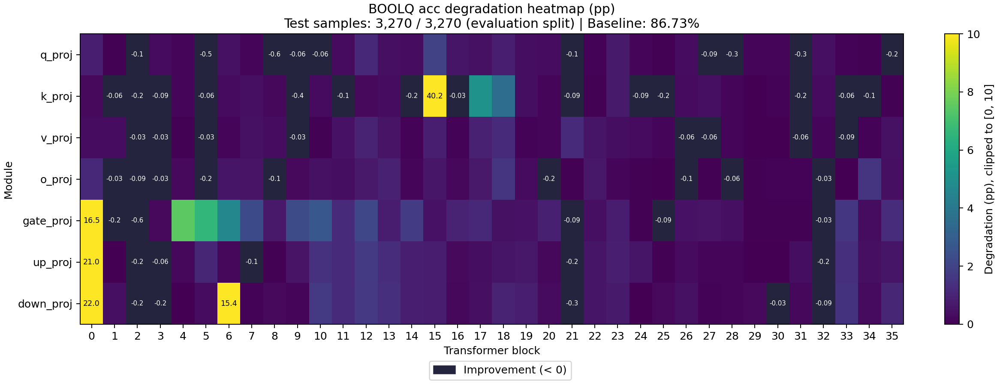

# Sensitivity Report

- Task: `boolq`
- Dataset: `boolq`
- Split: `lm-eval`
- Preprocessing: `lm-eval-0-shot`
- Evaluated examples: 3270
- Total evaluation examples: 3270
- Baseline evaluation seconds: 62.699

## Baseline Metrics

| Metric | Value |
|---|---:|
| acc | 0.867278 |

## Cases

| Case | Targets | Model Compression Ratio | Tensor Size Ratio | Compression Seconds | Evaluation Seconds |
|---|---:|---:|---:|---:|---:|
| model.layers.0.self_attn.q_proj | 1 | 1.00176 | 1.00176 | 0.0908036 | 56.8423 |
| model.layers.0.self_attn.k_proj | 1 | 1.00036 | 1.00036 | 0.0333257 | 58.1308 |
| model.layers.0.self_attn.v_proj | 1 | 1.00036 | 1.00036 | 0.0306695 | 57.5779 |
| model.layers.0.self_attn.o_proj | 1 | 1.00176 | 1.00176 | 0.0501639 | 59.536 |
| model.layers.0.mlp.gate_proj | 1 | 1.00588 | 1.00588 | 0.139758 | 60.1332 |
| model.layers.0.mlp.up_proj | 1 | 1.00588 | 1.00588 | 0.138405 | 59.9839 |
| model.layers.0.mlp.down_proj | 1 | 1.00588 | 1.00588 | 0.136281 | 59.7557 |
| model.layers.1.self_attn.q_proj | 1 | 1.00176 | 1.00176 | 0.0498147 | 59.4374 |
| model.layers.1.self_attn.k_proj | 1 | 1.00036 | 1.00036 | 0.0309048 | 56.7514 |
| model.layers.1.self_attn.v_proj | 1 | 1.00036 | 1.00036 | 0.0300858 | 57.0688 |
| model.layers.1.self_attn.o_proj | 1 | 1.00176 | 1.00176 | 0.0505725 | 56.7925 |
| model.layers.1.mlp.gate_proj | 1 | 1.00588 | 1.00588 | 0.139073 | 58.0455 |
| model.layers.1.mlp.up_proj | 1 | 1.00588 | 1.00588 | 0.136808 | 57.774 |
| model.layers.1.mlp.down_proj | 1 | 1.00588 | 1.00588 | 0.136036 | 57.3814 |
| model.layers.2.self_attn.q_proj | 1 | 1.00176 | 1.00176 | 0.050698 | 56.993 |
| model.layers.2.self_attn.k_proj | 1 | 1.00036 | 1.00036 | 0.0306698 | 56.9202 |
| model.layers.2.self_attn.v_proj | 1 | 1.00036 | 1.00036 | 0.0319155 | 56.5355 |
| model.layers.2.self_attn.o_proj | 1 | 1.00176 | 1.00176 | 0.0508812 | 56.8136 |
| model.layers.2.mlp.gate_proj | 1 | 1.00588 | 1.00588 | 0.136597 | 57.6552 |
| model.layers.2.mlp.up_proj | 1 | 1.00588 | 1.00588 | 0.140512 | 57.8066 |
| model.layers.2.mlp.down_proj | 1 | 1.00588 | 1.00588 | 0.137343 | 57.2792 |
| model.layers.3.self_attn.q_proj | 1 | 1.00176 | 1.00176 | 0.0499464 | 56.9728 |
| model.layers.3.self_attn.k_proj | 1 | 1.00036 | 1.00036 | 0.0310369 | 56.7243 |
| model.layers.3.self_attn.v_proj | 1 | 1.00036 | 1.00036 | 0.0301628 | 57.0136 |
| model.layers.3.self_attn.o_proj | 1 | 1.00176 | 1.00176 | 0.0506305 | 56.7972 |
| model.layers.3.mlp.gate_proj | 1 | 1.00588 | 1.00588 | 0.13807 | 57.7128 |
| model.layers.3.mlp.up_proj | 1 | 1.00588 | 1.00588 | 0.135554 | 57.8793 |
| model.layers.3.mlp.down_proj | 1 | 1.00588 | 1.00588 | 0.135404 | 57.3563 |
| model.layers.4.self_attn.q_proj | 1 | 1.00176 | 1.00176 | 0.0510275 | 57.1086 |
| model.layers.4.self_attn.k_proj | 1 | 1.00036 | 1.00036 | 0.0303484 | 57.3824 |
| model.layers.4.self_attn.v_proj | 1 | 1.00036 | 1.00036 | 0.030091 | 59.4334 |
| model.layers.4.self_attn.o_proj | 1 | 1.00176 | 1.00176 | 0.060942 | 56.7524 |
| model.layers.4.mlp.gate_proj | 1 | 1.00588 | 1.00588 | 0.148505 | 57.9587 |
| model.layers.4.mlp.up_proj | 1 | 1.00588 | 1.00588 | 0.141922 | 57.7787 |
| model.layers.4.mlp.down_proj | 1 | 1.00588 | 1.00588 | 0.137249 | 57.4822 |
| model.layers.5.self_attn.q_proj | 1 | 1.00176 | 1.00176 | 0.0506942 | 56.9193 |
| model.layers.5.self_attn.k_proj | 1 | 1.00036 | 1.00036 | 0.0304722 | 56.9851 |
| model.layers.5.self_attn.v_proj | 1 | 1.00036 | 1.00036 | 0.0302276 | 56.8309 |
| model.layers.5.self_attn.o_proj | 1 | 1.00176 | 1.00176 | 0.0503283 | 57.006 |
| model.layers.5.mlp.gate_proj | 1 | 1.00588 | 1.00588 | 0.138872 | 57.6408 |
| model.layers.5.mlp.up_proj | 1 | 1.00588 | 1.00588 | 0.138688 | 57.96 |
| model.layers.5.mlp.down_proj | 1 | 1.00588 | 1.00588 | 0.141457 | 57.2071 |
| model.layers.6.self_attn.q_proj | 1 | 1.00176 | 1.00176 | 0.0512941 | 57.2381 |
| model.layers.6.self_attn.k_proj | 1 | 1.00036 | 1.00036 | 0.0313778 | 57.118 |
| model.layers.6.self_attn.v_proj | 1 | 1.00036 | 1.00036 | 0.0301461 | 56.9411 |
| model.layers.6.self_attn.o_proj | 1 | 1.00176 | 1.00176 | 0.0505141 | 57.0701 |
| model.layers.6.mlp.gate_proj | 1 | 1.00588 | 1.00588 | 0.138536 | 57.7217 |
| model.layers.6.mlp.up_proj | 1 | 1.00588 | 1.00588 | 0.138208 | 57.9537 |
| model.layers.6.mlp.down_proj | 1 | 1.00588 | 1.00588 | 0.138236 | 57.3521 |
| model.layers.7.self_attn.q_proj | 1 | 1.00176 | 1.00176 | 0.0501834 | 57.1485 |
| model.layers.7.self_attn.k_proj | 1 | 1.00036 | 1.00036 | 0.0303271 | 56.8234 |
| model.layers.7.self_attn.v_proj | 1 | 1.00036 | 1.00036 | 0.0303673 | 56.9706 |
| model.layers.7.self_attn.o_proj | 1 | 1.00176 | 1.00176 | 0.0518667 | 57.7963 |
| model.layers.7.mlp.gate_proj | 1 | 1.00588 | 1.00588 | 0.140954 | 59.9353 |
| model.layers.7.mlp.up_proj | 1 | 1.00588 | 1.00588 | 0.138324 | 59.8368 |
| model.layers.7.mlp.down_proj | 1 | 1.00588 | 1.00588 | 0.147534 | 57.4473 |
| model.layers.8.self_attn.q_proj | 1 | 1.00176 | 1.00176 | 0.0510955 | 56.8607 |
| model.layers.8.self_attn.k_proj | 1 | 1.00036 | 1.00036 | 0.0307056 | 57.0984 |
| model.layers.8.self_attn.v_proj | 1 | 1.00036 | 1.00036 | 0.0307704 | 56.7606 |
| model.layers.8.self_attn.o_proj | 1 | 1.00176 | 1.00176 | 0.0522161 | 57.2229 |
| model.layers.8.mlp.gate_proj | 1 | 1.00588 | 1.00588 | 0.139132 | 57.8455 |
| model.layers.8.mlp.up_proj | 1 | 1.00588 | 1.00588 | 0.138294 | 57.8839 |
| model.layers.8.mlp.down_proj | 1 | 1.00588 | 1.00588 | 0.138992 | 57.6372 |
| model.layers.9.self_attn.q_proj | 1 | 1.00176 | 1.00176 | 0.0503649 | 56.9749 |
| model.layers.9.self_attn.k_proj | 1 | 1.00036 | 1.00036 | 0.030237 | 56.9499 |
| model.layers.9.self_attn.v_proj | 1 | 1.00036 | 1.00036 | 0.0308383 | 56.738 |
| model.layers.9.self_attn.o_proj | 1 | 1.00176 | 1.00176 | 0.0507533 | 57.0883 |
| model.layers.9.mlp.gate_proj | 1 | 1.00588 | 1.00588 | 0.138813 | 57.6788 |
| model.layers.9.mlp.up_proj | 1 | 1.00588 | 1.00588 | 0.139173 | 57.9033 |
| model.layers.9.mlp.down_proj | 1 | 1.00588 | 1.00588 | 0.143014 | 57.263 |
| model.layers.10.self_attn.q_proj | 1 | 1.00176 | 1.00176 | 0.0510461 | 57.29 |
| model.layers.10.self_attn.k_proj | 1 | 1.00036 | 1.00036 | 0.0306008 | 56.715 |
| model.layers.10.self_attn.v_proj | 1 | 1.00036 | 1.00036 | 0.0302084 | 56.8599 |
| model.layers.10.self_attn.o_proj | 1 | 1.00176 | 1.00176 | 0.0504012 | 56.8805 |
| model.layers.10.mlp.gate_proj | 1 | 1.00588 | 1.00588 | 0.141207 | 57.8315 |
| model.layers.10.mlp.up_proj | 1 | 1.00588 | 1.00588 | 0.139415 | 57.8569 |
| model.layers.10.mlp.down_proj | 1 | 1.00588 | 1.00588 | 0.142268 | 57.4388 |
| model.layers.11.self_attn.q_proj | 1 | 1.00176 | 1.00176 | 0.0500847 | 57.9923 |
| model.layers.11.self_attn.k_proj | 1 | 1.00036 | 1.00036 | 0.0304603 | 57.3032 |
| model.layers.11.self_attn.v_proj | 1 | 1.00036 | 1.00036 | 0.0303537 | 59.6619 |
| model.layers.11.self_attn.o_proj | 1 | 1.00176 | 1.00176 | 0.050425 | 56.8794 |
| model.layers.11.mlp.gate_proj | 1 | 1.00588 | 1.00588 | 0.138989 | 58.104 |
| model.layers.11.mlp.up_proj | 1 | 1.00588 | 1.00588 | 0.141086 | 57.8228 |
| model.layers.11.mlp.down_proj | 1 | 1.00588 | 1.00588 | 0.1387 | 57.6395 |
| model.layers.12.self_attn.q_proj | 1 | 1.00176 | 1.00176 | 0.0503626 | 56.7745 |
| model.layers.12.self_attn.k_proj | 1 | 1.00036 | 1.00036 | 0.0303713 | 57.0977 |
| model.layers.12.self_attn.v_proj | 1 | 1.00036 | 1.00036 | 0.0300623 | 56.8056 |
| model.layers.12.self_attn.o_proj | 1 | 1.00176 | 1.00176 | 0.0541192 | 57.3455 |
| model.layers.12.mlp.gate_proj | 1 | 1.00588 | 1.00588 | 0.139816 | 57.8202 |
| model.layers.12.mlp.up_proj | 1 | 1.00588 | 1.00588 | 0.138685 | 57.8584 |
| model.layers.12.mlp.down_proj | 1 | 1.00588 | 1.00588 | 0.139626 | 57.0849 |
| model.layers.13.self_attn.q_proj | 1 | 1.00176 | 1.00176 | 0.050439 | 57.0045 |
| model.layers.13.self_attn.k_proj | 1 | 1.00036 | 1.00036 | 0.0308008 | 56.4758 |
| model.layers.13.self_attn.v_proj | 1 | 1.00036 | 1.00036 | 0.03011 | 56.8573 |
| model.layers.13.self_attn.o_proj | 1 | 1.00176 | 1.00176 | 0.0510567 | 57.9116 |
| model.layers.13.mlp.gate_proj | 1 | 1.00588 | 1.00588 | 0.140553 | 58.1812 |
| model.layers.13.mlp.up_proj | 1 | 1.00588 | 1.00588 | 0.139437 | 57.8036 |
| model.layers.13.mlp.down_proj | 1 | 1.00588 | 1.00588 | 0.138678 | 57.1882 |
| model.layers.14.self_attn.q_proj | 1 | 1.00176 | 1.00176 | 0.0514746 | 57.0411 |
| model.layers.14.self_attn.k_proj | 1 | 1.00036 | 1.00036 | 0.030559 | 56.8389 |
| model.layers.14.self_attn.v_proj | 1 | 1.00036 | 1.00036 | 0.0305086 | 57.1821 |
| model.layers.14.self_attn.o_proj | 1 | 1.00176 | 1.00176 | 0.0508158 | 57.5814 |
| model.layers.14.mlp.gate_proj | 1 | 1.00588 | 1.00588 | 0.139142 | 59.4603 |
| model.layers.14.mlp.up_proj | 1 | 1.00588 | 1.00588 | 0.140283 | 59.9615 |
| model.layers.14.mlp.down_proj | 1 | 1.00588 | 1.00588 | 0.139373 | 59.8526 |
| model.layers.15.self_attn.q_proj | 1 | 1.00176 | 1.00176 | 0.0501911 | 57.3907 |
| model.layers.15.self_attn.k_proj | 1 | 1.00036 | 1.00036 | 0.0305246 | 56.8547 |
| model.layers.15.self_attn.v_proj | 1 | 1.00036 | 1.00036 | 0.0302376 | 56.7967 |
| model.layers.15.self_attn.o_proj | 1 | 1.00176 | 1.00176 | 0.0501724 | 57.2226 |
| model.layers.15.mlp.gate_proj | 1 | 1.00588 | 1.00588 | 0.141314 | 57.9416 |
| model.layers.15.mlp.up_proj | 1 | 1.00588 | 1.00588 | 0.139138 | 57.9549 |
| model.layers.15.mlp.down_proj | 1 | 1.00588 | 1.00588 | 0.138466 | 57.2514 |
| model.layers.16.self_attn.q_proj | 1 | 1.00176 | 1.00176 | 0.0511031 | 57.2242 |
| model.layers.16.self_attn.k_proj | 1 | 1.00036 | 1.00036 | 0.0300955 | 56.8454 |
| model.layers.16.self_attn.v_proj | 1 | 1.00036 | 1.00036 | 0.0311776 | 57.1186 |
| model.layers.16.self_attn.o_proj | 1 | 1.00176 | 1.00176 | 0.0501641 | 56.8781 |
| model.layers.16.mlp.gate_proj | 1 | 1.00588 | 1.00588 | 0.138224 | 57.8266 |
| model.layers.16.mlp.up_proj | 1 | 1.00588 | 1.00588 | 0.138518 | 58.0666 |
| model.layers.16.mlp.down_proj | 1 | 1.00588 | 1.00588 | 0.142253 | 57.2678 |
| model.layers.17.self_attn.q_proj | 1 | 1.00176 | 1.00176 | 0.0524601 | 57.2653 |
| model.layers.17.self_attn.k_proj | 1 | 1.00036 | 1.00036 | 0.030522 | 56.7064 |
| model.layers.17.self_attn.v_proj | 1 | 1.00036 | 1.00036 | 0.0305743 | 57.0566 |
| model.layers.17.self_attn.o_proj | 1 | 1.00176 | 1.00176 | 0.0501878 | 56.8095 |
| model.layers.17.mlp.gate_proj | 1 | 1.00588 | 1.00588 | 0.139176 | 57.9329 |
| model.layers.17.mlp.up_proj | 1 | 1.00588 | 1.00588 | 0.14048 | 57.6536 |
| model.layers.17.mlp.down_proj | 1 | 1.00588 | 1.00588 | 0.139123 | 57.4941 |
| model.layers.18.self_attn.q_proj | 1 | 1.00176 | 1.00176 | 0.0503815 | 57.0127 |
| model.layers.18.self_attn.k_proj | 1 | 1.00036 | 1.00036 | 0.0300092 | 57.6002 |
| model.layers.18.self_attn.v_proj | 1 | 1.00036 | 1.00036 | 0.0303547 | 57.437 |
| model.layers.18.self_attn.o_proj | 1 | 1.00176 | 1.00176 | 0.0508902 | 59.4744 |
| model.layers.18.mlp.gate_proj | 1 | 1.00588 | 1.00588 | 0.166972 | 60.311 |
| model.layers.18.mlp.up_proj | 1 | 1.00588 | 1.00588 | 0.138951 | 59.8749 |
| model.layers.18.mlp.down_proj | 1 | 1.00588 | 1.00588 | 0.138733 | 59.7103 |
| model.layers.19.self_attn.q_proj | 1 | 1.00176 | 1.00176 | 0.0507719 | 59.6775 |
| model.layers.19.self_attn.k_proj | 1 | 1.00036 | 1.00036 | 0.0304055 | 56.9016 |
| model.layers.19.self_attn.v_proj | 1 | 1.00036 | 1.00036 | 0.0303841 | 57.2183 |
| model.layers.19.self_attn.o_proj | 1 | 1.00176 | 1.00176 | 0.0496088 | 56.9325 |
| model.layers.19.mlp.gate_proj | 1 | 1.00588 | 1.00588 | 0.13986 | 58.0974 |
| model.layers.19.mlp.up_proj | 1 | 1.00588 | 1.00588 | 0.13861 | 57.869 |
| model.layers.19.mlp.down_proj | 1 | 1.00588 | 1.00588 | 0.13828 | 57.29 |
| model.layers.20.self_attn.q_proj | 1 | 1.00176 | 1.00176 | 0.0501607 | 57.4709 |
| model.layers.20.self_attn.k_proj | 1 | 1.00036 | 1.00036 | 0.0335227 | 56.8812 |
| model.layers.20.self_attn.v_proj | 1 | 1.00036 | 1.00036 | 0.0313112 | 56.9098 |
| model.layers.20.self_attn.o_proj | 1 | 1.00176 | 1.00176 | 0.0503443 | 57.0145 |
| model.layers.20.mlp.gate_proj | 1 | 1.00588 | 1.00588 | 0.138393 | 58.0856 |
| model.layers.20.mlp.up_proj | 1 | 1.00588 | 1.00588 | 0.143032 | 57.4985 |
| model.layers.20.mlp.down_proj | 1 | 1.00588 | 1.00588 | 0.136541 | 57.2652 |
| model.layers.21.self_attn.q_proj | 1 | 1.00176 | 1.00176 | 0.050374 | 57.1297 |
| model.layers.21.self_attn.k_proj | 1 | 1.00036 | 1.00036 | 0.0311285 | 57.1528 |
| model.layers.21.self_attn.v_proj | 1 | 1.00036 | 1.00036 | 0.0299571 | 56.9615 |
| model.layers.21.self_attn.o_proj | 1 | 1.00176 | 1.00176 | 0.0502322 | 57.3102 |
| model.layers.21.mlp.gate_proj | 1 | 1.00588 | 1.00588 | 0.139308 | 57.8637 |
| model.layers.21.mlp.up_proj | 1 | 1.00588 | 1.00588 | 0.139403 | 58.1221 |
| model.layers.21.mlp.down_proj | 1 | 1.00588 | 1.00588 | 0.13853 | 57.3711 |
| model.layers.22.self_attn.q_proj | 1 | 1.00176 | 1.00176 | 0.050589 | 57.1932 |
| model.layers.22.self_attn.k_proj | 1 | 1.00036 | 1.00036 | 0.0302288 | 57.2988 |
| model.layers.22.self_attn.v_proj | 1 | 1.00036 | 1.00036 | 0.0303788 | 59.1087 |
| model.layers.22.self_attn.o_proj | 1 | 1.00176 | 1.00176 | 0.054859 | 57.4752 |
| model.layers.22.mlp.gate_proj | 1 | 1.00588 | 1.00588 | 0.14046 | 59.7785 |
| model.layers.22.mlp.up_proj | 1 | 1.00588 | 1.00588 | 0.138024 | 59.8424 |
| model.layers.22.mlp.down_proj | 1 | 1.00588 | 1.00588 | 0.139689 | 60.0788 |
| model.layers.23.self_attn.q_proj | 1 | 1.00176 | 1.00176 | 0.0503239 | 56.8273 |
| model.layers.23.self_attn.k_proj | 1 | 1.00036 | 1.00036 | 0.0299904 | 56.8911 |
| model.layers.23.self_attn.v_proj | 1 | 1.00036 | 1.00036 | 0.0304003 | 57.2926 |
| model.layers.23.self_attn.o_proj | 1 | 1.00176 | 1.00176 | 0.0541933 | 57.0737 |
| model.layers.23.mlp.gate_proj | 1 | 1.00588 | 1.00588 | 0.13938 | 58.1247 |
| model.layers.23.mlp.up_proj | 1 | 1.00588 | 1.00588 | 0.138663 | 57.7424 |
| model.layers.23.mlp.down_proj | 1 | 1.00588 | 1.00588 | 0.13945 | 57.6942 |
| model.layers.24.self_attn.q_proj | 1 | 1.00176 | 1.00176 | 0.0531631 | 56.9448 |
| model.layers.24.self_attn.k_proj | 1 | 1.00036 | 1.00036 | 0.0305654 | 57.0331 |
| model.layers.24.self_attn.v_proj | 1 | 1.00036 | 1.00036 | 0.0301276 | 56.6411 |
| model.layers.24.self_attn.o_proj | 1 | 1.00176 | 1.00176 | 0.0503428 | 56.8581 |
| model.layers.24.mlp.gate_proj | 1 | 1.00588 | 1.00588 | 0.139573 | 57.6544 |
| model.layers.24.mlp.up_proj | 1 | 1.00588 | 1.00588 | 0.138387 | 57.852 |
| model.layers.24.mlp.down_proj | 1 | 1.00588 | 1.00588 | 0.138074 | 57.1657 |
| model.layers.25.self_attn.q_proj | 1 | 1.00176 | 1.00176 | 0.0504612 | 57.1438 |
| model.layers.25.self_attn.k_proj | 1 | 1.00036 | 1.00036 | 0.0308229 | 56.7926 |
| model.layers.25.self_attn.v_proj | 1 | 1.00036 | 1.00036 | 0.0313318 | 57.1615 |
| model.layers.25.self_attn.o_proj | 1 | 1.00176 | 1.00176 | 0.050841 | 57.0173 |
| model.layers.25.mlp.gate_proj | 1 | 1.00588 | 1.00588 | 0.138314 | 58.156 |
| model.layers.25.mlp.up_proj | 1 | 1.00588 | 1.00588 | 0.13908 | 57.7865 |
| model.layers.25.mlp.down_proj | 1 | 1.00588 | 1.00588 | 0.137945 | 57.4624 |
| model.layers.26.self_attn.q_proj | 1 | 1.00176 | 1.00176 | 0.0502699 | 57.1794 |
| model.layers.26.self_attn.k_proj | 1 | 1.00036 | 1.00036 | 0.0305242 | 57.6948 |
| model.layers.26.self_attn.v_proj | 1 | 1.00036 | 1.00036 | 0.0304497 | 59.5243 |
| model.layers.26.self_attn.o_proj | 1 | 1.00176 | 1.00176 | 0.0502659 | 57.0285 |
| model.layers.26.mlp.gate_proj | 1 | 1.00588 | 1.00588 | 0.138944 | 57.9746 |
| model.layers.26.mlp.up_proj | 1 | 1.00588 | 1.00588 | 0.138643 | 57.6765 |
| model.layers.26.mlp.down_proj | 1 | 1.00588 | 1.00588 | 0.144468 | 57.4649 |
| model.layers.27.self_attn.q_proj | 1 | 1.00176 | 1.00176 | 0.0506762 | 56.9982 |
| model.layers.27.self_attn.k_proj | 1 | 1.00036 | 1.00036 | 0.0303702 | 57.0018 |
| model.layers.27.self_attn.v_proj | 1 | 1.00036 | 1.00036 | 0.0303812 | 56.5984 |
| model.layers.27.self_attn.o_proj | 1 | 1.00176 | 1.00176 | 0.0504142 | 56.9848 |
| model.layers.27.mlp.gate_proj | 1 | 1.00588 | 1.00588 | 0.13925 | 57.8414 |
| model.layers.27.mlp.up_proj | 1 | 1.00588 | 1.00588 | 0.13849 | 57.9887 |
| model.layers.27.mlp.down_proj | 1 | 1.00588 | 1.00588 | 0.138982 | 57.197 |
| model.layers.28.self_attn.q_proj | 1 | 1.00176 | 1.00176 | 0.0500029 | 57.4409 |
| model.layers.28.self_attn.k_proj | 1 | 1.00036 | 1.00036 | 0.0307029 | 56.8448 |
| model.layers.28.self_attn.v_proj | 1 | 1.00036 | 1.00036 | 0.0302526 | 56.98 |
| model.layers.28.self_attn.o_proj | 1 | 1.00176 | 1.00176 | 0.0505572 | 56.8911 |
| model.layers.28.mlp.gate_proj | 1 | 1.00588 | 1.00588 | 0.139682 | 57.8671 |
| model.layers.28.mlp.up_proj | 1 | 1.00588 | 1.00588 | 0.139329 | 58.1593 |
| model.layers.28.mlp.down_proj | 1 | 1.00588 | 1.00588 | 0.139294 | 57.3365 |
| model.layers.29.self_attn.q_proj | 1 | 1.00176 | 1.00176 | 0.0503771 | 57.2284 |
| model.layers.29.self_attn.k_proj | 1 | 1.00036 | 1.00036 | 0.0297413 | 56.8868 |
| model.layers.29.self_attn.v_proj | 1 | 1.00036 | 1.00036 | 0.0299576 | 57.349 |
| model.layers.29.self_attn.o_proj | 1 | 1.00176 | 1.00176 | 0.0510895 | 57.0924 |
| model.layers.29.mlp.gate_proj | 1 | 1.00588 | 1.00588 | 0.140129 | 59.9589 |
| model.layers.29.mlp.up_proj | 1 | 1.00588 | 1.00588 | 0.140002 | 59.9604 |
| model.layers.29.mlp.down_proj | 1 | 1.00588 | 1.00588 | 0.136259 | 59.7026 |
| model.layers.30.self_attn.q_proj | 1 | 1.00176 | 1.00176 | 0.0544832 | 57.3986 |
| model.layers.30.self_attn.k_proj | 1 | 1.00036 | 1.00036 | 0.0304475 | 57.0688 |
| model.layers.30.self_attn.v_proj | 1 | 1.00036 | 1.00036 | 0.0301775 | 56.8709 |
| model.layers.30.self_attn.o_proj | 1 | 1.00176 | 1.00176 | 0.0540416 | 57.2187 |
| model.layers.30.mlp.gate_proj | 1 | 1.00588 | 1.00588 | 0.148477 | 57.6984 |
| model.layers.30.mlp.up_proj | 1 | 1.00588 | 1.00588 | 0.139203 | 58.4211 |
| model.layers.30.mlp.down_proj | 1 | 1.00588 | 1.00588 | 0.137471 | 57.471 |
| model.layers.31.self_attn.q_proj | 1 | 1.00176 | 1.00176 | 0.05123 | 56.9758 |
| model.layers.31.self_attn.k_proj | 1 | 1.00036 | 1.00036 | 0.0309695 | 57.4216 |
| model.layers.31.self_attn.v_proj | 1 | 1.00036 | 1.00036 | 0.0306258 | 56.9765 |
| model.layers.31.self_attn.o_proj | 1 | 1.00176 | 1.00176 | 0.0506393 | 57.0694 |
| model.layers.31.mlp.gate_proj | 1 | 1.00588 | 1.00588 | 0.139625 | 57.7314 |
| model.layers.31.mlp.up_proj | 1 | 1.00588 | 1.00588 | 0.139128 | 58.082 |
| model.layers.31.mlp.down_proj | 1 | 1.00588 | 1.00588 | 0.138577 | 57.1197 |
| model.layers.32.self_attn.q_proj | 1 | 1.00176 | 1.00176 | 0.0501935 | 57.2889 |
| model.layers.32.self_attn.k_proj | 1 | 1.00036 | 1.00036 | 0.0303524 | 56.9111 |
| model.layers.32.self_attn.v_proj | 1 | 1.00036 | 1.00036 | 0.0305449 | 57.1439 |
| model.layers.32.self_attn.o_proj | 1 | 1.00176 | 1.00176 | 0.0502004 | 56.8323 |
| model.layers.32.mlp.gate_proj | 1 | 1.00588 | 1.00588 | 0.136785 | 58.0681 |
| model.layers.32.mlp.up_proj | 1 | 1.00588 | 1.00588 | 0.13665 | 57.8132 |
| model.layers.32.mlp.down_proj | 1 | 1.00588 | 1.00588 | 0.138655 | 57.7038 |
| model.layers.33.self_attn.q_proj | 1 | 1.00176 | 1.00176 | 0.0517898 | 56.9798 |
| model.layers.33.self_attn.k_proj | 1 | 1.00036 | 1.00036 | 0.0301779 | 56.88 |
| model.layers.33.self_attn.v_proj | 1 | 1.00036 | 1.00036 | 0.0298929 | 58.8564 |
| model.layers.33.self_attn.o_proj | 1 | 1.00176 | 1.00176 | 0.0542609 | 57.5096 |
| model.layers.33.mlp.gate_proj | 1 | 1.00588 | 1.00588 | 0.139137 | 59.9912 |
| model.layers.33.mlp.up_proj | 1 | 1.00588 | 1.00588 | 0.140587 | 59.9275 |
| model.layers.33.mlp.down_proj | 1 | 1.00588 | 1.00588 | 0.140513 | 59.6511 |
| model.layers.34.self_attn.q_proj | 1 | 1.00176 | 1.00176 | 0.0511378 | 56.8926 |
| model.layers.34.self_attn.k_proj | 1 | 1.00036 | 1.00036 | 0.0302412 | 56.9669 |
| model.layers.34.self_attn.v_proj | 1 | 1.00036 | 1.00036 | 0.0306035 | 57.0695 |
| model.layers.34.self_attn.o_proj | 1 | 1.00176 | 1.00176 | 0.0505449 | 57.246 |
| model.layers.34.mlp.gate_proj | 1 | 1.00588 | 1.00588 | 0.139429 | 57.6628 |
| model.layers.34.mlp.up_proj | 1 | 1.00588 | 1.00588 | 0.139314 | 57.908 |
| model.layers.34.mlp.down_proj | 1 | 1.00588 | 1.00588 | 0.138597 | 57.176 |
| model.layers.35.self_attn.q_proj | 1 | 1.00176 | 1.00176 | 0.0509902 | 56.9511 |
| model.layers.35.self_attn.k_proj | 1 | 1.00036 | 1.00036 | 0.0306336 | 56.557 |
| model.layers.35.self_attn.v_proj | 1 | 1.00036 | 1.00036 | 0.0299968 | 56.8925 |
| model.layers.35.self_attn.o_proj | 1 | 1.00176 | 1.00176 | 0.0500387 | 56.8215 |
| model.layers.35.mlp.gate_proj | 1 | 1.00588 | 1.00588 | 0.141271 | 58.1793 |
| model.layers.35.mlp.up_proj | 1 | 1.00588 | 1.00588 | 0.136594 | 57.8958 |
| model.layers.35.mlp.down_proj | 1 | 1.00588 | 1.00588 | 0.137398 | 57.5999 |

## Metrics

| Case | Metric | Value | Degradation |
|---|---|---:|---:|
| model.layers.0.self_attn.q_proj | acc | 0.859021 | 0.00825688 |
| model.layers.0.self_attn.k_proj | acc | 0.864832 | 0.00244648 |
| model.layers.0.self_attn.v_proj | acc | 0.863914 | 0.00336391 |
| model.layers.0.self_attn.o_proj | acc | 0.855963 | 0.011315 |
| model.layers.0.mlp.gate_proj | acc | 0.702141 | 0.165138 |
| model.layers.0.mlp.up_proj | acc | 0.657492 | 0.209786 |
| model.layers.0.mlp.down_proj | acc | 0.647401 | 0.219878 |
| model.layers.1.self_attn.q_proj | acc | 0.866667 | 0.000611621 |
| model.layers.1.self_attn.k_proj | acc | 0.86789 | -0.000611621 |
| model.layers.1.self_attn.v_proj | acc | 0.863914 | 0.00336391 |
| model.layers.1.self_attn.o_proj | acc | 0.867584 | -0.00030581 |
| model.layers.1.mlp.gate_proj | acc | 0.869113 | -0.00183486 |
| model.layers.1.mlp.up_proj | acc | 0.866972 | 0.00030581 |
| model.layers.1.mlp.down_proj | acc | 0.862997 | 0.00428135 |
| model.layers.2.self_attn.q_proj | acc | 0.868502 | -0.00122324 |
| model.layers.2.self_attn.k_proj | acc | 0.868807 | -0.00152905 |
| model.layers.2.self_attn.v_proj | acc | 0.867584 | -0.00030581 |
| model.layers.2.self_attn.o_proj | acc | 0.868196 | -0.000917431 |
| model.layers.2.mlp.gate_proj | acc | 0.872783 | -0.00550459 |
| model.layers.2.mlp.up_proj | acc | 0.869419 | -0.00214067 |
| model.layers.2.mlp.down_proj | acc | 0.868807 | -0.00152905 |
| model.layers.3.self_attn.q_proj | acc | 0.864526 | 0.00275229 |
| model.layers.3.self_attn.k_proj | acc | 0.868196 | -0.000917431 |
| model.layers.3.self_attn.v_proj | acc | 0.867584 | -0.00030581 |
| model.layers.3.self_attn.o_proj | acc | 0.867584 | -0.00030581 |
| model.layers.3.mlp.gate_proj | acc | 0.864832 | 0.00244648 |
| model.layers.3.mlp.up_proj | acc | 0.86789 | -0.000611621 |
| model.layers.3.mlp.down_proj | acc | 0.869113 | -0.00183486 |
| model.layers.4.self_attn.q_proj | acc | 0.865443 | 0.00183486 |
| model.layers.4.self_attn.k_proj | acc | 0.866055 | 0.00122324 |
| model.layers.4.self_attn.v_proj | acc | 0.866667 | 0.000611621 |
| model.layers.4.self_attn.o_proj | acc | 0.864832 | 0.00244648 |
| model.layers.4.mlp.gate_proj | acc | 0.792661 | 0.0746177 |
| model.layers.4.mlp.up_proj | acc | 0.865138 | 0.00214067 |
| model.layers.4.mlp.down_proj | acc | 0.867278 | 0 |
| model.layers.5.self_attn.q_proj | acc | 0.872171 | -0.00489297 |
| model.layers.5.self_attn.k_proj | acc | 0.86789 | -0.000611621 |
| model.layers.5.self_attn.v_proj | acc | 0.867584 | -0.00030581 |
| model.layers.5.self_attn.o_proj | acc | 0.869113 | -0.00183486 |
| model.layers.5.mlp.gate_proj | acc | 0.801223 | 0.066055 |
| model.layers.5.mlp.up_proj | acc | 0.856575 | 0.0107034 |
| model.layers.5.mlp.down_proj | acc | 0.863914 | 0.00336391 |
| model.layers.6.self_attn.q_proj | acc | 0.862691 | 0.00458716 |
| model.layers.6.self_attn.k_proj | acc | 0.864526 | 0.00275229 |
| model.layers.6.self_attn.v_proj | acc | 0.865749 | 0.00152905 |
| model.layers.6.self_attn.o_proj | acc | 0.861468 | 0.0058104 |
| model.layers.6.mlp.gate_proj | acc | 0.820795 | 0.0464832 |
| model.layers.6.mlp.up_proj | acc | 0.865138 | 0.00214067 |
| model.layers.6.mlp.down_proj | acc | 0.713761 | 0.153517 |
| model.layers.7.self_attn.q_proj | acc | 0.866055 | 0.00122324 |
| model.layers.7.self_attn.k_proj | acc | 0.862997 | 0.00428135 |
| model.layers.7.self_attn.v_proj | acc | 0.862691 | 0.00458716 |
| model.layers.7.self_attn.o_proj | acc | 0.86208 | 0.00519878 |
| model.layers.7.mlp.gate_proj | acc | 0.844648 | 0.02263 |
| model.layers.7.mlp.up_proj | acc | 0.868502 | -0.00122324 |
| model.layers.7.mlp.down_proj | acc | 0.866361 | 0.000917431 |
| model.layers.8.self_attn.q_proj | acc | 0.873089 | -0.0058104 |
| model.layers.8.self_attn.k_proj | acc | 0.865138 | 0.00214067 |
| model.layers.8.self_attn.v_proj | acc | 0.863914 | 0.00336391 |
| model.layers.8.self_attn.o_proj | acc | 0.868502 | -0.00122324 |
| model.layers.8.mlp.gate_proj | acc | 0.86055 | 0.00672783 |
| model.layers.8.mlp.up_proj | acc | 0.866667 | 0.000611621 |
| model.layers.8.mlp.down_proj | acc | 0.864832 | 0.00244648 |
| model.layers.9.self_attn.q_proj | acc | 0.86789 | -0.000611621 |
| model.layers.9.self_attn.k_proj | acc | 0.871254 | -0.00397554 |
| model.layers.9.self_attn.v_proj | acc | 0.867584 | -0.00030581 |
| model.layers.9.self_attn.o_proj | acc | 0.864832 | 0.00244648 |
| model.layers.9.mlp.gate_proj | acc | 0.844343 | 0.0229358 |
| model.layers.9.mlp.up_proj | acc | 0.86208 | 0.00519878 |
| model.layers.9.mlp.down_proj | acc | 0.866055 | 0.00122324 |
| model.layers.10.self_attn.q_proj | acc | 0.86789 | -0.000611621 |
| model.layers.10.self_attn.k_proj | acc | 0.864526 | 0.00275229 |
| model.layers.10.self_attn.v_proj | acc | 0.866667 | 0.000611621 |
| model.layers.10.self_attn.o_proj | acc | 0.862691 | 0.00458716 |
| model.layers.10.mlp.gate_proj | acc | 0.840061 | 0.0272171 |
| model.layers.10.mlp.up_proj | acc | 0.853211 | 0.0140673 |
| model.layers.10.mlp.down_proj | acc | 0.850459 | 0.0168196 |
| model.layers.11.self_attn.q_proj | acc | 0.864526 | 0.00275229 |
| model.layers.11.self_attn.k_proj | acc | 0.868502 | -0.00122324 |
| model.layers.11.self_attn.v_proj | acc | 0.862385 | 0.00489297 |
| model.layers.11.self_attn.o_proj | acc | 0.863609 | 0.00366972 |
| model.layers.11.mlp.gate_proj | acc | 0.855046 | 0.0122324 |
| model.layers.11.mlp.up_proj | acc | 0.855352 | 0.0119266 |
| model.layers.11.mlp.down_proj | acc | 0.855046 | 0.0122324 |
| model.layers.12.self_attn.q_proj | acc | 0.856269 | 0.0110092 |
| model.layers.12.self_attn.k_proj | acc | 0.864832 | 0.00244648 |
| model.layers.12.self_attn.v_proj | acc | 0.857492 | 0.00978593 |
| model.layers.12.self_attn.o_proj | acc | 0.86055 | 0.00672783 |
| model.layers.12.mlp.gate_proj | acc | 0.846177 | 0.0211009 |
| model.layers.12.mlp.up_proj | acc | 0.850459 | 0.0168196 |
| model.layers.12.mlp.down_proj | acc | 0.850765 | 0.0165138 |
| model.layers.13.self_attn.q_proj | acc | 0.862997 | 0.00428135 |
| model.layers.13.self_attn.k_proj | acc | 0.863914 | 0.00336391 |
| model.layers.13.self_attn.v_proj | acc | 0.86208 | 0.00519878 |
| model.layers.13.self_attn.o_proj | acc | 0.858104 | 0.00917431 |
| model.layers.13.mlp.gate_proj | acc | 0.859327 | 0.00795107 |
| model.layers.13.mlp.up_proj | acc | 0.854434 | 0.012844 |
| model.layers.13.mlp.down_proj | acc | 0.853823 | 0.0134557 |
| model.layers.14.self_attn.q_proj | acc | 0.863914 | 0.00336391 |
| model.layers.14.self_attn.k_proj | acc | 0.869419 | -0.00214067 |
| model.layers.14.self_attn.v_proj | acc | 0.866361 | 0.000917431 |
| model.layers.14.self_attn.o_proj | acc | 0.865443 | 0.00183486 |
| model.layers.14.mlp.gate_proj | acc | 0.849847 | 0.0174312 |
| model.layers.14.mlp.up_proj | acc | 0.858716 | 0.00856269 |
| model.layers.14.mlp.down_proj | acc | 0.858716 | 0.00856269 |
| model.layers.15.self_attn.q_proj | acc | 0.847706 | 0.0195719 |
| model.layers.15.self_attn.k_proj | acc | 0.465138 | 0.402141 |
| model.layers.15.self_attn.v_proj | acc | 0.858716 | 0.00856269 |
| model.layers.15.self_attn.o_proj | acc | 0.861162 | 0.00611621 |
| model.layers.15.mlp.gate_proj | acc | 0.862385 | 0.00489297 |
| model.layers.15.mlp.up_proj | acc | 0.859633 | 0.00764526 |
| model.layers.15.mlp.down_proj | acc | 0.859327 | 0.00795107 |
| model.layers.16.self_attn.q_proj | acc | 0.861468 | 0.0058104 |
| model.layers.16.self_attn.k_proj | acc | 0.867584 | -0.00030581 |
| model.layers.16.self_attn.v_proj | acc | 0.866361 | 0.000917431 |
| model.layers.16.self_attn.o_proj | acc | 0.865138 | 0.00214067 |
| model.layers.16.mlp.gate_proj | acc | 0.857492 | 0.00978593 |
| model.layers.16.mlp.up_proj | acc | 0.864832 | 0.00244648 |
| model.layers.16.mlp.down_proj | acc | 0.865138 | 0.00214067 |
| model.layers.17.self_attn.q_proj | acc | 0.862691 | 0.00458716 |
| model.layers.17.self_attn.k_proj | acc | 0.816208 | 0.0510703 |
| model.layers.17.self_attn.v_proj | acc | 0.858104 | 0.00917431 |
| model.layers.17.self_attn.o_proj | acc | 0.86055 | 0.00672783 |
| model.layers.17.mlp.gate_proj | acc | 0.855657 | 0.0116208 |
| model.layers.17.mlp.up_proj | acc | 0.863609 | 0.00366972 |
| model.layers.17.mlp.down_proj | acc | 0.862997 | 0.00428135 |
| model.layers.18.self_attn.q_proj | acc | 0.859021 | 0.00825688 |
| model.layers.18.self_attn.k_proj | acc | 0.831498 | 0.0357798 |
| model.layers.18.self_attn.v_proj | acc | 0.855046 | 0.0122324 |
| model.layers.18.self_attn.o_proj | acc | 0.851682 | 0.0155963 |
| model.layers.18.mlp.gate_proj | acc | 0.862691 | 0.00458716 |
| model.layers.18.mlp.up_proj | acc | 0.861468 | 0.0058104 |
| model.layers.18.mlp.down_proj | acc | 0.857492 | 0.00978593 |
| model.layers.19.self_attn.q_proj | acc | 0.863609 | 0.00366972 |
| model.layers.19.self_attn.k_proj | acc | 0.863609 | 0.00366972 |
| model.layers.19.self_attn.v_proj | acc | 0.866361 | 0.000917431 |
| model.layers.19.self_attn.o_proj | acc | 0.864526 | 0.00275229 |
| model.layers.19.mlp.gate_proj | acc | 0.862385 | 0.00489297 |
| model.layers.19.mlp.up_proj | acc | 0.860856 | 0.00642202 |
| model.layers.19.mlp.down_proj | acc | 0.859021 | 0.00825688 |
| model.layers.20.self_attn.q_proj | acc | 0.863914 | 0.00336391 |
| model.layers.20.self_attn.k_proj | acc | 0.865749 | 0.00152905 |
| model.layers.20.self_attn.v_proj | acc | 0.865749 | 0.00152905 |
| model.layers.20.self_attn.o_proj | acc | 0.869419 | -0.00214067 |
| model.layers.20.mlp.gate_proj | acc | 0.85841 | 0.0088685 |
| model.layers.20.mlp.up_proj | acc | 0.865138 | 0.00214067 |
| model.layers.20.mlp.down_proj | acc | 0.86422 | 0.0030581 |
| model.layers.21.self_attn.q_proj | acc | 0.868502 | -0.00122324 |
| model.layers.21.self_attn.k_proj | acc | 0.868196 | -0.000917431 |
| model.layers.21.self_attn.v_proj | acc | 0.855352 | 0.0119266 |
| model.layers.21.self_attn.o_proj | acc | 0.866667 | 0.000611621 |
| model.layers.21.mlp.gate_proj | acc | 0.868196 | -0.000917431 |
| model.layers.21.mlp.up_proj | acc | 0.869419 | -0.00214067 |
| model.layers.21.mlp.down_proj | acc | 0.870336 | -0.0030581 |
| model.layers.22.self_attn.q_proj | acc | 0.866361 | 0.000917431 |
| model.layers.22.self_attn.k_proj | acc | 0.866667 | 0.000611621 |
| model.layers.22.self_attn.v_proj | acc | 0.861774 | 0.00550459 |
| model.layers.22.self_attn.o_proj | acc | 0.860856 | 0.00642202 |
| model.layers.22.mlp.gate_proj | acc | 0.862997 | 0.00428135 |
| model.layers.22.mlp.up_proj | acc | 0.861774 | 0.00550459 |
| model.layers.22.mlp.down_proj | acc | 0.861468 | 0.0058104 |
| model.layers.23.self_attn.q_proj | acc | 0.859939 | 0.00733945 |
| model.layers.23.self_attn.k_proj | acc | 0.859939 | 0.00733945 |
| model.layers.23.self_attn.v_proj | acc | 0.863609 | 0.00366972 |
| model.layers.23.self_attn.o_proj | acc | 0.865749 | 0.00152905 |
| model.layers.23.mlp.gate_proj | acc | 0.859327 | 0.00795107 |
| model.layers.23.mlp.up_proj | acc | 0.859021 | 0.00825688 |
| model.layers.23.mlp.down_proj | acc | 0.859939 | 0.00733945 |
| model.layers.24.self_attn.q_proj | acc | 0.866055 | 0.00122324 |
| model.layers.24.self_attn.k_proj | acc | 0.868196 | -0.000917431 |
| model.layers.24.self_attn.v_proj | acc | 0.86422 | 0.0030581 |
| model.layers.24.self_attn.o_proj | acc | 0.866667 | 0.000611621 |
| model.layers.24.mlp.gate_proj | acc | 0.866667 | 0.000611621 |
| model.layers.24.mlp.up_proj | acc | 0.861468 | 0.0058104 |
| model.layers.24.mlp.down_proj | acc | 0.866972 | 0.00030581 |
| model.layers.25.self_attn.q_proj | acc | 0.866667 | 0.000611621 |
| model.layers.25.self_attn.k_proj | acc | 0.868807 | -0.00152905 |
| model.layers.25.self_attn.v_proj | acc | 0.865443 | 0.00183486 |
| model.layers.25.self_attn.o_proj | acc | 0.866972 | 0.00030581 |
| model.layers.25.mlp.gate_proj | acc | 0.868196 | -0.000917431 |
| model.layers.25.mlp.up_proj | acc | 0.866667 | 0.000611621 |
| model.layers.25.mlp.down_proj | acc | 0.864832 | 0.00244648 |
| model.layers.26.self_attn.q_proj | acc | 0.863914 | 0.00336391 |
| model.layers.26.self_attn.k_proj | acc | 0.864526 | 0.00275229 |
| model.layers.26.self_attn.v_proj | acc | 0.86789 | -0.000611621 |
| model.layers.26.self_attn.o_proj | acc | 0.868502 | -0.00122324 |
| model.layers.26.mlp.gate_proj | acc | 0.862385 | 0.00489297 |
| model.layers.26.mlp.up_proj | acc | 0.864526 | 0.00275229 |
| model.layers.26.mlp.down_proj | acc | 0.862691 | 0.00458716 |
| model.layers.27.self_attn.q_proj | acc | 0.868196 | -0.000917431 |
| model.layers.27.self_attn.k_proj | acc | 0.863303 | 0.00397554 |
| model.layers.27.self_attn.v_proj | acc | 0.86789 | -0.000611621 |
| model.layers.27.self_attn.o_proj | acc | 0.866667 | 0.000611621 |
| model.layers.27.mlp.gate_proj | acc | 0.86208 | 0.00519878 |
| model.layers.27.mlp.up_proj | acc | 0.865749 | 0.00152905 |
| model.layers.27.mlp.down_proj | acc | 0.866361 | 0.000917431 |
| model.layers.28.self_attn.q_proj | acc | 0.870031 | -0.00275229 |
| model.layers.28.self_attn.k_proj | acc | 0.865749 | 0.00152905 |
| model.layers.28.self_attn.v_proj | acc | 0.865749 | 0.00152905 |
| model.layers.28.self_attn.o_proj | acc | 0.86789 | -0.000611621 |
| model.layers.28.mlp.gate_proj | acc | 0.863303 | 0.00397554 |
| model.layers.28.mlp.up_proj | acc | 0.866055 | 0.00122324 |
| model.layers.28.mlp.down_proj | acc | 0.865749 | 0.00152905 |
| model.layers.29.self_attn.q_proj | acc | 0.865749 | 0.00152905 |
| model.layers.29.self_attn.k_proj | acc | 0.867278 | 0 |
| model.layers.29.self_attn.v_proj | acc | 0.867278 | 0 |
| model.layers.29.self_attn.o_proj | acc | 0.866667 | 0.000611621 |
| model.layers.29.mlp.gate_proj | acc | 0.866667 | 0.000611621 |
| model.layers.29.mlp.up_proj | acc | 0.866972 | 0.00030581 |
| model.layers.29.mlp.down_proj | acc | 0.864832 | 0.00244648 |
| model.layers.30.self_attn.q_proj | acc | 0.865749 | 0.00152905 |
| model.layers.30.self_attn.k_proj | acc | 0.866361 | 0.000917431 |
| model.layers.30.self_attn.v_proj | acc | 0.867278 | 0 |
| model.layers.30.self_attn.o_proj | acc | 0.866361 | 0.000917431 |
| model.layers.30.mlp.gate_proj | acc | 0.866667 | 0.000611621 |
| model.layers.30.mlp.up_proj | acc | 0.867278 | 0 |
| model.layers.30.mlp.down_proj | acc | 0.867584 | -0.00030581 |
| model.layers.31.self_attn.q_proj | acc | 0.870642 | -0.00336391 |
| model.layers.31.self_attn.k_proj | acc | 0.868807 | -0.00152905 |
| model.layers.31.self_attn.v_proj | acc | 0.86789 | -0.000611621 |
| model.layers.31.self_attn.o_proj | acc | 0.866361 | 0.000917431 |
| model.layers.31.mlp.gate_proj | acc | 0.866667 | 0.000611621 |
| model.layers.31.mlp.up_proj | acc | 0.863609 | 0.00366972 |
| model.layers.31.mlp.down_proj | acc | 0.865138 | 0.00214067 |
| model.layers.32.self_attn.q_proj | acc | 0.862997 | 0.00428135 |
| model.layers.32.self_attn.k_proj | acc | 0.864526 | 0.00275229 |
| model.layers.32.self_attn.v_proj | acc | 0.865443 | 0.00183486 |
| model.layers.32.self_attn.o_proj | acc | 0.867584 | -0.00030581 |
| model.layers.32.mlp.gate_proj | acc | 0.867584 | -0.00030581 |
| model.layers.32.mlp.up_proj | acc | 0.869725 | -0.00244648 |
| model.layers.32.mlp.down_proj | acc | 0.868196 | -0.000917431 |
| model.layers.33.self_attn.q_proj | acc | 0.866361 | 0.000917431 |
| model.layers.33.self_attn.k_proj | acc | 0.86789 | -0.000611621 |
| model.layers.33.self_attn.v_proj | acc | 0.868196 | -0.000917431 |
| model.layers.33.self_attn.o_proj | acc | 0.867278 | 0 |
| model.layers.33.mlp.gate_proj | acc | 0.851376 | 0.0159021 |
| model.layers.33.mlp.up_proj | acc | 0.853517 | 0.0137615 |
| model.layers.33.mlp.down_proj | acc | 0.852599 | 0.0146789 |
| model.layers.34.self_attn.q_proj | acc | 0.866667 | 0.000611621 |
| model.layers.34.self_attn.k_proj | acc | 0.868502 | -0.00122324 |
| model.layers.34.self_attn.v_proj | acc | 0.866361 | 0.000917431 |
| model.layers.34.self_attn.o_proj | acc | 0.851682 | 0.0155963 |
| model.layers.34.mlp.gate_proj | acc | 0.863914 | 0.00336391 |
| model.layers.34.mlp.up_proj | acc | 0.863303 | 0.00397554 |
| model.layers.34.mlp.down_proj | acc | 0.86422 | 0.0030581 |
| model.layers.35.self_attn.q_proj | acc | 0.869113 | -0.00183486 |
| model.layers.35.self_attn.k_proj | acc | 0.866667 | 0.000611621 |
| model.layers.35.self_attn.v_proj | acc | 0.862691 | 0.00458716 |
| model.layers.35.self_attn.o_proj | acc | 0.863303 | 0.00397554 |
| model.layers.35.mlp.gate_proj | acc | 0.854434 | 0.012844 |
| model.layers.35.mlp.up_proj | acc | 0.861774 | 0.00550459 |
| model.layers.35.mlp.down_proj | acc | 0.856575 | 0.0107034 |

## Layers

| Case | Module | Representation | Compression Ratio | Tensor Size Ratio | Relative Error |
|---|---|---|---:|---:|---:|
| model.layers.0.self_attn.q_proj | model.layers.0.self_attn.q_proj | mpo | 6.96599 | 6.96599 | 0.902344 |
| model.layers.0.self_attn.k_proj | model.layers.0.self_attn.k_proj | mpo | 3.44781 | 3.44781 | 0.808594 |
| model.layers.0.self_attn.v_proj | model.layers.0.self_attn.v_proj | mpo | 3.44781 | 3.44781 | 0.8125 |
| model.layers.0.self_attn.o_proj | model.layers.0.self_attn.o_proj | mpo | 6.96599 | 6.96599 | 0.890625 |
| model.layers.0.mlp.gate_proj | model.layers.0.mlp.gate_proj | mpo | 20.48 | 20.48 | 0.96875 |
| model.layers.0.mlp.up_proj | model.layers.0.mlp.up_proj | mpo | 20.48 | 20.48 | 0.96875 |
| model.layers.0.mlp.down_proj | model.layers.0.mlp.down_proj | mpo | 20.48 | 20.48 | 0.96875 |
| model.layers.1.self_attn.q_proj | model.layers.1.self_attn.q_proj | mpo | 6.96599 | 6.96599 | 0.902344 |
| model.layers.1.self_attn.k_proj | model.layers.1.self_attn.k_proj | mpo | 3.44781 | 3.44781 | 0.8125 |
| model.layers.1.self_attn.v_proj | model.layers.1.self_attn.v_proj | mpo | 3.44781 | 3.44781 | 0.800781 |
| model.layers.1.self_attn.o_proj | model.layers.1.self_attn.o_proj | mpo | 6.96599 | 6.96599 | 0.902344 |
| model.layers.1.mlp.gate_proj | model.layers.1.mlp.gate_proj | mpo | 20.48 | 20.48 | 0.953125 |
| model.layers.1.mlp.up_proj | model.layers.1.mlp.up_proj | mpo | 20.48 | 20.48 | 0.964844 |
| model.layers.1.mlp.down_proj | model.layers.1.mlp.down_proj | mpo | 20.48 | 20.48 | 0.957031 |
| model.layers.2.self_attn.q_proj | model.layers.2.self_attn.q_proj | mpo | 6.96599 | 6.96599 | 0.902344 |
| model.layers.2.self_attn.k_proj | model.layers.2.self_attn.k_proj | mpo | 3.44781 | 3.44781 | 0.804688 |
| model.layers.2.self_attn.v_proj | model.layers.2.self_attn.v_proj | mpo | 3.44781 | 3.44781 | 0.808594 |
| model.layers.2.self_attn.o_proj | model.layers.2.self_attn.o_proj | mpo | 6.96599 | 6.96599 | 0.90625 |
| model.layers.2.mlp.gate_proj | model.layers.2.mlp.gate_proj | mpo | 20.48 | 20.48 | 0.957031 |
| model.layers.2.mlp.up_proj | model.layers.2.mlp.up_proj | mpo | 20.48 | 20.48 | 0.964844 |
| model.layers.2.mlp.down_proj | model.layers.2.mlp.down_proj | mpo | 20.48 | 20.48 | 0.960938 |
| model.layers.3.self_attn.q_proj | model.layers.3.self_attn.q_proj | mpo | 6.96599 | 6.96599 | 0.898438 |
| model.layers.3.self_attn.k_proj | model.layers.3.self_attn.k_proj | mpo | 3.44781 | 3.44781 | 0.808594 |
| model.layers.3.self_attn.v_proj | model.layers.3.self_attn.v_proj | mpo | 3.44781 | 3.44781 | 0.800781 |
| model.layers.3.self_attn.o_proj | model.layers.3.self_attn.o_proj | mpo | 6.96599 | 6.96599 | 0.90625 |
| model.layers.3.mlp.gate_proj | model.layers.3.mlp.gate_proj | mpo | 20.48 | 20.48 | 0.957031 |
| model.layers.3.mlp.up_proj | model.layers.3.mlp.up_proj | mpo | 20.48 | 20.48 | 0.964844 |
| model.layers.3.mlp.down_proj | model.layers.3.mlp.down_proj | mpo | 20.48 | 20.48 | 0.964844 |
| model.layers.4.self_attn.q_proj | model.layers.4.self_attn.q_proj | mpo | 6.96599 | 6.96599 | 0.90625 |
| model.layers.4.self_attn.k_proj | model.layers.4.self_attn.k_proj | mpo | 3.44781 | 3.44781 | 0.808594 |
| model.layers.4.self_attn.v_proj | model.layers.4.self_attn.v_proj | mpo | 3.44781 | 3.44781 | 0.804688 |
| model.layers.4.self_attn.o_proj | model.layers.4.self_attn.o_proj | mpo | 6.96599 | 6.96599 | 0.90625 |
| model.layers.4.mlp.gate_proj | model.layers.4.mlp.gate_proj | mpo | 20.48 | 20.48 | 0.960938 |
| model.layers.4.mlp.up_proj | model.layers.4.mlp.up_proj | mpo | 20.48 | 20.48 | 0.96875 |
| model.layers.4.mlp.down_proj | model.layers.4.mlp.down_proj | mpo | 20.48 | 20.48 | 0.96875 |
| model.layers.5.self_attn.q_proj | model.layers.5.self_attn.q_proj | mpo | 6.96599 | 6.96599 | 0.894531 |
| model.layers.5.self_attn.k_proj | model.layers.5.self_attn.k_proj | mpo | 3.44781 | 3.44781 | 0.792969 |
| model.layers.5.self_attn.v_proj | model.layers.5.self_attn.v_proj | mpo | 3.44781 | 3.44781 | 0.800781 |
| model.layers.5.self_attn.o_proj | model.layers.5.self_attn.o_proj | mpo | 6.96599 | 6.96599 | 0.898438 |
| model.layers.5.mlp.gate_proj | model.layers.5.mlp.gate_proj | mpo | 20.48 | 20.48 | 0.964844 |
| model.layers.5.mlp.up_proj | model.layers.5.mlp.up_proj | mpo | 20.48 | 20.48 | 0.972656 |
| model.layers.5.mlp.down_proj | model.layers.5.mlp.down_proj | mpo | 20.48 | 20.48 | 0.964844 |
| model.layers.6.self_attn.q_proj | model.layers.6.self_attn.q_proj | mpo | 6.96599 | 6.96599 | 0.90625 |
| model.layers.6.self_attn.k_proj | model.layers.6.self_attn.k_proj | mpo | 3.44781 | 3.44781 | 0.8125 |
| model.layers.6.self_attn.v_proj | model.layers.6.self_attn.v_proj | mpo | 3.44781 | 3.44781 | 0.804688 |
| model.layers.6.self_attn.o_proj | model.layers.6.self_attn.o_proj | mpo | 6.96599 | 6.96599 | 0.890625 |
| model.layers.6.mlp.gate_proj | model.layers.6.mlp.gate_proj | mpo | 20.48 | 20.48 | 0.964844 |
| model.layers.6.mlp.up_proj | model.layers.6.mlp.up_proj | mpo | 20.48 | 20.48 | 0.972656 |
| model.layers.6.mlp.down_proj | model.layers.6.mlp.down_proj | mpo | 20.48 | 20.48 | 0.964844 |
| model.layers.7.self_attn.q_proj | model.layers.7.self_attn.q_proj | mpo | 6.96599 | 6.96599 | 0.898438 |
| model.layers.7.self_attn.k_proj | model.layers.7.self_attn.k_proj | mpo | 3.44781 | 3.44781 | 0.804688 |
| model.layers.7.self_attn.v_proj | model.layers.7.self_attn.v_proj | mpo | 3.44781 | 3.44781 | 0.796875 |
| model.layers.7.self_attn.o_proj | model.layers.7.self_attn.o_proj | mpo | 6.96599 | 6.96599 | 0.902344 |
| model.layers.7.mlp.gate_proj | model.layers.7.mlp.gate_proj | mpo | 20.48 | 20.48 | 0.96875 |
| model.layers.7.mlp.up_proj | model.layers.7.mlp.up_proj | mpo | 20.48 | 20.48 | 0.96875 |
| model.layers.7.mlp.down_proj | model.layers.7.mlp.down_proj | mpo | 20.48 | 20.48 | 0.96875 |
| model.layers.8.self_attn.q_proj | model.layers.8.self_attn.q_proj | mpo | 6.96599 | 6.96599 | 0.898438 |
| model.layers.8.self_attn.k_proj | model.layers.8.self_attn.k_proj | mpo | 3.44781 | 3.44781 | 0.808594 |
| model.layers.8.self_attn.v_proj | model.layers.8.self_attn.v_proj | mpo | 3.44781 | 3.44781 | 0.808594 |
| model.layers.8.self_attn.o_proj | model.layers.8.self_attn.o_proj | mpo | 6.96599 | 6.96599 | 0.902344 |
| model.layers.8.mlp.gate_proj | model.layers.8.mlp.gate_proj | mpo | 20.48 | 20.48 | 0.964844 |
| model.layers.8.mlp.up_proj | model.layers.8.mlp.up_proj | mpo | 20.48 | 20.48 | 0.96875 |
| model.layers.8.mlp.down_proj | model.layers.8.mlp.down_proj | mpo | 20.48 | 20.48 | 0.96875 |
| model.layers.9.self_attn.q_proj | model.layers.9.self_attn.q_proj | mpo | 6.96599 | 6.96599 | 0.898438 |
| model.layers.9.self_attn.k_proj | model.layers.9.self_attn.k_proj | mpo | 3.44781 | 3.44781 | 0.800781 |
| model.layers.9.self_attn.v_proj | model.layers.9.self_attn.v_proj | mpo | 3.44781 | 3.44781 | 0.792969 |
| model.layers.9.self_attn.o_proj | model.layers.9.self_attn.o_proj | mpo | 6.96599 | 6.96599 | 0.898438 |
| model.layers.9.mlp.gate_proj | model.layers.9.mlp.gate_proj | mpo | 20.48 | 20.48 | 0.96875 |
| model.layers.9.mlp.up_proj | model.layers.9.mlp.up_proj | mpo | 20.48 | 20.48 | 0.96875 |
| model.layers.9.mlp.down_proj | model.layers.9.mlp.down_proj | mpo | 20.48 | 20.48 | 0.96875 |
| model.layers.10.self_attn.q_proj | model.layers.10.self_attn.q_proj | mpo | 6.96599 | 6.96599 | 0.90625 |
| model.layers.10.self_attn.k_proj | model.layers.10.self_attn.k_proj | mpo | 3.44781 | 3.44781 | 0.8125 |
| model.layers.10.self_attn.v_proj | model.layers.10.self_attn.v_proj | mpo | 3.44781 | 3.44781 | 0.800781 |
| model.layers.10.self_attn.o_proj | model.layers.10.self_attn.o_proj | mpo | 6.96599 | 6.96599 | 0.890625 |
| model.layers.10.mlp.gate_proj | model.layers.10.mlp.gate_proj | mpo | 20.48 | 20.48 | 0.960938 |
| model.layers.10.mlp.up_proj | model.layers.10.mlp.up_proj | mpo | 20.48 | 20.48 | 0.96875 |
| model.layers.10.mlp.down_proj | model.layers.10.mlp.down_proj | mpo | 20.48 | 20.48 | 0.96875 |
| model.layers.11.self_attn.q_proj | model.layers.11.self_attn.q_proj | mpo | 6.96599 | 6.96599 | 0.898438 |
| model.layers.11.self_attn.k_proj | model.layers.11.self_attn.k_proj | mpo | 3.44781 | 3.44781 | 0.808594 |
| model.layers.11.self_attn.v_proj | model.layers.11.self_attn.v_proj | mpo | 3.44781 | 3.44781 | 0.796875 |
| model.layers.11.self_attn.o_proj | model.layers.11.self_attn.o_proj | mpo | 6.96599 | 6.96599 | 0.894531 |
| model.layers.11.mlp.gate_proj | model.layers.11.mlp.gate_proj | mpo | 20.48 | 20.48 | 0.964844 |
| model.layers.11.mlp.up_proj | model.layers.11.mlp.up_proj | mpo | 20.48 | 20.48 | 0.96875 |
| model.layers.11.mlp.down_proj | model.layers.11.mlp.down_proj | mpo | 20.48 | 20.48 | 0.96875 |
| model.layers.12.self_attn.q_proj | model.layers.12.self_attn.q_proj | mpo | 6.96599 | 6.96599 | 0.898438 |
| model.layers.12.self_attn.k_proj | model.layers.12.self_attn.k_proj | mpo | 3.44781 | 3.44781 | 0.804688 |
| model.layers.12.self_attn.v_proj | model.layers.12.self_attn.v_proj | mpo | 3.44781 | 3.44781 | 0.796875 |
| model.layers.12.self_attn.o_proj | model.layers.12.self_attn.o_proj | mpo | 6.96599 | 6.96599 | 0.898438 |
| model.layers.12.mlp.gate_proj | model.layers.12.mlp.gate_proj | mpo | 20.48 | 20.48 | 0.964844 |
| model.layers.12.mlp.up_proj | model.layers.12.mlp.up_proj | mpo | 20.48 | 20.48 | 0.96875 |
| model.layers.12.mlp.down_proj | model.layers.12.mlp.down_proj | mpo | 20.48 | 20.48 | 0.96875 |
| model.layers.13.self_attn.q_proj | model.layers.13.self_attn.q_proj | mpo | 6.96599 | 6.96599 | 0.890625 |
| model.layers.13.self_attn.k_proj | model.layers.13.self_attn.k_proj | mpo | 3.44781 | 3.44781 | 0.796875 |
| model.layers.13.self_attn.v_proj | model.layers.13.self_attn.v_proj | mpo | 3.44781 | 3.44781 | 0.800781 |
| model.layers.13.self_attn.o_proj | model.layers.13.self_attn.o_proj | mpo | 6.96599 | 6.96599 | 0.902344 |
| model.layers.13.mlp.gate_proj | model.layers.13.mlp.gate_proj | mpo | 20.48 | 20.48 | 0.96875 |
| model.layers.13.mlp.up_proj | model.layers.13.mlp.up_proj | mpo | 20.48 | 20.48 | 0.96875 |
| model.layers.13.mlp.down_proj | model.layers.13.mlp.down_proj | mpo | 20.48 | 20.48 | 0.96875 |
| model.layers.14.self_attn.q_proj | model.layers.14.self_attn.q_proj | mpo | 6.96599 | 6.96599 | 0.902344 |
| model.layers.14.self_attn.k_proj | model.layers.14.self_attn.k_proj | mpo | 3.44781 | 3.44781 | 0.804688 |
| model.layers.14.self_attn.v_proj | model.layers.14.self_attn.v_proj | mpo | 3.44781 | 3.44781 | 0.808594 |
| model.layers.14.self_attn.o_proj | model.layers.14.self_attn.o_proj | mpo | 6.96599 | 6.96599 | 0.898438 |
| model.layers.14.mlp.gate_proj | model.layers.14.mlp.gate_proj | mpo | 20.48 | 20.48 | 0.96875 |
| model.layers.14.mlp.up_proj | model.layers.14.mlp.up_proj | mpo | 20.48 | 20.48 | 0.96875 |
| model.layers.14.mlp.down_proj | model.layers.14.mlp.down_proj | mpo | 20.48 | 20.48 | 0.96875 |
| model.layers.15.self_attn.q_proj | model.layers.15.self_attn.q_proj | mpo | 6.96599 | 6.96599 | 0.886719 |
| model.layers.15.self_attn.k_proj | model.layers.15.self_attn.k_proj | mpo | 3.44781 | 3.44781 | 0.804688 |
| model.layers.15.self_attn.v_proj | model.layers.15.self_attn.v_proj | mpo | 3.44781 | 3.44781 | 0.8125 |
| model.layers.15.self_attn.o_proj | model.layers.15.self_attn.o_proj | mpo | 6.96599 | 6.96599 | 0.894531 |
| model.layers.15.mlp.gate_proj | model.layers.15.mlp.gate_proj | mpo | 20.48 | 20.48 | 0.960938 |
| model.layers.15.mlp.up_proj | model.layers.15.mlp.up_proj | mpo | 20.48 | 20.48 | 0.96875 |
| model.layers.15.mlp.down_proj | model.layers.15.mlp.down_proj | mpo | 20.48 | 20.48 | 0.96875 |
| model.layers.16.self_attn.q_proj | model.layers.16.self_attn.q_proj | mpo | 6.96599 | 6.96599 | 0.890625 |
| model.layers.16.self_attn.k_proj | model.layers.16.self_attn.k_proj | mpo | 3.44781 | 3.44781 | 0.800781 |
| model.layers.16.self_attn.v_proj | model.layers.16.self_attn.v_proj | mpo | 3.44781 | 3.44781 | 0.800781 |
| model.layers.16.self_attn.o_proj | model.layers.16.self_attn.o_proj | mpo | 6.96599 | 6.96599 | 0.898438 |
| model.layers.16.mlp.gate_proj | model.layers.16.mlp.gate_proj | mpo | 20.48 | 20.48 | 0.964844 |
| model.layers.16.mlp.up_proj | model.layers.16.mlp.up_proj | mpo | 20.48 | 20.48 | 0.96875 |
| model.layers.16.mlp.down_proj | model.layers.16.mlp.down_proj | mpo | 20.48 | 20.48 | 0.96875 |
| model.layers.17.self_attn.q_proj | model.layers.17.self_attn.q_proj | mpo | 6.96599 | 6.96599 | 0.882812 |
| model.layers.17.self_attn.k_proj | model.layers.17.self_attn.k_proj | mpo | 3.44781 | 3.44781 | 0.804688 |
| model.layers.17.self_attn.v_proj | model.layers.17.self_attn.v_proj | mpo | 3.44781 | 3.44781 | 0.808594 |
| model.layers.17.self_attn.o_proj | model.layers.17.self_attn.o_proj | mpo | 6.96599 | 6.96599 | 0.902344 |
| model.layers.17.mlp.gate_proj | model.layers.17.mlp.gate_proj | mpo | 20.48 | 20.48 | 0.96875 |
| model.layers.17.mlp.up_proj | model.layers.17.mlp.up_proj | mpo | 20.48 | 20.48 | 0.96875 |
| model.layers.17.mlp.down_proj | model.layers.17.mlp.down_proj | mpo | 20.48 | 20.48 | 0.96875 |
| model.layers.18.self_attn.q_proj | model.layers.18.self_attn.q_proj | mpo | 6.96599 | 6.96599 | 0.890625 |
| model.layers.18.self_attn.k_proj | model.layers.18.self_attn.k_proj | mpo | 3.44781 | 3.44781 | 0.804688 |
| model.layers.18.self_attn.v_proj | model.layers.18.self_attn.v_proj | mpo | 3.44781 | 3.44781 | 0.808594 |
| model.layers.18.self_attn.o_proj | model.layers.18.self_attn.o_proj | mpo | 6.96599 | 6.96599 | 0.902344 |
| model.layers.18.mlp.gate_proj | model.layers.18.mlp.gate_proj | mpo | 20.48 | 20.48 | 0.96875 |
| model.layers.18.mlp.up_proj | model.layers.18.mlp.up_proj | mpo | 20.48 | 20.48 | 0.96875 |
| model.layers.18.mlp.down_proj | model.layers.18.mlp.down_proj | mpo | 20.48 | 20.48 | 0.96875 |
| model.layers.19.self_attn.q_proj | model.layers.19.self_attn.q_proj | mpo | 6.96599 | 6.96599 | 0.882812 |
| model.layers.19.self_attn.k_proj | model.layers.19.self_attn.k_proj | mpo | 3.44781 | 3.44781 | 0.796875 |
| model.layers.19.self_attn.v_proj | model.layers.19.self_attn.v_proj | mpo | 3.44781 | 3.44781 | 0.800781 |
| model.layers.19.self_attn.o_proj | model.layers.19.self_attn.o_proj | mpo | 6.96599 | 6.96599 | 0.886719 |
| model.layers.19.mlp.gate_proj | model.layers.19.mlp.gate_proj | mpo | 20.48 | 20.48 | 0.96875 |
| model.layers.19.mlp.up_proj | model.layers.19.mlp.up_proj | mpo | 20.48 | 20.48 | 0.96875 |
| model.layers.19.mlp.down_proj | model.layers.19.mlp.down_proj | mpo | 20.48 | 20.48 | 0.960938 |
| model.layers.20.self_attn.q_proj | model.layers.20.self_attn.q_proj | mpo | 6.96599 | 6.96599 | 0.882812 |
| model.layers.20.self_attn.k_proj | model.layers.20.self_attn.k_proj | mpo | 3.44781 | 3.44781 | 0.800781 |
| model.layers.20.self_attn.v_proj | model.layers.20.self_attn.v_proj | mpo | 3.44781 | 3.44781 | 0.8125 |
| model.layers.20.self_attn.o_proj | model.layers.20.self_attn.o_proj | mpo | 6.96599 | 6.96599 | 0.890625 |
| model.layers.20.mlp.gate_proj | model.layers.20.mlp.gate_proj | mpo | 20.48 | 20.48 | 0.96875 |
| model.layers.20.mlp.up_proj | model.layers.20.mlp.up_proj | mpo | 20.48 | 20.48 | 0.96875 |
| model.layers.20.mlp.down_proj | model.layers.20.mlp.down_proj | mpo | 20.48 | 20.48 | 0.96875 |
| model.layers.21.self_attn.q_proj | model.layers.21.self_attn.q_proj | mpo | 6.96599 | 6.96599 | 0.886719 |
| model.layers.21.self_attn.k_proj | model.layers.21.self_attn.k_proj | mpo | 3.44781 | 3.44781 | 0.8125 |
| model.layers.21.self_attn.v_proj | model.layers.21.self_attn.v_proj | mpo | 3.44781 | 3.44781 | 0.800781 |
| model.layers.21.self_attn.o_proj | model.layers.21.self_attn.o_proj | mpo | 6.96599 | 6.96599 | 0.894531 |
| model.layers.21.mlp.gate_proj | model.layers.21.mlp.gate_proj | mpo | 20.48 | 20.48 | 0.96875 |
| model.layers.21.mlp.up_proj | model.layers.21.mlp.up_proj | mpo | 20.48 | 20.48 | 0.964844 |
| model.layers.21.mlp.down_proj | model.layers.21.mlp.down_proj | mpo | 20.48 | 20.48 | 0.96875 |
| model.layers.22.self_attn.q_proj | model.layers.22.self_attn.q_proj | mpo | 6.96599 | 6.96599 | 0.886719 |
| model.layers.22.self_attn.k_proj | model.layers.22.self_attn.k_proj | mpo | 3.44781 | 3.44781 | 0.792969 |
| model.layers.22.self_attn.v_proj | model.layers.22.self_attn.v_proj | mpo | 3.44781 | 3.44781 | 0.804688 |
| model.layers.22.self_attn.o_proj | model.layers.22.self_attn.o_proj | mpo | 6.96599 | 6.96599 | 0.890625 |
| model.layers.22.mlp.gate_proj | model.layers.22.mlp.gate_proj | mpo | 20.48 | 20.48 | 0.96875 |
| model.layers.22.mlp.up_proj | model.layers.22.mlp.up_proj | mpo | 20.48 | 20.48 | 0.96875 |
| model.layers.22.mlp.down_proj | model.layers.22.mlp.down_proj | mpo | 20.48 | 20.48 | 0.96875 |
| model.layers.23.self_attn.q_proj | model.layers.23.self_attn.q_proj | mpo | 6.96599 | 6.96599 | 0.878906 |
| model.layers.23.self_attn.k_proj | model.layers.23.self_attn.k_proj | mpo | 3.44781 | 3.44781 | 0.804688 |
| model.layers.23.self_attn.v_proj | model.layers.23.self_attn.v_proj | mpo | 3.44781 | 3.44781 | 0.800781 |
| model.layers.23.self_attn.o_proj | model.layers.23.self_attn.o_proj | mpo | 6.96599 | 6.96599 | 0.894531 |
| model.layers.23.mlp.gate_proj | model.layers.23.mlp.gate_proj | mpo | 20.48 | 20.48 | 0.964844 |
| model.layers.23.mlp.up_proj | model.layers.23.mlp.up_proj | mpo | 20.48 | 20.48 | 0.96875 |
| model.layers.23.mlp.down_proj | model.layers.23.mlp.down_proj | mpo | 20.48 | 20.48 | 0.96875 |
| model.layers.24.self_attn.q_proj | model.layers.24.self_attn.q_proj | mpo | 6.96599 | 6.96599 | 0.886719 |
| model.layers.24.self_attn.k_proj | model.layers.24.self_attn.k_proj | mpo | 3.44781 | 3.44781 | 0.808594 |
| model.layers.24.self_attn.v_proj | model.layers.24.self_attn.v_proj | mpo | 3.44781 | 3.44781 | 0.800781 |
| model.layers.24.self_attn.o_proj | model.layers.24.self_attn.o_proj | mpo | 6.96599 | 6.96599 | 0.894531 |
| model.layers.24.mlp.gate_proj | model.layers.24.mlp.gate_proj | mpo | 20.48 | 20.48 | 0.96875 |
| model.layers.24.mlp.up_proj | model.layers.24.mlp.up_proj | mpo | 20.48 | 20.48 | 0.96875 |
| model.layers.24.mlp.down_proj | model.layers.24.mlp.down_proj | mpo | 20.48 | 20.48 | 0.964844 |
| model.layers.25.self_attn.q_proj | model.layers.25.self_attn.q_proj | mpo | 6.96599 | 6.96599 | 0.894531 |
| model.layers.25.self_attn.k_proj | model.layers.25.self_attn.k_proj | mpo | 3.44781 | 3.44781 | 0.800781 |
| model.layers.25.self_attn.v_proj | model.layers.25.self_attn.v_proj | mpo | 3.44781 | 3.44781 | 0.804688 |
| model.layers.25.self_attn.o_proj | model.layers.25.self_attn.o_proj | mpo | 6.96599 | 6.96599 | 0.902344 |
| model.layers.25.mlp.gate_proj | model.layers.25.mlp.gate_proj | mpo | 20.48 | 20.48 | 0.96875 |
| model.layers.25.mlp.up_proj | model.layers.25.mlp.up_proj | mpo | 20.48 | 20.48 | 0.96875 |
| model.layers.25.mlp.down_proj | model.layers.25.mlp.down_proj | mpo | 20.48 | 20.48 | 0.96875 |
| model.layers.26.self_attn.q_proj | model.layers.26.self_attn.q_proj | mpo | 6.96599 | 6.96599 | 0.890625 |
| model.layers.26.self_attn.k_proj | model.layers.26.self_attn.k_proj | mpo | 3.44781 | 3.44781 | 0.808594 |
| model.layers.26.self_attn.v_proj | model.layers.26.self_attn.v_proj | mpo | 3.44781 | 3.44781 | 0.808594 |
| model.layers.26.self_attn.o_proj | model.layers.26.self_attn.o_proj | mpo | 6.96599 | 6.96599 | 0.894531 |
| model.layers.26.mlp.gate_proj | model.layers.26.mlp.gate_proj | mpo | 20.48 | 20.48 | 0.964844 |
| model.layers.26.mlp.up_proj | model.layers.26.mlp.up_proj | mpo | 20.48 | 20.48 | 0.964844 |
| model.layers.26.mlp.down_proj | model.layers.26.mlp.down_proj | mpo | 20.48 | 20.48 | 0.96875 |
| model.layers.27.self_attn.q_proj | model.layers.27.self_attn.q_proj | mpo | 6.96599 | 6.96599 | 0.902344 |
| model.layers.27.self_attn.k_proj | model.layers.27.self_attn.k_proj | mpo | 3.44781 | 3.44781 | 0.800781 |
| model.layers.27.self_attn.v_proj | model.layers.27.self_attn.v_proj | mpo | 3.44781 | 3.44781 | 0.804688 |
| model.layers.27.self_attn.o_proj | model.layers.27.self_attn.o_proj | mpo | 6.96599 | 6.96599 | 0.902344 |
| model.layers.27.mlp.gate_proj | model.layers.27.mlp.gate_proj | mpo | 20.48 | 20.48 | 0.964844 |
| model.layers.27.mlp.up_proj | model.layers.27.mlp.up_proj | mpo | 20.48 | 20.48 | 0.964844 |
| model.layers.27.mlp.down_proj | model.layers.27.mlp.down_proj | mpo | 20.48 | 20.48 | 0.96875 |
| model.layers.28.self_attn.q_proj | model.layers.28.self_attn.q_proj | mpo | 6.96599 | 6.96599 | 0.898438 |
| model.layers.28.self_attn.k_proj | model.layers.28.self_attn.k_proj | mpo | 3.44781 | 3.44781 | 0.792969 |
| model.layers.28.self_attn.v_proj | model.layers.28.self_attn.v_proj | mpo | 3.44781 | 3.44781 | 0.804688 |
| model.layers.28.self_attn.o_proj | model.layers.28.self_attn.o_proj | mpo | 6.96599 | 6.96599 | 0.898438 |
| model.layers.28.mlp.gate_proj | model.layers.28.mlp.gate_proj | mpo | 20.48 | 20.48 | 0.964844 |
| model.layers.28.mlp.up_proj | model.layers.28.mlp.up_proj | mpo | 20.48 | 20.48 | 0.96875 |
| model.layers.28.mlp.down_proj | model.layers.28.mlp.down_proj | mpo | 20.48 | 20.48 | 0.964844 |
| model.layers.29.self_attn.q_proj | model.layers.29.self_attn.q_proj | mpo | 6.96599 | 6.96599 | 0.882812 |
| model.layers.29.self_attn.k_proj | model.layers.29.self_attn.k_proj | mpo | 3.44781 | 3.44781 | 0.796875 |
| model.layers.29.self_attn.v_proj | model.layers.29.self_attn.v_proj | mpo | 3.44781 | 3.44781 | 0.792969 |
| model.layers.29.self_attn.o_proj | model.layers.29.self_attn.o_proj | mpo | 6.96599 | 6.96599 | 0.898438 |
| model.layers.29.mlp.gate_proj | model.layers.29.mlp.gate_proj | mpo | 20.48 | 20.48 | 0.964844 |
| model.layers.29.mlp.up_proj | model.layers.29.mlp.up_proj | mpo | 20.48 | 20.48 | 0.972656 |
| model.layers.29.mlp.down_proj | model.layers.29.mlp.down_proj | mpo | 20.48 | 20.48 | 0.964844 |
| model.layers.30.self_attn.q_proj | model.layers.30.self_attn.q_proj | mpo | 6.96599 | 6.96599 | 0.898438 |
| model.layers.30.self_attn.k_proj | model.layers.30.self_attn.k_proj | mpo | 3.44781 | 3.44781 | 0.792969 |
| model.layers.30.self_attn.v_proj | model.layers.30.self_attn.v_proj | mpo | 3.44781 | 3.44781 | 0.800781 |
| model.layers.30.self_attn.o_proj | model.layers.30.self_attn.o_proj | mpo | 6.96599 | 6.96599 | 0.902344 |
| model.layers.30.mlp.gate_proj | model.layers.30.mlp.gate_proj | mpo | 20.48 | 20.48 | 0.964844 |
| model.layers.30.mlp.up_proj | model.layers.30.mlp.up_proj | mpo | 20.48 | 20.48 | 0.964844 |
| model.layers.30.mlp.down_proj | model.layers.30.mlp.down_proj | mpo | 20.48 | 20.48 | 0.964844 |
| model.layers.31.self_attn.q_proj | model.layers.31.self_attn.q_proj | mpo | 6.96599 | 6.96599 | 0.894531 |
| model.layers.31.self_attn.k_proj | model.layers.31.self_attn.k_proj | mpo | 3.44781 | 3.44781 | 0.789062 |
| model.layers.31.self_attn.v_proj | model.layers.31.self_attn.v_proj | mpo | 3.44781 | 3.44781 | 0.804688 |
| model.layers.31.self_attn.o_proj | model.layers.31.self_attn.o_proj | mpo | 6.96599 | 6.96599 | 0.898438 |
| model.layers.31.mlp.gate_proj | model.layers.31.mlp.gate_proj | mpo | 20.48 | 20.48 | 0.964844 |
| model.layers.31.mlp.up_proj | model.layers.31.mlp.up_proj | mpo | 20.48 | 20.48 | 0.964844 |
| model.layers.31.mlp.down_proj | model.layers.31.mlp.down_proj | mpo | 20.48 | 20.48 | 0.964844 |
| model.layers.32.self_attn.q_proj | model.layers.32.self_attn.q_proj | mpo | 6.96599 | 6.96599 | 0.898438 |
| model.layers.32.self_attn.k_proj | model.layers.32.self_attn.k_proj | mpo | 3.44781 | 3.44781 | 0.789062 |
| model.layers.32.self_attn.v_proj | model.layers.32.self_attn.v_proj | mpo | 3.44781 | 3.44781 | 0.808594 |
| model.layers.32.self_attn.o_proj | model.layers.32.self_attn.o_proj | mpo | 6.96599 | 6.96599 | 0.894531 |
| model.layers.32.mlp.gate_proj | model.layers.32.mlp.gate_proj | mpo | 20.48 | 20.48 | 0.964844 |
| model.layers.32.mlp.up_proj | model.layers.32.mlp.up_proj | mpo | 20.48 | 20.48 | 0.964844 |
| model.layers.32.mlp.down_proj | model.layers.32.mlp.down_proj | mpo | 20.48 | 20.48 | 0.964844 |
| model.layers.33.self_attn.q_proj | model.layers.33.self_attn.q_proj | mpo | 6.96599 | 6.96599 | 0.894531 |
| model.layers.33.self_attn.k_proj | model.layers.33.self_attn.k_proj | mpo | 3.44781 | 3.44781 | 0.785156 |
| model.layers.33.self_attn.v_proj | model.layers.33.self_attn.v_proj | mpo | 3.44781 | 3.44781 | 0.800781 |
| model.layers.33.self_attn.o_proj | model.layers.33.self_attn.o_proj | mpo | 6.96599 | 6.96599 | 0.894531 |
| model.layers.33.mlp.gate_proj | model.layers.33.mlp.gate_proj | mpo | 20.48 | 20.48 | 0.96875 |
| model.layers.33.mlp.up_proj | model.layers.33.mlp.up_proj | mpo | 20.48 | 20.48 | 0.972656 |
| model.layers.33.mlp.down_proj | model.layers.33.mlp.down_proj | mpo | 20.48 | 20.48 | 0.964844 |
| model.layers.34.self_attn.q_proj | model.layers.34.self_attn.q_proj | mpo | 6.96599 | 6.96599 | 0.890625 |
| model.layers.34.self_attn.k_proj | model.layers.34.self_attn.k_proj | mpo | 3.44781 | 3.44781 | 0.777344 |
| model.layers.34.self_attn.v_proj | model.layers.34.self_attn.v_proj | mpo | 3.44781 | 3.44781 | 0.804688 |
| model.layers.34.self_attn.o_proj | model.layers.34.self_attn.o_proj | mpo | 6.96599 | 6.96599 | 0.902344 |
| model.layers.34.mlp.gate_proj | model.layers.34.mlp.gate_proj | mpo | 20.48 | 20.48 | 0.964844 |
| model.layers.34.mlp.up_proj | model.layers.34.mlp.up_proj | mpo | 20.48 | 20.48 | 0.972656 |
| model.layers.34.mlp.down_proj | model.layers.34.mlp.down_proj | mpo | 20.48 | 20.48 | 0.964844 |
| model.layers.35.self_attn.q_proj | model.layers.35.self_attn.q_proj | mpo | 6.96599 | 6.96599 | 0.902344 |
| model.layers.35.self_attn.k_proj | model.layers.35.self_attn.k_proj | mpo | 3.44781 | 3.44781 | 0.796875 |
| model.layers.35.self_attn.v_proj | model.layers.35.self_attn.v_proj | mpo | 3.44781 | 3.44781 | 0.800781 |
| model.layers.35.self_attn.o_proj | model.layers.35.self_attn.o_proj | mpo | 6.96599 | 6.96599 | 0.882812 |
| model.layers.35.mlp.gate_proj | model.layers.35.mlp.gate_proj | mpo | 20.48 | 20.48 | 0.964844 |
| model.layers.35.mlp.up_proj | model.layers.35.mlp.up_proj | mpo | 20.48 | 20.48 | 0.96875 |
| model.layers.35.mlp.down_proj | model.layers.35.mlp.down_proj | mpo | 20.48 | 20.48 | 0.972656 |

<!-- qcomp-sensitivity-heatmaps -->

## Sensitivity heatmaps

Positive values indicate degradation; negative values indicate improvement. Accuracy and exact-match drops are in percentage points (pp). Out-of-range cells show their actual values; gray cells were not evaluated.

