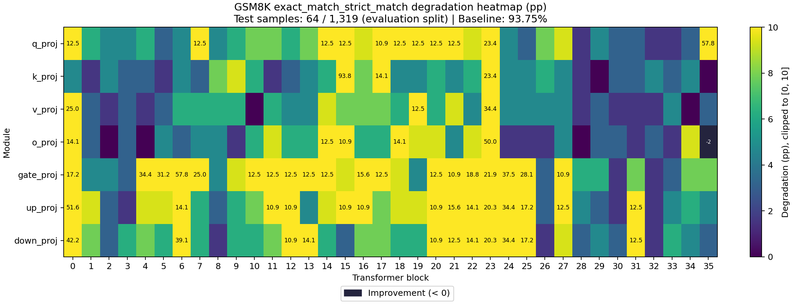
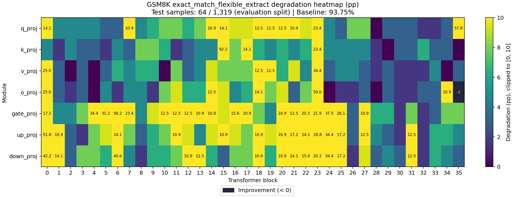

# Sensitivity Report

- Task: `gsm8k`
- Dataset: `gsm8k`
- Split: `lm-eval`
- Preprocessing: `lm-eval-default-shot`
- Evaluated examples: 64
- Total evaluation examples: 1319
- Baseline evaluation seconds: 84.1725

## Baseline Metrics

| Metric | Value |
|---|---:|
| exact_match_strict_match | 0.9375 |
| exact_match_flexible_extract | 0.9375 |

## Cases

| Case | Targets | Model Compression Ratio | Tensor Size Ratio | Compression Seconds | Evaluation Seconds |
|---|---:|---:|---:|---:|---:|
| model.layers.0.self_attn.q_proj | 1 | 1.00176 | 1.00176 | 0.0910536 | 78.7838 |
| model.layers.0.self_attn.k_proj | 1 | 1.00036 | 1.00036 | 0.0315525 | 73.5948 |
| model.layers.0.self_attn.v_proj | 1 | 1.00036 | 1.00036 | 0.0306042 | 80.9811 |
| model.layers.0.self_attn.o_proj | 1 | 1.00176 | 1.00176 | 0.0508328 | 92.7231 |
| model.layers.0.mlp.gate_proj | 1 | 1.00588 | 1.00588 | 0.141424 | 84.8271 |
| model.layers.0.mlp.up_proj | 1 | 1.00588 | 1.00588 | 0.138674 | 86.0405 |
| model.layers.0.mlp.down_proj | 1 | 1.00588 | 1.00588 | 0.136592 | 77.8771 |
| model.layers.1.self_attn.q_proj | 1 | 1.00176 | 1.00176 | 0.0548057 | 79.4219 |
| model.layers.1.self_attn.k_proj | 1 | 1.00036 | 1.00036 | 0.0307808 | 78.8733 |
| model.layers.1.self_attn.v_proj | 1 | 1.00036 | 1.00036 | 0.0301154 | 73.7087 |
| model.layers.1.self_attn.o_proj | 1 | 1.00176 | 1.00176 | 0.0506531 | 75.1746 |
| model.layers.1.mlp.gate_proj | 1 | 1.00588 | 1.00588 | 0.13966 | 76.933 |
| model.layers.1.mlp.up_proj | 1 | 1.00588 | 1.00588 | 0.137064 | 79.1372 |
| model.layers.1.mlp.down_proj | 1 | 1.00588 | 1.00588 | 0.136045 | 80.4082 |
| model.layers.2.self_attn.q_proj | 1 | 1.00176 | 1.00176 | 0.0507566 | 80.4452 |
| model.layers.2.self_attn.k_proj | 1 | 1.00036 | 1.00036 | 0.0306903 | 76.1237 |
| model.layers.2.self_attn.v_proj | 1 | 1.00036 | 1.00036 | 0.0303023 | 74.3163 |
| model.layers.2.self_attn.o_proj | 1 | 1.00176 | 1.00176 | 0.0567929 | 78.2436 |
| model.layers.2.mlp.gate_proj | 1 | 1.00588 | 1.00588 | 0.137112 | 79.18 |
| model.layers.2.mlp.up_proj | 1 | 1.00588 | 1.00588 | 0.135597 | 78.7184 |
| model.layers.2.mlp.down_proj | 1 | 1.00588 | 1.00588 | 0.137747 | 75.2143 |
| model.layers.3.self_attn.q_proj | 1 | 1.00176 | 1.00176 | 0.050684 | 75.2895 |
| model.layers.3.self_attn.k_proj | 1 | 1.00036 | 1.00036 | 0.0307753 | 80.701 |
| model.layers.3.self_attn.v_proj | 1 | 1.00036 | 1.00036 | 0.0299941 | 71.5209 |
| model.layers.3.self_attn.o_proj | 1 | 1.00176 | 1.00176 | 0.0507068 | 72.1638 |
| model.layers.3.mlp.gate_proj | 1 | 1.00588 | 1.00588 | 0.138749 | 79.2312 |
| model.layers.3.mlp.up_proj | 1 | 1.00588 | 1.00588 | 0.135733 | 76.3509 |
| model.layers.3.mlp.down_proj | 1 | 1.00588 | 1.00588 | 0.135735 | 77.2769 |
| model.layers.4.self_attn.q_proj | 1 | 1.00176 | 1.00176 | 0.0512646 | 71.6937 |
| model.layers.4.self_attn.k_proj | 1 | 1.00036 | 1.00036 | 0.0303744 | 74.6383 |
| model.layers.4.self_attn.v_proj | 1 | 1.00036 | 1.00036 | 0.0300915 | 77.816 |
| model.layers.4.self_attn.o_proj | 1 | 1.00176 | 1.00176 | 0.0515516 | 72.8583 |
| model.layers.4.mlp.gate_proj | 1 | 1.00588 | 1.00588 | 0.138559 | 75.1426 |
| model.layers.4.mlp.up_proj | 1 | 1.00588 | 1.00588 | 0.136581 | 79.7713 |
| model.layers.4.mlp.down_proj | 1 | 1.00588 | 1.00588 | 0.136246 | 76.0782 |
| model.layers.5.self_attn.q_proj | 1 | 1.00176 | 1.00176 | 0.0509099 | 78.983 |
| model.layers.5.self_attn.k_proj | 1 | 1.00036 | 1.00036 | 0.0304981 | 77.3125 |
| model.layers.5.self_attn.v_proj | 1 | 1.00036 | 1.00036 | 0.0301678 | 76.4137 |
| model.layers.5.self_attn.o_proj | 1 | 1.00176 | 1.00176 | 0.050617 | 77.4501 |
| model.layers.5.mlp.gate_proj | 1 | 1.00588 | 1.00588 | 0.139091 | 80.0584 |
| model.layers.5.mlp.up_proj | 1 | 1.00588 | 1.00588 | 0.140303 | 75.6887 |
| model.layers.5.mlp.down_proj | 1 | 1.00588 | 1.00588 | 0.138622 | 75.146 |
| model.layers.6.self_attn.q_proj | 1 | 1.00176 | 1.00176 | 0.0507849 | 77.0151 |
| model.layers.6.self_attn.k_proj | 1 | 1.00036 | 1.00036 | 0.0307788 | 77.9326 |
| model.layers.6.self_attn.v_proj | 1 | 1.00036 | 1.00036 | 0.0302284 | 74.4963 |
| model.layers.6.self_attn.o_proj | 1 | 1.00176 | 1.00176 | 0.0536522 | 76.5883 |
| model.layers.6.mlp.gate_proj | 1 | 1.00588 | 1.00588 | 0.138802 | 77.0134 |
| model.layers.6.mlp.up_proj | 1 | 1.00588 | 1.00588 | 0.138463 | 74.915 |
| model.layers.6.mlp.down_proj | 1 | 1.00588 | 1.00588 | 0.138805 | 84.0354 |
| model.layers.7.self_attn.q_proj | 1 | 1.00176 | 1.00176 | 0.0503067 | 80.7539 |
| model.layers.7.self_attn.k_proj | 1 | 1.00036 | 1.00036 | 0.0302768 | 81.1398 |
| model.layers.7.self_attn.v_proj | 1 | 1.00036 | 1.00036 | 0.0323654 | 74.2503 |
| model.layers.7.self_attn.o_proj | 1 | 1.00176 | 1.00176 | 0.0507161 | 73.558 |
| model.layers.7.mlp.gate_proj | 1 | 1.00588 | 1.00588 | 0.138239 | 76.0818 |
| model.layers.7.mlp.up_proj | 1 | 1.00588 | 1.00588 | 0.13871 | 78.0771 |
| model.layers.7.mlp.down_proj | 1 | 1.00588 | 1.00588 | 0.139343 | 77.6943 |
| model.layers.8.self_attn.q_proj | 1 | 1.00176 | 1.00176 | 0.0511262 | 80.9831 |
| model.layers.8.self_attn.k_proj | 1 | 1.00036 | 1.00036 | 0.03105 | 78.733 |
| model.layers.8.self_attn.v_proj | 1 | 1.00036 | 1.00036 | 0.0306792 | 75.9438 |
| model.layers.8.self_attn.o_proj | 1 | 1.00176 | 1.00176 | 0.0514959 | 75.7797 |
| model.layers.8.mlp.gate_proj | 1 | 1.00588 | 1.00588 | 0.139517 | 74.9238 |
| model.layers.8.mlp.up_proj | 1 | 1.00588 | 1.00588 | 0.155885 | 80.1546 |
| model.layers.8.mlp.down_proj | 1 | 1.00588 | 1.00588 | 0.13921 | 74.5036 |
| model.layers.9.self_attn.q_proj | 1 | 1.00176 | 1.00176 | 0.0507376 | 76.2318 |
| model.layers.9.self_attn.k_proj | 1 | 1.00036 | 1.00036 | 0.0301355 | 76.0743 |
| model.layers.9.self_attn.v_proj | 1 | 1.00036 | 1.00036 | 0.0302133 | 76.4406 |
| model.layers.9.self_attn.o_proj | 1 | 1.00176 | 1.00176 | 0.0509742 | 74.5299 |
| model.layers.9.mlp.gate_proj | 1 | 1.00588 | 1.00588 | 0.138999 | 77.7943 |
| model.layers.9.mlp.up_proj | 1 | 1.00588 | 1.00588 | 0.138953 | 76.7624 |
| model.layers.9.mlp.down_proj | 1 | 1.00588 | 1.00588 | 0.138746 | 73.5013 |
| model.layers.10.self_attn.q_proj | 1 | 1.00176 | 1.00176 | 0.0518732 | 75.7213 |
| model.layers.10.self_attn.k_proj | 1 | 1.00036 | 1.00036 | 0.030661 | 75.1053 |
| model.layers.10.self_attn.v_proj | 1 | 1.00036 | 1.00036 | 0.0302053 | 75.5713 |
| model.layers.10.self_attn.o_proj | 1 | 1.00176 | 1.00176 | 0.0506033 | 78.4673 |
| model.layers.10.mlp.gate_proj | 1 | 1.00588 | 1.00588 | 0.139976 | 82.4421 |
| model.layers.10.mlp.up_proj | 1 | 1.00588 | 1.00588 | 0.139864 | 75.9782 |
| model.layers.10.mlp.down_proj | 1 | 1.00588 | 1.00588 | 0.139017 | 75.0832 |
| model.layers.11.self_attn.q_proj | 1 | 1.00176 | 1.00176 | 0.0507934 | 79.8639 |
| model.layers.11.self_attn.k_proj | 1 | 1.00036 | 1.00036 | 0.0306659 | 78.1245 |
| model.layers.11.self_attn.v_proj | 1 | 1.00036 | 1.00036 | 0.0320141 | 86.7645 |
| model.layers.11.self_attn.o_proj | 1 | 1.00176 | 1.00176 | 0.0508532 | 76.2967 |
| model.layers.11.mlp.gate_proj | 1 | 1.00588 | 1.00588 | 0.13881 | 83.4948 |
| model.layers.11.mlp.up_proj | 1 | 1.00588 | 1.00588 | 0.163804 | 73.5541 |
| model.layers.11.mlp.down_proj | 1 | 1.00588 | 1.00588 | 0.139144 | 72.9163 |
| model.layers.12.self_attn.q_proj | 1 | 1.00176 | 1.00176 | 0.0504446 | 78.0013 |
| model.layers.12.self_attn.k_proj | 1 | 1.00036 | 1.00036 | 0.0303723 | 78.934 |
| model.layers.12.self_attn.v_proj | 1 | 1.00036 | 1.00036 | 0.0300731 | 78.808 |
| model.layers.12.self_attn.o_proj | 1 | 1.00176 | 1.00176 | 0.0509733 | 81.6894 |
| model.layers.12.mlp.gate_proj | 1 | 1.00588 | 1.00588 | 0.139892 | 71.7634 |
| model.layers.12.mlp.up_proj | 1 | 1.00588 | 1.00588 | 0.13894 | 78.1783 |
| model.layers.12.mlp.down_proj | 1 | 1.00588 | 1.00588 | 0.139965 | 79.6786 |
| model.layers.13.self_attn.q_proj | 1 | 1.00176 | 1.00176 | 0.0527026 | 78.3562 |
| model.layers.13.self_attn.k_proj | 1 | 1.00036 | 1.00036 | 0.0305048 | 75.5931 |
| model.layers.13.self_attn.v_proj | 1 | 1.00036 | 1.00036 | 0.0311187 | 74.5814 |
| model.layers.13.self_attn.o_proj | 1 | 1.00176 | 1.00176 | 0.0513205 | 74.6457 |
| model.layers.13.mlp.gate_proj | 1 | 1.00588 | 1.00588 | 0.139689 | 76.6113 |
| model.layers.13.mlp.up_proj | 1 | 1.00588 | 1.00588 | 0.139842 | 73.7554 |
| model.layers.13.mlp.down_proj | 1 | 1.00588 | 1.00588 | 0.138892 | 78.0887 |
| model.layers.14.self_attn.q_proj | 1 | 1.00176 | 1.00176 | 0.0514061 | 74.8421 |
| model.layers.14.self_attn.k_proj | 1 | 1.00036 | 1.00036 | 0.0304456 | 78.4107 |
| model.layers.14.self_attn.v_proj | 1 | 1.00036 | 1.00036 | 0.030212 | 76.1816 |
| model.layers.14.self_attn.o_proj | 1 | 1.00176 | 1.00176 | 0.0506848 | 74.5875 |
| model.layers.14.mlp.gate_proj | 1 | 1.00588 | 1.00588 | 0.138957 | 76.6861 |
| model.layers.14.mlp.up_proj | 1 | 1.00588 | 1.00588 | 0.139548 | 76.4305 |
| model.layers.14.mlp.down_proj | 1 | 1.00588 | 1.00588 | 0.139069 | 76.6573 |
| model.layers.15.self_attn.q_proj | 1 | 1.00176 | 1.00176 | 0.05432 | 78.1357 |
| model.layers.15.self_attn.k_proj | 1 | 1.00036 | 1.00036 | 0.0306623 | 94.1295 |
| model.layers.15.self_attn.v_proj | 1 | 1.00036 | 1.00036 | 0.0301936 | 75.1437 |
| model.layers.15.self_attn.o_proj | 1 | 1.00176 | 1.00176 | 0.05048 | 72.0888 |
| model.layers.15.mlp.gate_proj | 1 | 1.00588 | 1.00588 | 0.136737 | 79.3054 |
| model.layers.15.mlp.up_proj | 1 | 1.00588 | 1.00588 | 0.140513 | 80.8507 |
| model.layers.15.mlp.down_proj | 1 | 1.00588 | 1.00588 | 0.138765 | 73.2252 |
| model.layers.16.self_attn.q_proj | 1 | 1.00176 | 1.00176 | 0.0506047 | 75.8701 |
| model.layers.16.self_attn.k_proj | 1 | 1.00036 | 1.00036 | 0.0302653 | 75.8418 |
| model.layers.16.self_attn.v_proj | 1 | 1.00036 | 1.00036 | 0.0308683 | 75.92 |
| model.layers.16.self_attn.o_proj | 1 | 1.00176 | 1.00176 | 0.0506806 | 80.6588 |
| model.layers.16.mlp.gate_proj | 1 | 1.00588 | 1.00588 | 0.14687 | 76.9265 |
| model.layers.16.mlp.up_proj | 1 | 1.00588 | 1.00588 | 0.138865 | 79.0061 |
| model.layers.16.mlp.down_proj | 1 | 1.00588 | 1.00588 | 0.139137 | 76.3709 |
| model.layers.17.self_attn.q_proj | 1 | 1.00176 | 1.00176 | 0.0509688 | 71.5436 |
| model.layers.17.self_attn.k_proj | 1 | 1.00036 | 1.00036 | 0.0303968 | 81.1187 |
| model.layers.17.self_attn.v_proj | 1 | 1.00036 | 1.00036 | 0.0303443 | 77.7422 |
| model.layers.17.self_attn.o_proj | 1 | 1.00176 | 1.00176 | 0.0506345 | 72.0536 |
| model.layers.17.mlp.gate_proj | 1 | 1.00588 | 1.00588 | 0.139073 | 74.7709 |
| model.layers.17.mlp.up_proj | 1 | 1.00588 | 1.00588 | 0.140378 | 73.235 |
| model.layers.17.mlp.down_proj | 1 | 1.00588 | 1.00588 | 0.139111 | 71.5943 |
| model.layers.18.self_attn.q_proj | 1 | 1.00176 | 1.00176 | 0.0505513 | 77.4661 |
| model.layers.18.self_attn.k_proj | 1 | 1.00036 | 1.00036 | 0.0299043 | 75.1719 |
| model.layers.18.self_attn.v_proj | 1 | 1.00036 | 1.00036 | 0.0301448 | 82.2162 |
| model.layers.18.self_attn.o_proj | 1 | 1.00176 | 1.00176 | 0.0509229 | 77.5411 |
| model.layers.18.mlp.gate_proj | 1 | 1.00588 | 1.00588 | 0.138386 | 74.8789 |
| model.layers.18.mlp.up_proj | 1 | 1.00588 | 1.00588 | 0.138626 | 73.7617 |
| model.layers.18.mlp.down_proj | 1 | 1.00588 | 1.00588 | 0.139017 | 77.493 |
| model.layers.19.self_attn.q_proj | 1 | 1.00176 | 1.00176 | 0.0507639 | 75.0171 |
| model.layers.19.self_attn.k_proj | 1 | 1.00036 | 1.00036 | 0.0309712 | 76.8758 |
| model.layers.19.self_attn.v_proj | 1 | 1.00036 | 1.00036 | 0.0305086 | 70.435 |
| model.layers.19.self_attn.o_proj | 1 | 1.00176 | 1.00176 | 0.0566948 | 72.4822 |
| model.layers.19.mlp.gate_proj | 1 | 1.00588 | 1.00588 | 0.138399 | 81.0081 |
| model.layers.19.mlp.up_proj | 1 | 1.00588 | 1.00588 | 0.147761 | 88.8073 |
| model.layers.19.mlp.down_proj | 1 | 1.00588 | 1.00588 | 0.140502 | 76.183 |
| model.layers.20.self_attn.q_proj | 1 | 1.00176 | 1.00176 | 0.0502824 | 72.6117 |
| model.layers.20.self_attn.k_proj | 1 | 1.00036 | 1.00036 | 0.030181 | 72.2612 |
| model.layers.20.self_attn.v_proj | 1 | 1.00036 | 1.00036 | 0.0308568 | 69.5217 |
| model.layers.20.self_attn.o_proj | 1 | 1.00176 | 1.00176 | 0.0506312 | 69.7018 |
| model.layers.20.mlp.gate_proj | 1 | 1.00588 | 1.00588 | 0.138462 | 76.249 |
| model.layers.20.mlp.up_proj | 1 | 1.00588 | 1.00588 | 0.138613 | 81.2264 |
| model.layers.20.mlp.down_proj | 1 | 1.00588 | 1.00588 | 0.136748 | 78.8434 |
| model.layers.21.self_attn.q_proj | 1 | 1.00176 | 1.00176 | 0.0505654 | 76.6529 |
| model.layers.21.self_attn.k_proj | 1 | 1.00036 | 1.00036 | 0.0304325 | 78.4882 |
| model.layers.21.self_attn.v_proj | 1 | 1.00036 | 1.00036 | 0.0300107 | 76.1701 |
| model.layers.21.self_attn.o_proj | 1 | 1.00176 | 1.00176 | 0.0506556 | 75.2281 |
| model.layers.21.mlp.gate_proj | 1 | 1.00588 | 1.00588 | 0.139243 | 79.9343 |
| model.layers.21.mlp.up_proj | 1 | 1.00588 | 1.00588 | 0.139947 | 75.854 |
| model.layers.21.mlp.down_proj | 1 | 1.00588 | 1.00588 | 0.138227 | 79.6187 |
| model.layers.22.self_attn.q_proj | 1 | 1.00176 | 1.00176 | 0.0506215 | 75.159 |
| model.layers.22.self_attn.k_proj | 1 | 1.00036 | 1.00036 | 0.0300992 | 75.2888 |
| model.layers.22.self_attn.v_proj | 1 | 1.00036 | 1.00036 | 0.0301924 | 68.9691 |
| model.layers.22.self_attn.o_proj | 1 | 1.00176 | 1.00176 | 0.0508039 | 70.5945 |
| model.layers.22.mlp.gate_proj | 1 | 1.00588 | 1.00588 | 0.138743 | 75.2755 |
| model.layers.22.mlp.up_proj | 1 | 1.00588 | 1.00588 | 0.137703 | 85.6436 |
| model.layers.22.mlp.down_proj | 1 | 1.00588 | 1.00588 | 0.138977 | 85.972 |
| model.layers.23.self_attn.q_proj | 1 | 1.00176 | 1.00176 | 0.0507344 | 69.7478 |
| model.layers.23.self_attn.k_proj | 1 | 1.00036 | 1.00036 | 0.0299409 | 75.1152 |
| model.layers.23.self_attn.v_proj | 1 | 1.00036 | 1.00036 | 0.0301435 | 77.6057 |
| model.layers.23.self_attn.o_proj | 1 | 1.00176 | 1.00176 | 0.0504596 | 80.8828 |
| model.layers.23.mlp.gate_proj | 1 | 1.00588 | 1.00588 | 0.143599 | 84.0083 |
| model.layers.23.mlp.up_proj | 1 | 1.00588 | 1.00588 | 0.138856 | 80.2244 |
| model.layers.23.mlp.down_proj | 1 | 1.00588 | 1.00588 | 0.138091 | 75.8512 |
| model.layers.24.self_attn.q_proj | 1 | 1.00176 | 1.00176 | 0.054696 | 73.0778 |
| model.layers.24.self_attn.k_proj | 1 | 1.00036 | 1.00036 | 0.0304723 | 71.6374 |
| model.layers.24.self_attn.v_proj | 1 | 1.00036 | 1.00036 | 0.0323401 | 73.5364 |
| model.layers.24.self_attn.o_proj | 1 | 1.00176 | 1.00176 | 0.0506808 | 70.4323 |
| model.layers.24.mlp.gate_proj | 1 | 1.00588 | 1.00588 | 0.139305 | 77.1563 |
| model.layers.24.mlp.up_proj | 1 | 1.00588 | 1.00588 | 0.138818 | 73.2069 |
| model.layers.24.mlp.down_proj | 1 | 1.00588 | 1.00588 | 0.138529 | 73.0803 |
| model.layers.25.self_attn.q_proj | 1 | 1.00176 | 1.00176 | 0.0507896 | 76.9139 |
| model.layers.25.self_attn.k_proj | 1 | 1.00036 | 1.00036 | 0.0310103 | 75.489 |
| model.layers.25.self_attn.v_proj | 1 | 1.00036 | 1.00036 | 0.0303457 | 81.8929 |
| model.layers.25.self_attn.o_proj | 1 | 1.00176 | 1.00176 | 0.0511937 | 76.915 |
| model.layers.25.mlp.gate_proj | 1 | 1.00588 | 1.00588 | 0.138663 | 78.1156 |
| model.layers.25.mlp.up_proj | 1 | 1.00588 | 1.00588 | 0.147825 | 77.3865 |
| model.layers.25.mlp.down_proj | 1 | 1.00588 | 1.00588 | 0.138421 | 76.7196 |
| model.layers.26.self_attn.q_proj | 1 | 1.00176 | 1.00176 | 0.0505132 | 79.2516 |
| model.layers.26.self_attn.k_proj | 1 | 1.00036 | 1.00036 | 0.0305849 | 80.9061 |
| model.layers.26.self_attn.v_proj | 1 | 1.00036 | 1.00036 | 0.0303048 | 70.7159 |
| model.layers.26.self_attn.o_proj | 1 | 1.00176 | 1.00176 | 0.0525962 | 76.0101 |
| model.layers.26.mlp.gate_proj | 1 | 1.00588 | 1.00588 | 0.138999 | 77.6168 |
| model.layers.26.mlp.up_proj | 1 | 1.00588 | 1.00588 | 0.139126 | 80.9696 |
| model.layers.26.mlp.down_proj | 1 | 1.00588 | 1.00588 | 0.139139 | 80.8956 |
| model.layers.27.self_attn.q_proj | 1 | 1.00176 | 1.00176 | 0.0510016 | 74.7321 |
| model.layers.27.self_attn.k_proj | 1 | 1.00036 | 1.00036 | 0.0304304 | 75.4168 |
| model.layers.27.self_attn.v_proj | 1 | 1.00036 | 1.00036 | 0.030274 | 76.7568 |
| model.layers.27.self_attn.o_proj | 1 | 1.00176 | 1.00176 | 0.0507198 | 76.6163 |
| model.layers.27.mlp.gate_proj | 1 | 1.00588 | 1.00588 | 0.139347 | 71.5547 |
| model.layers.27.mlp.up_proj | 1 | 1.00588 | 1.00588 | 0.147381 | 80.8006 |
| model.layers.27.mlp.down_proj | 1 | 1.00588 | 1.00588 | 0.139466 | 73.2604 |
| model.layers.28.self_attn.q_proj | 1 | 1.00176 | 1.00176 | 0.0501844 | 75.6258 |
| model.layers.28.self_attn.k_proj | 1 | 1.00036 | 1.00036 | 0.0305436 | 72.8677 |
| model.layers.28.self_attn.v_proj | 1 | 1.00036 | 1.00036 | 0.0301692 | 76.6719 |
| model.layers.28.self_attn.o_proj | 1 | 1.00176 | 1.00176 | 0.050759 | 77.0373 |
| model.layers.28.mlp.gate_proj | 1 | 1.00588 | 1.00588 | 0.139815 | 82.4479 |
| model.layers.28.mlp.up_proj | 1 | 1.00588 | 1.00588 | 0.139562 | 80.7534 |
| model.layers.28.mlp.down_proj | 1 | 1.00588 | 1.00588 | 0.141153 | 80.6501 |
| model.layers.29.self_attn.q_proj | 1 | 1.00176 | 1.00176 | 0.0504739 | 75.8263 |
| model.layers.29.self_attn.k_proj | 1 | 1.00036 | 1.00036 | 0.0297566 | 69.6544 |
| model.layers.29.self_attn.v_proj | 1 | 1.00036 | 1.00036 | 0.0299366 | 77.8511 |
| model.layers.29.self_attn.o_proj | 1 | 1.00176 | 1.00176 | 0.0511683 | 76.1268 |
| model.layers.29.mlp.gate_proj | 1 | 1.00588 | 1.00588 | 0.139461 | 80.0922 |
| model.layers.29.mlp.up_proj | 1 | 1.00588 | 1.00588 | 0.13925 | 76.5464 |
| model.layers.29.mlp.down_proj | 1 | 1.00588 | 1.00588 | 0.136275 | 79.6712 |
| model.layers.30.self_attn.q_proj | 1 | 1.00176 | 1.00176 | 0.0528902 | 75.4026 |
| model.layers.30.self_attn.k_proj | 1 | 1.00036 | 1.00036 | 0.0302191 | 76.7357 |
| model.layers.30.self_attn.v_proj | 1 | 1.00036 | 1.00036 | 0.0301929 | 76.6245 |
| model.layers.30.self_attn.o_proj | 1 | 1.00176 | 1.00176 | 0.0515707 | 74.4485 |
| model.layers.30.mlp.gate_proj | 1 | 1.00588 | 1.00588 | 0.138777 | 78.686 |
| model.layers.30.mlp.up_proj | 1 | 1.00588 | 1.00588 | 0.138949 | 77.397 |
| model.layers.30.mlp.down_proj | 1 | 1.00588 | 1.00588 | 0.139691 | 75.8225 |
| model.layers.31.self_attn.q_proj | 1 | 1.00176 | 1.00176 | 0.0513497 | 74.2716 |
| model.layers.31.self_attn.k_proj | 1 | 1.00036 | 1.00036 | 0.0302723 | 75.8148 |
| model.layers.31.self_attn.v_proj | 1 | 1.00036 | 1.00036 | 0.0338692 | 72.7981 |
| model.layers.31.self_attn.o_proj | 1 | 1.00176 | 1.00176 | 0.0508692 | 75.0293 |
| model.layers.31.mlp.gate_proj | 1 | 1.00588 | 1.00588 | 0.141469 | 77.6375 |
| model.layers.31.mlp.up_proj | 1 | 1.00588 | 1.00588 | 0.14084 | 74.4236 |
| model.layers.31.mlp.down_proj | 1 | 1.00588 | 1.00588 | 0.138914 | 76.3934 |
| model.layers.32.self_attn.q_proj | 1 | 1.00176 | 1.00176 | 0.0499489 | 70.8843 |
| model.layers.32.self_attn.k_proj | 1 | 1.00036 | 1.00036 | 0.0304639 | 75.5983 |
| model.layers.32.self_attn.v_proj | 1 | 1.00036 | 1.00036 | 0.0305931 | 75.3349 |
| model.layers.32.self_attn.o_proj | 1 | 1.00176 | 1.00176 | 0.0510168 | 73.8049 |
| model.layers.32.mlp.gate_proj | 1 | 1.00588 | 1.00588 | 0.137808 | 82.0065 |
| model.layers.32.mlp.up_proj | 1 | 1.00588 | 1.00588 | 0.136651 | 81.6621 |
| model.layers.32.mlp.down_proj | 1 | 1.00588 | 1.00588 | 0.144384 | 80.1856 |
| model.layers.33.self_attn.q_proj | 1 | 1.00176 | 1.00176 | 0.0504518 | 72.8586 |
| model.layers.33.self_attn.k_proj | 1 | 1.00036 | 1.00036 | 0.0305585 | 79.3845 |
| model.layers.33.self_attn.v_proj | 1 | 1.00036 | 1.00036 | 0.0296997 | 75.0854 |
| model.layers.33.self_attn.o_proj | 1 | 1.00176 | 1.00176 | 0.0510769 | 80.6063 |
| model.layers.33.mlp.gate_proj | 1 | 1.00588 | 1.00588 | 0.138965 | 74.2924 |
| model.layers.33.mlp.up_proj | 1 | 1.00588 | 1.00588 | 0.139111 | 81.6091 |
| model.layers.33.mlp.down_proj | 1 | 1.00588 | 1.00588 | 0.139518 | 76.8262 |
| model.layers.34.self_attn.q_proj | 1 | 1.00176 | 1.00176 | 0.0552217 | 69.4874 |
| model.layers.34.self_attn.k_proj | 1 | 1.00036 | 1.00036 | 0.0301809 | 72.4019 |
| model.layers.34.self_attn.v_proj | 1 | 1.00036 | 1.00036 | 0.0305459 | 69.7098 |
| model.layers.34.self_attn.o_proj | 1 | 1.00176 | 1.00176 | 0.0508183 | 72.3062 |
| model.layers.34.mlp.gate_proj | 1 | 1.00588 | 1.00588 | 0.139835 | 79.837 |
| model.layers.34.mlp.up_proj | 1 | 1.00588 | 1.00588 | 0.139444 | 78.7136 |
| model.layers.34.mlp.down_proj | 1 | 1.00588 | 1.00588 | 0.138533 | 74.9849 |
| model.layers.35.self_attn.q_proj | 1 | 1.00176 | 1.00176 | 0.0510771 | 85.582 |
| model.layers.35.self_attn.k_proj | 1 | 1.00036 | 1.00036 | 0.0304168 | 77.6488 |
| model.layers.35.self_attn.v_proj | 1 | 1.00036 | 1.00036 | 0.0300891 | 76.4526 |
| model.layers.35.self_attn.o_proj | 1 | 1.00176 | 1.00176 | 0.050302 | 73.4674 |
| model.layers.35.mlp.gate_proj | 1 | 1.00588 | 1.00588 | 0.139743 | 69.8484 |
| model.layers.35.mlp.up_proj | 1 | 1.00588 | 1.00588 | 0.14525 | 77.4152 |
| model.layers.35.mlp.down_proj | 1 | 1.00588 | 1.00588 | 0.137634 | 75.9822 |

## Metrics

| Case | Metric | Value | Degradation |
|---|---|---:|---:|
| model.layers.0.self_attn.q_proj | exact_match_strict_match | 0.8125 | 0.125 |
| model.layers.0.self_attn.q_proj | exact_match_flexible_extract | 0.796875 | 0.140625 |
| model.layers.0.self_attn.k_proj | exact_match_strict_match | 0.890625 | 0.046875 |
| model.layers.0.self_attn.k_proj | exact_match_flexible_extract | 0.890625 | 0.046875 |
| model.layers.0.self_attn.v_proj | exact_match_strict_match | 0.6875 | 0.25 |
| model.layers.0.self_attn.v_proj | exact_match_flexible_extract | 0.6875 | 0.25 |
| model.layers.0.self_attn.o_proj | exact_match_strict_match | 0.796875 | 0.140625 |
| model.layers.0.self_attn.o_proj | exact_match_flexible_extract | 0.6875 | 0.25 |
| model.layers.0.mlp.gate_proj | exact_match_strict_match | 0.765625 | 0.171875 |
| model.layers.0.mlp.gate_proj | exact_match_flexible_extract | 0.765625 | 0.171875 |
| model.layers.0.mlp.up_proj | exact_match_strict_match | 0.421875 | 0.515625 |
| model.layers.0.mlp.up_proj | exact_match_flexible_extract | 0.421875 | 0.515625 |
| model.layers.0.mlp.down_proj | exact_match_strict_match | 0.515625 | 0.421875 |
| model.layers.0.mlp.down_proj | exact_match_flexible_extract | 0.515625 | 0.421875 |
| model.layers.1.self_attn.q_proj | exact_match_strict_match | 0.875 | 0.0625 |
| model.layers.1.self_attn.q_proj | exact_match_flexible_extract | 0.890625 | 0.046875 |
| model.layers.1.self_attn.k_proj | exact_match_strict_match | 0.921875 | 0.015625 |
| model.layers.1.self_attn.k_proj | exact_match_flexible_extract | 0.921875 | 0.015625 |
| model.layers.1.self_attn.v_proj | exact_match_strict_match | 0.90625 | 0.03125 |
| model.layers.1.self_attn.v_proj | exact_match_flexible_extract | 0.90625 | 0.03125 |
| model.layers.1.self_attn.o_proj | exact_match_strict_match | 0.90625 | 0.03125 |
| model.layers.1.self_attn.o_proj | exact_match_flexible_extract | 0.90625 | 0.03125 |
| model.layers.1.mlp.gate_proj | exact_match_strict_match | 0.890625 | 0.046875 |
| model.layers.1.mlp.gate_proj | exact_match_flexible_extract | 0.890625 | 0.046875 |
| model.layers.1.mlp.up_proj | exact_match_strict_match | 0.84375 | 0.09375 |
| model.layers.1.mlp.up_proj | exact_match_flexible_extract | 0.828125 | 0.109375 |
| model.layers.1.mlp.down_proj | exact_match_strict_match | 0.859375 | 0.078125 |
| model.layers.1.mlp.down_proj | exact_match_flexible_extract | 0.796875 | 0.140625 |
| model.layers.2.self_attn.q_proj | exact_match_strict_match | 0.890625 | 0.046875 |
| model.layers.2.self_attn.q_proj | exact_match_flexible_extract | 0.890625 | 0.046875 |
| model.layers.2.self_attn.k_proj | exact_match_strict_match | 0.890625 | 0.046875 |
| model.layers.2.self_attn.k_proj | exact_match_flexible_extract | 0.890625 | 0.046875 |
| model.layers.2.self_attn.v_proj | exact_match_strict_match | 0.921875 | 0.015625 |
| model.layers.2.self_attn.v_proj | exact_match_flexible_extract | 0.9375 | 0 |
| model.layers.2.self_attn.o_proj | exact_match_strict_match | 0.9375 | 0 |
| model.layers.2.self_attn.o_proj | exact_match_flexible_extract | 0.921875 | 0.015625 |
| model.layers.2.mlp.gate_proj | exact_match_strict_match | 0.890625 | 0.046875 |
| model.layers.2.mlp.gate_proj | exact_match_flexible_extract | 0.890625 | 0.046875 |
| model.layers.2.mlp.up_proj | exact_match_strict_match | 0.90625 | 0.03125 |
| model.layers.2.mlp.up_proj | exact_match_flexible_extract | 0.90625 | 0.03125 |
| model.layers.2.mlp.down_proj | exact_match_strict_match | 0.90625 | 0.03125 |
| model.layers.2.mlp.down_proj | exact_match_flexible_extract | 0.90625 | 0.03125 |
| model.layers.3.self_attn.q_proj | exact_match_strict_match | 0.890625 | 0.046875 |
| model.layers.3.self_attn.q_proj | exact_match_flexible_extract | 0.890625 | 0.046875 |
| model.layers.3.self_attn.k_proj | exact_match_strict_match | 0.90625 | 0.03125 |
| model.layers.3.self_attn.k_proj | exact_match_flexible_extract | 0.90625 | 0.03125 |
| model.layers.3.self_attn.v_proj | exact_match_strict_match | 0.90625 | 0.03125 |
| model.layers.3.self_attn.v_proj | exact_match_flexible_extract | 0.90625 | 0.03125 |
| model.layers.3.self_attn.o_proj | exact_match_strict_match | 0.90625 | 0.03125 |
| model.layers.3.self_attn.o_proj | exact_match_flexible_extract | 0.90625 | 0.03125 |
| model.layers.3.mlp.gate_proj | exact_match_strict_match | 0.90625 | 0.03125 |
| model.layers.3.mlp.gate_proj | exact_match_flexible_extract | 0.859375 | 0.078125 |
| model.layers.3.mlp.up_proj | exact_match_strict_match | 0.921875 | 0.015625 |
| model.layers.3.mlp.up_proj | exact_match_flexible_extract | 0.921875 | 0.015625 |
| model.layers.3.mlp.down_proj | exact_match_strict_match | 0.875 | 0.0625 |
| model.layers.3.mlp.down_proj | exact_match_flexible_extract | 0.859375 | 0.078125 |
| model.layers.4.self_attn.q_proj | exact_match_strict_match | 0.875 | 0.0625 |
| model.layers.4.self_attn.q_proj | exact_match_flexible_extract | 0.890625 | 0.046875 |
| model.layers.4.self_attn.k_proj | exact_match_strict_match | 0.90625 | 0.03125 |
| model.layers.4.self_attn.k_proj | exact_match_flexible_extract | 0.90625 | 0.03125 |
| model.layers.4.self_attn.v_proj | exact_match_strict_match | 0.921875 | 0.015625 |
| model.layers.4.self_attn.v_proj | exact_match_flexible_extract | 0.9375 | 0 |
| model.layers.4.self_attn.o_proj | exact_match_strict_match | 0.9375 | 0 |
| model.layers.4.self_attn.o_proj | exact_match_flexible_extract | 0.9375 | 0 |
| model.layers.4.mlp.gate_proj | exact_match_strict_match | 0.59375 | 0.34375 |
| model.layers.4.mlp.gate_proj | exact_match_flexible_extract | 0.59375 | 0.34375 |
| model.layers.4.mlp.up_proj | exact_match_strict_match | 0.84375 | 0.09375 |
| model.layers.4.mlp.up_proj | exact_match_flexible_extract | 0.859375 | 0.078125 |
| model.layers.4.mlp.down_proj | exact_match_strict_match | 0.859375 | 0.078125 |
| model.layers.4.mlp.down_proj | exact_match_flexible_extract | 0.859375 | 0.078125 |
| model.layers.5.self_attn.q_proj | exact_match_strict_match | 0.90625 | 0.03125 |
| model.layers.5.self_attn.q_proj | exact_match_flexible_extract | 0.90625 | 0.03125 |
| model.layers.5.self_attn.k_proj | exact_match_strict_match | 0.921875 | 0.015625 |
| model.layers.5.self_attn.k_proj | exact_match_flexible_extract | 0.921875 | 0.015625 |
| model.layers.5.self_attn.v_proj | exact_match_strict_match | 0.90625 | 0.03125 |
| model.layers.5.self_attn.v_proj | exact_match_flexible_extract | 0.90625 | 0.03125 |
| model.layers.5.self_attn.o_proj | exact_match_strict_match | 0.890625 | 0.046875 |
| model.layers.5.self_attn.o_proj | exact_match_flexible_extract | 0.890625 | 0.046875 |
| model.layers.5.mlp.gate_proj | exact_match_strict_match | 0.625 | 0.3125 |
| model.layers.5.mlp.gate_proj | exact_match_flexible_extract | 0.625 | 0.3125 |
| model.layers.5.mlp.up_proj | exact_match_strict_match | 0.84375 | 0.09375 |
| model.layers.5.mlp.up_proj | exact_match_flexible_extract | 0.84375 | 0.09375 |
| model.layers.5.mlp.down_proj | exact_match_strict_match | 0.875 | 0.0625 |
| model.layers.5.mlp.down_proj | exact_match_flexible_extract | 0.875 | 0.0625 |
| model.layers.6.self_attn.q_proj | exact_match_strict_match | 0.890625 | 0.046875 |
| model.layers.6.self_attn.q_proj | exact_match_flexible_extract | 0.90625 | 0.03125 |
| model.layers.6.self_attn.k_proj | exact_match_strict_match | 0.890625 | 0.046875 |
| model.layers.6.self_attn.k_proj | exact_match_flexible_extract | 0.890625 | 0.046875 |
| model.layers.6.self_attn.v_proj | exact_match_strict_match | 0.875 | 0.0625 |
| model.layers.6.self_attn.v_proj | exact_match_flexible_extract | 0.875 | 0.0625 |
| model.layers.6.self_attn.o_proj | exact_match_strict_match | 0.90625 | 0.03125 |
| model.layers.6.self_attn.o_proj | exact_match_flexible_extract | 0.921875 | 0.015625 |
| model.layers.6.mlp.gate_proj | exact_match_strict_match | 0.359375 | 0.578125 |
| model.layers.6.mlp.gate_proj | exact_match_flexible_extract | 0.375 | 0.5625 |
| model.layers.6.mlp.up_proj | exact_match_strict_match | 0.796875 | 0.140625 |
| model.layers.6.mlp.up_proj | exact_match_flexible_extract | 0.796875 | 0.140625 |
| model.layers.6.mlp.down_proj | exact_match_strict_match | 0.546875 | 0.390625 |
| model.layers.6.mlp.down_proj | exact_match_flexible_extract | 0.53125 | 0.40625 |
| model.layers.7.self_attn.q_proj | exact_match_strict_match | 0.8125 | 0.125 |
| model.layers.7.self_attn.q_proj | exact_match_flexible_extract | 0.828125 | 0.109375 |
| model.layers.7.self_attn.k_proj | exact_match_strict_match | 0.90625 | 0.03125 |
| model.layers.7.self_attn.k_proj | exact_match_flexible_extract | 0.90625 | 0.03125 |
| model.layers.7.self_attn.v_proj | exact_match_strict_match | 0.875 | 0.0625 |
| model.layers.7.self_attn.v_proj | exact_match_flexible_extract | 0.890625 | 0.046875 |
| model.layers.7.self_attn.o_proj | exact_match_strict_match | 0.890625 | 0.046875 |
| model.layers.7.self_attn.o_proj | exact_match_flexible_extract | 0.890625 | 0.046875 |
| model.layers.7.mlp.gate_proj | exact_match_strict_match | 0.6875 | 0.25 |
| model.layers.7.mlp.gate_proj | exact_match_flexible_extract | 0.703125 | 0.234375 |
| model.layers.7.mlp.up_proj | exact_match_strict_match | 0.875 | 0.0625 |
| model.layers.7.mlp.up_proj | exact_match_flexible_extract | 0.859375 | 0.078125 |
| model.layers.7.mlp.down_proj | exact_match_strict_match | 0.875 | 0.0625 |
| model.layers.7.mlp.down_proj | exact_match_flexible_extract | 0.890625 | 0.046875 |
| model.layers.8.self_attn.q_proj | exact_match_strict_match | 0.890625 | 0.046875 |
| model.layers.8.self_attn.q_proj | exact_match_flexible_extract | 0.890625 | 0.046875 |
| model.layers.8.self_attn.k_proj | exact_match_strict_match | 0.859375 | 0.078125 |
| model.layers.8.self_attn.k_proj | exact_match_flexible_extract | 0.859375 | 0.078125 |
| model.layers.8.self_attn.v_proj | exact_match_strict_match | 0.875 | 0.0625 |
| model.layers.8.self_attn.v_proj | exact_match_flexible_extract | 0.875 | 0.0625 |
| model.layers.8.self_attn.o_proj | exact_match_strict_match | 0.890625 | 0.046875 |
| model.layers.8.self_attn.o_proj | exact_match_flexible_extract | 0.890625 | 0.046875 |
| model.layers.8.mlp.gate_proj | exact_match_strict_match | 0.890625 | 0.046875 |
| model.layers.8.mlp.gate_proj | exact_match_flexible_extract | 0.890625 | 0.046875 |
| model.layers.8.mlp.up_proj | exact_match_strict_match | 0.90625 | 0.03125 |
| model.layers.8.mlp.up_proj | exact_match_flexible_extract | 0.90625 | 0.03125 |
| model.layers.8.mlp.down_proj | exact_match_strict_match | 0.921875 | 0.015625 |
| model.layers.8.mlp.down_proj | exact_match_flexible_extract | 0.921875 | 0.015625 |
| model.layers.9.self_attn.q_proj | exact_match_strict_match | 0.875 | 0.0625 |
| model.layers.9.self_attn.q_proj | exact_match_flexible_extract | 0.875 | 0.0625 |
| model.layers.9.self_attn.k_proj | exact_match_strict_match | 0.84375 | 0.09375 |
| model.layers.9.self_attn.k_proj | exact_match_flexible_extract | 0.859375 | 0.078125 |
| model.layers.9.self_attn.v_proj | exact_match_strict_match | 0.875 | 0.0625 |
| model.layers.9.self_attn.v_proj | exact_match_flexible_extract | 0.875 | 0.0625 |
| model.layers.9.self_attn.o_proj | exact_match_strict_match | 0.921875 | 0.015625 |
| model.layers.9.self_attn.o_proj | exact_match_flexible_extract | 0.921875 | 0.015625 |
| model.layers.9.mlp.gate_proj | exact_match_strict_match | 0.84375 | 0.09375 |
| model.layers.9.mlp.gate_proj | exact_match_flexible_extract | 0.84375 | 0.09375 |
| model.layers.9.mlp.up_proj | exact_match_strict_match | 0.875 | 0.0625 |
| model.layers.9.mlp.up_proj | exact_match_flexible_extract | 0.875 | 0.0625 |
| model.layers.9.mlp.down_proj | exact_match_strict_match | 0.875 | 0.0625 |
| model.layers.9.mlp.down_proj | exact_match_flexible_extract | 0.875 | 0.0625 |
| model.layers.10.self_attn.q_proj | exact_match_strict_match | 0.859375 | 0.078125 |
| model.layers.10.self_attn.q_proj | exact_match_flexible_extract | 0.859375 | 0.078125 |
| model.layers.10.self_attn.k_proj | exact_match_strict_match | 0.875 | 0.0625 |
| model.layers.10.self_attn.k_proj | exact_match_flexible_extract | 0.875 | 0.0625 |
| model.layers.10.self_attn.v_proj | exact_match_strict_match | 0.9375 | 0 |
| model.layers.10.self_attn.v_proj | exact_match_flexible_extract | 0.9375 | 0 |
| model.layers.10.self_attn.o_proj | exact_match_strict_match | 0.875 | 0.0625 |
| model.layers.10.self_attn.o_proj | exact_match_flexible_extract | 0.859375 | 0.078125 |
| model.layers.10.mlp.gate_proj | exact_match_strict_match | 0.8125 | 0.125 |
| model.layers.10.mlp.gate_proj | exact_match_flexible_extract | 0.8125 | 0.125 |
| model.layers.10.mlp.up_proj | exact_match_strict_match | 0.859375 | 0.078125 |
| model.layers.10.mlp.up_proj | exact_match_flexible_extract | 0.859375 | 0.078125 |
| model.layers.10.mlp.down_proj | exact_match_strict_match | 0.875 | 0.0625 |
| model.layers.10.mlp.down_proj | exact_match_flexible_extract | 0.875 | 0.0625 |
| model.layers.11.self_attn.q_proj | exact_match_strict_match | 0.859375 | 0.078125 |
| model.layers.11.self_attn.q_proj | exact_match_flexible_extract | 0.859375 | 0.078125 |
| model.layers.11.self_attn.k_proj | exact_match_strict_match | 0.921875 | 0.015625 |
| model.layers.11.self_attn.k_proj | exact_match_flexible_extract | 0.921875 | 0.015625 |
| model.layers.11.self_attn.v_proj | exact_match_strict_match | 0.875 | 0.0625 |
| model.layers.11.self_attn.v_proj | exact_match_flexible_extract | 0.859375 | 0.078125 |
| model.layers.11.self_attn.o_proj | exact_match_strict_match | 0.84375 | 0.09375 |
| model.layers.11.self_attn.o_proj | exact_match_flexible_extract | 0.84375 | 0.09375 |
| model.layers.11.mlp.gate_proj | exact_match_strict_match | 0.8125 | 0.125 |
| model.layers.11.mlp.gate_proj | exact_match_flexible_extract | 0.8125 | 0.125 |
| model.layers.11.mlp.up_proj | exact_match_strict_match | 0.828125 | 0.109375 |
| model.layers.11.mlp.up_proj | exact_match_flexible_extract | 0.828125 | 0.109375 |
| model.layers.11.mlp.down_proj | exact_match_strict_match | 0.859375 | 0.078125 |
| model.layers.11.mlp.down_proj | exact_match_flexible_extract | 0.859375 | 0.078125 |
| model.layers.12.self_attn.q_proj | exact_match_strict_match | 0.875 | 0.0625 |
| model.layers.12.self_attn.q_proj | exact_match_flexible_extract | 0.875 | 0.0625 |
| model.layers.12.self_attn.k_proj | exact_match_strict_match | 0.90625 | 0.03125 |
| model.layers.12.self_attn.k_proj | exact_match_flexible_extract | 0.90625 | 0.03125 |
| model.layers.12.self_attn.v_proj | exact_match_strict_match | 0.890625 | 0.046875 |
| model.layers.12.self_attn.v_proj | exact_match_flexible_extract | 0.90625 | 0.03125 |
| model.layers.12.self_attn.o_proj | exact_match_strict_match | 0.875 | 0.0625 |
| model.layers.12.self_attn.o_proj | exact_match_flexible_extract | 0.875 | 0.0625 |
| model.layers.12.mlp.gate_proj | exact_match_strict_match | 0.8125 | 0.125 |
| model.layers.12.mlp.gate_proj | exact_match_flexible_extract | 0.8125 | 0.125 |
| model.layers.12.mlp.up_proj | exact_match_strict_match | 0.828125 | 0.109375 |
| model.layers.12.mlp.up_proj | exact_match_flexible_extract | 0.84375 | 0.09375 |
| model.layers.12.mlp.down_proj | exact_match_strict_match | 0.828125 | 0.109375 |
| model.layers.12.mlp.down_proj | exact_match_flexible_extract | 0.828125 | 0.109375 |
| model.layers.13.self_attn.q_proj | exact_match_strict_match | 0.859375 | 0.078125 |
| model.layers.13.self_attn.q_proj | exact_match_flexible_extract | 0.859375 | 0.078125 |
| model.layers.13.self_attn.k_proj | exact_match_strict_match | 0.890625 | 0.046875 |
| model.layers.13.self_attn.k_proj | exact_match_flexible_extract | 0.890625 | 0.046875 |
| model.layers.13.self_attn.v_proj | exact_match_strict_match | 0.890625 | 0.046875 |
| model.layers.13.self_attn.v_proj | exact_match_flexible_extract | 0.890625 | 0.046875 |
| model.layers.13.self_attn.o_proj | exact_match_strict_match | 0.875 | 0.0625 |
| model.layers.13.self_attn.o_proj | exact_match_flexible_extract | 0.875 | 0.0625 |
| model.layers.13.mlp.gate_proj | exact_match_strict_match | 0.8125 | 0.125 |
| model.layers.13.mlp.gate_proj | exact_match_flexible_extract | 0.828125 | 0.109375 |
| model.layers.13.mlp.up_proj | exact_match_strict_match | 0.890625 | 0.046875 |
| model.layers.13.mlp.up_proj | exact_match_flexible_extract | 0.890625 | 0.046875 |
| model.layers.13.mlp.down_proj | exact_match_strict_match | 0.796875 | 0.140625 |
| model.layers.13.mlp.down_proj | exact_match_flexible_extract | 0.8125 | 0.125 |
| model.layers.14.self_attn.q_proj | exact_match_strict_match | 0.8125 | 0.125 |
| model.layers.14.self_attn.q_proj | exact_match_flexible_extract | 0.828125 | 0.109375 |
| model.layers.14.self_attn.k_proj | exact_match_strict_match | 0.875 | 0.0625 |
| model.layers.14.self_attn.k_proj | exact_match_flexible_extract | 0.890625 | 0.046875 |
| model.layers.14.self_attn.v_proj | exact_match_strict_match | 0.84375 | 0.09375 |
| model.layers.14.self_attn.v_proj | exact_match_flexible_extract | 0.84375 | 0.09375 |
| model.layers.14.self_attn.o_proj | exact_match_strict_match | 0.8125 | 0.125 |
| model.layers.14.self_attn.o_proj | exact_match_flexible_extract | 0.8125 | 0.125 |
| model.layers.14.mlp.gate_proj | exact_match_strict_match | 0.8125 | 0.125 |
| model.layers.14.mlp.gate_proj | exact_match_flexible_extract | 0.828125 | 0.109375 |
| model.layers.14.mlp.up_proj | exact_match_strict_match | 0.84375 | 0.09375 |
| model.layers.14.mlp.up_proj | exact_match_flexible_extract | 0.84375 | 0.09375 |
| model.layers.14.mlp.down_proj | exact_match_strict_match | 0.875 | 0.0625 |
| model.layers.14.mlp.down_proj | exact_match_flexible_extract | 0.875 | 0.0625 |
| model.layers.15.self_attn.q_proj | exact_match_strict_match | 0.8125 | 0.125 |
| model.layers.15.self_attn.q_proj | exact_match_flexible_extract | 0.796875 | 0.140625 |
| model.layers.15.self_attn.k_proj | exact_match_strict_match | 0 | 0.9375 |
| model.layers.15.self_attn.k_proj | exact_match_flexible_extract | 0.015625 | 0.921875 |
| model.layers.15.self_attn.v_proj | exact_match_strict_match | 0.859375 | 0.078125 |
| model.layers.15.self_attn.v_proj | exact_match_flexible_extract | 0.859375 | 0.078125 |
| model.layers.15.self_attn.o_proj | exact_match_strict_match | 0.828125 | 0.109375 |
| model.layers.15.self_attn.o_proj | exact_match_flexible_extract | 0.84375 | 0.09375 |
| model.layers.15.mlp.gate_proj | exact_match_strict_match | 0.84375 | 0.09375 |
| model.layers.15.mlp.gate_proj | exact_match_flexible_extract | 0.84375 | 0.09375 |
| model.layers.15.mlp.up_proj | exact_match_strict_match | 0.828125 | 0.109375 |
| model.layers.15.mlp.up_proj | exact_match_flexible_extract | 0.828125 | 0.109375 |
| model.layers.15.mlp.down_proj | exact_match_strict_match | 0.90625 | 0.03125 |
| model.layers.15.mlp.down_proj | exact_match_flexible_extract | 0.90625 | 0.03125 |
| model.layers.16.self_attn.q_proj | exact_match_strict_match | 0.84375 | 0.09375 |
| model.layers.16.self_attn.q_proj | exact_match_flexible_extract | 0.84375 | 0.09375 |
| model.layers.16.self_attn.k_proj | exact_match_strict_match | 0.859375 | 0.078125 |
| model.layers.16.self_attn.k_proj | exact_match_flexible_extract | 0.859375 | 0.078125 |
| model.layers.16.self_attn.v_proj | exact_match_strict_match | 0.859375 | 0.078125 |
| model.layers.16.self_attn.v_proj | exact_match_flexible_extract | 0.859375 | 0.078125 |
| model.layers.16.self_attn.o_proj | exact_match_strict_match | 0.875 | 0.0625 |
| model.layers.16.self_attn.o_proj | exact_match_flexible_extract | 0.890625 | 0.046875 |
| model.layers.16.mlp.gate_proj | exact_match_strict_match | 0.78125 | 0.15625 |
| model.layers.16.mlp.gate_proj | exact_match_flexible_extract | 0.78125 | 0.15625 |
| model.layers.16.mlp.up_proj | exact_match_strict_match | 0.828125 | 0.109375 |
| model.layers.16.mlp.up_proj | exact_match_flexible_extract | 0.84375 | 0.09375 |
| model.layers.16.mlp.down_proj | exact_match_strict_match | 0.859375 | 0.078125 |
| model.layers.16.mlp.down_proj | exact_match_flexible_extract | 0.859375 | 0.078125 |
| model.layers.17.self_attn.q_proj | exact_match_strict_match | 0.828125 | 0.109375 |
| model.layers.17.self_attn.q_proj | exact_match_flexible_extract | 0.84375 | 0.09375 |
| model.layers.17.self_attn.k_proj | exact_match_strict_match | 0.796875 | 0.140625 |
| model.layers.17.self_attn.k_proj | exact_match_flexible_extract | 0.796875 | 0.140625 |
| model.layers.17.self_attn.v_proj | exact_match_strict_match | 0.859375 | 0.078125 |
| model.layers.17.self_attn.v_proj | exact_match_flexible_extract | 0.859375 | 0.078125 |
| model.layers.17.self_attn.o_proj | exact_match_strict_match | 0.875 | 0.0625 |
| model.layers.17.self_attn.o_proj | exact_match_flexible_extract | 0.875 | 0.0625 |
| model.layers.17.mlp.gate_proj | exact_match_strict_match | 0.8125 | 0.125 |
| model.layers.17.mlp.gate_proj | exact_match_flexible_extract | 0.828125 | 0.109375 |
| model.layers.17.mlp.up_proj | exact_match_strict_match | 0.859375 | 0.078125 |
| model.layers.17.mlp.up_proj | exact_match_flexible_extract | 0.859375 | 0.078125 |
| model.layers.17.mlp.down_proj | exact_match_strict_match | 0.859375 | 0.078125 |
| model.layers.17.mlp.down_proj | exact_match_flexible_extract | 0.859375 | 0.078125 |
| model.layers.18.self_attn.q_proj | exact_match_strict_match | 0.8125 | 0.125 |
| model.layers.18.self_attn.q_proj | exact_match_flexible_extract | 0.8125 | 0.125 |
| model.layers.18.self_attn.k_proj | exact_match_strict_match | 0.890625 | 0.046875 |
| model.layers.18.self_attn.k_proj | exact_match_flexible_extract | 0.875 | 0.0625 |
| model.layers.18.self_attn.v_proj | exact_match_strict_match | 0.875 | 0.0625 |
| model.layers.18.self_attn.v_proj | exact_match_flexible_extract | 0.8125 | 0.125 |
| model.layers.18.self_attn.o_proj | exact_match_strict_match | 0.796875 | 0.140625 |
| model.layers.18.self_attn.o_proj | exact_match_flexible_extract | 0.796875 | 0.140625 |
| model.layers.18.mlp.gate_proj | exact_match_strict_match | 0.84375 | 0.09375 |
| model.layers.18.mlp.gate_proj | exact_match_flexible_extract | 0.859375 | 0.078125 |
| model.layers.18.mlp.up_proj | exact_match_strict_match | 0.84375 | 0.09375 |
| model.layers.18.mlp.up_proj | exact_match_flexible_extract | 0.828125 | 0.109375 |
| model.layers.18.mlp.down_proj | exact_match_strict_match | 0.875 | 0.0625 |
| model.layers.18.mlp.down_proj | exact_match_flexible_extract | 0.828125 | 0.109375 |
| model.layers.19.self_attn.q_proj | exact_match_strict_match | 0.8125 | 0.125 |
| model.layers.19.self_attn.q_proj | exact_match_flexible_extract | 0.8125 | 0.125 |
| model.layers.19.self_attn.k_proj | exact_match_strict_match | 0.890625 | 0.046875 |
| model.layers.19.self_attn.k_proj | exact_match_flexible_extract | 0.890625 | 0.046875 |
| model.layers.19.self_attn.v_proj | exact_match_strict_match | 0.8125 | 0.125 |
| model.layers.19.self_attn.v_proj | exact_match_flexible_extract | 0.8125 | 0.125 |
| model.layers.19.self_attn.o_proj | exact_match_strict_match | 0.84375 | 0.09375 |
| model.layers.19.self_attn.o_proj | exact_match_flexible_extract | 0.859375 | 0.078125 |
| model.layers.19.mlp.gate_proj | exact_match_strict_match | 0.890625 | 0.046875 |
| model.layers.19.mlp.gate_proj | exact_match_flexible_extract | 0.890625 | 0.046875 |
| model.layers.19.mlp.up_proj | exact_match_strict_match | 0.84375 | 0.09375 |
| model.layers.19.mlp.up_proj | exact_match_flexible_extract | 0.84375 | 0.09375 |
| model.layers.19.mlp.down_proj | exact_match_strict_match | 0.875 | 0.0625 |
| model.layers.19.mlp.down_proj | exact_match_flexible_extract | 0.875 | 0.0625 |
| model.layers.20.self_attn.q_proj | exact_match_strict_match | 0.8125 | 0.125 |
| model.layers.20.self_attn.q_proj | exact_match_flexible_extract | 0.8125 | 0.125 |
| model.layers.20.self_attn.k_proj | exact_match_strict_match | 0.875 | 0.0625 |
| model.layers.20.self_attn.k_proj | exact_match_flexible_extract | 0.875 | 0.0625 |
| model.layers.20.self_attn.v_proj | exact_match_strict_match | 0.875 | 0.0625 |
| model.layers.20.self_attn.v_proj | exact_match_flexible_extract | 0.875 | 0.0625 |
| model.layers.20.self_attn.o_proj | exact_match_strict_match | 0.84375 | 0.09375 |
| model.layers.20.self_attn.o_proj | exact_match_flexible_extract | 0.84375 | 0.09375 |
| model.layers.20.mlp.gate_proj | exact_match_strict_match | 0.8125 | 0.125 |
| model.layers.20.mlp.gate_proj | exact_match_flexible_extract | 0.828125 | 0.109375 |
| model.layers.20.mlp.up_proj | exact_match_strict_match | 0.828125 | 0.109375 |
| model.layers.20.mlp.up_proj | exact_match_flexible_extract | 0.828125 | 0.109375 |
| model.layers.20.mlp.down_proj | exact_match_strict_match | 0.828125 | 0.109375 |
| model.layers.20.mlp.down_proj | exact_match_flexible_extract | 0.828125 | 0.109375 |
| model.layers.21.self_attn.q_proj | exact_match_strict_match | 0.8125 | 0.125 |
| model.layers.21.self_attn.q_proj | exact_match_flexible_extract | 0.828125 | 0.109375 |
| model.layers.21.self_attn.k_proj | exact_match_strict_match | 0.890625 | 0.046875 |
| model.layers.21.self_attn.k_proj | exact_match_flexible_extract | 0.890625 | 0.046875 |
| model.layers.21.self_attn.v_proj | exact_match_strict_match | 0.84375 | 0.09375 |
| model.layers.21.self_attn.v_proj | exact_match_flexible_extract | 0.84375 | 0.09375 |
| model.layers.21.self_attn.o_proj | exact_match_strict_match | 0.890625 | 0.046875 |
| model.layers.21.self_attn.o_proj | exact_match_flexible_extract | 0.90625 | 0.03125 |
| model.layers.21.mlp.gate_proj | exact_match_strict_match | 0.828125 | 0.109375 |
| model.layers.21.mlp.gate_proj | exact_match_flexible_extract | 0.8125 | 0.125 |
| model.layers.21.mlp.up_proj | exact_match_strict_match | 0.78125 | 0.15625 |
| model.layers.21.mlp.up_proj | exact_match_flexible_extract | 0.765625 | 0.171875 |
| model.layers.21.mlp.down_proj | exact_match_strict_match | 0.8125 | 0.125 |
| model.layers.21.mlp.down_proj | exact_match_flexible_extract | 0.796875 | 0.140625 |
| model.layers.22.self_attn.q_proj | exact_match_strict_match | 0.84375 | 0.09375 |
| model.layers.22.self_attn.q_proj | exact_match_flexible_extract | 0.84375 | 0.09375 |
| model.layers.22.self_attn.k_proj | exact_match_strict_match | 0.875 | 0.0625 |
| model.layers.22.self_attn.k_proj | exact_match_flexible_extract | 0.875 | 0.0625 |
| model.layers.22.self_attn.v_proj | exact_match_strict_match | 0.890625 | 0.046875 |
| model.layers.22.self_attn.v_proj | exact_match_flexible_extract | 0.890625 | 0.046875 |
| model.layers.22.self_attn.o_proj | exact_match_strict_match | 0.84375 | 0.09375 |
| model.layers.22.self_attn.o_proj | exact_match_flexible_extract | 0.859375 | 0.078125 |
| model.layers.22.mlp.gate_proj | exact_match_strict_match | 0.75 | 0.1875 |
| model.layers.22.mlp.gate_proj | exact_match_flexible_extract | 0.734375 | 0.203125 |
| model.layers.22.mlp.up_proj | exact_match_strict_match | 0.796875 | 0.140625 |
| model.layers.22.mlp.up_proj | exact_match_flexible_extract | 0.796875 | 0.140625 |
| model.layers.22.mlp.down_proj | exact_match_strict_match | 0.796875 | 0.140625 |
| model.layers.22.mlp.down_proj | exact_match_flexible_extract | 0.78125 | 0.15625 |
| model.layers.23.self_attn.q_proj | exact_match_strict_match | 0.703125 | 0.234375 |
| model.layers.23.self_attn.q_proj | exact_match_flexible_extract | 0.703125 | 0.234375 |
| model.layers.23.self_attn.k_proj | exact_match_strict_match | 0.703125 | 0.234375 |
| model.layers.23.self_attn.k_proj | exact_match_flexible_extract | 0.703125 | 0.234375 |
| model.layers.23.self_attn.v_proj | exact_match_strict_match | 0.59375 | 0.34375 |
| model.layers.23.self_attn.v_proj | exact_match_flexible_extract | 0.59375 | 0.34375 |
| model.layers.23.self_attn.o_proj | exact_match_strict_match | 0.4375 | 0.5 |
| model.layers.23.self_attn.o_proj | exact_match_flexible_extract | 0.4375 | 0.5 |
| model.layers.23.mlp.gate_proj | exact_match_strict_match | 0.71875 | 0.21875 |
| model.layers.23.mlp.gate_proj | exact_match_flexible_extract | 0.71875 | 0.21875 |
| model.layers.23.mlp.up_proj | exact_match_strict_match | 0.734375 | 0.203125 |
| model.layers.23.mlp.up_proj | exact_match_flexible_extract | 0.75 | 0.1875 |
| model.layers.23.mlp.down_proj | exact_match_strict_match | 0.734375 | 0.203125 |
| model.layers.23.mlp.down_proj | exact_match_flexible_extract | 0.734375 | 0.203125 |
| model.layers.24.self_attn.q_proj | exact_match_strict_match | 0.890625 | 0.046875 |
| model.layers.24.self_attn.q_proj | exact_match_flexible_extract | 0.890625 | 0.046875 |
| model.layers.24.self_attn.k_proj | exact_match_strict_match | 0.890625 | 0.046875 |
| model.layers.24.self_attn.k_proj | exact_match_flexible_extract | 0.890625 | 0.046875 |
| model.layers.24.self_attn.v_proj | exact_match_strict_match | 0.890625 | 0.046875 |
| model.layers.24.self_attn.v_proj | exact_match_flexible_extract | 0.90625 | 0.03125 |
| model.layers.24.self_attn.o_proj | exact_match_strict_match | 0.921875 | 0.015625 |
| model.layers.24.self_attn.o_proj | exact_match_flexible_extract | 0.9375 | 0 |
| model.layers.24.mlp.gate_proj | exact_match_strict_match | 0.5625 | 0.375 |
| model.layers.24.mlp.gate_proj | exact_match_flexible_extract | 0.5625 | 0.375 |
| model.layers.24.mlp.up_proj | exact_match_strict_match | 0.59375 | 0.34375 |
| model.layers.24.mlp.up_proj | exact_match_flexible_extract | 0.59375 | 0.34375 |
| model.layers.24.mlp.down_proj | exact_match_strict_match | 0.59375 | 0.34375 |
| model.layers.24.mlp.down_proj | exact_match_flexible_extract | 0.59375 | 0.34375 |
| model.layers.25.self_attn.q_proj | exact_match_strict_match | 0.90625 | 0.03125 |
| model.layers.25.self_attn.q_proj | exact_match_flexible_extract | 0.90625 | 0.03125 |
| model.layers.25.self_attn.k_proj | exact_match_strict_match | 0.890625 | 0.046875 |
| model.layers.25.self_attn.k_proj | exact_match_flexible_extract | 0.890625 | 0.046875 |
| model.layers.25.self_attn.v_proj | exact_match_strict_match | 0.890625 | 0.046875 |
| model.layers.25.self_attn.v_proj | exact_match_flexible_extract | 0.890625 | 0.046875 |
| model.layers.25.self_attn.o_proj | exact_match_strict_match | 0.921875 | 0.015625 |
| model.layers.25.self_attn.o_proj | exact_match_flexible_extract | 0.921875 | 0.015625 |
| model.layers.25.mlp.gate_proj | exact_match_strict_match | 0.65625 | 0.28125 |
| model.layers.25.mlp.gate_proj | exact_match_flexible_extract | 0.65625 | 0.28125 |
| model.layers.25.mlp.up_proj | exact_match_strict_match | 0.765625 | 0.171875 |
| model.layers.25.mlp.up_proj | exact_match_flexible_extract | 0.765625 | 0.171875 |
| model.layers.25.mlp.down_proj | exact_match_strict_match | 0.765625 | 0.171875 |
| model.layers.25.mlp.down_proj | exact_match_flexible_extract | 0.765625 | 0.171875 |
| model.layers.26.self_attn.q_proj | exact_match_strict_match | 0.859375 | 0.078125 |
| model.layers.26.self_attn.q_proj | exact_match_flexible_extract | 0.859375 | 0.078125 |
| model.layers.26.self_attn.k_proj | exact_match_strict_match | 0.875 | 0.0625 |
| model.layers.26.self_attn.k_proj | exact_match_flexible_extract | 0.890625 | 0.046875 |
| model.layers.26.self_attn.v_proj | exact_match_strict_match | 0.890625 | 0.046875 |
| model.layers.26.self_attn.v_proj | exact_match_flexible_extract | 0.890625 | 0.046875 |
| model.layers.26.self_attn.o_proj | exact_match_strict_match | 0.921875 | 0.015625 |
| model.layers.26.self_attn.o_proj | exact_match_flexible_extract | 0.921875 | 0.015625 |
| model.layers.26.mlp.gate_proj | exact_match_strict_match | 0.90625 | 0.03125 |
| model.layers.26.mlp.gate_proj | exact_match_flexible_extract | 0.90625 | 0.03125 |
| model.layers.26.mlp.up_proj | exact_match_strict_match | 0.90625 | 0.03125 |
| model.layers.26.mlp.up_proj | exact_match_flexible_extract | 0.90625 | 0.03125 |
| model.layers.26.mlp.down_proj | exact_match_strict_match | 0.921875 | 0.015625 |
| model.layers.26.mlp.down_proj | exact_match_flexible_extract | 0.921875 | 0.015625 |
| model.layers.27.self_attn.q_proj | exact_match_strict_match | 0.84375 | 0.09375 |
| model.layers.27.self_attn.q_proj | exact_match_flexible_extract | 0.859375 | 0.078125 |
| model.layers.27.self_attn.k_proj | exact_match_strict_match | 0.890625 | 0.046875 |
| model.layers.27.self_attn.k_proj | exact_match_flexible_extract | 0.890625 | 0.046875 |
| model.layers.27.self_attn.v_proj | exact_match_strict_match | 0.890625 | 0.046875 |
| model.layers.27.self_attn.v_proj | exact_match_flexible_extract | 0.90625 | 0.03125 |
| model.layers.27.self_attn.o_proj | exact_match_strict_match | 0.890625 | 0.046875 |
| model.layers.27.self_attn.o_proj | exact_match_flexible_extract | 0.90625 | 0.03125 |
| model.layers.27.mlp.gate_proj | exact_match_strict_match | 0.828125 | 0.109375 |
| model.layers.27.mlp.gate_proj | exact_match_flexible_extract | 0.828125 | 0.109375 |
| model.layers.27.mlp.up_proj | exact_match_strict_match | 0.8125 | 0.125 |
| model.layers.27.mlp.up_proj | exact_match_flexible_extract | 0.8125 | 0.125 |
| model.layers.27.mlp.down_proj | exact_match_strict_match | 0.84375 | 0.09375 |
| model.layers.27.mlp.down_proj | exact_match_flexible_extract | 0.84375 | 0.09375 |
| model.layers.28.self_attn.q_proj | exact_match_strict_match | 0.921875 | 0.015625 |
| model.layers.28.self_attn.q_proj | exact_match_flexible_extract | 0.9375 | 0 |
| model.layers.28.self_attn.k_proj | exact_match_strict_match | 0.921875 | 0.015625 |
| model.layers.28.self_attn.k_proj | exact_match_flexible_extract | 0.921875 | 0.015625 |
| model.layers.28.self_attn.v_proj | exact_match_strict_match | 0.921875 | 0.015625 |
| model.layers.28.self_attn.v_proj | exact_match_flexible_extract | 0.921875 | 0.015625 |
| model.layers.28.self_attn.o_proj | exact_match_strict_match | 0.9375 | 0 |
| model.layers.28.self_attn.o_proj | exact_match_flexible_extract | 0.9375 | 0 |
| model.layers.28.mlp.gate_proj | exact_match_strict_match | 0.875 | 0.0625 |
| model.layers.28.mlp.gate_proj | exact_match_flexible_extract | 0.875 | 0.0625 |
| model.layers.28.mlp.up_proj | exact_match_strict_match | 0.890625 | 0.046875 |
| model.layers.28.mlp.up_proj | exact_match_flexible_extract | 0.890625 | 0.046875 |
| model.layers.28.mlp.down_proj | exact_match_strict_match | 0.90625 | 0.03125 |
| model.layers.28.mlp.down_proj | exact_match_flexible_extract | 0.90625 | 0.03125 |
| model.layers.29.self_attn.q_proj | exact_match_strict_match | 0.890625 | 0.046875 |
| model.layers.29.self_attn.q_proj | exact_match_flexible_extract | 0.90625 | 0.03125 |
| model.layers.29.self_attn.k_proj | exact_match_strict_match | 0.9375 | 0 |
| model.layers.29.self_attn.k_proj | exact_match_flexible_extract | 0.9375 | 0 |
| model.layers.29.self_attn.v_proj | exact_match_strict_match | 0.90625 | 0.03125 |
| model.layers.29.self_attn.v_proj | exact_match_flexible_extract | 0.90625 | 0.03125 |
| model.layers.29.self_attn.o_proj | exact_match_strict_match | 0.90625 | 0.03125 |
| model.layers.29.self_attn.o_proj | exact_match_flexible_extract | 0.90625 | 0.03125 |
| model.layers.29.mlp.gate_proj | exact_match_strict_match | 0.875 | 0.0625 |
| model.layers.29.mlp.gate_proj | exact_match_flexible_extract | 0.875 | 0.0625 |
| model.layers.29.mlp.up_proj | exact_match_strict_match | 0.90625 | 0.03125 |
| model.layers.29.mlp.up_proj | exact_match_flexible_extract | 0.90625 | 0.03125 |
| model.layers.29.mlp.down_proj | exact_match_strict_match | 0.890625 | 0.046875 |
| model.layers.29.mlp.down_proj | exact_match_flexible_extract | 0.890625 | 0.046875 |
| model.layers.30.self_attn.q_proj | exact_match_strict_match | 0.90625 | 0.03125 |
| model.layers.30.self_attn.q_proj | exact_match_flexible_extract | 0.90625 | 0.03125 |
| model.layers.30.self_attn.k_proj | exact_match_strict_match | 0.90625 | 0.03125 |
| model.layers.30.self_attn.k_proj | exact_match_flexible_extract | 0.90625 | 0.03125 |
| model.layers.30.self_attn.v_proj | exact_match_strict_match | 0.921875 | 0.015625 |
| model.layers.30.self_attn.v_proj | exact_match_flexible_extract | 0.921875 | 0.015625 |
| model.layers.30.self_attn.o_proj | exact_match_strict_match | 0.90625 | 0.03125 |
| model.layers.30.self_attn.o_proj | exact_match_flexible_extract | 0.921875 | 0.015625 |
| model.layers.30.mlp.gate_proj | exact_match_strict_match | 0.921875 | 0.015625 |
| model.layers.30.mlp.gate_proj | exact_match_flexible_extract | 0.921875 | 0.015625 |
| model.layers.30.mlp.up_proj | exact_match_strict_match | 0.921875 | 0.015625 |
| model.layers.30.mlp.up_proj | exact_match_flexible_extract | 0.921875 | 0.015625 |
| model.layers.30.mlp.down_proj | exact_match_strict_match | 0.90625 | 0.03125 |
| model.layers.30.mlp.down_proj | exact_match_flexible_extract | 0.90625 | 0.03125 |
| model.layers.31.self_attn.q_proj | exact_match_strict_match | 0.90625 | 0.03125 |
| model.layers.31.self_attn.q_proj | exact_match_flexible_extract | 0.90625 | 0.03125 |
| model.layers.31.self_attn.k_proj | exact_match_strict_match | 0.90625 | 0.03125 |
| model.layers.31.self_attn.k_proj | exact_match_flexible_extract | 0.90625 | 0.03125 |
| model.layers.31.self_attn.v_proj | exact_match_strict_match | 0.921875 | 0.015625 |
| model.layers.31.self_attn.v_proj | exact_match_flexible_extract | 0.921875 | 0.015625 |
| model.layers.31.self_attn.o_proj | exact_match_strict_match | 0.921875 | 0.015625 |
| model.layers.31.self_attn.o_proj | exact_match_flexible_extract | 0.921875 | 0.015625 |
| model.layers.31.mlp.gate_proj | exact_match_strict_match | 0.859375 | 0.078125 |
| model.layers.31.mlp.gate_proj | exact_match_flexible_extract | 0.859375 | 0.078125 |
| model.layers.31.mlp.up_proj | exact_match_strict_match | 0.8125 | 0.125 |
| model.layers.31.mlp.up_proj | exact_match_flexible_extract | 0.8125 | 0.125 |
| model.layers.31.mlp.down_proj | exact_match_strict_match | 0.8125 | 0.125 |
| model.layers.31.mlp.down_proj | exact_match_flexible_extract | 0.8125 | 0.125 |
| model.layers.32.self_attn.q_proj | exact_match_strict_match | 0.921875 | 0.015625 |
| model.layers.32.self_attn.q_proj | exact_match_flexible_extract | 0.921875 | 0.015625 |
| model.layers.32.self_attn.k_proj | exact_match_strict_match | 0.890625 | 0.046875 |
| model.layers.32.self_attn.k_proj | exact_match_flexible_extract | 0.875 | 0.0625 |
| model.layers.32.self_attn.v_proj | exact_match_strict_match | 0.921875 | 0.015625 |
| model.layers.32.self_attn.v_proj | exact_match_flexible_extract | 0.921875 | 0.015625 |
| model.layers.32.self_attn.o_proj | exact_match_strict_match | 0.90625 | 0.03125 |
| model.layers.32.self_attn.o_proj | exact_match_flexible_extract | 0.90625 | 0.03125 |
| model.layers.32.mlp.gate_proj | exact_match_strict_match | 0.921875 | 0.015625 |
| model.layers.32.mlp.gate_proj | exact_match_flexible_extract | 0.921875 | 0.015625 |
| model.layers.32.mlp.up_proj | exact_match_strict_match | 0.921875 | 0.015625 |
| model.layers.32.mlp.up_proj | exact_match_flexible_extract | 0.921875 | 0.015625 |
| model.layers.32.mlp.down_proj | exact_match_strict_match | 0.921875 | 0.015625 |
| model.layers.32.mlp.down_proj | exact_match_flexible_extract | 0.921875 | 0.015625 |
| model.layers.33.self_attn.q_proj | exact_match_strict_match | 0.921875 | 0.015625 |
| model.layers.33.self_attn.q_proj | exact_match_flexible_extract | 0.921875 | 0.015625 |
| model.layers.33.self_attn.k_proj | exact_match_strict_match | 0.90625 | 0.03125 |
| model.layers.33.self_attn.k_proj | exact_match_flexible_extract | 0.90625 | 0.03125 |
| model.layers.33.self_attn.v_proj | exact_match_strict_match | 0.890625 | 0.046875 |
| model.layers.33.self_attn.v_proj | exact_match_flexible_extract | 0.890625 | 0.046875 |
| model.layers.33.self_attn.o_proj | exact_match_strict_match | 0.921875 | 0.015625 |
| model.layers.33.self_attn.o_proj | exact_match_flexible_extract | 0.90625 | 0.03125 |
| model.layers.33.mlp.gate_proj | exact_match_strict_match | 0.90625 | 0.03125 |
| model.layers.33.mlp.gate_proj | exact_match_flexible_extract | 0.90625 | 0.03125 |
| model.layers.33.mlp.up_proj | exact_match_strict_match | 0.890625 | 0.046875 |
| model.layers.33.mlp.up_proj | exact_match_flexible_extract | 0.875 | 0.0625 |
| model.layers.33.mlp.down_proj | exact_match_strict_match | 0.875 | 0.0625 |
| model.layers.33.mlp.down_proj | exact_match_flexible_extract | 0.875 | 0.0625 |
| model.layers.34.self_attn.q_proj | exact_match_strict_match | 0.90625 | 0.03125 |
| model.layers.34.self_attn.q_proj | exact_match_flexible_extract | 0.90625 | 0.03125 |
| model.layers.34.self_attn.k_proj | exact_match_strict_match | 0.890625 | 0.046875 |
| model.layers.34.self_attn.k_proj | exact_match_flexible_extract | 0.90625 | 0.03125 |
| model.layers.34.self_attn.v_proj | exact_match_strict_match | 0.9375 | 0 |
| model.layers.34.self_attn.v_proj | exact_match_flexible_extract | 0.9375 | 0 |
| model.layers.34.self_attn.o_proj | exact_match_strict_match | 0.84375 | 0.09375 |
| model.layers.34.self_attn.o_proj | exact_match_flexible_extract | 0.828125 | 0.109375 |
| model.layers.34.mlp.gate_proj | exact_match_strict_match | 0.859375 | 0.078125 |
| model.layers.34.mlp.gate_proj | exact_match_flexible_extract | 0.859375 | 0.078125 |
| model.layers.34.mlp.up_proj | exact_match_strict_match | 0.875 | 0.0625 |
| model.layers.34.mlp.up_proj | exact_match_flexible_extract | 0.875 | 0.0625 |
| model.layers.34.mlp.down_proj | exact_match_strict_match | 0.890625 | 0.046875 |
| model.layers.34.mlp.down_proj | exact_match_flexible_extract | 0.890625 | 0.046875 |
| model.layers.35.self_attn.q_proj | exact_match_strict_match | 0.359375 | 0.578125 |
| model.layers.35.self_attn.q_proj | exact_match_flexible_extract | 0.359375 | 0.578125 |
| model.layers.35.self_attn.k_proj | exact_match_strict_match | 0.9375 | 0 |
| model.layers.35.self_attn.k_proj | exact_match_flexible_extract | 0.9375 | 0 |
| model.layers.35.self_attn.v_proj | exact_match_strict_match | 0.90625 | 0.03125 |
| model.layers.35.self_attn.v_proj | exact_match_flexible_extract | 0.90625 | 0.03125 |
| model.layers.35.self_attn.o_proj | exact_match_strict_match | 0.953125 | -0.015625 |
| model.layers.35.self_attn.o_proj | exact_match_flexible_extract | 0.953125 | -0.015625 |
| model.layers.35.mlp.gate_proj | exact_match_strict_match | 0.859375 | 0.078125 |
| model.layers.35.mlp.gate_proj | exact_match_flexible_extract | 0.859375 | 0.078125 |
| model.layers.35.mlp.up_proj | exact_match_strict_match | 0.890625 | 0.046875 |
| model.layers.35.mlp.up_proj | exact_match_flexible_extract | 0.890625 | 0.046875 |
| model.layers.35.mlp.down_proj | exact_match_strict_match | 0.90625 | 0.03125 |
| model.layers.35.mlp.down_proj | exact_match_flexible_extract | 0.90625 | 0.03125 |

## Layers

| Case | Module | Representation | Compression Ratio | Tensor Size Ratio | Relative Error |
|---|---|---|---:|---:|---:|
| model.layers.0.self_attn.q_proj | model.layers.0.self_attn.q_proj | mpo | 6.96599 | 6.96599 | 0.902344 |
| model.layers.0.self_attn.k_proj | model.layers.0.self_attn.k_proj | mpo | 3.44781 | 3.44781 | 0.808594 |
| model.layers.0.self_attn.v_proj | model.layers.0.self_attn.v_proj | mpo | 3.44781 | 3.44781 | 0.8125 |
| model.layers.0.self_attn.o_proj | model.layers.0.self_attn.o_proj | mpo | 6.96599 | 6.96599 | 0.890625 |
| model.layers.0.mlp.gate_proj | model.layers.0.mlp.gate_proj | mpo | 20.48 | 20.48 | 0.96875 |
| model.layers.0.mlp.up_proj | model.layers.0.mlp.up_proj | mpo | 20.48 | 20.48 | 0.96875 |
| model.layers.0.mlp.down_proj | model.layers.0.mlp.down_proj | mpo | 20.48 | 20.48 | 0.96875 |
| model.layers.1.self_attn.q_proj | model.layers.1.self_attn.q_proj | mpo | 6.96599 | 6.96599 | 0.902344 |
| model.layers.1.self_attn.k_proj | model.layers.1.self_attn.k_proj | mpo | 3.44781 | 3.44781 | 0.8125 |
| model.layers.1.self_attn.v_proj | model.layers.1.self_attn.v_proj | mpo | 3.44781 | 3.44781 | 0.800781 |
| model.layers.1.self_attn.o_proj | model.layers.1.self_attn.o_proj | mpo | 6.96599 | 6.96599 | 0.902344 |
| model.layers.1.mlp.gate_proj | model.layers.1.mlp.gate_proj | mpo | 20.48 | 20.48 | 0.953125 |
| model.layers.1.mlp.up_proj | model.layers.1.mlp.up_proj | mpo | 20.48 | 20.48 | 0.964844 |
| model.layers.1.mlp.down_proj | model.layers.1.mlp.down_proj | mpo | 20.48 | 20.48 | 0.957031 |
| model.layers.2.self_attn.q_proj | model.layers.2.self_attn.q_proj | mpo | 6.96599 | 6.96599 | 0.902344 |
| model.layers.2.self_attn.k_proj | model.layers.2.self_attn.k_proj | mpo | 3.44781 | 3.44781 | 0.804688 |
| model.layers.2.self_attn.v_proj | model.layers.2.self_attn.v_proj | mpo | 3.44781 | 3.44781 | 0.808594 |
| model.layers.2.self_attn.o_proj | model.layers.2.self_attn.o_proj | mpo | 6.96599 | 6.96599 | 0.90625 |
| model.layers.2.mlp.gate_proj | model.layers.2.mlp.gate_proj | mpo | 20.48 | 20.48 | 0.957031 |
| model.layers.2.mlp.up_proj | model.layers.2.mlp.up_proj | mpo | 20.48 | 20.48 | 0.964844 |
| model.layers.2.mlp.down_proj | model.layers.2.mlp.down_proj | mpo | 20.48 | 20.48 | 0.960938 |
| model.layers.3.self_attn.q_proj | model.layers.3.self_attn.q_proj | mpo | 6.96599 | 6.96599 | 0.898438 |
| model.layers.3.self_attn.k_proj | model.layers.3.self_attn.k_proj | mpo | 3.44781 | 3.44781 | 0.808594 |
| model.layers.3.self_attn.v_proj | model.layers.3.self_attn.v_proj | mpo | 3.44781 | 3.44781 | 0.800781 |
| model.layers.3.self_attn.o_proj | model.layers.3.self_attn.o_proj | mpo | 6.96599 | 6.96599 | 0.90625 |
| model.layers.3.mlp.gate_proj | model.layers.3.mlp.gate_proj | mpo | 20.48 | 20.48 | 0.957031 |
| model.layers.3.mlp.up_proj | model.layers.3.mlp.up_proj | mpo | 20.48 | 20.48 | 0.964844 |
| model.layers.3.mlp.down_proj | model.layers.3.mlp.down_proj | mpo | 20.48 | 20.48 | 0.964844 |
| model.layers.4.self_attn.q_proj | model.layers.4.self_attn.q_proj | mpo | 6.96599 | 6.96599 | 0.90625 |
| model.layers.4.self_attn.k_proj | model.layers.4.self_attn.k_proj | mpo | 3.44781 | 3.44781 | 0.808594 |
| model.layers.4.self_attn.v_proj | model.layers.4.self_attn.v_proj | mpo | 3.44781 | 3.44781 | 0.804688 |
| model.layers.4.self_attn.o_proj | model.layers.4.self_attn.o_proj | mpo | 6.96599 | 6.96599 | 0.90625 |
| model.layers.4.mlp.gate_proj | model.layers.4.mlp.gate_proj | mpo | 20.48 | 20.48 | 0.960938 |
| model.layers.4.mlp.up_proj | model.layers.4.mlp.up_proj | mpo | 20.48 | 20.48 | 0.96875 |
| model.layers.4.mlp.down_proj | model.layers.4.mlp.down_proj | mpo | 20.48 | 20.48 | 0.96875 |
| model.layers.5.self_attn.q_proj | model.layers.5.self_attn.q_proj | mpo | 6.96599 | 6.96599 | 0.894531 |
| model.layers.5.self_attn.k_proj | model.layers.5.self_attn.k_proj | mpo | 3.44781 | 3.44781 | 0.792969 |
| model.layers.5.self_attn.v_proj | model.layers.5.self_attn.v_proj | mpo | 3.44781 | 3.44781 | 0.800781 |
| model.layers.5.self_attn.o_proj | model.layers.5.self_attn.o_proj | mpo | 6.96599 | 6.96599 | 0.898438 |
| model.layers.5.mlp.gate_proj | model.layers.5.mlp.gate_proj | mpo | 20.48 | 20.48 | 0.964844 |
| model.layers.5.mlp.up_proj | model.layers.5.mlp.up_proj | mpo | 20.48 | 20.48 | 0.972656 |
| model.layers.5.mlp.down_proj | model.layers.5.mlp.down_proj | mpo | 20.48 | 20.48 | 0.964844 |
| model.layers.6.self_attn.q_proj | model.layers.6.self_attn.q_proj | mpo | 6.96599 | 6.96599 | 0.90625 |
| model.layers.6.self_attn.k_proj | model.layers.6.self_attn.k_proj | mpo | 3.44781 | 3.44781 | 0.8125 |
| model.layers.6.self_attn.v_proj | model.layers.6.self_attn.v_proj | mpo | 3.44781 | 3.44781 | 0.804688 |
| model.layers.6.self_attn.o_proj | model.layers.6.self_attn.o_proj | mpo | 6.96599 | 6.96599 | 0.890625 |
| model.layers.6.mlp.gate_proj | model.layers.6.mlp.gate_proj | mpo | 20.48 | 20.48 | 0.964844 |
| model.layers.6.mlp.up_proj | model.layers.6.mlp.up_proj | mpo | 20.48 | 20.48 | 0.972656 |
| model.layers.6.mlp.down_proj | model.layers.6.mlp.down_proj | mpo | 20.48 | 20.48 | 0.964844 |
| model.layers.7.self_attn.q_proj | model.layers.7.self_attn.q_proj | mpo | 6.96599 | 6.96599 | 0.898438 |
| model.layers.7.self_attn.k_proj | model.layers.7.self_attn.k_proj | mpo | 3.44781 | 3.44781 | 0.804688 |
| model.layers.7.self_attn.v_proj | model.layers.7.self_attn.v_proj | mpo | 3.44781 | 3.44781 | 0.796875 |
| model.layers.7.self_attn.o_proj | model.layers.7.self_attn.o_proj | mpo | 6.96599 | 6.96599 | 0.902344 |
| model.layers.7.mlp.gate_proj | model.layers.7.mlp.gate_proj | mpo | 20.48 | 20.48 | 0.96875 |
| model.layers.7.mlp.up_proj | model.layers.7.mlp.up_proj | mpo | 20.48 | 20.48 | 0.96875 |
| model.layers.7.mlp.down_proj | model.layers.7.mlp.down_proj | mpo | 20.48 | 20.48 | 0.96875 |
| model.layers.8.self_attn.q_proj | model.layers.8.self_attn.q_proj | mpo | 6.96599 | 6.96599 | 0.898438 |
| model.layers.8.self_attn.k_proj | model.layers.8.self_attn.k_proj | mpo | 3.44781 | 3.44781 | 0.808594 |
| model.layers.8.self_attn.v_proj | model.layers.8.self_attn.v_proj | mpo | 3.44781 | 3.44781 | 0.808594 |
| model.layers.8.self_attn.o_proj | model.layers.8.self_attn.o_proj | mpo | 6.96599 | 6.96599 | 0.902344 |
| model.layers.8.mlp.gate_proj | model.layers.8.mlp.gate_proj | mpo | 20.48 | 20.48 | 0.964844 |
| model.layers.8.mlp.up_proj | model.layers.8.mlp.up_proj | mpo | 20.48 | 20.48 | 0.96875 |
| model.layers.8.mlp.down_proj | model.layers.8.mlp.down_proj | mpo | 20.48 | 20.48 | 0.96875 |
| model.layers.9.self_attn.q_proj | model.layers.9.self_attn.q_proj | mpo | 6.96599 | 6.96599 | 0.898438 |
| model.layers.9.self_attn.k_proj | model.layers.9.self_attn.k_proj | mpo | 3.44781 | 3.44781 | 0.800781 |
| model.layers.9.self_attn.v_proj | model.layers.9.self_attn.v_proj | mpo | 3.44781 | 3.44781 | 0.792969 |
| model.layers.9.self_attn.o_proj | model.layers.9.self_attn.o_proj | mpo | 6.96599 | 6.96599 | 0.898438 |
| model.layers.9.mlp.gate_proj | model.layers.9.mlp.gate_proj | mpo | 20.48 | 20.48 | 0.96875 |
| model.layers.9.mlp.up_proj | model.layers.9.mlp.up_proj | mpo | 20.48 | 20.48 | 0.96875 |
| model.layers.9.mlp.down_proj | model.layers.9.mlp.down_proj | mpo | 20.48 | 20.48 | 0.96875 |
| model.layers.10.self_attn.q_proj | model.layers.10.self_attn.q_proj | mpo | 6.96599 | 6.96599 | 0.90625 |
| model.layers.10.self_attn.k_proj | model.layers.10.self_attn.k_proj | mpo | 3.44781 | 3.44781 | 0.8125 |
| model.layers.10.self_attn.v_proj | model.layers.10.self_attn.v_proj | mpo | 3.44781 | 3.44781 | 0.800781 |
| model.layers.10.self_attn.o_proj | model.layers.10.self_attn.o_proj | mpo | 6.96599 | 6.96599 | 0.890625 |
| model.layers.10.mlp.gate_proj | model.layers.10.mlp.gate_proj | mpo | 20.48 | 20.48 | 0.960938 |
| model.layers.10.mlp.up_proj | model.layers.10.mlp.up_proj | mpo | 20.48 | 20.48 | 0.96875 |
| model.layers.10.mlp.down_proj | model.layers.10.mlp.down_proj | mpo | 20.48 | 20.48 | 0.96875 |
| model.layers.11.self_attn.q_proj | model.layers.11.self_attn.q_proj | mpo | 6.96599 | 6.96599 | 0.898438 |
| model.layers.11.self_attn.k_proj | model.layers.11.self_attn.k_proj | mpo | 3.44781 | 3.44781 | 0.808594 |
| model.layers.11.self_attn.v_proj | model.layers.11.self_attn.v_proj | mpo | 3.44781 | 3.44781 | 0.796875 |
| model.layers.11.self_attn.o_proj | model.layers.11.self_attn.o_proj | mpo | 6.96599 | 6.96599 | 0.894531 |
| model.layers.11.mlp.gate_proj | model.layers.11.mlp.gate_proj | mpo | 20.48 | 20.48 | 0.964844 |
| model.layers.11.mlp.up_proj | model.layers.11.mlp.up_proj | mpo | 20.48 | 20.48 | 0.96875 |
| model.layers.11.mlp.down_proj | model.layers.11.mlp.down_proj | mpo | 20.48 | 20.48 | 0.96875 |
| model.layers.12.self_attn.q_proj | model.layers.12.self_attn.q_proj | mpo | 6.96599 | 6.96599 | 0.898438 |
| model.layers.12.self_attn.k_proj | model.layers.12.self_attn.k_proj | mpo | 3.44781 | 3.44781 | 0.804688 |
| model.layers.12.self_attn.v_proj | model.layers.12.self_attn.v_proj | mpo | 3.44781 | 3.44781 | 0.796875 |
| model.layers.12.self_attn.o_proj | model.layers.12.self_attn.o_proj | mpo | 6.96599 | 6.96599 | 0.898438 |
| model.layers.12.mlp.gate_proj | model.layers.12.mlp.gate_proj | mpo | 20.48 | 20.48 | 0.964844 |
| model.layers.12.mlp.up_proj | model.layers.12.mlp.up_proj | mpo | 20.48 | 20.48 | 0.96875 |
| model.layers.12.mlp.down_proj | model.layers.12.mlp.down_proj | mpo | 20.48 | 20.48 | 0.96875 |
| model.layers.13.self_attn.q_proj | model.layers.13.self_attn.q_proj | mpo | 6.96599 | 6.96599 | 0.890625 |
| model.layers.13.self_attn.k_proj | model.layers.13.self_attn.k_proj | mpo | 3.44781 | 3.44781 | 0.796875 |
| model.layers.13.self_attn.v_proj | model.layers.13.self_attn.v_proj | mpo | 3.44781 | 3.44781 | 0.800781 |
| model.layers.13.self_attn.o_proj | model.layers.13.self_attn.o_proj | mpo | 6.96599 | 6.96599 | 0.902344 |
| model.layers.13.mlp.gate_proj | model.layers.13.mlp.gate_proj | mpo | 20.48 | 20.48 | 0.96875 |
| model.layers.13.mlp.up_proj | model.layers.13.mlp.up_proj | mpo | 20.48 | 20.48 | 0.96875 |
| model.layers.13.mlp.down_proj | model.layers.13.mlp.down_proj | mpo | 20.48 | 20.48 | 0.96875 |
| model.layers.14.self_attn.q_proj | model.layers.14.self_attn.q_proj | mpo | 6.96599 | 6.96599 | 0.902344 |
| model.layers.14.self_attn.k_proj | model.layers.14.self_attn.k_proj | mpo | 3.44781 | 3.44781 | 0.804688 |
| model.layers.14.self_attn.v_proj | model.layers.14.self_attn.v_proj | mpo | 3.44781 | 3.44781 | 0.808594 |
| model.layers.14.self_attn.o_proj | model.layers.14.self_attn.o_proj | mpo | 6.96599 | 6.96599 | 0.898438 |
| model.layers.14.mlp.gate_proj | model.layers.14.mlp.gate_proj | mpo | 20.48 | 20.48 | 0.96875 |
| model.layers.14.mlp.up_proj | model.layers.14.mlp.up_proj | mpo | 20.48 | 20.48 | 0.96875 |
| model.layers.14.mlp.down_proj | model.layers.14.mlp.down_proj | mpo | 20.48 | 20.48 | 0.96875 |
| model.layers.15.self_attn.q_proj | model.layers.15.self_attn.q_proj | mpo | 6.96599 | 6.96599 | 0.886719 |
| model.layers.15.self_attn.k_proj | model.layers.15.self_attn.k_proj | mpo | 3.44781 | 3.44781 | 0.804688 |
| model.layers.15.self_attn.v_proj | model.layers.15.self_attn.v_proj | mpo | 3.44781 | 3.44781 | 0.8125 |
| model.layers.15.self_attn.o_proj | model.layers.15.self_attn.o_proj | mpo | 6.96599 | 6.96599 | 0.894531 |
| model.layers.15.mlp.gate_proj | model.layers.15.mlp.gate_proj | mpo | 20.48 | 20.48 | 0.960938 |
| model.layers.15.mlp.up_proj | model.layers.15.mlp.up_proj | mpo | 20.48 | 20.48 | 0.96875 |
| model.layers.15.mlp.down_proj | model.layers.15.mlp.down_proj | mpo | 20.48 | 20.48 | 0.96875 |
| model.layers.16.self_attn.q_proj | model.layers.16.self_attn.q_proj | mpo | 6.96599 | 6.96599 | 0.890625 |
| model.layers.16.self_attn.k_proj | model.layers.16.self_attn.k_proj | mpo | 3.44781 | 3.44781 | 0.800781 |
| model.layers.16.self_attn.v_proj | model.layers.16.self_attn.v_proj | mpo | 3.44781 | 3.44781 | 0.800781 |
| model.layers.16.self_attn.o_proj | model.layers.16.self_attn.o_proj | mpo | 6.96599 | 6.96599 | 0.898438 |
| model.layers.16.mlp.gate_proj | model.layers.16.mlp.gate_proj | mpo | 20.48 | 20.48 | 0.964844 |
| model.layers.16.mlp.up_proj | model.layers.16.mlp.up_proj | mpo | 20.48 | 20.48 | 0.96875 |
| model.layers.16.mlp.down_proj | model.layers.16.mlp.down_proj | mpo | 20.48 | 20.48 | 0.96875 |
| model.layers.17.self_attn.q_proj | model.layers.17.self_attn.q_proj | mpo | 6.96599 | 6.96599 | 0.882812 |
| model.layers.17.self_attn.k_proj | model.layers.17.self_attn.k_proj | mpo | 3.44781 | 3.44781 | 0.804688 |
| model.layers.17.self_attn.v_proj | model.layers.17.self_attn.v_proj | mpo | 3.44781 | 3.44781 | 0.808594 |
| model.layers.17.self_attn.o_proj | model.layers.17.self_attn.o_proj | mpo | 6.96599 | 6.96599 | 0.902344 |
| model.layers.17.mlp.gate_proj | model.layers.17.mlp.gate_proj | mpo | 20.48 | 20.48 | 0.96875 |
| model.layers.17.mlp.up_proj | model.layers.17.mlp.up_proj | mpo | 20.48 | 20.48 | 0.96875 |
| model.layers.17.mlp.down_proj | model.layers.17.mlp.down_proj | mpo | 20.48 | 20.48 | 0.96875 |
| model.layers.18.self_attn.q_proj | model.layers.18.self_attn.q_proj | mpo | 6.96599 | 6.96599 | 0.890625 |
| model.layers.18.self_attn.k_proj | model.layers.18.self_attn.k_proj | mpo | 3.44781 | 3.44781 | 0.804688 |
| model.layers.18.self_attn.v_proj | model.layers.18.self_attn.v_proj | mpo | 3.44781 | 3.44781 | 0.808594 |
| model.layers.18.self_attn.o_proj | model.layers.18.self_attn.o_proj | mpo | 6.96599 | 6.96599 | 0.902344 |
| model.layers.18.mlp.gate_proj | model.layers.18.mlp.gate_proj | mpo | 20.48 | 20.48 | 0.96875 |
| model.layers.18.mlp.up_proj | model.layers.18.mlp.up_proj | mpo | 20.48 | 20.48 | 0.96875 |
| model.layers.18.mlp.down_proj | model.layers.18.mlp.down_proj | mpo | 20.48 | 20.48 | 0.96875 |
| model.layers.19.self_attn.q_proj | model.layers.19.self_attn.q_proj | mpo | 6.96599 | 6.96599 | 0.882812 |
| model.layers.19.self_attn.k_proj | model.layers.19.self_attn.k_proj | mpo | 3.44781 | 3.44781 | 0.796875 |
| model.layers.19.self_attn.v_proj | model.layers.19.self_attn.v_proj | mpo | 3.44781 | 3.44781 | 0.800781 |
| model.layers.19.self_attn.o_proj | model.layers.19.self_attn.o_proj | mpo | 6.96599 | 6.96599 | 0.886719 |
| model.layers.19.mlp.gate_proj | model.layers.19.mlp.gate_proj | mpo | 20.48 | 20.48 | 0.96875 |
| model.layers.19.mlp.up_proj | model.layers.19.mlp.up_proj | mpo | 20.48 | 20.48 | 0.96875 |
| model.layers.19.mlp.down_proj | model.layers.19.mlp.down_proj | mpo | 20.48 | 20.48 | 0.960938 |
| model.layers.20.self_attn.q_proj | model.layers.20.self_attn.q_proj | mpo | 6.96599 | 6.96599 | 0.882812 |
| model.layers.20.self_attn.k_proj | model.layers.20.self_attn.k_proj | mpo | 3.44781 | 3.44781 | 0.800781 |
| model.layers.20.self_attn.v_proj | model.layers.20.self_attn.v_proj | mpo | 3.44781 | 3.44781 | 0.8125 |
| model.layers.20.self_attn.o_proj | model.layers.20.self_attn.o_proj | mpo | 6.96599 | 6.96599 | 0.890625 |
| model.layers.20.mlp.gate_proj | model.layers.20.mlp.gate_proj | mpo | 20.48 | 20.48 | 0.96875 |
| model.layers.20.mlp.up_proj | model.layers.20.mlp.up_proj | mpo | 20.48 | 20.48 | 0.96875 |
| model.layers.20.mlp.down_proj | model.layers.20.mlp.down_proj | mpo | 20.48 | 20.48 | 0.96875 |
| model.layers.21.self_attn.q_proj | model.layers.21.self_attn.q_proj | mpo | 6.96599 | 6.96599 | 0.886719 |
| model.layers.21.self_attn.k_proj | model.layers.21.self_attn.k_proj | mpo | 3.44781 | 3.44781 | 0.8125 |
| model.layers.21.self_attn.v_proj | model.layers.21.self_attn.v_proj | mpo | 3.44781 | 3.44781 | 0.800781 |
| model.layers.21.self_attn.o_proj | model.layers.21.self_attn.o_proj | mpo | 6.96599 | 6.96599 | 0.894531 |
| model.layers.21.mlp.gate_proj | model.layers.21.mlp.gate_proj | mpo | 20.48 | 20.48 | 0.96875 |
| model.layers.21.mlp.up_proj | model.layers.21.mlp.up_proj | mpo | 20.48 | 20.48 | 0.964844 |
| model.layers.21.mlp.down_proj | model.layers.21.mlp.down_proj | mpo | 20.48 | 20.48 | 0.96875 |
| model.layers.22.self_attn.q_proj | model.layers.22.self_attn.q_proj | mpo | 6.96599 | 6.96599 | 0.886719 |
| model.layers.22.self_attn.k_proj | model.layers.22.self_attn.k_proj | mpo | 3.44781 | 3.44781 | 0.792969 |
| model.layers.22.self_attn.v_proj | model.layers.22.self_attn.v_proj | mpo | 3.44781 | 3.44781 | 0.804688 |
| model.layers.22.self_attn.o_proj | model.layers.22.self_attn.o_proj | mpo | 6.96599 | 6.96599 | 0.890625 |
| model.layers.22.mlp.gate_proj | model.layers.22.mlp.gate_proj | mpo | 20.48 | 20.48 | 0.96875 |
| model.layers.22.mlp.up_proj | model.layers.22.mlp.up_proj | mpo | 20.48 | 20.48 | 0.96875 |
| model.layers.22.mlp.down_proj | model.layers.22.mlp.down_proj | mpo | 20.48 | 20.48 | 0.96875 |
| model.layers.23.self_attn.q_proj | model.layers.23.self_attn.q_proj | mpo | 6.96599 | 6.96599 | 0.878906 |
| model.layers.23.self_attn.k_proj | model.layers.23.self_attn.k_proj | mpo | 3.44781 | 3.44781 | 0.804688 |
| model.layers.23.self_attn.v_proj | model.layers.23.self_attn.v_proj | mpo | 3.44781 | 3.44781 | 0.800781 |
| model.layers.23.self_attn.o_proj | model.layers.23.self_attn.o_proj | mpo | 6.96599 | 6.96599 | 0.894531 |
| model.layers.23.mlp.gate_proj | model.layers.23.mlp.gate_proj | mpo | 20.48 | 20.48 | 0.964844 |
| model.layers.23.mlp.up_proj | model.layers.23.mlp.up_proj | mpo | 20.48 | 20.48 | 0.96875 |
| model.layers.23.mlp.down_proj | model.layers.23.mlp.down_proj | mpo | 20.48 | 20.48 | 0.96875 |
| model.layers.24.self_attn.q_proj | model.layers.24.self_attn.q_proj | mpo | 6.96599 | 6.96599 | 0.886719 |
| model.layers.24.self_attn.k_proj | model.layers.24.self_attn.k_proj | mpo | 3.44781 | 3.44781 | 0.808594 |
| model.layers.24.self_attn.v_proj | model.layers.24.self_attn.v_proj | mpo | 3.44781 | 3.44781 | 0.800781 |
| model.layers.24.self_attn.o_proj | model.layers.24.self_attn.o_proj | mpo | 6.96599 | 6.96599 | 0.894531 |
| model.layers.24.mlp.gate_proj | model.layers.24.mlp.gate_proj | mpo | 20.48 | 20.48 | 0.96875 |
| model.layers.24.mlp.up_proj | model.layers.24.mlp.up_proj | mpo | 20.48 | 20.48 | 0.96875 |
| model.layers.24.mlp.down_proj | model.layers.24.mlp.down_proj | mpo | 20.48 | 20.48 | 0.964844 |
| model.layers.25.self_attn.q_proj | model.layers.25.self_attn.q_proj | mpo | 6.96599 | 6.96599 | 0.894531 |
| model.layers.25.self_attn.k_proj | model.layers.25.self_attn.k_proj | mpo | 3.44781 | 3.44781 | 0.800781 |
| model.layers.25.self_attn.v_proj | model.layers.25.self_attn.v_proj | mpo | 3.44781 | 3.44781 | 0.804688 |
| model.layers.25.self_attn.o_proj | model.layers.25.self_attn.o_proj | mpo | 6.96599 | 6.96599 | 0.902344 |
| model.layers.25.mlp.gate_proj | model.layers.25.mlp.gate_proj | mpo | 20.48 | 20.48 | 0.96875 |
| model.layers.25.mlp.up_proj | model.layers.25.mlp.up_proj | mpo | 20.48 | 20.48 | 0.96875 |
| model.layers.25.mlp.down_proj | model.layers.25.mlp.down_proj | mpo | 20.48 | 20.48 | 0.96875 |
| model.layers.26.self_attn.q_proj | model.layers.26.self_attn.q_proj | mpo | 6.96599 | 6.96599 | 0.890625 |
| model.layers.26.self_attn.k_proj | model.layers.26.self_attn.k_proj | mpo | 3.44781 | 3.44781 | 0.808594 |
| model.layers.26.self_attn.v_proj | model.layers.26.self_attn.v_proj | mpo | 3.44781 | 3.44781 | 0.808594 |
| model.layers.26.self_attn.o_proj | model.layers.26.self_attn.o_proj | mpo | 6.96599 | 6.96599 | 0.894531 |
| model.layers.26.mlp.gate_proj | model.layers.26.mlp.gate_proj | mpo | 20.48 | 20.48 | 0.964844 |
| model.layers.26.mlp.up_proj | model.layers.26.mlp.up_proj | mpo | 20.48 | 20.48 | 0.964844 |
| model.layers.26.mlp.down_proj | model.layers.26.mlp.down_proj | mpo | 20.48 | 20.48 | 0.96875 |
| model.layers.27.self_attn.q_proj | model.layers.27.self_attn.q_proj | mpo | 6.96599 | 6.96599 | 0.902344 |
| model.layers.27.self_attn.k_proj | model.layers.27.self_attn.k_proj | mpo | 3.44781 | 3.44781 | 0.800781 |
| model.layers.27.self_attn.v_proj | model.layers.27.self_attn.v_proj | mpo | 3.44781 | 3.44781 | 0.804688 |
| model.layers.27.self_attn.o_proj | model.layers.27.self_attn.o_proj | mpo | 6.96599 | 6.96599 | 0.902344 |
| model.layers.27.mlp.gate_proj | model.layers.27.mlp.gate_proj | mpo | 20.48 | 20.48 | 0.964844 |
| model.layers.27.mlp.up_proj | model.layers.27.mlp.up_proj | mpo | 20.48 | 20.48 | 0.964844 |
| model.layers.27.mlp.down_proj | model.layers.27.mlp.down_proj | mpo | 20.48 | 20.48 | 0.96875 |
| model.layers.28.self_attn.q_proj | model.layers.28.self_attn.q_proj | mpo | 6.96599 | 6.96599 | 0.898438 |
| model.layers.28.self_attn.k_proj | model.layers.28.self_attn.k_proj | mpo | 3.44781 | 3.44781 | 0.792969 |
| model.layers.28.self_attn.v_proj | model.layers.28.self_attn.v_proj | mpo | 3.44781 | 3.44781 | 0.804688 |
| model.layers.28.self_attn.o_proj | model.layers.28.self_attn.o_proj | mpo | 6.96599 | 6.96599 | 0.898438 |
| model.layers.28.mlp.gate_proj | model.layers.28.mlp.gate_proj | mpo | 20.48 | 20.48 | 0.964844 |
| model.layers.28.mlp.up_proj | model.layers.28.mlp.up_proj | mpo | 20.48 | 20.48 | 0.96875 |
| model.layers.28.mlp.down_proj | model.layers.28.mlp.down_proj | mpo | 20.48 | 20.48 | 0.964844 |
| model.layers.29.self_attn.q_proj | model.layers.29.self_attn.q_proj | mpo | 6.96599 | 6.96599 | 0.882812 |
| model.layers.29.self_attn.k_proj | model.layers.29.self_attn.k_proj | mpo | 3.44781 | 3.44781 | 0.796875 |
| model.layers.29.self_attn.v_proj | model.layers.29.self_attn.v_proj | mpo | 3.44781 | 3.44781 | 0.792969 |
| model.layers.29.self_attn.o_proj | model.layers.29.self_attn.o_proj | mpo | 6.96599 | 6.96599 | 0.898438 |
| model.layers.29.mlp.gate_proj | model.layers.29.mlp.gate_proj | mpo | 20.48 | 20.48 | 0.964844 |
| model.layers.29.mlp.up_proj | model.layers.29.mlp.up_proj | mpo | 20.48 | 20.48 | 0.972656 |
| model.layers.29.mlp.down_proj | model.layers.29.mlp.down_proj | mpo | 20.48 | 20.48 | 0.964844 |
| model.layers.30.self_attn.q_proj | model.layers.30.self_attn.q_proj | mpo | 6.96599 | 6.96599 | 0.898438 |
| model.layers.30.self_attn.k_proj | model.layers.30.self_attn.k_proj | mpo | 3.44781 | 3.44781 | 0.792969 |
| model.layers.30.self_attn.v_proj | model.layers.30.self_attn.v_proj | mpo | 3.44781 | 3.44781 | 0.800781 |
| model.layers.30.self_attn.o_proj | model.layers.30.self_attn.o_proj | mpo | 6.96599 | 6.96599 | 0.902344 |
| model.layers.30.mlp.gate_proj | model.layers.30.mlp.gate_proj | mpo | 20.48 | 20.48 | 0.964844 |
| model.layers.30.mlp.up_proj | model.layers.30.mlp.up_proj | mpo | 20.48 | 20.48 | 0.964844 |
| model.layers.30.mlp.down_proj | model.layers.30.mlp.down_proj | mpo | 20.48 | 20.48 | 0.964844 |
| model.layers.31.self_attn.q_proj | model.layers.31.self_attn.q_proj | mpo | 6.96599 | 6.96599 | 0.894531 |
| model.layers.31.self_attn.k_proj | model.layers.31.self_attn.k_proj | mpo | 3.44781 | 3.44781 | 0.789062 |
| model.layers.31.self_attn.v_proj | model.layers.31.self_attn.v_proj | mpo | 3.44781 | 3.44781 | 0.804688 |
| model.layers.31.self_attn.o_proj | model.layers.31.self_attn.o_proj | mpo | 6.96599 | 6.96599 | 0.898438 |
| model.layers.31.mlp.gate_proj | model.layers.31.mlp.gate_proj | mpo | 20.48 | 20.48 | 0.964844 |
| model.layers.31.mlp.up_proj | model.layers.31.mlp.up_proj | mpo | 20.48 | 20.48 | 0.964844 |
| model.layers.31.mlp.down_proj | model.layers.31.mlp.down_proj | mpo | 20.48 | 20.48 | 0.964844 |
| model.layers.32.self_attn.q_proj | model.layers.32.self_attn.q_proj | mpo | 6.96599 | 6.96599 | 0.898438 |
| model.layers.32.self_attn.k_proj | model.layers.32.self_attn.k_proj | mpo | 3.44781 | 3.44781 | 0.789062 |
| model.layers.32.self_attn.v_proj | model.layers.32.self_attn.v_proj | mpo | 3.44781 | 3.44781 | 0.808594 |
| model.layers.32.self_attn.o_proj | model.layers.32.self_attn.o_proj | mpo | 6.96599 | 6.96599 | 0.894531 |
| model.layers.32.mlp.gate_proj | model.layers.32.mlp.gate_proj | mpo | 20.48 | 20.48 | 0.964844 |
| model.layers.32.mlp.up_proj | model.layers.32.mlp.up_proj | mpo | 20.48 | 20.48 | 0.964844 |
| model.layers.32.mlp.down_proj | model.layers.32.mlp.down_proj | mpo | 20.48 | 20.48 | 0.964844 |
| model.layers.33.self_attn.q_proj | model.layers.33.self_attn.q_proj | mpo | 6.96599 | 6.96599 | 0.894531 |
| model.layers.33.self_attn.k_proj | model.layers.33.self_attn.k_proj | mpo | 3.44781 | 3.44781 | 0.785156 |
| model.layers.33.self_attn.v_proj | model.layers.33.self_attn.v_proj | mpo | 3.44781 | 3.44781 | 0.800781 |
| model.layers.33.self_attn.o_proj | model.layers.33.self_attn.o_proj | mpo | 6.96599 | 6.96599 | 0.894531 |
| model.layers.33.mlp.gate_proj | model.layers.33.mlp.gate_proj | mpo | 20.48 | 20.48 | 0.96875 |
| model.layers.33.mlp.up_proj | model.layers.33.mlp.up_proj | mpo | 20.48 | 20.48 | 0.972656 |
| model.layers.33.mlp.down_proj | model.layers.33.mlp.down_proj | mpo | 20.48 | 20.48 | 0.964844 |
| model.layers.34.self_attn.q_proj | model.layers.34.self_attn.q_proj | mpo | 6.96599 | 6.96599 | 0.890625 |
| model.layers.34.self_attn.k_proj | model.layers.34.self_attn.k_proj | mpo | 3.44781 | 3.44781 | 0.777344 |
| model.layers.34.self_attn.v_proj | model.layers.34.self_attn.v_proj | mpo | 3.44781 | 3.44781 | 0.804688 |
| model.layers.34.self_attn.o_proj | model.layers.34.self_attn.o_proj | mpo | 6.96599 | 6.96599 | 0.902344 |
| model.layers.34.mlp.gate_proj | model.layers.34.mlp.gate_proj | mpo | 20.48 | 20.48 | 0.964844 |
| model.layers.34.mlp.up_proj | model.layers.34.mlp.up_proj | mpo | 20.48 | 20.48 | 0.972656 |
| model.layers.34.mlp.down_proj | model.layers.34.mlp.down_proj | mpo | 20.48 | 20.48 | 0.964844 |
| model.layers.35.self_attn.q_proj | model.layers.35.self_attn.q_proj | mpo | 6.96599 | 6.96599 | 0.902344 |
| model.layers.35.self_attn.k_proj | model.layers.35.self_attn.k_proj | mpo | 3.44781 | 3.44781 | 0.796875 |
| model.layers.35.self_attn.v_proj | model.layers.35.self_attn.v_proj | mpo | 3.44781 | 3.44781 | 0.800781 |
| model.layers.35.self_attn.o_proj | model.layers.35.self_attn.o_proj | mpo | 6.96599 | 6.96599 | 0.882812 |
| model.layers.35.mlp.gate_proj | model.layers.35.mlp.gate_proj | mpo | 20.48 | 20.48 | 0.964844 |
| model.layers.35.mlp.up_proj | model.layers.35.mlp.up_proj | mpo | 20.48 | 20.48 | 0.96875 |
| model.layers.35.mlp.down_proj | model.layers.35.mlp.down_proj | mpo | 20.48 | 20.48 | 0.972656 |

<!-- qcomp-sensitivity-heatmaps -->

## Sensitivity heatmaps

Positive values indicate degradation; negative values indicate improvement. Accuracy and exact-match drops are in percentage points (pp). Out-of-range cells show their actual values; gray cells were not evaluated.

