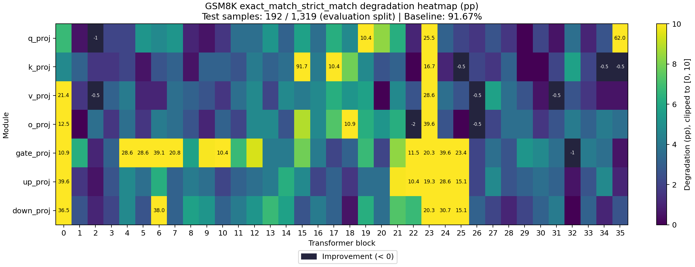
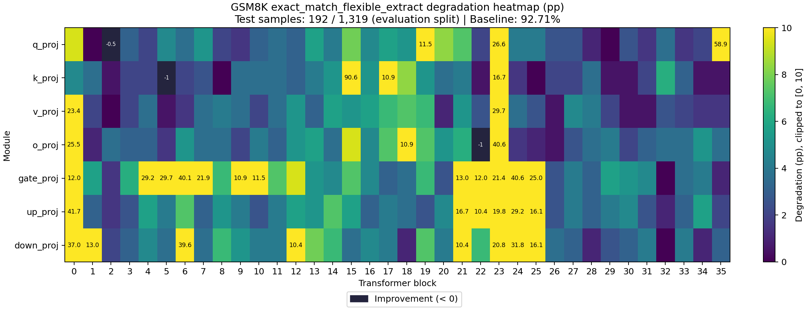

# Sensitivity Report

- Task: `gsm8k`
- Dataset: `gsm8k`
- Split: `lm-eval`
- Preprocessing: `lm-eval-default-shot-samples-64:256`
- Evaluated examples: 192
- Baseline evaluation seconds: 234.862
- Total evaluation examples: 1319

## Baseline Metrics

| Metric | Value |
|---|---:|
| exact_match_strict_match | 0.916667 |
| exact_match_flexible_extract | 0.927083 |

## Cases

| Case | Targets | Model Compression Ratio | Tensor Size Ratio | Compression Seconds | Evaluation Seconds |
|---|---:|---:|---:|---:|---:|
| model.layers.0.self_attn.q_proj | 1 | 1.00176 | 1.00176 | 0.093786 | 240.705 |
| model.layers.0.self_attn.k_proj | 1 | 1.00036 | 1.00036 | 0.0314552 | 234.243 |
| model.layers.0.self_attn.v_proj | 1 | 1.00036 | 1.00036 | 0.0306281 | 253.059 |
| model.layers.0.self_attn.o_proj | 1 | 1.00176 | 1.00176 | 0.0508065 | 267.775 |
| model.layers.0.mlp.gate_proj | 1 | 1.00588 | 1.00588 | 0.139618 | 233.099 |
| model.layers.0.mlp.up_proj | 1 | 1.00588 | 1.00588 | 0.139023 | 235.89 |
| model.layers.0.mlp.down_proj | 1 | 1.00588 | 1.00588 | 0.136661 | 237.856 |
| model.layers.1.self_attn.q_proj | 1 | 1.00176 | 1.00176 | 0.0518814 | 231.428 |
| model.layers.1.self_attn.k_proj | 1 | 1.00036 | 1.00036 | 0.0308071 | 238.145 |
| model.layers.1.self_attn.v_proj | 1 | 1.00036 | 1.00036 | 0.0303033 | 223.858 |
| model.layers.1.self_attn.o_proj | 1 | 1.00176 | 1.00176 | 0.0508906 | 227.649 |
| model.layers.1.mlp.gate_proj | 1 | 1.00588 | 1.00588 | 0.139941 | 239.862 |
| model.layers.1.mlp.up_proj | 1 | 1.00588 | 1.00588 | 0.136974 | 242.554 |
| model.layers.1.mlp.down_proj | 1 | 1.00588 | 1.00588 | 0.137156 | 258.673 |
| model.layers.2.self_attn.q_proj | 1 | 1.00176 | 1.00176 | 0.0514777 | 230.581 |
| model.layers.2.self_attn.k_proj | 1 | 1.00036 | 1.00036 | 0.0308029 | 241.114 |
| model.layers.2.self_attn.v_proj | 1 | 1.00036 | 1.00036 | 0.0302717 | 232.396 |
| model.layers.2.self_attn.o_proj | 1 | 1.00176 | 1.00176 | 0.0513709 | 234.149 |
| model.layers.2.mlp.gate_proj | 1 | 1.00588 | 1.00588 | 0.136739 | 232.496 |
| model.layers.2.mlp.up_proj | 1 | 1.00588 | 1.00588 | 0.135241 | 231.943 |
| model.layers.2.mlp.down_proj | 1 | 1.00588 | 1.00588 | 0.138013 | 227.59 |
| model.layers.3.self_attn.q_proj | 1 | 1.00176 | 1.00176 | 0.0507533 | 230.9 |
| model.layers.3.self_attn.k_proj | 1 | 1.00036 | 1.00036 | 0.032476 | 233.307 |
| model.layers.3.self_attn.v_proj | 1 | 1.00036 | 1.00036 | 0.0302248 | 237.517 |
| model.layers.3.self_attn.o_proj | 1 | 1.00176 | 1.00176 | 0.0508376 | 233.798 |
| model.layers.3.mlp.gate_proj | 1 | 1.00588 | 1.00588 | 0.139674 | 247.856 |
| model.layers.3.mlp.up_proj | 1 | 1.00588 | 1.00588 | 0.137297 | 239.821 |
| model.layers.3.mlp.down_proj | 1 | 1.00588 | 1.00588 | 0.135876 | 237.003 |
| model.layers.4.self_attn.q_proj | 1 | 1.00176 | 1.00176 | 0.0513746 | 234.515 |
| model.layers.4.self_attn.k_proj | 1 | 1.00036 | 1.00036 | 0.0304698 | 234.601 |
| model.layers.4.self_attn.v_proj | 1 | 1.00036 | 1.00036 | 0.0301471 | 239.87 |
| model.layers.4.self_attn.o_proj | 1 | 1.00176 | 1.00176 | 0.0512392 | 240.007 |
| model.layers.4.mlp.gate_proj | 1 | 1.00588 | 1.00588 | 0.148919 | 234.178 |
| model.layers.4.mlp.up_proj | 1 | 1.00588 | 1.00588 | 0.136506 | 226.203 |
| model.layers.4.mlp.down_proj | 1 | 1.00588 | 1.00588 | 0.147702 | 237.257 |
| model.layers.5.self_attn.q_proj | 1 | 1.00176 | 1.00176 | 0.0509259 | 236.322 |
| model.layers.5.self_attn.k_proj | 1 | 1.00036 | 1.00036 | 0.0304824 | 233.981 |
| model.layers.5.self_attn.v_proj | 1 | 1.00036 | 1.00036 | 0.0303093 | 231.799 |
| model.layers.5.self_attn.o_proj | 1 | 1.00176 | 1.00176 | 0.0505936 | 231.426 |
| model.layers.5.mlp.gate_proj | 1 | 1.00588 | 1.00588 | 0.145008 | 225.576 |
| model.layers.5.mlp.up_proj | 1 | 1.00588 | 1.00588 | 0.139428 | 232.611 |
| model.layers.5.mlp.down_proj | 1 | 1.00588 | 1.00588 | 0.138603 | 223.45 |
| model.layers.6.self_attn.q_proj | 1 | 1.00176 | 1.00176 | 0.0513224 | 230.297 |
| model.layers.6.self_attn.k_proj | 1 | 1.00036 | 1.00036 | 0.0303887 | 231.654 |
| model.layers.6.self_attn.v_proj | 1 | 1.00036 | 1.00036 | 0.0301502 | 226.352 |
| model.layers.6.self_attn.o_proj | 1 | 1.00176 | 1.00176 | 0.0504392 | 229.437 |
| model.layers.6.mlp.gate_proj | 1 | 1.00588 | 1.00588 | 0.139121 | 224.143 |
| model.layers.6.mlp.up_proj | 1 | 1.00588 | 1.00588 | 0.138434 | 232.012 |
| model.layers.6.mlp.down_proj | 1 | 1.00588 | 1.00588 | 0.139174 | 239.418 |
| model.layers.7.self_attn.q_proj | 1 | 1.00176 | 1.00176 | 0.0506972 | 216.273 |
| model.layers.7.self_attn.k_proj | 1 | 1.00036 | 1.00036 | 0.0302458 | 235.829 |
| model.layers.7.self_attn.v_proj | 1 | 1.00036 | 1.00036 | 0.0306568 | 246.392 |
| model.layers.7.self_attn.o_proj | 1 | 1.00176 | 1.00176 | 0.0507514 | 234.262 |
| model.layers.7.mlp.gate_proj | 1 | 1.00588 | 1.00588 | 0.138742 | 221.837 |
| model.layers.7.mlp.up_proj | 1 | 1.00588 | 1.00588 | 0.138783 | 221.252 |
| model.layers.7.mlp.down_proj | 1 | 1.00588 | 1.00588 | 0.139343 | 223.937 |
| model.layers.8.self_attn.q_proj | 1 | 1.00176 | 1.00176 | 0.0512957 | 229.315 |
| model.layers.8.self_attn.k_proj | 1 | 1.00036 | 1.00036 | 0.0306386 | 230.13 |
| model.layers.8.self_attn.v_proj | 1 | 1.00036 | 1.00036 | 0.0305377 | 219.648 |
| model.layers.8.self_attn.o_proj | 1 | 1.00176 | 1.00176 | 0.0511841 | 230.999 |
| model.layers.8.mlp.gate_proj | 1 | 1.00588 | 1.00588 | 0.139713 | 224.594 |
| model.layers.8.mlp.up_proj | 1 | 1.00588 | 1.00588 | 0.138572 | 223.258 |
| model.layers.8.mlp.down_proj | 1 | 1.00588 | 1.00588 | 0.138932 | 221.333 |
| model.layers.9.self_attn.q_proj | 1 | 1.00176 | 1.00176 | 0.0510691 | 227.065 |
| model.layers.9.self_attn.k_proj | 1 | 1.00036 | 1.00036 | 0.0302335 | 238.715 |
| model.layers.9.self_attn.v_proj | 1 | 1.00036 | 1.00036 | 0.030317 | 216.717 |
| model.layers.9.self_attn.o_proj | 1 | 1.00176 | 1.00176 | 0.0507962 | 229.338 |
| model.layers.9.mlp.gate_proj | 1 | 1.00588 | 1.00588 | 0.13969 | 230.196 |
| model.layers.9.mlp.up_proj | 1 | 1.00588 | 1.00588 | 0.13934 | 243.003 |
| model.layers.9.mlp.down_proj | 1 | 1.00588 | 1.00588 | 0.138744 | 242.425 |
| model.layers.10.self_attn.q_proj | 1 | 1.00176 | 1.00176 | 0.050835 | 234.226 |
| model.layers.10.self_attn.k_proj | 1 | 1.00036 | 1.00036 | 0.0307277 | 233.528 |
| model.layers.10.self_attn.v_proj | 1 | 1.00036 | 1.00036 | 0.0302955 | 227.554 |
| model.layers.10.self_attn.o_proj | 1 | 1.00176 | 1.00176 | 0.0508505 | 237.407 |
| model.layers.10.mlp.gate_proj | 1 | 1.00588 | 1.00588 | 0.13989 | 220.426 |
| model.layers.10.mlp.up_proj | 1 | 1.00588 | 1.00588 | 0.139548 | 231.908 |
| model.layers.10.mlp.down_proj | 1 | 1.00588 | 1.00588 | 0.138923 | 232.137 |
| model.layers.11.self_attn.q_proj | 1 | 1.00176 | 1.00176 | 0.0506813 | 229.376 |
| model.layers.11.self_attn.k_proj | 1 | 1.00036 | 1.00036 | 0.0304552 | 228.514 |
| model.layers.11.self_attn.v_proj | 1 | 1.00036 | 1.00036 | 0.0303887 | 230.972 |
| model.layers.11.self_attn.o_proj | 1 | 1.00176 | 1.00176 | 0.0506474 | 234.477 |
| model.layers.11.mlp.gate_proj | 1 | 1.00588 | 1.00588 | 0.139029 | 334.791 |
| model.layers.11.mlp.up_proj | 1 | 1.00588 | 1.00588 | 0.306434 | 507.75 |
| model.layers.11.mlp.down_proj | 1 | 1.00588 | 1.00588 | 0.320523 | 512.059 |
| model.layers.12.self_attn.q_proj | 1 | 1.00176 | 1.00176 | 0.122488 | 500.94 |
| model.layers.12.self_attn.k_proj | 1 | 1.00036 | 1.00036 | 0.110624 | 514.219 |
| model.layers.12.self_attn.v_proj | 1 | 1.00036 | 1.00036 | 0.0850259 | 486.427 |
| model.layers.12.self_attn.o_proj | 1 | 1.00176 | 1.00176 | 0.13223 | 486.694 |
| model.layers.12.mlp.gate_proj | 1 | 1.00588 | 1.00588 | 0.319304 | 495.859 |
| model.layers.12.mlp.up_proj | 1 | 1.00588 | 1.00588 | 0.307473 | 494.058 |
| model.layers.12.mlp.down_proj | 1 | 1.00588 | 1.00588 | 0.316457 | 499.182 |
| model.layers.13.self_attn.q_proj | 1 | 1.00176 | 1.00176 | 0.125342 | 492.351 |
| model.layers.13.self_attn.k_proj | 1 | 1.00036 | 1.00036 | 0.0980742 | 465.591 |
| model.layers.13.self_attn.v_proj | 1 | 1.00036 | 1.00036 | 0.0956172 | 491.512 |
| model.layers.13.self_attn.o_proj | 1 | 1.00176 | 1.00176 | 0.126751 | 478.978 |
| model.layers.13.mlp.gate_proj | 1 | 1.00588 | 1.00588 | 0.321466 | 480.659 |
| model.layers.13.mlp.up_proj | 1 | 1.00588 | 1.00588 | 0.310077 | 489.049 |
| model.layers.13.mlp.down_proj | 1 | 1.00588 | 1.00588 | 0.317508 | 493.945 |
| model.layers.14.self_attn.q_proj | 1 | 1.00176 | 1.00176 | 0.131583 | 489.301 |
| model.layers.14.self_attn.k_proj | 1 | 1.00036 | 1.00036 | 0.112205 | 491.355 |
| model.layers.14.self_attn.v_proj | 1 | 1.00036 | 1.00036 | 0.0958248 | 487.003 |
| model.layers.14.self_attn.o_proj | 1 | 1.00176 | 1.00176 | 0.119826 | 465.095 |
| model.layers.14.mlp.gate_proj | 1 | 1.00588 | 1.00588 | 0.305535 | 480.136 |
| model.layers.14.mlp.up_proj | 1 | 1.00588 | 1.00588 | 0.3099 | 472.564 |
| model.layers.14.mlp.down_proj | 1 | 1.00588 | 1.00588 | 0.310885 | 465.664 |
| model.layers.15.self_attn.q_proj | 1 | 1.00176 | 1.00176 | 0.138365 | 495.273 |
| model.layers.15.self_attn.k_proj | 1 | 1.00036 | 1.00036 | 0.0957138 | 576.265 |
| model.layers.15.self_attn.v_proj | 1 | 1.00036 | 1.00036 | 0.0943303 | 479.767 |
| model.layers.15.self_attn.o_proj | 1 | 1.00176 | 1.00176 | 0.124208 | 473.003 |
| model.layers.15.mlp.gate_proj | 1 | 1.00588 | 1.00588 | 0.305614 | 517.454 |
| model.layers.15.mlp.up_proj | 1 | 1.00588 | 1.00588 | 0.314125 | 484.075 |
| model.layers.15.mlp.down_proj | 1 | 1.00588 | 1.00588 | 0.305898 | 483.769 |
| model.layers.16.self_attn.q_proj | 1 | 1.00176 | 1.00176 | 0.141414 | 491.664 |
| model.layers.16.self_attn.k_proj | 1 | 1.00036 | 1.00036 | 0.102692 | 481.505 |
| model.layers.16.self_attn.v_proj | 1 | 1.00036 | 1.00036 | 0.0768451 | 487.03 |
| model.layers.16.self_attn.o_proj | 1 | 1.00176 | 1.00176 | 0.127435 | 491.228 |
| model.layers.16.mlp.gate_proj | 1 | 1.00588 | 1.00588 | 0.31541 | 480.365 |
| model.layers.16.mlp.up_proj | 1 | 1.00588 | 1.00588 | 0.314821 | 493.867 |
| model.layers.16.mlp.down_proj | 1 | 1.00588 | 1.00588 | 0.311645 | 475.3 |
| model.layers.17.self_attn.q_proj | 1 | 1.00176 | 1.00176 | 0.129203 | 513.726 |
| model.layers.17.self_attn.k_proj | 1 | 1.00036 | 1.00036 | 0.0965532 | 500.954 |
| model.layers.17.self_attn.v_proj | 1 | 1.00036 | 1.00036 | 0.10093 | 486.272 |
| model.layers.17.self_attn.o_proj | 1 | 1.00176 | 1.00176 | 0.125158 | 521.333 |
| model.layers.17.mlp.gate_proj | 1 | 1.00588 | 1.00588 | 0.317626 | 467.237 |
| model.layers.17.mlp.up_proj | 1 | 1.00588 | 1.00588 | 0.314437 | 466.963 |
| model.layers.17.mlp.down_proj | 1 | 1.00588 | 1.00588 | 0.316742 | 474.491 |
| model.layers.18.self_attn.q_proj | 1 | 1.00176 | 1.00176 | 0.120335 | 486.227 |
| model.layers.18.self_attn.k_proj | 1 | 1.00036 | 1.00036 | 0.0876294 | 510.453 |
| model.layers.18.self_attn.v_proj | 1 | 1.00036 | 1.00036 | 0.091568 | 528.178 |
| model.layers.18.self_attn.o_proj | 1 | 1.00176 | 1.00176 | 0.144115 | 481.143 |
| model.layers.18.mlp.gate_proj | 1 | 1.00588 | 1.00588 | 0.313827 | 483.591 |
| model.layers.18.mlp.up_proj | 1 | 1.00588 | 1.00588 | 0.310511 | 472.335 |
| model.layers.18.mlp.down_proj | 1 | 1.00588 | 1.00588 | 0.319676 | 458.949 |
| model.layers.19.self_attn.q_proj | 1 | 1.00176 | 1.00176 | 0.138367 | 443.893 |
| model.layers.19.self_attn.k_proj | 1 | 1.00036 | 1.00036 | 0.0986535 | 492.441 |
| model.layers.19.self_attn.v_proj | 1 | 1.00036 | 1.00036 | 0.107608 | 449.21 |
| model.layers.19.self_attn.o_proj | 1 | 1.00176 | 1.00176 | 0.125327 | 465.554 |
| model.layers.19.mlp.gate_proj | 1 | 1.00588 | 1.00588 | 0.305028 | 508.218 |
| model.layers.19.mlp.up_proj | 1 | 1.00588 | 1.00588 | 0.321156 | 505.956 |
| model.layers.19.mlp.down_proj | 1 | 1.00588 | 1.00588 | 0.307644 | 499.279 |
| model.layers.20.self_attn.q_proj | 1 | 1.00176 | 1.00176 | 0.142469 | 489.271 |
| model.layers.20.self_attn.k_proj | 1 | 1.00036 | 1.00036 | 0.106668 | 473.26 |
| model.layers.20.self_attn.v_proj | 1 | 1.00036 | 1.00036 | 0.0865219 | 464.673 |
| model.layers.20.self_attn.o_proj | 1 | 1.00176 | 1.00176 | 0.120164 | 476.378 |
| model.layers.20.mlp.gate_proj | 1 | 1.00588 | 1.00588 | 0.316433 | 501.818 |
| model.layers.20.mlp.up_proj | 1 | 1.00588 | 1.00588 | 0.315016 | 488.057 |
| model.layers.20.mlp.down_proj | 1 | 1.00588 | 1.00588 | 0.310425 | 493.618 |
| model.layers.21.self_attn.q_proj | 1 | 1.00176 | 1.00176 | 0.150932 | 467.075 |
| model.layers.21.self_attn.k_proj | 1 | 1.00036 | 1.00036 | 0.0840798 | 482.502 |
| model.layers.21.self_attn.v_proj | 1 | 1.00036 | 1.00036 | 0.0876598 | 487.054 |
| model.layers.21.self_attn.o_proj | 1 | 1.00176 | 1.00176 | 0.124781 | 494.855 |
| model.layers.21.mlp.gate_proj | 1 | 1.00588 | 1.00588 | 0.313447 | 517.828 |
| model.layers.21.mlp.up_proj | 1 | 1.00588 | 1.00588 | 0.319393 | 542.289 |
| model.layers.21.mlp.down_proj | 1 | 1.00588 | 1.00588 | 0.287204 | 528.44 |
| model.layers.22.self_attn.q_proj | 1 | 1.00176 | 1.00176 | 0.127406 | 486.234 |
| model.layers.22.self_attn.k_proj | 1 | 1.00036 | 1.00036 | 0.0915527 | 466.079 |
| model.layers.22.self_attn.v_proj | 1 | 1.00036 | 1.00036 | 0.109712 | 458.576 |
| model.layers.22.self_attn.o_proj | 1 | 1.00176 | 1.00176 | 0.132291 | 470.543 |
| model.layers.22.mlp.gate_proj | 1 | 1.00588 | 1.00588 | 0.309553 | 497.527 |
| model.layers.22.mlp.up_proj | 1 | 1.00588 | 1.00588 | 0.138234 | 516.124 |
| model.layers.22.mlp.down_proj | 1 | 1.00588 | 1.00588 | 0.315643 | 507.826 |
| model.layers.23.self_attn.q_proj | 1 | 1.00176 | 1.00176 | 0.132136 | 485.52 |
| model.layers.23.self_attn.k_proj | 1 | 1.00036 | 1.00036 | 0.103897 | 481.509 |
| model.layers.23.self_attn.v_proj | 1 | 1.00036 | 1.00036 | 0.0786557 | 345.686 |
| model.layers.23.self_attn.o_proj | 1 | 1.00176 | 1.00176 | 0.0503694 | 242.282 |
| model.layers.23.mlp.gate_proj | 1 | 1.00588 | 1.00588 | 0.139234 | 226.289 |
| model.layers.23.mlp.up_proj | 1 | 1.00588 | 1.00588 | 0.138941 | 226.122 |
| model.layers.23.mlp.down_proj | 1 | 1.00588 | 1.00588 | 0.138137 | 222.449 |
| model.layers.24.self_attn.q_proj | 1 | 1.00176 | 1.00176 | 0.0501288 | 235.84 |
| model.layers.24.self_attn.k_proj | 1 | 1.00036 | 1.00036 | 0.0304516 | 226.014 |
| model.layers.24.self_attn.v_proj | 1 | 1.00036 | 1.00036 | 0.0315195 | 229.862 |
| model.layers.24.self_attn.o_proj | 1 | 1.00176 | 1.00176 | 0.0505638 | 229.039 |
| model.layers.24.mlp.gate_proj | 1 | 1.00588 | 1.00588 | 0.139362 | 224.144 |
| model.layers.24.mlp.up_proj | 1 | 1.00588 | 1.00588 | 0.138918 | 232.917 |
| model.layers.24.mlp.down_proj | 1 | 1.00588 | 1.00588 | 0.138564 | 232.227 |
| model.layers.25.self_attn.q_proj | 1 | 1.00176 | 1.00176 | 0.0504116 | 232.524 |
| model.layers.25.self_attn.k_proj | 1 | 1.00036 | 1.00036 | 0.0307386 | 224.638 |
| model.layers.25.self_attn.v_proj | 1 | 1.00036 | 1.00036 | 0.0302085 | 235.548 |
| model.layers.25.self_attn.o_proj | 1 | 1.00176 | 1.00176 | 0.0512326 | 237.492 |
| model.layers.25.mlp.gate_proj | 1 | 1.00588 | 1.00588 | 0.138967 | 235.947 |
| model.layers.25.mlp.up_proj | 1 | 1.00588 | 1.00588 | 0.13895 | 236.833 |
| model.layers.25.mlp.down_proj | 1 | 1.00588 | 1.00588 | 0.138008 | 236.707 |
| model.layers.26.self_attn.q_proj | 1 | 1.00176 | 1.00176 | 0.0506835 | 226.567 |
| model.layers.26.self_attn.k_proj | 1 | 1.00036 | 1.00036 | 0.0305191 | 227.218 |
| model.layers.26.self_attn.v_proj | 1 | 1.00036 | 1.00036 | 0.0303413 | 230.902 |
| model.layers.26.self_attn.o_proj | 1 | 1.00176 | 1.00176 | 0.0504275 | 232.605 |
| model.layers.26.mlp.gate_proj | 1 | 1.00588 | 1.00588 | 0.13935 | 232.513 |
| model.layers.26.mlp.up_proj | 1 | 1.00588 | 1.00588 | 0.139361 | 224.206 |
| model.layers.26.mlp.down_proj | 1 | 1.00588 | 1.00588 | 0.139182 | 223.84 |
| model.layers.27.self_attn.q_proj | 1 | 1.00176 | 1.00176 | 0.0508638 | 236.464 |
| model.layers.27.self_attn.k_proj | 1 | 1.00036 | 1.00036 | 0.0303903 | 234.473 |
| model.layers.27.self_attn.v_proj | 1 | 1.00036 | 1.00036 | 0.030661 | 238.587 |
| model.layers.27.self_attn.o_proj | 1 | 1.00176 | 1.00176 | 0.0506489 | 235.933 |
| model.layers.27.mlp.gate_proj | 1 | 1.00588 | 1.00588 | 0.139837 | 239.118 |
| model.layers.27.mlp.up_proj | 1 | 1.00588 | 1.00588 | 0.147341 | 241.269 |
| model.layers.27.mlp.down_proj | 1 | 1.00588 | 1.00588 | 0.13911 | 235.745 |
| model.layers.28.self_attn.q_proj | 1 | 1.00176 | 1.00176 | 0.0503517 | 229.366 |
| model.layers.28.self_attn.k_proj | 1 | 1.00036 | 1.00036 | 0.0304919 | 233.086 |
| model.layers.28.self_attn.v_proj | 1 | 1.00036 | 1.00036 | 0.0303013 | 240.663 |
| model.layers.28.self_attn.o_proj | 1 | 1.00176 | 1.00176 | 0.051134 | 238.904 |
| model.layers.28.mlp.gate_proj | 1 | 1.00588 | 1.00588 | 0.139682 | 223.242 |
| model.layers.28.mlp.up_proj | 1 | 1.00588 | 1.00588 | 0.139432 | 224.858 |
| model.layers.28.mlp.down_proj | 1 | 1.00588 | 1.00588 | 0.140203 | 224.709 |
| model.layers.29.self_attn.q_proj | 1 | 1.00176 | 1.00176 | 0.0505651 | 226.514 |
| model.layers.29.self_attn.k_proj | 1 | 1.00036 | 1.00036 | 0.0308925 | 230.945 |
| model.layers.29.self_attn.v_proj | 1 | 1.00036 | 1.00036 | 0.0301633 | 221.373 |
| model.layers.29.self_attn.o_proj | 1 | 1.00176 | 1.00176 | 0.0512014 | 225.783 |
| model.layers.29.mlp.gate_proj | 1 | 1.00588 | 1.00588 | 0.139353 | 233.325 |
| model.layers.29.mlp.up_proj | 1 | 1.00588 | 1.00588 | 0.139328 | 238.898 |
| model.layers.29.mlp.down_proj | 1 | 1.00588 | 1.00588 | 0.136572 | 230.001 |
| model.layers.30.self_attn.q_proj | 1 | 1.00176 | 1.00176 | 0.054446 | 234.99 |
| model.layers.30.self_attn.k_proj | 1 | 1.00036 | 1.00036 | 0.0303872 | 226.931 |
| model.layers.30.self_attn.v_proj | 1 | 1.00036 | 1.00036 | 0.0299447 | 228.378 |
| model.layers.30.self_attn.o_proj | 1 | 1.00176 | 1.00176 | 0.0510187 | 231.347 |
| model.layers.30.mlp.gate_proj | 1 | 1.00588 | 1.00588 | 0.138843 | 229.015 |
| model.layers.30.mlp.up_proj | 1 | 1.00588 | 1.00588 | 0.147693 | 229.537 |
| model.layers.30.mlp.down_proj | 1 | 1.00588 | 1.00588 | 0.138076 | 234.599 |
| model.layers.31.self_attn.q_proj | 1 | 1.00176 | 1.00176 | 0.0530736 | 226.656 |
| model.layers.31.self_attn.k_proj | 1 | 1.00036 | 1.00036 | 0.0300636 | 228.104 |
| model.layers.31.self_attn.v_proj | 1 | 1.00036 | 1.00036 | 0.0305704 | 229.765 |
| model.layers.31.self_attn.o_proj | 1 | 1.00176 | 1.00176 | 0.0510278 | 233.441 |
| model.layers.31.mlp.gate_proj | 1 | 1.00588 | 1.00588 | 0.139895 | 232.804 |
| model.layers.31.mlp.up_proj | 1 | 1.00588 | 1.00588 | 0.139278 | 239.887 |
| model.layers.31.mlp.down_proj | 1 | 1.00588 | 1.00588 | 0.138938 | 236.147 |
| model.layers.32.self_attn.q_proj | 1 | 1.00176 | 1.00176 | 0.0498585 | 224.705 |
| model.layers.32.self_attn.k_proj | 1 | 1.00036 | 1.00036 | 0.0303548 | 229.83 |
| model.layers.32.self_attn.v_proj | 1 | 1.00036 | 1.00036 | 0.0310194 | 234.695 |
| model.layers.32.self_attn.o_proj | 1 | 1.00176 | 1.00176 | 0.0504897 | 233.343 |
| model.layers.32.mlp.gate_proj | 1 | 1.00588 | 1.00588 | 0.136531 | 223.555 |
| model.layers.32.mlp.up_proj | 1 | 1.00588 | 1.00588 | 0.136724 | 227.525 |
| model.layers.32.mlp.down_proj | 1 | 1.00588 | 1.00588 | 0.138656 | 226.194 |
| model.layers.33.self_attn.q_proj | 1 | 1.00176 | 1.00176 | 0.0505326 | 236.561 |
| model.layers.33.self_attn.k_proj | 1 | 1.00036 | 1.00036 | 0.0301539 | 227.19 |
| model.layers.33.self_attn.v_proj | 1 | 1.00036 | 1.00036 | 0.029824 | 234.001 |
| model.layers.33.self_attn.o_proj | 1 | 1.00176 | 1.00176 | 0.0528232 | 235.441 |
| model.layers.33.mlp.gate_proj | 1 | 1.00588 | 1.00588 | 0.140116 | 235.671 |
| model.layers.33.mlp.up_proj | 1 | 1.00588 | 1.00588 | 0.139299 | 240.602 |
| model.layers.33.mlp.down_proj | 1 | 1.00588 | 1.00588 | 0.139395 | 233.152 |
| model.layers.34.self_attn.q_proj | 1 | 1.00176 | 1.00176 | 0.0505914 | 222.895 |
| model.layers.34.self_attn.k_proj | 1 | 1.00036 | 1.00036 | 0.0301387 | 221.423 |
| model.layers.34.self_attn.v_proj | 1 | 1.00036 | 1.00036 | 0.0323429 | 225.684 |
| model.layers.34.self_attn.o_proj | 1 | 1.00176 | 1.00176 | 0.0511354 | 221.686 |
| model.layers.34.mlp.gate_proj | 1 | 1.00588 | 1.00588 | 0.143524 | 239.888 |
| model.layers.34.mlp.up_proj | 1 | 1.00588 | 1.00588 | 0.139556 | 250.788 |
| model.layers.34.mlp.down_proj | 1 | 1.00588 | 1.00588 | 0.138276 | 239.662 |
| model.layers.35.self_attn.q_proj | 1 | 1.00176 | 1.00176 | 0.0513651 | 257.041 |
| model.layers.35.self_attn.k_proj | 1 | 1.00036 | 1.00036 | 0.0304249 | 226.111 |
| model.layers.35.self_attn.v_proj | 1 | 1.00036 | 1.00036 | 0.0299639 | 234.103 |
| model.layers.35.self_attn.o_proj | 1 | 1.00176 | 1.00176 | 0.050089 | 226.038 |
| model.layers.35.mlp.gate_proj | 1 | 1.00588 | 1.00588 | 0.148465 | 217.944 |
| model.layers.35.mlp.up_proj | 1 | 1.00588 | 1.00588 | 0.136927 | 229.459 |
| model.layers.35.mlp.down_proj | 1 | 1.00588 | 1.00588 | 0.137708 | 233.962 |

## Metrics

| Case | Metric | Value | Degradation |
|---|---|---:|---:|
| model.layers.0.self_attn.q_proj | exact_match_strict_match | 0.848958 | 0.0677083 |
| model.layers.0.self_attn.q_proj | exact_match_flexible_extract | 0.833333 | 0.09375 |
| model.layers.0.self_attn.k_proj | exact_match_strict_match | 0.869792 | 0.046875 |
| model.layers.0.self_attn.k_proj | exact_match_flexible_extract | 0.880208 | 0.046875 |
| model.layers.0.self_attn.v_proj | exact_match_strict_match | 0.703125 | 0.213542 |
| model.layers.0.self_attn.v_proj | exact_match_flexible_extract | 0.692708 | 0.234375 |
| model.layers.0.self_attn.o_proj | exact_match_strict_match | 0.791667 | 0.125 |
| model.layers.0.self_attn.o_proj | exact_match_flexible_extract | 0.671875 | 0.255208 |
| model.layers.0.mlp.gate_proj | exact_match_strict_match | 0.807292 | 0.109375 |
| model.layers.0.mlp.gate_proj | exact_match_flexible_extract | 0.807292 | 0.119792 |
| model.layers.0.mlp.up_proj | exact_match_strict_match | 0.520833 | 0.395833 |
| model.layers.0.mlp.up_proj | exact_match_flexible_extract | 0.510417 | 0.416667 |
| model.layers.0.mlp.down_proj | exact_match_strict_match | 0.552083 | 0.364583 |
| model.layers.0.mlp.down_proj | exact_match_flexible_extract | 0.557292 | 0.369792 |
| model.layers.1.self_attn.q_proj | exact_match_strict_match | 0.911458 | 0.00520833 |
| model.layers.1.self_attn.q_proj | exact_match_flexible_extract | 0.927083 | 0 |
| model.layers.1.self_attn.k_proj | exact_match_strict_match | 0.885417 | 0.03125 |
| model.layers.1.self_attn.k_proj | exact_match_flexible_extract | 0.890625 | 0.0364583 |
| model.layers.1.self_attn.v_proj | exact_match_strict_match | 0.901042 | 0.015625 |
| model.layers.1.self_attn.v_proj | exact_match_flexible_extract | 0.90625 | 0.0208333 |
| model.layers.1.self_attn.o_proj | exact_match_strict_match | 0.916667 | 0 |
| model.layers.1.self_attn.o_proj | exact_match_flexible_extract | 0.916667 | 0.0104167 |
| model.layers.1.mlp.gate_proj | exact_match_strict_match | 0.854167 | 0.0625 |
| model.layers.1.mlp.gate_proj | exact_match_flexible_extract | 0.869792 | 0.0572917 |
| model.layers.1.mlp.up_proj | exact_match_strict_match | 0.901042 | 0.015625 |
| model.layers.1.mlp.up_proj | exact_match_flexible_extract | 0.895833 | 0.03125 |
| model.layers.1.mlp.down_proj | exact_match_strict_match | 0.890625 | 0.0260417 |
| model.layers.1.mlp.down_proj | exact_match_flexible_extract | 0.796875 | 0.130208 |
| model.layers.2.self_attn.q_proj | exact_match_strict_match | 0.927083 | -0.0104167 |
| model.layers.2.self_attn.q_proj | exact_match_flexible_extract | 0.932292 | -0.00520833 |
| model.layers.2.self_attn.k_proj | exact_match_strict_match | 0.901042 | 0.015625 |
| model.layers.2.self_attn.k_proj | exact_match_flexible_extract | 0.921875 | 0.00520833 |
| model.layers.2.self_attn.v_proj | exact_match_strict_match | 0.921875 | -0.00520833 |
| model.layers.2.self_attn.v_proj | exact_match_flexible_extract | 0.927083 | 0 |
| model.layers.2.self_attn.o_proj | exact_match_strict_match | 0.880208 | 0.0364583 |
| model.layers.2.self_attn.o_proj | exact_match_flexible_extract | 0.890625 | 0.0364583 |
| model.layers.2.mlp.gate_proj | exact_match_strict_match | 0.90625 | 0.0104167 |
| model.layers.2.mlp.gate_proj | exact_match_flexible_extract | 0.911458 | 0.015625 |
| model.layers.2.mlp.up_proj | exact_match_strict_match | 0.911458 | 0.00520833 |
| model.layers.2.mlp.up_proj | exact_match_flexible_extract | 0.911458 | 0.015625 |
| model.layers.2.mlp.down_proj | exact_match_strict_match | 0.90625 | 0.0104167 |
| model.layers.2.mlp.down_proj | exact_match_flexible_extract | 0.90625 | 0.0208333 |
| model.layers.3.self_attn.q_proj | exact_match_strict_match | 0.895833 | 0.0208333 |
| model.layers.3.self_attn.q_proj | exact_match_flexible_extract | 0.895833 | 0.03125 |
| model.layers.3.self_attn.k_proj | exact_match_strict_match | 0.901042 | 0.015625 |
| model.layers.3.self_attn.k_proj | exact_match_flexible_extract | 0.90625 | 0.0208333 |
| model.layers.3.self_attn.v_proj | exact_match_strict_match | 0.885417 | 0.03125 |
| model.layers.3.self_attn.v_proj | exact_match_flexible_extract | 0.90625 | 0.0208333 |
| model.layers.3.self_attn.o_proj | exact_match_strict_match | 0.901042 | 0.015625 |
| model.layers.3.self_attn.o_proj | exact_match_flexible_extract | 0.895833 | 0.03125 |
| model.layers.3.mlp.gate_proj | exact_match_strict_match | 0.885417 | 0.03125 |
| model.layers.3.mlp.gate_proj | exact_match_flexible_extract | 0.864583 | 0.0625 |
| model.layers.3.mlp.up_proj | exact_match_strict_match | 0.890625 | 0.0260417 |
| model.layers.3.mlp.up_proj | exact_match_flexible_extract | 0.901042 | 0.0260417 |
| model.layers.3.mlp.down_proj | exact_match_strict_match | 0.895833 | 0.0208333 |
| model.layers.3.mlp.down_proj | exact_match_flexible_extract | 0.895833 | 0.03125 |
| model.layers.4.self_attn.q_proj | exact_match_strict_match | 0.895833 | 0.0208333 |
| model.layers.4.self_attn.q_proj | exact_match_flexible_extract | 0.90625 | 0.0208333 |
| model.layers.4.self_attn.k_proj | exact_match_strict_match | 0.895833 | 0.0208333 |
| model.layers.4.self_attn.k_proj | exact_match_flexible_extract | 0.90625 | 0.0208333 |
| model.layers.4.self_attn.v_proj | exact_match_strict_match | 0.875 | 0.0416667 |
| model.layers.4.self_attn.v_proj | exact_match_flexible_extract | 0.890625 | 0.0364583 |
| model.layers.4.self_attn.o_proj | exact_match_strict_match | 0.880208 | 0.0364583 |
| model.layers.4.self_attn.o_proj | exact_match_flexible_extract | 0.895833 | 0.03125 |
| model.layers.4.mlp.gate_proj | exact_match_strict_match | 0.630208 | 0.286458 |
| model.layers.4.mlp.gate_proj | exact_match_flexible_extract | 0.635417 | 0.291667 |
| model.layers.4.mlp.up_proj | exact_match_strict_match | 0.869792 | 0.046875 |
| model.layers.4.mlp.up_proj | exact_match_flexible_extract | 0.869792 | 0.0572917 |
| model.layers.4.mlp.down_proj | exact_match_strict_match | 0.869792 | 0.046875 |
| model.layers.4.mlp.down_proj | exact_match_flexible_extract | 0.880208 | 0.046875 |
| model.layers.5.self_attn.q_proj | exact_match_strict_match | 0.864583 | 0.0520833 |
| model.layers.5.self_attn.q_proj | exact_match_flexible_extract | 0.880208 | 0.046875 |
| model.layers.5.self_attn.k_proj | exact_match_strict_match | 0.911458 | 0.00520833 |
| model.layers.5.self_attn.k_proj | exact_match_flexible_extract | 0.9375 | -0.0104167 |
| model.layers.5.self_attn.v_proj | exact_match_strict_match | 0.90625 | 0.0104167 |
| model.layers.5.self_attn.v_proj | exact_match_flexible_extract | 0.921875 | 0.00520833 |
| model.layers.5.self_attn.o_proj | exact_match_strict_match | 0.901042 | 0.015625 |
| model.layers.5.self_attn.o_proj | exact_match_flexible_extract | 0.911458 | 0.015625 |
| model.layers.5.mlp.gate_proj | exact_match_strict_match | 0.630208 | 0.286458 |
| model.layers.5.mlp.gate_proj | exact_match_flexible_extract | 0.630208 | 0.296875 |
| model.layers.5.mlp.up_proj | exact_match_strict_match | 0.880208 | 0.0364583 |
| model.layers.5.mlp.up_proj | exact_match_flexible_extract | 0.885417 | 0.0416667 |
| model.layers.5.mlp.down_proj | exact_match_strict_match | 0.890625 | 0.0260417 |
| model.layers.5.mlp.down_proj | exact_match_flexible_extract | 0.890625 | 0.0364583 |
| model.layers.6.self_attn.q_proj | exact_match_strict_match | 0.869792 | 0.046875 |
| model.layers.6.self_attn.q_proj | exact_match_flexible_extract | 0.890625 | 0.0364583 |
| model.layers.6.self_attn.k_proj | exact_match_strict_match | 0.890625 | 0.0260417 |
| model.layers.6.self_attn.k_proj | exact_match_flexible_extract | 0.90625 | 0.0208333 |
| model.layers.6.self_attn.v_proj | exact_match_strict_match | 0.90625 | 0.0104167 |
| model.layers.6.self_attn.v_proj | exact_match_flexible_extract | 0.911458 | 0.015625 |
| model.layers.6.self_attn.o_proj | exact_match_strict_match | 0.875 | 0.0416667 |
| model.layers.6.self_attn.o_proj | exact_match_flexible_extract | 0.875 | 0.0520833 |
| model.layers.6.mlp.gate_proj | exact_match_strict_match | 0.526042 | 0.390625 |
| model.layers.6.mlp.gate_proj | exact_match_flexible_extract | 0.526042 | 0.401042 |
| model.layers.6.mlp.up_proj | exact_match_strict_match | 0.854167 | 0.0625 |
| model.layers.6.mlp.up_proj | exact_match_flexible_extract | 0.854167 | 0.0729167 |
| model.layers.6.mlp.down_proj | exact_match_strict_match | 0.536458 | 0.380208 |
| model.layers.6.mlp.down_proj | exact_match_flexible_extract | 0.53125 | 0.395833 |
| model.layers.7.self_attn.q_proj | exact_match_strict_match | 0.864583 | 0.0520833 |
| model.layers.7.self_attn.q_proj | exact_match_flexible_extract | 0.875 | 0.0520833 |
| model.layers.7.self_attn.k_proj | exact_match_strict_match | 0.885417 | 0.03125 |
| model.layers.7.self_attn.k_proj | exact_match_flexible_extract | 0.901042 | 0.0260417 |
| model.layers.7.self_attn.v_proj | exact_match_strict_match | 0.880208 | 0.0364583 |
| model.layers.7.self_attn.v_proj | exact_match_flexible_extract | 0.890625 | 0.0364583 |
| model.layers.7.self_attn.o_proj | exact_match_strict_match | 0.880208 | 0.0364583 |
| model.layers.7.self_attn.o_proj | exact_match_flexible_extract | 0.890625 | 0.0364583 |
| model.layers.7.mlp.gate_proj | exact_match_strict_match | 0.708333 | 0.208333 |
| model.layers.7.mlp.gate_proj | exact_match_flexible_extract | 0.708333 | 0.21875 |
| model.layers.7.mlp.up_proj | exact_match_strict_match | 0.885417 | 0.03125 |
| model.layers.7.mlp.up_proj | exact_match_flexible_extract | 0.895833 | 0.03125 |
| model.layers.7.mlp.down_proj | exact_match_strict_match | 0.885417 | 0.03125 |
| model.layers.7.mlp.down_proj | exact_match_flexible_extract | 0.890625 | 0.0364583 |
| model.layers.8.self_attn.q_proj | exact_match_strict_match | 0.90625 | 0.0104167 |
| model.layers.8.self_attn.q_proj | exact_match_flexible_extract | 0.90625 | 0.0208333 |
| model.layers.8.self_attn.k_proj | exact_match_strict_match | 0.911458 | 0.00520833 |
| model.layers.8.self_attn.k_proj | exact_match_flexible_extract | 0.927083 | 0 |
| model.layers.8.self_attn.v_proj | exact_match_strict_match | 0.885417 | 0.03125 |
| model.layers.8.self_attn.v_proj | exact_match_flexible_extract | 0.885417 | 0.0416667 |
| model.layers.8.self_attn.o_proj | exact_match_strict_match | 0.890625 | 0.0260417 |
| model.layers.8.self_attn.o_proj | exact_match_flexible_extract | 0.890625 | 0.0364583 |
| model.layers.8.mlp.gate_proj | exact_match_strict_match | 0.859375 | 0.0572917 |
| model.layers.8.mlp.gate_proj | exact_match_flexible_extract | 0.859375 | 0.0677083 |
| model.layers.8.mlp.up_proj | exact_match_strict_match | 0.875 | 0.0416667 |
| model.layers.8.mlp.up_proj | exact_match_flexible_extract | 0.875 | 0.0520833 |
| model.layers.8.mlp.down_proj | exact_match_strict_match | 0.859375 | 0.0572917 |
| model.layers.8.mlp.down_proj | exact_match_flexible_extract | 0.859375 | 0.0677083 |
| model.layers.9.self_attn.q_proj | exact_match_strict_match | 0.911458 | 0.00520833 |
| model.layers.9.self_attn.q_proj | exact_match_flexible_extract | 0.911458 | 0.015625 |
| model.layers.9.self_attn.k_proj | exact_match_strict_match | 0.885417 | 0.03125 |
| model.layers.9.self_attn.k_proj | exact_match_flexible_extract | 0.890625 | 0.0364583 |
| model.layers.9.self_attn.v_proj | exact_match_strict_match | 0.890625 | 0.0260417 |
| model.layers.9.self_attn.v_proj | exact_match_flexible_extract | 0.890625 | 0.0364583 |
| model.layers.9.self_attn.o_proj | exact_match_strict_match | 0.90625 | 0.0104167 |
| model.layers.9.self_attn.o_proj | exact_match_flexible_extract | 0.90625 | 0.0208333 |
| model.layers.9.mlp.gate_proj | exact_match_strict_match | 0.817708 | 0.0989583 |
| model.layers.9.mlp.gate_proj | exact_match_flexible_extract | 0.817708 | 0.109375 |
| model.layers.9.mlp.up_proj | exact_match_strict_match | 0.880208 | 0.0364583 |
| model.layers.9.mlp.up_proj | exact_match_flexible_extract | 0.885417 | 0.0416667 |
| model.layers.9.mlp.down_proj | exact_match_strict_match | 0.864583 | 0.0520833 |
| model.layers.9.mlp.down_proj | exact_match_flexible_extract | 0.875 | 0.0520833 |
| model.layers.10.self_attn.q_proj | exact_match_strict_match | 0.901042 | 0.015625 |
| model.layers.10.self_attn.q_proj | exact_match_flexible_extract | 0.895833 | 0.03125 |
| model.layers.10.self_attn.k_proj | exact_match_strict_match | 0.885417 | 0.03125 |
| model.layers.10.self_attn.k_proj | exact_match_flexible_extract | 0.890625 | 0.0364583 |
| model.layers.10.self_attn.v_proj | exact_match_strict_match | 0.901042 | 0.015625 |
| model.layers.10.self_attn.v_proj | exact_match_flexible_extract | 0.90625 | 0.0208333 |
| model.layers.10.self_attn.o_proj | exact_match_strict_match | 0.885417 | 0.03125 |
| model.layers.10.self_attn.o_proj | exact_match_flexible_extract | 0.885417 | 0.0416667 |
| model.layers.10.mlp.gate_proj | exact_match_strict_match | 0.8125 | 0.104167 |
| model.layers.10.mlp.gate_proj | exact_match_flexible_extract | 0.8125 | 0.114583 |
| model.layers.10.mlp.up_proj | exact_match_strict_match | 0.895833 | 0.0208333 |
| model.layers.10.mlp.up_proj | exact_match_flexible_extract | 0.901042 | 0.0260417 |
| model.layers.10.mlp.down_proj | exact_match_strict_match | 0.885417 | 0.03125 |
| model.layers.10.mlp.down_proj | exact_match_flexible_extract | 0.885417 | 0.0416667 |
| model.layers.11.self_attn.q_proj | exact_match_strict_match | 0.880208 | 0.0364583 |
| model.layers.11.self_attn.q_proj | exact_match_flexible_extract | 0.890625 | 0.0364583 |
| model.layers.11.self_attn.k_proj | exact_match_strict_match | 0.890625 | 0.0260417 |
| model.layers.11.self_attn.k_proj | exact_match_flexible_extract | 0.890625 | 0.0364583 |
| model.layers.11.self_attn.v_proj | exact_match_strict_match | 0.880208 | 0.0364583 |
| model.layers.11.self_attn.v_proj | exact_match_flexible_extract | 0.890625 | 0.0364583 |
| model.layers.11.self_attn.o_proj | exact_match_strict_match | 0.895833 | 0.0208333 |
| model.layers.11.self_attn.o_proj | exact_match_flexible_extract | 0.895833 | 0.03125 |
| model.layers.11.mlp.gate_proj | exact_match_strict_match | 0.848958 | 0.0677083 |
| model.layers.11.mlp.gate_proj | exact_match_flexible_extract | 0.854167 | 0.0729167 |
| model.layers.11.mlp.up_proj | exact_match_strict_match | 0.885417 | 0.03125 |
| model.layers.11.mlp.up_proj | exact_match_flexible_extract | 0.885417 | 0.0416667 |
| model.layers.11.mlp.down_proj | exact_match_strict_match | 0.875 | 0.0416667 |
| model.layers.11.mlp.down_proj | exact_match_flexible_extract | 0.885417 | 0.0416667 |
| model.layers.12.self_attn.q_proj | exact_match_strict_match | 0.880208 | 0.0364583 |
| model.layers.12.self_attn.q_proj | exact_match_flexible_extract | 0.895833 | 0.03125 |
| model.layers.12.self_attn.k_proj | exact_match_strict_match | 0.875 | 0.0416667 |
| model.layers.12.self_attn.k_proj | exact_match_flexible_extract | 0.895833 | 0.03125 |
| model.layers.12.self_attn.v_proj | exact_match_strict_match | 0.869792 | 0.046875 |
| model.layers.12.self_attn.v_proj | exact_match_flexible_extract | 0.875 | 0.0520833 |
| model.layers.12.self_attn.o_proj | exact_match_strict_match | 0.869792 | 0.046875 |
| model.layers.12.self_attn.o_proj | exact_match_flexible_extract | 0.875 | 0.0520833 |
| model.layers.12.mlp.gate_proj | exact_match_strict_match | 0.822917 | 0.09375 |
| model.layers.12.mlp.gate_proj | exact_match_flexible_extract | 0.833333 | 0.09375 |
| model.layers.12.mlp.up_proj | exact_match_strict_match | 0.880208 | 0.0364583 |
| model.layers.12.mlp.up_proj | exact_match_flexible_extract | 0.869792 | 0.0572917 |
| model.layers.12.mlp.down_proj | exact_match_strict_match | 0.864583 | 0.0520833 |
| model.layers.12.mlp.down_proj | exact_match_flexible_extract | 0.822917 | 0.104167 |
| model.layers.13.self_attn.q_proj | exact_match_strict_match | 0.864583 | 0.0520833 |
| model.layers.13.self_attn.q_proj | exact_match_flexible_extract | 0.869792 | 0.0572917 |
| model.layers.13.self_attn.k_proj | exact_match_strict_match | 0.885417 | 0.03125 |
| model.layers.13.self_attn.k_proj | exact_match_flexible_extract | 0.885417 | 0.0416667 |
| model.layers.13.self_attn.v_proj | exact_match_strict_match | 0.895833 | 0.0208333 |
| model.layers.13.self_attn.v_proj | exact_match_flexible_extract | 0.895833 | 0.03125 |
| model.layers.13.self_attn.o_proj | exact_match_strict_match | 0.869792 | 0.046875 |
| model.layers.13.self_attn.o_proj | exact_match_flexible_extract | 0.869792 | 0.0572917 |
| model.layers.13.mlp.gate_proj | exact_match_strict_match | 0.875 | 0.0416667 |
| model.layers.13.mlp.gate_proj | exact_match_flexible_extract | 0.875 | 0.0520833 |
| model.layers.13.mlp.up_proj | exact_match_strict_match | 0.875 | 0.0416667 |
| model.layers.13.mlp.up_proj | exact_match_flexible_extract | 0.875 | 0.0520833 |
| model.layers.13.mlp.down_proj | exact_match_strict_match | 0.848958 | 0.0677083 |
| model.layers.13.mlp.down_proj | exact_match_flexible_extract | 0.848958 | 0.078125 |
| model.layers.14.self_attn.q_proj | exact_match_strict_match | 0.885417 | 0.03125 |
| model.layers.14.self_attn.q_proj | exact_match_flexible_extract | 0.885417 | 0.0416667 |
| model.layers.14.self_attn.k_proj | exact_match_strict_match | 0.880208 | 0.0364583 |
| model.layers.14.self_attn.k_proj | exact_match_flexible_extract | 0.875 | 0.0520833 |
| model.layers.14.self_attn.v_proj | exact_match_strict_match | 0.869792 | 0.046875 |
| model.layers.14.self_attn.v_proj | exact_match_flexible_extract | 0.869792 | 0.0572917 |
| model.layers.14.self_attn.o_proj | exact_match_strict_match | 0.890625 | 0.0260417 |
| model.layers.14.self_attn.o_proj | exact_match_flexible_extract | 0.890625 | 0.0364583 |
| model.layers.14.mlp.gate_proj | exact_match_strict_match | 0.875 | 0.0416667 |
| model.layers.14.mlp.gate_proj | exact_match_flexible_extract | 0.880208 | 0.046875 |
| model.layers.14.mlp.up_proj | exact_match_strict_match | 0.854167 | 0.0625 |
| model.layers.14.mlp.up_proj | exact_match_flexible_extract | 0.854167 | 0.0729167 |
| model.layers.14.mlp.down_proj | exact_match_strict_match | 0.859375 | 0.0572917 |
| model.layers.14.mlp.down_proj | exact_match_flexible_extract | 0.859375 | 0.0677083 |
| model.layers.15.self_attn.q_proj | exact_match_strict_match | 0.859375 | 0.0572917 |
| model.layers.15.self_attn.q_proj | exact_match_flexible_extract | 0.848958 | 0.078125 |
| model.layers.15.self_attn.k_proj | exact_match_strict_match | 0 | 0.916667 |
| model.layers.15.self_attn.k_proj | exact_match_flexible_extract | 0.0208333 | 0.90625 |
| model.layers.15.self_attn.v_proj | exact_match_strict_match | 0.875 | 0.0416667 |
| model.layers.15.self_attn.v_proj | exact_match_flexible_extract | 0.875 | 0.0520833 |
| model.layers.15.self_attn.o_proj | exact_match_strict_match | 0.828125 | 0.0885417 |
| model.layers.15.self_attn.o_proj | exact_match_flexible_extract | 0.833333 | 0.09375 |
| model.layers.15.mlp.gate_proj | exact_match_strict_match | 0.838542 | 0.078125 |
| model.layers.15.mlp.gate_proj | exact_match_flexible_extract | 0.854167 | 0.0729167 |
| model.layers.15.mlp.up_proj | exact_match_strict_match | 0.869792 | 0.046875 |
| model.layers.15.mlp.up_proj | exact_match_flexible_extract | 0.869792 | 0.0572917 |
| model.layers.15.mlp.down_proj | exact_match_strict_match | 0.890625 | 0.0260417 |
| model.layers.15.mlp.down_proj | exact_match_flexible_extract | 0.890625 | 0.0364583 |
| model.layers.16.self_attn.q_proj | exact_match_strict_match | 0.880208 | 0.0364583 |
| model.layers.16.self_attn.q_proj | exact_match_flexible_extract | 0.880208 | 0.046875 |
| model.layers.16.self_attn.k_proj | exact_match_strict_match | 0.875 | 0.0416667 |
| model.layers.16.self_attn.k_proj | exact_match_flexible_extract | 0.875 | 0.0520833 |
| model.layers.16.self_attn.v_proj | exact_match_strict_match | 0.869792 | 0.046875 |
| model.layers.16.self_attn.v_proj | exact_match_flexible_extract | 0.869792 | 0.0572917 |
| model.layers.16.self_attn.o_proj | exact_match_strict_match | 0.869792 | 0.046875 |
| model.layers.16.self_attn.o_proj | exact_match_flexible_extract | 0.880208 | 0.046875 |
| model.layers.16.mlp.gate_proj | exact_match_strict_match | 0.875 | 0.0416667 |
| model.layers.16.mlp.gate_proj | exact_match_flexible_extract | 0.880208 | 0.046875 |
| model.layers.16.mlp.up_proj | exact_match_strict_match | 0.895833 | 0.0208333 |
| model.layers.16.mlp.up_proj | exact_match_flexible_extract | 0.895833 | 0.03125 |
| model.layers.16.mlp.down_proj | exact_match_strict_match | 0.875 | 0.0416667 |
| model.layers.16.mlp.down_proj | exact_match_flexible_extract | 0.880208 | 0.046875 |
| model.layers.17.self_attn.q_proj | exact_match_strict_match | 0.854167 | 0.0625 |
| model.layers.17.self_attn.q_proj | exact_match_flexible_extract | 0.869792 | 0.0572917 |
| model.layers.17.self_attn.k_proj | exact_match_strict_match | 0.8125 | 0.104167 |
| model.layers.17.self_attn.k_proj | exact_match_flexible_extract | 0.817708 | 0.109375 |
| model.layers.17.self_attn.v_proj | exact_match_strict_match | 0.854167 | 0.0625 |
| model.layers.17.self_attn.v_proj | exact_match_flexible_extract | 0.859375 | 0.0677083 |
| model.layers.17.self_attn.o_proj | exact_match_strict_match | 0.84375 | 0.0729167 |
| model.layers.17.self_attn.o_proj | exact_match_flexible_extract | 0.854167 | 0.0729167 |
| model.layers.17.mlp.gate_proj | exact_match_strict_match | 0.895833 | 0.0208333 |
| model.layers.17.mlp.gate_proj | exact_match_flexible_extract | 0.895833 | 0.03125 |
| model.layers.17.mlp.up_proj | exact_match_strict_match | 0.885417 | 0.03125 |
| model.layers.17.mlp.up_proj | exact_match_flexible_extract | 0.885417 | 0.0416667 |
| model.layers.17.mlp.down_proj | exact_match_strict_match | 0.885417 | 0.03125 |
| model.layers.17.mlp.down_proj | exact_match_flexible_extract | 0.885417 | 0.0416667 |
| model.layers.18.self_attn.q_proj | exact_match_strict_match | 0.869792 | 0.046875 |
| model.layers.18.self_attn.q_proj | exact_match_flexible_extract | 0.875 | 0.0520833 |
| model.layers.18.self_attn.k_proj | exact_match_strict_match | 0.838542 | 0.078125 |
| model.layers.18.self_attn.k_proj | exact_match_flexible_extract | 0.84375 | 0.0833333 |
| model.layers.18.self_attn.v_proj | exact_match_strict_match | 0.864583 | 0.0520833 |
| model.layers.18.self_attn.v_proj | exact_match_flexible_extract | 0.854167 | 0.0729167 |
| model.layers.18.self_attn.o_proj | exact_match_strict_match | 0.807292 | 0.109375 |
| model.layers.18.self_attn.o_proj | exact_match_flexible_extract | 0.817708 | 0.109375 |
| model.layers.18.mlp.gate_proj | exact_match_strict_match | 0.885417 | 0.03125 |
| model.layers.18.mlp.gate_proj | exact_match_flexible_extract | 0.890625 | 0.0364583 |
| model.layers.18.mlp.up_proj | exact_match_strict_match | 0.901042 | 0.015625 |
| model.layers.18.mlp.up_proj | exact_match_flexible_extract | 0.890625 | 0.0364583 |
| model.layers.18.mlp.down_proj | exact_match_strict_match | 0.911458 | 0.00520833 |
| model.layers.18.mlp.down_proj | exact_match_flexible_extract | 0.916667 | 0.0104167 |
| model.layers.19.self_attn.q_proj | exact_match_strict_match | 0.8125 | 0.104167 |
| model.layers.19.self_attn.q_proj | exact_match_flexible_extract | 0.8125 | 0.114583 |
| model.layers.19.self_attn.k_proj | exact_match_strict_match | 0.869792 | 0.046875 |
| model.layers.19.self_attn.k_proj | exact_match_flexible_extract | 0.875 | 0.0520833 |
| model.layers.19.self_attn.v_proj | exact_match_strict_match | 0.859375 | 0.0572917 |
| model.layers.19.self_attn.v_proj | exact_match_flexible_extract | 0.859375 | 0.0677083 |
| model.layers.19.self_attn.o_proj | exact_match_strict_match | 0.854167 | 0.0625 |
| model.layers.19.self_attn.o_proj | exact_match_flexible_extract | 0.854167 | 0.0729167 |
| model.layers.19.mlp.gate_proj | exact_match_strict_match | 0.848958 | 0.0677083 |
| model.layers.19.mlp.gate_proj | exact_match_flexible_extract | 0.859375 | 0.0677083 |
| model.layers.19.mlp.up_proj | exact_match_strict_match | 0.880208 | 0.0364583 |
| model.layers.19.mlp.up_proj | exact_match_flexible_extract | 0.901042 | 0.0260417 |
| model.layers.19.mlp.down_proj | exact_match_strict_match | 0.854167 | 0.0625 |
| model.layers.19.mlp.down_proj | exact_match_flexible_extract | 0.854167 | 0.0729167 |
| model.layers.20.self_attn.q_proj | exact_match_strict_match | 0.833333 | 0.0833333 |
| model.layers.20.self_attn.q_proj | exact_match_flexible_extract | 0.84375 | 0.0833333 |
| model.layers.20.self_attn.k_proj | exact_match_strict_match | 0.890625 | 0.0260417 |
| model.layers.20.self_attn.k_proj | exact_match_flexible_extract | 0.890625 | 0.0364583 |
| model.layers.20.self_attn.v_proj | exact_match_strict_match | 0.916667 | 0 |
| model.layers.20.self_attn.v_proj | exact_match_flexible_extract | 0.916667 | 0.0104167 |
| model.layers.20.self_attn.o_proj | exact_match_strict_match | 0.864583 | 0.0520833 |
| model.layers.20.self_attn.o_proj | exact_match_flexible_extract | 0.875 | 0.0520833 |
| model.layers.20.mlp.gate_proj | exact_match_strict_match | 0.895833 | 0.0208333 |
| model.layers.20.mlp.gate_proj | exact_match_flexible_extract | 0.901042 | 0.0260417 |
| model.layers.20.mlp.up_proj | exact_match_strict_match | 0.880208 | 0.0364583 |
| model.layers.20.mlp.up_proj | exact_match_flexible_extract | 0.880208 | 0.046875 |
| model.layers.20.mlp.down_proj | exact_match_strict_match | 0.880208 | 0.0364583 |
| model.layers.20.mlp.down_proj | exact_match_flexible_extract | 0.885417 | 0.0416667 |
| model.layers.21.self_attn.q_proj | exact_match_strict_match | 0.854167 | 0.0625 |
| model.layers.21.self_attn.q_proj | exact_match_flexible_extract | 0.854167 | 0.0729167 |
| model.layers.21.self_attn.k_proj | exact_match_strict_match | 0.885417 | 0.03125 |
| model.layers.21.self_attn.k_proj | exact_match_flexible_extract | 0.885417 | 0.0416667 |
| model.layers.21.self_attn.v_proj | exact_match_strict_match | 0.869792 | 0.046875 |
| model.layers.21.self_attn.v_proj | exact_match_flexible_extract | 0.875 | 0.0520833 |
| model.layers.21.self_attn.o_proj | exact_match_strict_match | 0.854167 | 0.0625 |
| model.layers.21.self_attn.o_proj | exact_match_flexible_extract | 0.864583 | 0.0625 |
| model.layers.21.mlp.gate_proj | exact_match_strict_match | 0.833333 | 0.0833333 |
| model.layers.21.mlp.gate_proj | exact_match_flexible_extract | 0.796875 | 0.130208 |
| model.layers.21.mlp.up_proj | exact_match_strict_match | 0.817708 | 0.0989583 |
| model.layers.21.mlp.up_proj | exact_match_flexible_extract | 0.760417 | 0.166667 |
| model.layers.21.mlp.down_proj | exact_match_strict_match | 0.84375 | 0.0729167 |
| model.layers.21.mlp.down_proj | exact_match_flexible_extract | 0.822917 | 0.104167 |
| model.layers.22.self_attn.q_proj | exact_match_strict_match | 0.90625 | 0.0104167 |
| model.layers.22.self_attn.q_proj | exact_match_flexible_extract | 0.90625 | 0.0208333 |
| model.layers.22.self_attn.k_proj | exact_match_strict_match | 0.916667 | 0 |
| model.layers.22.self_attn.k_proj | exact_match_flexible_extract | 0.921875 | 0.00520833 |
| model.layers.22.self_attn.v_proj | exact_match_strict_match | 0.890625 | 0.0260417 |
| model.layers.22.self_attn.v_proj | exact_match_flexible_extract | 0.901042 | 0.0260417 |
| model.layers.22.self_attn.o_proj | exact_match_strict_match | 0.932292 | -0.015625 |
| model.layers.22.self_attn.o_proj | exact_match_flexible_extract | 0.9375 | -0.0104167 |
| model.layers.22.mlp.gate_proj | exact_match_strict_match | 0.802083 | 0.114583 |
| model.layers.22.mlp.gate_proj | exact_match_flexible_extract | 0.807292 | 0.119792 |
| model.layers.22.mlp.up_proj | exact_match_strict_match | 0.8125 | 0.104167 |
| model.layers.22.mlp.up_proj | exact_match_flexible_extract | 0.822917 | 0.104167 |
| model.layers.22.mlp.down_proj | exact_match_strict_match | 0.848958 | 0.0677083 |
| model.layers.22.mlp.down_proj | exact_match_flexible_extract | 0.859375 | 0.0677083 |
| model.layers.23.self_attn.q_proj | exact_match_strict_match | 0.661458 | 0.255208 |
| model.layers.23.self_attn.q_proj | exact_match_flexible_extract | 0.661458 | 0.265625 |
| model.layers.23.self_attn.k_proj | exact_match_strict_match | 0.75 | 0.166667 |
| model.layers.23.self_attn.k_proj | exact_match_flexible_extract | 0.760417 | 0.166667 |
| model.layers.23.self_attn.v_proj | exact_match_strict_match | 0.630208 | 0.286458 |
| model.layers.23.self_attn.v_proj | exact_match_flexible_extract | 0.630208 | 0.296875 |
| model.layers.23.self_attn.o_proj | exact_match_strict_match | 0.520833 | 0.395833 |
| model.layers.23.self_attn.o_proj | exact_match_flexible_extract | 0.520833 | 0.40625 |
| model.layers.23.mlp.gate_proj | exact_match_strict_match | 0.713542 | 0.203125 |
| model.layers.23.mlp.gate_proj | exact_match_flexible_extract | 0.713542 | 0.213542 |
| model.layers.23.mlp.up_proj | exact_match_strict_match | 0.723958 | 0.192708 |
| model.layers.23.mlp.up_proj | exact_match_flexible_extract | 0.729167 | 0.197917 |
| model.layers.23.mlp.down_proj | exact_match_strict_match | 0.713542 | 0.203125 |
| model.layers.23.mlp.down_proj | exact_match_flexible_extract | 0.71875 | 0.208333 |
| model.layers.24.self_attn.q_proj | exact_match_strict_match | 0.885417 | 0.03125 |
| model.layers.24.self_attn.q_proj | exact_match_flexible_extract | 0.885417 | 0.0416667 |
| model.layers.24.self_attn.k_proj | exact_match_strict_match | 0.90625 | 0.0104167 |
| model.layers.24.self_attn.k_proj | exact_match_flexible_extract | 0.911458 | 0.015625 |
| model.layers.24.self_attn.v_proj | exact_match_strict_match | 0.880208 | 0.0364583 |
| model.layers.24.self_attn.v_proj | exact_match_flexible_extract | 0.890625 | 0.0364583 |
| model.layers.24.self_attn.o_proj | exact_match_strict_match | 0.890625 | 0.0260417 |
| model.layers.24.self_attn.o_proj | exact_match_flexible_extract | 0.911458 | 0.015625 |
| model.layers.24.mlp.gate_proj | exact_match_strict_match | 0.520833 | 0.395833 |
| model.layers.24.mlp.gate_proj | exact_match_flexible_extract | 0.520833 | 0.40625 |
| model.layers.24.mlp.up_proj | exact_match_strict_match | 0.630208 | 0.286458 |
| model.layers.24.mlp.up_proj | exact_match_flexible_extract | 0.635417 | 0.291667 |
| model.layers.24.mlp.down_proj | exact_match_strict_match | 0.609375 | 0.307292 |
| model.layers.24.mlp.down_proj | exact_match_flexible_extract | 0.609375 | 0.317708 |
| model.layers.25.self_attn.q_proj | exact_match_strict_match | 0.895833 | 0.0208333 |
| model.layers.25.self_attn.q_proj | exact_match_flexible_extract | 0.885417 | 0.0416667 |
| model.layers.25.self_attn.k_proj | exact_match_strict_match | 0.921875 | -0.00520833 |
| model.layers.25.self_attn.k_proj | exact_match_flexible_extract | 0.927083 | 0 |
| model.layers.25.self_attn.v_proj | exact_match_strict_match | 0.890625 | 0.0260417 |
| model.layers.25.self_attn.v_proj | exact_match_flexible_extract | 0.901042 | 0.0260417 |
| model.layers.25.self_attn.o_proj | exact_match_strict_match | 0.916667 | 0 |
| model.layers.25.self_attn.o_proj | exact_match_flexible_extract | 0.916667 | 0.0104167 |
| model.layers.25.mlp.gate_proj | exact_match_strict_match | 0.682292 | 0.234375 |
| model.layers.25.mlp.gate_proj | exact_match_flexible_extract | 0.677083 | 0.25 |
| model.layers.25.mlp.up_proj | exact_match_strict_match | 0.765625 | 0.151042 |
| model.layers.25.mlp.up_proj | exact_match_flexible_extract | 0.765625 | 0.161458 |
| model.layers.25.mlp.down_proj | exact_match_strict_match | 0.765625 | 0.151042 |
| model.layers.25.mlp.down_proj | exact_match_flexible_extract | 0.765625 | 0.161458 |
| model.layers.26.self_attn.q_proj | exact_match_strict_match | 0.901042 | 0.015625 |
| model.layers.26.self_attn.q_proj | exact_match_flexible_extract | 0.901042 | 0.0260417 |
| model.layers.26.self_attn.k_proj | exact_match_strict_match | 0.895833 | 0.0208333 |
| model.layers.26.self_attn.k_proj | exact_match_flexible_extract | 0.90625 | 0.0208333 |
| model.layers.26.self_attn.v_proj | exact_match_strict_match | 0.921875 | -0.00520833 |
| model.layers.26.self_attn.v_proj | exact_match_flexible_extract | 0.921875 | 0.00520833 |
| model.layers.26.self_attn.o_proj | exact_match_strict_match | 0.921875 | -0.00520833 |
| model.layers.26.self_attn.o_proj | exact_match_flexible_extract | 0.921875 | 0.00520833 |
| model.layers.26.mlp.gate_proj | exact_match_strict_match | 0.895833 | 0.0208333 |
| model.layers.26.mlp.gate_proj | exact_match_flexible_extract | 0.901042 | 0.0260417 |
| model.layers.26.mlp.up_proj | exact_match_strict_match | 0.895833 | 0.0208333 |
| model.layers.26.mlp.up_proj | exact_match_flexible_extract | 0.901042 | 0.0260417 |
| model.layers.26.mlp.down_proj | exact_match_strict_match | 0.885417 | 0.03125 |
| model.layers.26.mlp.down_proj | exact_match_flexible_extract | 0.890625 | 0.0364583 |
| model.layers.27.self_attn.q_proj | exact_match_strict_match | 0.890625 | 0.0260417 |
| model.layers.27.self_attn.q_proj | exact_match_flexible_extract | 0.901042 | 0.0260417 |
| model.layers.27.self_attn.k_proj | exact_match_strict_match | 0.901042 | 0.015625 |
| model.layers.27.self_attn.k_proj | exact_match_flexible_extract | 0.90625 | 0.0208333 |
| model.layers.27.self_attn.v_proj | exact_match_strict_match | 0.859375 | 0.0572917 |
| model.layers.27.self_attn.v_proj | exact_match_flexible_extract | 0.880208 | 0.046875 |
| model.layers.27.self_attn.o_proj | exact_match_strict_match | 0.895833 | 0.0208333 |
| model.layers.27.self_attn.o_proj | exact_match_flexible_extract | 0.901042 | 0.0260417 |
| model.layers.27.mlp.gate_proj | exact_match_strict_match | 0.880208 | 0.0364583 |
| model.layers.27.mlp.gate_proj | exact_match_flexible_extract | 0.885417 | 0.0416667 |
| model.layers.27.mlp.up_proj | exact_match_strict_match | 0.869792 | 0.046875 |
| model.layers.27.mlp.up_proj | exact_match_flexible_extract | 0.885417 | 0.0416667 |
| model.layers.27.mlp.down_proj | exact_match_strict_match | 0.895833 | 0.0208333 |
| model.layers.27.mlp.down_proj | exact_match_flexible_extract | 0.895833 | 0.03125 |
| model.layers.28.self_attn.q_proj | exact_match_strict_match | 0.901042 | 0.015625 |
| model.layers.28.self_attn.q_proj | exact_match_flexible_extract | 0.916667 | 0.0104167 |
| model.layers.28.self_attn.k_proj | exact_match_strict_match | 0.885417 | 0.03125 |
| model.layers.28.self_attn.k_proj | exact_match_flexible_extract | 0.890625 | 0.0364583 |
| model.layers.28.self_attn.v_proj | exact_match_strict_match | 0.880208 | 0.0364583 |
| model.layers.28.self_attn.v_proj | exact_match_flexible_extract | 0.885417 | 0.0416667 |
| model.layers.28.self_attn.o_proj | exact_match_strict_match | 0.880208 | 0.0364583 |
| model.layers.28.self_attn.o_proj | exact_match_flexible_extract | 0.890625 | 0.0364583 |
| model.layers.28.mlp.gate_proj | exact_match_strict_match | 0.890625 | 0.0260417 |
| model.layers.28.mlp.gate_proj | exact_match_flexible_extract | 0.895833 | 0.03125 |
| model.layers.28.mlp.up_proj | exact_match_strict_match | 0.890625 | 0.0260417 |
| model.layers.28.mlp.up_proj | exact_match_flexible_extract | 0.895833 | 0.03125 |
| model.layers.28.mlp.down_proj | exact_match_strict_match | 0.90625 | 0.0104167 |
| model.layers.28.mlp.down_proj | exact_match_flexible_extract | 0.916667 | 0.0104167 |
| model.layers.29.self_attn.q_proj | exact_match_strict_match | 0.916667 | 0 |
| model.layers.29.self_attn.q_proj | exact_match_flexible_extract | 0.927083 | 0 |
| model.layers.29.self_attn.k_proj | exact_match_strict_match | 0.916667 | 0 |
| model.layers.29.self_attn.k_proj | exact_match_flexible_extract | 0.921875 | 0.00520833 |
| model.layers.29.self_attn.v_proj | exact_match_strict_match | 0.890625 | 0.0260417 |
| model.layers.29.self_attn.v_proj | exact_match_flexible_extract | 0.90625 | 0.0208333 |
| model.layers.29.self_attn.o_proj | exact_match_strict_match | 0.880208 | 0.0364583 |
| model.layers.29.self_attn.o_proj | exact_match_flexible_extract | 0.885417 | 0.0416667 |
| model.layers.29.mlp.gate_proj | exact_match_strict_match | 0.864583 | 0.0520833 |
| model.layers.29.mlp.gate_proj | exact_match_flexible_extract | 0.869792 | 0.0572917 |
| model.layers.29.mlp.up_proj | exact_match_strict_match | 0.885417 | 0.03125 |
| model.layers.29.mlp.up_proj | exact_match_flexible_extract | 0.885417 | 0.0416667 |
| model.layers.29.mlp.down_proj | exact_match_strict_match | 0.895833 | 0.0208333 |
| model.layers.29.mlp.down_proj | exact_match_flexible_extract | 0.901042 | 0.0260417 |
| model.layers.30.self_attn.q_proj | exact_match_strict_match | 0.895833 | 0.0208333 |
| model.layers.30.self_attn.q_proj | exact_match_flexible_extract | 0.901042 | 0.0260417 |
| model.layers.30.self_attn.k_proj | exact_match_strict_match | 0.916667 | 0 |
| model.layers.30.self_attn.k_proj | exact_match_flexible_extract | 0.921875 | 0.00520833 |
| model.layers.30.self_attn.v_proj | exact_match_strict_match | 0.911458 | 0.00520833 |
| model.layers.30.self_attn.v_proj | exact_match_flexible_extract | 0.921875 | 0.00520833 |
| model.layers.30.self_attn.o_proj | exact_match_strict_match | 0.901042 | 0.015625 |
| model.layers.30.self_attn.o_proj | exact_match_flexible_extract | 0.90625 | 0.0208333 |
| model.layers.30.mlp.gate_proj | exact_match_strict_match | 0.869792 | 0.046875 |
| model.layers.30.mlp.gate_proj | exact_match_flexible_extract | 0.875 | 0.0520833 |
| model.layers.30.mlp.up_proj | exact_match_strict_match | 0.880208 | 0.0364583 |
| model.layers.30.mlp.up_proj | exact_match_flexible_extract | 0.880208 | 0.046875 |
| model.layers.30.mlp.down_proj | exact_match_strict_match | 0.885417 | 0.03125 |
| model.layers.30.mlp.down_proj | exact_match_flexible_extract | 0.895833 | 0.03125 |
| model.layers.31.self_attn.q_proj | exact_match_strict_match | 0.911458 | 0.00520833 |
| model.layers.31.self_attn.q_proj | exact_match_flexible_extract | 0.911458 | 0.015625 |
| model.layers.31.self_attn.k_proj | exact_match_strict_match | 0.895833 | 0.0208333 |
| model.layers.31.self_attn.k_proj | exact_match_flexible_extract | 0.90625 | 0.0208333 |
| model.layers.31.self_attn.v_proj | exact_match_strict_match | 0.921875 | -0.00520833 |
| model.layers.31.self_attn.v_proj | exact_match_flexible_extract | 0.921875 | 0.00520833 |
| model.layers.31.self_attn.o_proj | exact_match_strict_match | 0.890625 | 0.0260417 |
| model.layers.31.self_attn.o_proj | exact_match_flexible_extract | 0.895833 | 0.03125 |
| model.layers.31.mlp.gate_proj | exact_match_strict_match | 0.880208 | 0.0364583 |
| model.layers.31.mlp.gate_proj | exact_match_flexible_extract | 0.880208 | 0.046875 |
| model.layers.31.mlp.up_proj | exact_match_strict_match | 0.885417 | 0.03125 |
| model.layers.31.mlp.up_proj | exact_match_flexible_extract | 0.901042 | 0.0260417 |
| model.layers.31.mlp.down_proj | exact_match_strict_match | 0.875 | 0.0416667 |
| model.layers.31.mlp.down_proj | exact_match_flexible_extract | 0.885417 | 0.0416667 |
| model.layers.32.self_attn.q_proj | exact_match_strict_match | 0.880208 | 0.0364583 |
| model.layers.32.self_attn.q_proj | exact_match_flexible_extract | 0.890625 | 0.0364583 |
| model.layers.32.self_attn.k_proj | exact_match_strict_match | 0.859375 | 0.0572917 |
| model.layers.32.self_attn.k_proj | exact_match_flexible_extract | 0.864583 | 0.0625 |
| model.layers.32.self_attn.v_proj | exact_match_strict_match | 0.890625 | 0.0260417 |
| model.layers.32.self_attn.v_proj | exact_match_flexible_extract | 0.901042 | 0.0260417 |
| model.layers.32.self_attn.o_proj | exact_match_strict_match | 0.875 | 0.0416667 |
| model.layers.32.self_attn.o_proj | exact_match_flexible_extract | 0.890625 | 0.0364583 |
| model.layers.32.mlp.gate_proj | exact_match_strict_match | 0.927083 | -0.0104167 |
| model.layers.32.mlp.gate_proj | exact_match_flexible_extract | 0.927083 | 0 |
| model.layers.32.mlp.up_proj | exact_match_strict_match | 0.911458 | 0.00520833 |
| model.layers.32.mlp.up_proj | exact_match_flexible_extract | 0.916667 | 0.0104167 |
| model.layers.32.mlp.down_proj | exact_match_strict_match | 0.916667 | 0 |
| model.layers.32.mlp.down_proj | exact_match_flexible_extract | 0.927083 | 0 |
| model.layers.33.self_attn.q_proj | exact_match_strict_match | 0.90625 | 0.0104167 |
| model.layers.33.self_attn.q_proj | exact_match_flexible_extract | 0.911458 | 0.015625 |
| model.layers.33.self_attn.k_proj | exact_match_strict_match | 0.895833 | 0.0208333 |
| model.layers.33.self_attn.k_proj | exact_match_flexible_extract | 0.895833 | 0.03125 |
| model.layers.33.self_attn.v_proj | exact_match_strict_match | 0.901042 | 0.015625 |
| model.layers.33.self_attn.v_proj | exact_match_flexible_extract | 0.90625 | 0.0208333 |
| model.layers.33.self_attn.o_proj | exact_match_strict_match | 0.885417 | 0.03125 |
| model.layers.33.self_attn.o_proj | exact_match_flexible_extract | 0.890625 | 0.0364583 |
| model.layers.33.mlp.gate_proj | exact_match_strict_match | 0.875 | 0.0416667 |
| model.layers.33.mlp.gate_proj | exact_match_flexible_extract | 0.890625 | 0.0364583 |
| model.layers.33.mlp.up_proj | exact_match_strict_match | 0.890625 | 0.0260417 |
| model.layers.33.mlp.up_proj | exact_match_flexible_extract | 0.895833 | 0.03125 |
| model.layers.33.mlp.down_proj | exact_match_strict_match | 0.885417 | 0.03125 |
| model.layers.33.mlp.down_proj | exact_match_flexible_extract | 0.885417 | 0.0416667 |
| model.layers.34.self_attn.q_proj | exact_match_strict_match | 0.890625 | 0.0260417 |
| model.layers.34.self_attn.q_proj | exact_match_flexible_extract | 0.90625 | 0.0208333 |
| model.layers.34.self_attn.k_proj | exact_match_strict_match | 0.921875 | -0.00520833 |
| model.layers.34.self_attn.k_proj | exact_match_flexible_extract | 0.921875 | 0.00520833 |
| model.layers.34.self_attn.v_proj | exact_match_strict_match | 0.911458 | 0.00520833 |
| model.layers.34.self_attn.v_proj | exact_match_flexible_extract | 0.911458 | 0.015625 |
| model.layers.34.self_attn.o_proj | exact_match_strict_match | 0.875 | 0.0416667 |
| model.layers.34.self_attn.o_proj | exact_match_flexible_extract | 0.875 | 0.0520833 |
| model.layers.34.mlp.gate_proj | exact_match_strict_match | 0.880208 | 0.0364583 |
| model.layers.34.mlp.gate_proj | exact_match_flexible_extract | 0.885417 | 0.0416667 |
| model.layers.34.mlp.up_proj | exact_match_strict_match | 0.869792 | 0.046875 |
| model.layers.34.mlp.up_proj | exact_match_flexible_extract | 0.869792 | 0.0572917 |
| model.layers.34.mlp.down_proj | exact_match_strict_match | 0.90625 | 0.0104167 |
| model.layers.34.mlp.down_proj | exact_match_flexible_extract | 0.916667 | 0.0104167 |
| model.layers.35.self_attn.q_proj | exact_match_strict_match | 0.296875 | 0.619792 |
| model.layers.35.self_attn.q_proj | exact_match_flexible_extract | 0.338542 | 0.588542 |
| model.layers.35.self_attn.k_proj | exact_match_strict_match | 0.921875 | -0.00520833 |
| model.layers.35.self_attn.k_proj | exact_match_flexible_extract | 0.921875 | 0.00520833 |
| model.layers.35.self_attn.v_proj | exact_match_strict_match | 0.911458 | 0.00520833 |
| model.layers.35.self_attn.v_proj | exact_match_flexible_extract | 0.911458 | 0.015625 |
| model.layers.35.self_attn.o_proj | exact_match_strict_match | 0.880208 | 0.0364583 |
| model.layers.35.self_attn.o_proj | exact_match_flexible_extract | 0.890625 | 0.0364583 |
| model.layers.35.mlp.gate_proj | exact_match_strict_match | 0.911458 | 0.00520833 |
| model.layers.35.mlp.gate_proj | exact_match_flexible_extract | 0.916667 | 0.0104167 |
| model.layers.35.mlp.up_proj | exact_match_strict_match | 0.90625 | 0.0104167 |
| model.layers.35.mlp.up_proj | exact_match_flexible_extract | 0.90625 | 0.0208333 |
| model.layers.35.mlp.down_proj | exact_match_strict_match | 0.890625 | 0.0260417 |
| model.layers.35.mlp.down_proj | exact_match_flexible_extract | 0.895833 | 0.03125 |

## Layers

| Case | Module | Representation | Compression Ratio | Tensor Size Ratio | Relative Error |
|---|---|---|---:|---:|---:|
| model.layers.0.self_attn.q_proj | model.layers.0.self_attn.q_proj | mpo | 6.96599 | 6.96599 | 0.902344 |
| model.layers.0.self_attn.k_proj | model.layers.0.self_attn.k_proj | mpo | 3.44781 | 3.44781 | 0.808594 |
| model.layers.0.self_attn.v_proj | model.layers.0.self_attn.v_proj | mpo | 3.44781 | 3.44781 | 0.8125 |
| model.layers.0.self_attn.o_proj | model.layers.0.self_attn.o_proj | mpo | 6.96599 | 6.96599 | 0.890625 |
| model.layers.0.mlp.gate_proj | model.layers.0.mlp.gate_proj | mpo | 20.48 | 20.48 | 0.96875 |
| model.layers.0.mlp.up_proj | model.layers.0.mlp.up_proj | mpo | 20.48 | 20.48 | 0.96875 |
| model.layers.0.mlp.down_proj | model.layers.0.mlp.down_proj | mpo | 20.48 | 20.48 | 0.96875 |
| model.layers.1.self_attn.q_proj | model.layers.1.self_attn.q_proj | mpo | 6.96599 | 6.96599 | 0.902344 |
| model.layers.1.self_attn.k_proj | model.layers.1.self_attn.k_proj | mpo | 3.44781 | 3.44781 | 0.8125 |
| model.layers.1.self_attn.v_proj | model.layers.1.self_attn.v_proj | mpo | 3.44781 | 3.44781 | 0.800781 |
| model.layers.1.self_attn.o_proj | model.layers.1.self_attn.o_proj | mpo | 6.96599 | 6.96599 | 0.902344 |
| model.layers.1.mlp.gate_proj | model.layers.1.mlp.gate_proj | mpo | 20.48 | 20.48 | 0.953125 |
| model.layers.1.mlp.up_proj | model.layers.1.mlp.up_proj | mpo | 20.48 | 20.48 | 0.964844 |
| model.layers.1.mlp.down_proj | model.layers.1.mlp.down_proj | mpo | 20.48 | 20.48 | 0.957031 |
| model.layers.2.self_attn.q_proj | model.layers.2.self_attn.q_proj | mpo | 6.96599 | 6.96599 | 0.902344 |
| model.layers.2.self_attn.k_proj | model.layers.2.self_attn.k_proj | mpo | 3.44781 | 3.44781 | 0.804688 |
| model.layers.2.self_attn.v_proj | model.layers.2.self_attn.v_proj | mpo | 3.44781 | 3.44781 | 0.808594 |
| model.layers.2.self_attn.o_proj | model.layers.2.self_attn.o_proj | mpo | 6.96599 | 6.96599 | 0.90625 |
| model.layers.2.mlp.gate_proj | model.layers.2.mlp.gate_proj | mpo | 20.48 | 20.48 | 0.957031 |
| model.layers.2.mlp.up_proj | model.layers.2.mlp.up_proj | mpo | 20.48 | 20.48 | 0.964844 |
| model.layers.2.mlp.down_proj | model.layers.2.mlp.down_proj | mpo | 20.48 | 20.48 | 0.960938 |
| model.layers.3.self_attn.q_proj | model.layers.3.self_attn.q_proj | mpo | 6.96599 | 6.96599 | 0.898438 |
| model.layers.3.self_attn.k_proj | model.layers.3.self_attn.k_proj | mpo | 3.44781 | 3.44781 | 0.808594 |
| model.layers.3.self_attn.v_proj | model.layers.3.self_attn.v_proj | mpo | 3.44781 | 3.44781 | 0.800781 |
| model.layers.3.self_attn.o_proj | model.layers.3.self_attn.o_proj | mpo | 6.96599 | 6.96599 | 0.90625 |
| model.layers.3.mlp.gate_proj | model.layers.3.mlp.gate_proj | mpo | 20.48 | 20.48 | 0.957031 |
| model.layers.3.mlp.up_proj | model.layers.3.mlp.up_proj | mpo | 20.48 | 20.48 | 0.964844 |
| model.layers.3.mlp.down_proj | model.layers.3.mlp.down_proj | mpo | 20.48 | 20.48 | 0.964844 |
| model.layers.4.self_attn.q_proj | model.layers.4.self_attn.q_proj | mpo | 6.96599 | 6.96599 | 0.90625 |
| model.layers.4.self_attn.k_proj | model.layers.4.self_attn.k_proj | mpo | 3.44781 | 3.44781 | 0.808594 |
| model.layers.4.self_attn.v_proj | model.layers.4.self_attn.v_proj | mpo | 3.44781 | 3.44781 | 0.804688 |
| model.layers.4.self_attn.o_proj | model.layers.4.self_attn.o_proj | mpo | 6.96599 | 6.96599 | 0.90625 |
| model.layers.4.mlp.gate_proj | model.layers.4.mlp.gate_proj | mpo | 20.48 | 20.48 | 0.960938 |
| model.layers.4.mlp.up_proj | model.layers.4.mlp.up_proj | mpo | 20.48 | 20.48 | 0.96875 |
| model.layers.4.mlp.down_proj | model.layers.4.mlp.down_proj | mpo | 20.48 | 20.48 | 0.96875 |
| model.layers.5.self_attn.q_proj | model.layers.5.self_attn.q_proj | mpo | 6.96599 | 6.96599 | 0.894531 |
| model.layers.5.self_attn.k_proj | model.layers.5.self_attn.k_proj | mpo | 3.44781 | 3.44781 | 0.792969 |
| model.layers.5.self_attn.v_proj | model.layers.5.self_attn.v_proj | mpo | 3.44781 | 3.44781 | 0.800781 |
| model.layers.5.self_attn.o_proj | model.layers.5.self_attn.o_proj | mpo | 6.96599 | 6.96599 | 0.898438 |
| model.layers.5.mlp.gate_proj | model.layers.5.mlp.gate_proj | mpo | 20.48 | 20.48 | 0.964844 |
| model.layers.5.mlp.up_proj | model.layers.5.mlp.up_proj | mpo | 20.48 | 20.48 | 0.972656 |
| model.layers.5.mlp.down_proj | model.layers.5.mlp.down_proj | mpo | 20.48 | 20.48 | 0.964844 |
| model.layers.6.self_attn.q_proj | model.layers.6.self_attn.q_proj | mpo | 6.96599 | 6.96599 | 0.90625 |
| model.layers.6.self_attn.k_proj | model.layers.6.self_attn.k_proj | mpo | 3.44781 | 3.44781 | 0.8125 |
| model.layers.6.self_attn.v_proj | model.layers.6.self_attn.v_proj | mpo | 3.44781 | 3.44781 | 0.804688 |
| model.layers.6.self_attn.o_proj | model.layers.6.self_attn.o_proj | mpo | 6.96599 | 6.96599 | 0.890625 |
| model.layers.6.mlp.gate_proj | model.layers.6.mlp.gate_proj | mpo | 20.48 | 20.48 | 0.964844 |
| model.layers.6.mlp.up_proj | model.layers.6.mlp.up_proj | mpo | 20.48 | 20.48 | 0.972656 |
| model.layers.6.mlp.down_proj | model.layers.6.mlp.down_proj | mpo | 20.48 | 20.48 | 0.964844 |
| model.layers.7.self_attn.q_proj | model.layers.7.self_attn.q_proj | mpo | 6.96599 | 6.96599 | 0.898438 |
| model.layers.7.self_attn.k_proj | model.layers.7.self_attn.k_proj | mpo | 3.44781 | 3.44781 | 0.804688 |
| model.layers.7.self_attn.v_proj | model.layers.7.self_attn.v_proj | mpo | 3.44781 | 3.44781 | 0.796875 |
| model.layers.7.self_attn.o_proj | model.layers.7.self_attn.o_proj | mpo | 6.96599 | 6.96599 | 0.902344 |
| model.layers.7.mlp.gate_proj | model.layers.7.mlp.gate_proj | mpo | 20.48 | 20.48 | 0.96875 |
| model.layers.7.mlp.up_proj | model.layers.7.mlp.up_proj | mpo | 20.48 | 20.48 | 0.96875 |
| model.layers.7.mlp.down_proj | model.layers.7.mlp.down_proj | mpo | 20.48 | 20.48 | 0.96875 |
| model.layers.8.self_attn.q_proj | model.layers.8.self_attn.q_proj | mpo | 6.96599 | 6.96599 | 0.898438 |
| model.layers.8.self_attn.k_proj | model.layers.8.self_attn.k_proj | mpo | 3.44781 | 3.44781 | 0.808594 |
| model.layers.8.self_attn.v_proj | model.layers.8.self_attn.v_proj | mpo | 3.44781 | 3.44781 | 0.808594 |
| model.layers.8.self_attn.o_proj | model.layers.8.self_attn.o_proj | mpo | 6.96599 | 6.96599 | 0.902344 |
| model.layers.8.mlp.gate_proj | model.layers.8.mlp.gate_proj | mpo | 20.48 | 20.48 | 0.964844 |
| model.layers.8.mlp.up_proj | model.layers.8.mlp.up_proj | mpo | 20.48 | 20.48 | 0.96875 |
| model.layers.8.mlp.down_proj | model.layers.8.mlp.down_proj | mpo | 20.48 | 20.48 | 0.96875 |
| model.layers.9.self_attn.q_proj | model.layers.9.self_attn.q_proj | mpo | 6.96599 | 6.96599 | 0.898438 |
| model.layers.9.self_attn.k_proj | model.layers.9.self_attn.k_proj | mpo | 3.44781 | 3.44781 | 0.800781 |
| model.layers.9.self_attn.v_proj | model.layers.9.self_attn.v_proj | mpo | 3.44781 | 3.44781 | 0.792969 |
| model.layers.9.self_attn.o_proj | model.layers.9.self_attn.o_proj | mpo | 6.96599 | 6.96599 | 0.898438 |
| model.layers.9.mlp.gate_proj | model.layers.9.mlp.gate_proj | mpo | 20.48 | 20.48 | 0.96875 |
| model.layers.9.mlp.up_proj | model.layers.9.mlp.up_proj | mpo | 20.48 | 20.48 | 0.96875 |
| model.layers.9.mlp.down_proj | model.layers.9.mlp.down_proj | mpo | 20.48 | 20.48 | 0.96875 |
| model.layers.10.self_attn.q_proj | model.layers.10.self_attn.q_proj | mpo | 6.96599 | 6.96599 | 0.90625 |
| model.layers.10.self_attn.k_proj | model.layers.10.self_attn.k_proj | mpo | 3.44781 | 3.44781 | 0.8125 |
| model.layers.10.self_attn.v_proj | model.layers.10.self_attn.v_proj | mpo | 3.44781 | 3.44781 | 0.800781 |
| model.layers.10.self_attn.o_proj | model.layers.10.self_attn.o_proj | mpo | 6.96599 | 6.96599 | 0.890625 |
| model.layers.10.mlp.gate_proj | model.layers.10.mlp.gate_proj | mpo | 20.48 | 20.48 | 0.960938 |
| model.layers.10.mlp.up_proj | model.layers.10.mlp.up_proj | mpo | 20.48 | 20.48 | 0.96875 |
| model.layers.10.mlp.down_proj | model.layers.10.mlp.down_proj | mpo | 20.48 | 20.48 | 0.96875 |
| model.layers.11.self_attn.q_proj | model.layers.11.self_attn.q_proj | mpo | 6.96599 | 6.96599 | 0.898438 |
| model.layers.11.self_attn.k_proj | model.layers.11.self_attn.k_proj | mpo | 3.44781 | 3.44781 | 0.808594 |
| model.layers.11.self_attn.v_proj | model.layers.11.self_attn.v_proj | mpo | 3.44781 | 3.44781 | 0.796875 |
| model.layers.11.self_attn.o_proj | model.layers.11.self_attn.o_proj | mpo | 6.96599 | 6.96599 | 0.894531 |
| model.layers.11.mlp.gate_proj | model.layers.11.mlp.gate_proj | mpo | 20.48 | 20.48 | 0.964844 |
| model.layers.11.mlp.up_proj | model.layers.11.mlp.up_proj | mpo | 20.48 | 20.48 | 0.96875 |
| model.layers.11.mlp.down_proj | model.layers.11.mlp.down_proj | mpo | 20.48 | 20.48 | 0.96875 |
| model.layers.12.self_attn.q_proj | model.layers.12.self_attn.q_proj | mpo | 6.96599 | 6.96599 | 0.898438 |
| model.layers.12.self_attn.k_proj | model.layers.12.self_attn.k_proj | mpo | 3.44781 | 3.44781 | 0.804688 |
| model.layers.12.self_attn.v_proj | model.layers.12.self_attn.v_proj | mpo | 3.44781 | 3.44781 | 0.796875 |
| model.layers.12.self_attn.o_proj | model.layers.12.self_attn.o_proj | mpo | 6.96599 | 6.96599 | 0.898438 |
| model.layers.12.mlp.gate_proj | model.layers.12.mlp.gate_proj | mpo | 20.48 | 20.48 | 0.964844 |
| model.layers.12.mlp.up_proj | model.layers.12.mlp.up_proj | mpo | 20.48 | 20.48 | 0.96875 |
| model.layers.12.mlp.down_proj | model.layers.12.mlp.down_proj | mpo | 20.48 | 20.48 | 0.96875 |
| model.layers.13.self_attn.q_proj | model.layers.13.self_attn.q_proj | mpo | 6.96599 | 6.96599 | 0.890625 |
| model.layers.13.self_attn.k_proj | model.layers.13.self_attn.k_proj | mpo | 3.44781 | 3.44781 | 0.796875 |
| model.layers.13.self_attn.v_proj | model.layers.13.self_attn.v_proj | mpo | 3.44781 | 3.44781 | 0.800781 |
| model.layers.13.self_attn.o_proj | model.layers.13.self_attn.o_proj | mpo | 6.96599 | 6.96599 | 0.902344 |
| model.layers.13.mlp.gate_proj | model.layers.13.mlp.gate_proj | mpo | 20.48 | 20.48 | 0.96875 |
| model.layers.13.mlp.up_proj | model.layers.13.mlp.up_proj | mpo | 20.48 | 20.48 | 0.96875 |
| model.layers.13.mlp.down_proj | model.layers.13.mlp.down_proj | mpo | 20.48 | 20.48 | 0.96875 |
| model.layers.14.self_attn.q_proj | model.layers.14.self_attn.q_proj | mpo | 6.96599 | 6.96599 | 0.902344 |
| model.layers.14.self_attn.k_proj | model.layers.14.self_attn.k_proj | mpo | 3.44781 | 3.44781 | 0.804688 |
| model.layers.14.self_attn.v_proj | model.layers.14.self_attn.v_proj | mpo | 3.44781 | 3.44781 | 0.808594 |
| model.layers.14.self_attn.o_proj | model.layers.14.self_attn.o_proj | mpo | 6.96599 | 6.96599 | 0.898438 |
| model.layers.14.mlp.gate_proj | model.layers.14.mlp.gate_proj | mpo | 20.48 | 20.48 | 0.96875 |
| model.layers.14.mlp.up_proj | model.layers.14.mlp.up_proj | mpo | 20.48 | 20.48 | 0.96875 |
| model.layers.14.mlp.down_proj | model.layers.14.mlp.down_proj | mpo | 20.48 | 20.48 | 0.96875 |
| model.layers.15.self_attn.q_proj | model.layers.15.self_attn.q_proj | mpo | 6.96599 | 6.96599 | 0.886719 |
| model.layers.15.self_attn.k_proj | model.layers.15.self_attn.k_proj | mpo | 3.44781 | 3.44781 | 0.804688 |
| model.layers.15.self_attn.v_proj | model.layers.15.self_attn.v_proj | mpo | 3.44781 | 3.44781 | 0.8125 |
| model.layers.15.self_attn.o_proj | model.layers.15.self_attn.o_proj | mpo | 6.96599 | 6.96599 | 0.894531 |
| model.layers.15.mlp.gate_proj | model.layers.15.mlp.gate_proj | mpo | 20.48 | 20.48 | 0.960938 |
| model.layers.15.mlp.up_proj | model.layers.15.mlp.up_proj | mpo | 20.48 | 20.48 | 0.96875 |
| model.layers.15.mlp.down_proj | model.layers.15.mlp.down_proj | mpo | 20.48 | 20.48 | 0.96875 |
| model.layers.16.self_attn.q_proj | model.layers.16.self_attn.q_proj | mpo | 6.96599 | 6.96599 | 0.890625 |
| model.layers.16.self_attn.k_proj | model.layers.16.self_attn.k_proj | mpo | 3.44781 | 3.44781 | 0.800781 |
| model.layers.16.self_attn.v_proj | model.layers.16.self_attn.v_proj | mpo | 3.44781 | 3.44781 | 0.800781 |
| model.layers.16.self_attn.o_proj | model.layers.16.self_attn.o_proj | mpo | 6.96599 | 6.96599 | 0.898438 |
| model.layers.16.mlp.gate_proj | model.layers.16.mlp.gate_proj | mpo | 20.48 | 20.48 | 0.964844 |
| model.layers.16.mlp.up_proj | model.layers.16.mlp.up_proj | mpo | 20.48 | 20.48 | 0.96875 |
| model.layers.16.mlp.down_proj | model.layers.16.mlp.down_proj | mpo | 20.48 | 20.48 | 0.96875 |
| model.layers.17.self_attn.q_proj | model.layers.17.self_attn.q_proj | mpo | 6.96599 | 6.96599 | 0.882812 |
| model.layers.17.self_attn.k_proj | model.layers.17.self_attn.k_proj | mpo | 3.44781 | 3.44781 | 0.804688 |
| model.layers.17.self_attn.v_proj | model.layers.17.self_attn.v_proj | mpo | 3.44781 | 3.44781 | 0.808594 |
| model.layers.17.self_attn.o_proj | model.layers.17.self_attn.o_proj | mpo | 6.96599 | 6.96599 | 0.902344 |
| model.layers.17.mlp.gate_proj | model.layers.17.mlp.gate_proj | mpo | 20.48 | 20.48 | 0.96875 |
| model.layers.17.mlp.up_proj | model.layers.17.mlp.up_proj | mpo | 20.48 | 20.48 | 0.96875 |
| model.layers.17.mlp.down_proj | model.layers.17.mlp.down_proj | mpo | 20.48 | 20.48 | 0.96875 |
| model.layers.18.self_attn.q_proj | model.layers.18.self_attn.q_proj | mpo | 6.96599 | 6.96599 | 0.890625 |
| model.layers.18.self_attn.k_proj | model.layers.18.self_attn.k_proj | mpo | 3.44781 | 3.44781 | 0.804688 |
| model.layers.18.self_attn.v_proj | model.layers.18.self_attn.v_proj | mpo | 3.44781 | 3.44781 | 0.808594 |
| model.layers.18.self_attn.o_proj | model.layers.18.self_attn.o_proj | mpo | 6.96599 | 6.96599 | 0.902344 |
| model.layers.18.mlp.gate_proj | model.layers.18.mlp.gate_proj | mpo | 20.48 | 20.48 | 0.96875 |
| model.layers.18.mlp.up_proj | model.layers.18.mlp.up_proj | mpo | 20.48 | 20.48 | 0.96875 |
| model.layers.18.mlp.down_proj | model.layers.18.mlp.down_proj | mpo | 20.48 | 20.48 | 0.96875 |
| model.layers.19.self_attn.q_proj | model.layers.19.self_attn.q_proj | mpo | 6.96599 | 6.96599 | 0.882812 |
| model.layers.19.self_attn.k_proj | model.layers.19.self_attn.k_proj | mpo | 3.44781 | 3.44781 | 0.796875 |
| model.layers.19.self_attn.v_proj | model.layers.19.self_attn.v_proj | mpo | 3.44781 | 3.44781 | 0.800781 |
| model.layers.19.self_attn.o_proj | model.layers.19.self_attn.o_proj | mpo | 6.96599 | 6.96599 | 0.886719 |
| model.layers.19.mlp.gate_proj | model.layers.19.mlp.gate_proj | mpo | 20.48 | 20.48 | 0.96875 |
| model.layers.19.mlp.up_proj | model.layers.19.mlp.up_proj | mpo | 20.48 | 20.48 | 0.96875 |
| model.layers.19.mlp.down_proj | model.layers.19.mlp.down_proj | mpo | 20.48 | 20.48 | 0.960938 |
| model.layers.20.self_attn.q_proj | model.layers.20.self_attn.q_proj | mpo | 6.96599 | 6.96599 | 0.882812 |
| model.layers.20.self_attn.k_proj | model.layers.20.self_attn.k_proj | mpo | 3.44781 | 3.44781 | 0.800781 |
| model.layers.20.self_attn.v_proj | model.layers.20.self_attn.v_proj | mpo | 3.44781 | 3.44781 | 0.8125 |
| model.layers.20.self_attn.o_proj | model.layers.20.self_attn.o_proj | mpo | 6.96599 | 6.96599 | 0.890625 |
| model.layers.20.mlp.gate_proj | model.layers.20.mlp.gate_proj | mpo | 20.48 | 20.48 | 0.96875 |
| model.layers.20.mlp.up_proj | model.layers.20.mlp.up_proj | mpo | 20.48 | 20.48 | 0.96875 |
| model.layers.20.mlp.down_proj | model.layers.20.mlp.down_proj | mpo | 20.48 | 20.48 | 0.96875 |
| model.layers.21.self_attn.q_proj | model.layers.21.self_attn.q_proj | mpo | 6.96599 | 6.96599 | 0.886719 |
| model.layers.21.self_attn.k_proj | model.layers.21.self_attn.k_proj | mpo | 3.44781 | 3.44781 | 0.8125 |
| model.layers.21.self_attn.v_proj | model.layers.21.self_attn.v_proj | mpo | 3.44781 | 3.44781 | 0.800781 |
| model.layers.21.self_attn.o_proj | model.layers.21.self_attn.o_proj | mpo | 6.96599 | 6.96599 | 0.894531 |
| model.layers.21.mlp.gate_proj | model.layers.21.mlp.gate_proj | mpo | 20.48 | 20.48 | 0.96875 |
| model.layers.21.mlp.up_proj | model.layers.21.mlp.up_proj | mpo | 20.48 | 20.48 | 0.964844 |
| model.layers.21.mlp.down_proj | model.layers.21.mlp.down_proj | mpo | 20.48 | 20.48 | 0.96875 |
| model.layers.22.self_attn.q_proj | model.layers.22.self_attn.q_proj | mpo | 6.96599 | 6.96599 | 0.886719 |
| model.layers.22.self_attn.k_proj | model.layers.22.self_attn.k_proj | mpo | 3.44781 | 3.44781 | 0.792969 |
| model.layers.22.self_attn.v_proj | model.layers.22.self_attn.v_proj | mpo | 3.44781 | 3.44781 | 0.804688 |
| model.layers.22.self_attn.o_proj | model.layers.22.self_attn.o_proj | mpo | 6.96599 | 6.96599 | 0.890625 |
| model.layers.22.mlp.gate_proj | model.layers.22.mlp.gate_proj | mpo | 20.48 | 20.48 | 0.96875 |
| model.layers.22.mlp.up_proj | model.layers.22.mlp.up_proj | mpo | 20.48 | 20.48 | 0.96875 |
| model.layers.22.mlp.down_proj | model.layers.22.mlp.down_proj | mpo | 20.48 | 20.48 | 0.96875 |
| model.layers.23.self_attn.q_proj | model.layers.23.self_attn.q_proj | mpo | 6.96599 | 6.96599 | 0.878906 |
| model.layers.23.self_attn.k_proj | model.layers.23.self_attn.k_proj | mpo | 3.44781 | 3.44781 | 0.804688 |
| model.layers.23.self_attn.v_proj | model.layers.23.self_attn.v_proj | mpo | 3.44781 | 3.44781 | 0.800781 |
| model.layers.23.self_attn.o_proj | model.layers.23.self_attn.o_proj | mpo | 6.96599 | 6.96599 | 0.894531 |
| model.layers.23.mlp.gate_proj | model.layers.23.mlp.gate_proj | mpo | 20.48 | 20.48 | 0.964844 |
| model.layers.23.mlp.up_proj | model.layers.23.mlp.up_proj | mpo | 20.48 | 20.48 | 0.96875 |
| model.layers.23.mlp.down_proj | model.layers.23.mlp.down_proj | mpo | 20.48 | 20.48 | 0.96875 |
| model.layers.24.self_attn.q_proj | model.layers.24.self_attn.q_proj | mpo | 6.96599 | 6.96599 | 0.886719 |
| model.layers.24.self_attn.k_proj | model.layers.24.self_attn.k_proj | mpo | 3.44781 | 3.44781 | 0.808594 |
| model.layers.24.self_attn.v_proj | model.layers.24.self_attn.v_proj | mpo | 3.44781 | 3.44781 | 0.800781 |
| model.layers.24.self_attn.o_proj | model.layers.24.self_attn.o_proj | mpo | 6.96599 | 6.96599 | 0.894531 |
| model.layers.24.mlp.gate_proj | model.layers.24.mlp.gate_proj | mpo | 20.48 | 20.48 | 0.96875 |
| model.layers.24.mlp.up_proj | model.layers.24.mlp.up_proj | mpo | 20.48 | 20.48 | 0.96875 |
| model.layers.24.mlp.down_proj | model.layers.24.mlp.down_proj | mpo | 20.48 | 20.48 | 0.964844 |
| model.layers.25.self_attn.q_proj | model.layers.25.self_attn.q_proj | mpo | 6.96599 | 6.96599 | 0.894531 |
| model.layers.25.self_attn.k_proj | model.layers.25.self_attn.k_proj | mpo | 3.44781 | 3.44781 | 0.800781 |
| model.layers.25.self_attn.v_proj | model.layers.25.self_attn.v_proj | mpo | 3.44781 | 3.44781 | 0.804688 |
| model.layers.25.self_attn.o_proj | model.layers.25.self_attn.o_proj | mpo | 6.96599 | 6.96599 | 0.902344 |
| model.layers.25.mlp.gate_proj | model.layers.25.mlp.gate_proj | mpo | 20.48 | 20.48 | 0.96875 |
| model.layers.25.mlp.up_proj | model.layers.25.mlp.up_proj | mpo | 20.48 | 20.48 | 0.96875 |
| model.layers.25.mlp.down_proj | model.layers.25.mlp.down_proj | mpo | 20.48 | 20.48 | 0.96875 |
| model.layers.26.self_attn.q_proj | model.layers.26.self_attn.q_proj | mpo | 6.96599 | 6.96599 | 0.890625 |
| model.layers.26.self_attn.k_proj | model.layers.26.self_attn.k_proj | mpo | 3.44781 | 3.44781 | 0.808594 |
| model.layers.26.self_attn.v_proj | model.layers.26.self_attn.v_proj | mpo | 3.44781 | 3.44781 | 0.808594 |
| model.layers.26.self_attn.o_proj | model.layers.26.self_attn.o_proj | mpo | 6.96599 | 6.96599 | 0.894531 |
| model.layers.26.mlp.gate_proj | model.layers.26.mlp.gate_proj | mpo | 20.48 | 20.48 | 0.964844 |
| model.layers.26.mlp.up_proj | model.layers.26.mlp.up_proj | mpo | 20.48 | 20.48 | 0.964844 |
| model.layers.26.mlp.down_proj | model.layers.26.mlp.down_proj | mpo | 20.48 | 20.48 | 0.96875 |
| model.layers.27.self_attn.q_proj | model.layers.27.self_attn.q_proj | mpo | 6.96599 | 6.96599 | 0.902344 |
| model.layers.27.self_attn.k_proj | model.layers.27.self_attn.k_proj | mpo | 3.44781 | 3.44781 | 0.800781 |
| model.layers.27.self_attn.v_proj | model.layers.27.self_attn.v_proj | mpo | 3.44781 | 3.44781 | 0.804688 |
| model.layers.27.self_attn.o_proj | model.layers.27.self_attn.o_proj | mpo | 6.96599 | 6.96599 | 0.902344 |
| model.layers.27.mlp.gate_proj | model.layers.27.mlp.gate_proj | mpo | 20.48 | 20.48 | 0.964844 |
| model.layers.27.mlp.up_proj | model.layers.27.mlp.up_proj | mpo | 20.48 | 20.48 | 0.964844 |
| model.layers.27.mlp.down_proj | model.layers.27.mlp.down_proj | mpo | 20.48 | 20.48 | 0.96875 |
| model.layers.28.self_attn.q_proj | model.layers.28.self_attn.q_proj | mpo | 6.96599 | 6.96599 | 0.898438 |
| model.layers.28.self_attn.k_proj | model.layers.28.self_attn.k_proj | mpo | 3.44781 | 3.44781 | 0.792969 |
| model.layers.28.self_attn.v_proj | model.layers.28.self_attn.v_proj | mpo | 3.44781 | 3.44781 | 0.804688 |
| model.layers.28.self_attn.o_proj | model.layers.28.self_attn.o_proj | mpo | 6.96599 | 6.96599 | 0.898438 |
| model.layers.28.mlp.gate_proj | model.layers.28.mlp.gate_proj | mpo | 20.48 | 20.48 | 0.964844 |
| model.layers.28.mlp.up_proj | model.layers.28.mlp.up_proj | mpo | 20.48 | 20.48 | 0.96875 |
| model.layers.28.mlp.down_proj | model.layers.28.mlp.down_proj | mpo | 20.48 | 20.48 | 0.964844 |
| model.layers.29.self_attn.q_proj | model.layers.29.self_attn.q_proj | mpo | 6.96599 | 6.96599 | 0.882812 |
| model.layers.29.self_attn.k_proj | model.layers.29.self_attn.k_proj | mpo | 3.44781 | 3.44781 | 0.796875 |
| model.layers.29.self_attn.v_proj | model.layers.29.self_attn.v_proj | mpo | 3.44781 | 3.44781 | 0.792969 |
| model.layers.29.self_attn.o_proj | model.layers.29.self_attn.o_proj | mpo | 6.96599 | 6.96599 | 0.898438 |
| model.layers.29.mlp.gate_proj | model.layers.29.mlp.gate_proj | mpo | 20.48 | 20.48 | 0.964844 |
| model.layers.29.mlp.up_proj | model.layers.29.mlp.up_proj | mpo | 20.48 | 20.48 | 0.972656 |
| model.layers.29.mlp.down_proj | model.layers.29.mlp.down_proj | mpo | 20.48 | 20.48 | 0.964844 |
| model.layers.30.self_attn.q_proj | model.layers.30.self_attn.q_proj | mpo | 6.96599 | 6.96599 | 0.898438 |
| model.layers.30.self_attn.k_proj | model.layers.30.self_attn.k_proj | mpo | 3.44781 | 3.44781 | 0.792969 |
| model.layers.30.self_attn.v_proj | model.layers.30.self_attn.v_proj | mpo | 3.44781 | 3.44781 | 0.800781 |
| model.layers.30.self_attn.o_proj | model.layers.30.self_attn.o_proj | mpo | 6.96599 | 6.96599 | 0.902344 |
| model.layers.30.mlp.gate_proj | model.layers.30.mlp.gate_proj | mpo | 20.48 | 20.48 | 0.964844 |
| model.layers.30.mlp.up_proj | model.layers.30.mlp.up_proj | mpo | 20.48 | 20.48 | 0.964844 |
| model.layers.30.mlp.down_proj | model.layers.30.mlp.down_proj | mpo | 20.48 | 20.48 | 0.964844 |
| model.layers.31.self_attn.q_proj | model.layers.31.self_attn.q_proj | mpo | 6.96599 | 6.96599 | 0.894531 |
| model.layers.31.self_attn.k_proj | model.layers.31.self_attn.k_proj | mpo | 3.44781 | 3.44781 | 0.789062 |
| model.layers.31.self_attn.v_proj | model.layers.31.self_attn.v_proj | mpo | 3.44781 | 3.44781 | 0.804688 |
| model.layers.31.self_attn.o_proj | model.layers.31.self_attn.o_proj | mpo | 6.96599 | 6.96599 | 0.898438 |
| model.layers.31.mlp.gate_proj | model.layers.31.mlp.gate_proj | mpo | 20.48 | 20.48 | 0.964844 |
| model.layers.31.mlp.up_proj | model.layers.31.mlp.up_proj | mpo | 20.48 | 20.48 | 0.964844 |
| model.layers.31.mlp.down_proj | model.layers.31.mlp.down_proj | mpo | 20.48 | 20.48 | 0.964844 |
| model.layers.32.self_attn.q_proj | model.layers.32.self_attn.q_proj | mpo | 6.96599 | 6.96599 | 0.898438 |
| model.layers.32.self_attn.k_proj | model.layers.32.self_attn.k_proj | mpo | 3.44781 | 3.44781 | 0.789062 |
| model.layers.32.self_attn.v_proj | model.layers.32.self_attn.v_proj | mpo | 3.44781 | 3.44781 | 0.808594 |
| model.layers.32.self_attn.o_proj | model.layers.32.self_attn.o_proj | mpo | 6.96599 | 6.96599 | 0.894531 |
| model.layers.32.mlp.gate_proj | model.layers.32.mlp.gate_proj | mpo | 20.48 | 20.48 | 0.964844 |
| model.layers.32.mlp.up_proj | model.layers.32.mlp.up_proj | mpo | 20.48 | 20.48 | 0.964844 |
| model.layers.32.mlp.down_proj | model.layers.32.mlp.down_proj | mpo | 20.48 | 20.48 | 0.964844 |
| model.layers.33.self_attn.q_proj | model.layers.33.self_attn.q_proj | mpo | 6.96599 | 6.96599 | 0.894531 |
| model.layers.33.self_attn.k_proj | model.layers.33.self_attn.k_proj | mpo | 3.44781 | 3.44781 | 0.785156 |
| model.layers.33.self_attn.v_proj | model.layers.33.self_attn.v_proj | mpo | 3.44781 | 3.44781 | 0.800781 |
| model.layers.33.self_attn.o_proj | model.layers.33.self_attn.o_proj | mpo | 6.96599 | 6.96599 | 0.894531 |
| model.layers.33.mlp.gate_proj | model.layers.33.mlp.gate_proj | mpo | 20.48 | 20.48 | 0.96875 |
| model.layers.33.mlp.up_proj | model.layers.33.mlp.up_proj | mpo | 20.48 | 20.48 | 0.972656 |
| model.layers.33.mlp.down_proj | model.layers.33.mlp.down_proj | mpo | 20.48 | 20.48 | 0.964844 |
| model.layers.34.self_attn.q_proj | model.layers.34.self_attn.q_proj | mpo | 6.96599 | 6.96599 | 0.890625 |
| model.layers.34.self_attn.k_proj | model.layers.34.self_attn.k_proj | mpo | 3.44781 | 3.44781 | 0.777344 |
| model.layers.34.self_attn.v_proj | model.layers.34.self_attn.v_proj | mpo | 3.44781 | 3.44781 | 0.804688 |
| model.layers.34.self_attn.o_proj | model.layers.34.self_attn.o_proj | mpo | 6.96599 | 6.96599 | 0.902344 |
| model.layers.34.mlp.gate_proj | model.layers.34.mlp.gate_proj | mpo | 20.48 | 20.48 | 0.964844 |
| model.layers.34.mlp.up_proj | model.layers.34.mlp.up_proj | mpo | 20.48 | 20.48 | 0.972656 |
| model.layers.34.mlp.down_proj | model.layers.34.mlp.down_proj | mpo | 20.48 | 20.48 | 0.964844 |
| model.layers.35.self_attn.q_proj | model.layers.35.self_attn.q_proj | mpo | 6.96599 | 6.96599 | 0.902344 |
| model.layers.35.self_attn.k_proj | model.layers.35.self_attn.k_proj | mpo | 3.44781 | 3.44781 | 0.796875 |
| model.layers.35.self_attn.v_proj | model.layers.35.self_attn.v_proj | mpo | 3.44781 | 3.44781 | 0.800781 |
| model.layers.35.self_attn.o_proj | model.layers.35.self_attn.o_proj | mpo | 6.96599 | 6.96599 | 0.882812 |
| model.layers.35.mlp.gate_proj | model.layers.35.mlp.gate_proj | mpo | 20.48 | 20.48 | 0.964844 |
| model.layers.35.mlp.up_proj | model.layers.35.mlp.up_proj | mpo | 20.48 | 20.48 | 0.96875 |
| model.layers.35.mlp.down_proj | model.layers.35.mlp.down_proj | mpo | 20.48 | 20.48 | 0.972656 |

<!-- qcomp-sensitivity-heatmaps -->

## Sensitivity heatmaps

Positive values indicate degradation; negative values indicate improvement. Accuracy and exact-match drops are in percentage points (pp). Out-of-range cells show their actual values; gray cells were not evaluated.

