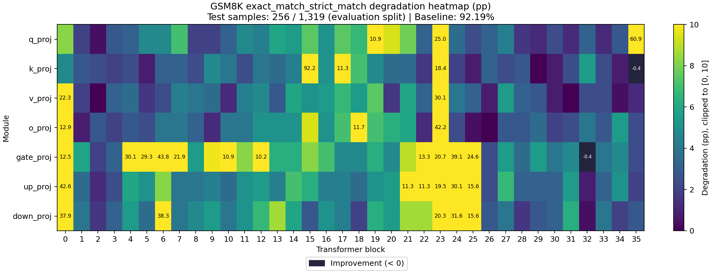
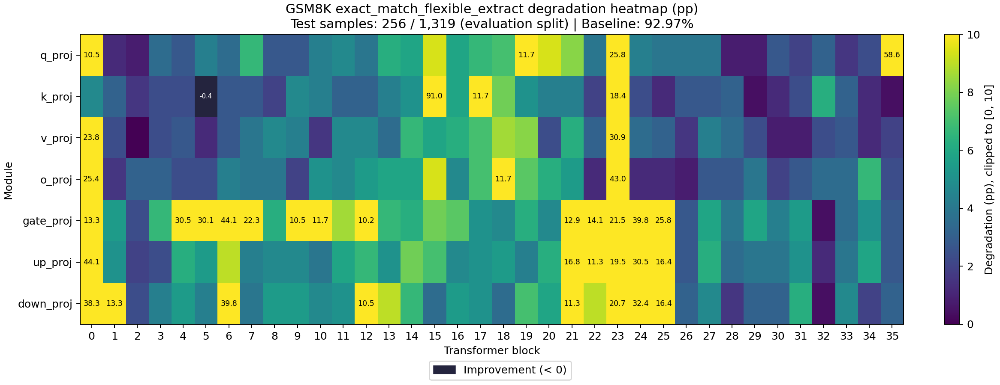

# Sensitivity Report

- Task: `gsm8k`
- Dataset: `gsm8k`
- Split: `lm-eval`
- Preprocessing: `lm-eval-default-shot-merged-samples-0:256`
- Evaluated examples: 256
- Total evaluation examples: 1319
- Sample range: [0, 256)
- Baseline evaluation seconds: 319.034500

## Aggregation

本报告将两段已完成评测按实际样本数 64:192 加权合并，覆盖全部 252 个 Linear。
准确率按两段正确题数之和除以 256 计算；退化量为合并基线减去合并准确率。
保留两段一致的压缩信息；耗时为两次运行之和，基线耗时来自原报告的舍入值。
沿用原默认 few-shot 设置；分段提示词的示例抽样可能与一次性运行 256 条不同。
新日志的时间戳是汇总生成时间；原运行标识、路径及日志 SHA-256 保存在开始事件中。

- [20260908T154917](../20260908T154917/report.md): [0, 64)，64 条
- [20260909T131710](../20260909T131710/report.md): [64, 256)，192 条

## Baseline Metrics

| Metric | Value |
|---|---:|
| exact_match_strict_match | 0.921875000 |
| exact_match_flexible_extract | 0.929687500 |

## Cases

| Case | Targets | Model Compression Ratio | Compression Seconds | Evaluation Seconds |
|---|---:|---:|---:|---:|
| model.layers.0.self_attn.q_proj | 1 | 1.001757354 | 0.184840 | 319.489067 |
| model.layers.0.self_attn.k_proj | 1 | 1.000363688 | 0.063008 | 307.837852 |
| model.layers.0.self_attn.v_proj | 1 | 1.000363688 | 0.061232 | 334.039800 |
| model.layers.0.self_attn.o_proj | 1 | 1.001757354 | 0.101639 | 360.497666 |
| model.layers.0.mlp.gate_proj | 1 | 1.005879266 | 0.281042 | 317.926249 |
| model.layers.0.mlp.up_proj | 1 | 1.005879266 | 0.277696 | 321.931017 |
| model.layers.0.mlp.down_proj | 1 | 1.005879266 | 0.273254 | 315.733304 |
| model.layers.1.self_attn.q_proj | 1 | 1.001757354 | 0.106687 | 310.850300 |
| model.layers.1.self_attn.k_proj | 1 | 1.000363688 | 0.061588 | 317.017871 |
| model.layers.1.self_attn.v_proj | 1 | 1.000363688 | 0.060419 | 297.567119 |
| model.layers.1.self_attn.o_proj | 1 | 1.001757354 | 0.101544 | 302.823556 |
| model.layers.1.mlp.gate_proj | 1 | 1.005879266 | 0.279601 | 316.795376 |
| model.layers.1.mlp.up_proj | 1 | 1.005879266 | 0.274038 | 321.690981 |
| model.layers.1.mlp.down_proj | 1 | 1.005879266 | 0.273201 | 339.081292 |
| model.layers.2.self_attn.q_proj | 1 | 1.001757354 | 0.102234 | 311.026710 |
| model.layers.2.self_attn.k_proj | 1 | 1.000363688 | 0.061493 | 317.237320 |
| model.layers.2.self_attn.v_proj | 1 | 1.000363688 | 0.060574 | 306.712549 |
| model.layers.2.self_attn.o_proj | 1 | 1.001757354 | 0.108164 | 312.392661 |
| model.layers.2.mlp.gate_proj | 1 | 1.005879266 | 0.273851 | 311.675551 |
| model.layers.2.mlp.up_proj | 1 | 1.005879266 | 0.270839 | 310.661651 |
| model.layers.2.mlp.down_proj | 1 | 1.005879266 | 0.275760 | 302.803960 |
| model.layers.3.self_attn.q_proj | 1 | 1.001757354 | 0.101437 | 306.189931 |
| model.layers.3.self_attn.k_proj | 1 | 1.000363688 | 0.063251 | 314.008278 |
| model.layers.3.self_attn.v_proj | 1 | 1.000363688 | 0.060219 | 309.038224 |
| model.layers.3.self_attn.o_proj | 1 | 1.001757354 | 0.101544 | 305.961810 |
| model.layers.3.mlp.gate_proj | 1 | 1.005879266 | 0.278423 | 327.087427 |
| model.layers.3.mlp.up_proj | 1 | 1.005879266 | 0.273031 | 316.171676 |
| model.layers.3.mlp.down_proj | 1 | 1.005879266 | 0.271612 | 314.279538 |
| model.layers.4.self_attn.q_proj | 1 | 1.001757354 | 0.102639 | 306.208997 |
| model.layers.4.self_attn.k_proj | 1 | 1.000363688 | 0.060844 | 309.238898 |
| model.layers.4.self_attn.v_proj | 1 | 1.000363688 | 0.060239 | 317.685749 |
| model.layers.4.self_attn.o_proj | 1 | 1.001757354 | 0.102791 | 312.864864 |
| model.layers.4.mlp.gate_proj | 1 | 1.005879266 | 0.287479 | 309.321060 |
| model.layers.4.mlp.up_proj | 1 | 1.005879266 | 0.273087 | 305.974667 |
| model.layers.4.mlp.down_proj | 1 | 1.005879266 | 0.283947 | 313.334924 |
| model.layers.5.self_attn.q_proj | 1 | 1.001757354 | 0.101836 | 315.304769 |
| model.layers.5.self_attn.k_proj | 1 | 1.000363688 | 0.060980 | 311.293279 |
| model.layers.5.self_attn.v_proj | 1 | 1.000363688 | 0.060477 | 308.212320 |
| model.layers.5.self_attn.o_proj | 1 | 1.001757354 | 0.101211 | 308.876009 |
| model.layers.5.mlp.gate_proj | 1 | 1.005879266 | 0.284098 | 305.634603 |
| model.layers.5.mlp.up_proj | 1 | 1.005879266 | 0.279730 | 308.299608 |
| model.layers.5.mlp.down_proj | 1 | 1.005879266 | 0.277225 | 298.596117 |
| model.layers.6.self_attn.q_proj | 1 | 1.001757354 | 0.102107 | 307.312380 |
| model.layers.6.self_attn.k_proj | 1 | 1.000363688 | 0.061167 | 309.586230 |
| model.layers.6.self_attn.v_proj | 1 | 1.000363688 | 0.060379 | 300.848483 |
| model.layers.6.self_attn.o_proj | 1 | 1.001757354 | 0.104091 | 306.025343 |
| model.layers.6.mlp.gate_proj | 1 | 1.005879266 | 0.277922 | 301.156759 |
| model.layers.6.mlp.up_proj | 1 | 1.005879266 | 0.276897 | 306.927462 |
| model.layers.6.mlp.down_proj | 1 | 1.005879266 | 0.277980 | 323.453596 |
| model.layers.7.self_attn.q_proj | 1 | 1.001757354 | 0.101004 | 297.026657 |
| model.layers.7.self_attn.k_proj | 1 | 1.000363688 | 0.060523 | 316.968456 |
| model.layers.7.self_attn.v_proj | 1 | 1.000363688 | 0.063022 | 320.642086 |
| model.layers.7.self_attn.o_proj | 1 | 1.001757354 | 0.101467 | 307.819780 |
| model.layers.7.mlp.gate_proj | 1 | 1.005879266 | 0.276981 | 297.918443 |
| model.layers.7.mlp.up_proj | 1 | 1.005879266 | 0.277493 | 299.329186 |
| model.layers.7.mlp.down_proj | 1 | 1.005879266 | 0.278686 | 301.631335 |
| model.layers.8.self_attn.q_proj | 1 | 1.001757354 | 0.102422 | 310.297880 |
| model.layers.8.self_attn.k_proj | 1 | 1.000363688 | 0.061689 | 308.863381 |
| model.layers.8.self_attn.v_proj | 1 | 1.000363688 | 0.061217 | 295.591637 |
| model.layers.8.self_attn.o_proj | 1 | 1.001757354 | 0.102680 | 306.778823 |
| model.layers.8.mlp.gate_proj | 1 | 1.005879266 | 0.279230 | 299.517778 |
| model.layers.8.mlp.up_proj | 1 | 1.005879266 | 0.294457 | 303.412211 |
| model.layers.8.mlp.down_proj | 1 | 1.005879266 | 0.278142 | 295.836398 |
| model.layers.9.self_attn.q_proj | 1 | 1.001757354 | 0.101807 | 303.296396 |
| model.layers.9.self_attn.k_proj | 1 | 1.000363688 | 0.060369 | 314.789194 |
| model.layers.9.self_attn.v_proj | 1 | 1.000363688 | 0.060530 | 293.157632 |
| model.layers.9.self_attn.o_proj | 1 | 1.001757354 | 0.101770 | 303.868115 |
| model.layers.9.mlp.gate_proj | 1 | 1.005879266 | 0.278690 | 307.989880 |
| model.layers.9.mlp.up_proj | 1 | 1.005879266 | 0.278293 | 319.765401 |
| model.layers.9.mlp.down_proj | 1 | 1.005879266 | 0.277490 | 315.926338 |
| model.layers.10.self_attn.q_proj | 1 | 1.001757354 | 0.102708 | 309.947317 |
| model.layers.10.self_attn.k_proj | 1 | 1.000363688 | 0.061389 | 308.633711 |
| model.layers.10.self_attn.v_proj | 1 | 1.000363688 | 0.060501 | 303.124983 |
| model.layers.10.self_attn.o_proj | 1 | 1.001757354 | 0.101454 | 315.874394 |
| model.layers.10.mlp.gate_proj | 1 | 1.005879266 | 0.279867 | 302.868243 |
| model.layers.10.mlp.up_proj | 1 | 1.005879266 | 0.279413 | 307.886110 |
| model.layers.10.mlp.down_proj | 1 | 1.005879266 | 0.277939 | 307.219965 |
| model.layers.11.self_attn.q_proj | 1 | 1.001757354 | 0.101475 | 309.239685 |
| model.layers.11.self_attn.k_proj | 1 | 1.000363688 | 0.061121 | 306.638451 |
| model.layers.11.self_attn.v_proj | 1 | 1.000363688 | 0.062403 | 317.736440 |
| model.layers.11.self_attn.o_proj | 1 | 1.001757354 | 0.101501 | 310.773878 |
| model.layers.11.mlp.gate_proj | 1 | 1.005879266 | 0.277839 | 418.286212 |
| model.layers.11.mlp.up_proj | 1 | 1.005879266 | 0.470238 | 581.303819 |
| model.layers.11.mlp.down_proj | 1 | 1.005879266 | 0.459667 | 584.975812 |
| model.layers.12.self_attn.q_proj | 1 | 1.001757354 | 0.172932 | 578.941339 |
| model.layers.12.self_attn.k_proj | 1 | 1.000363688 | 0.140996 | 593.153262 |
| model.layers.12.self_attn.v_proj | 1 | 1.000363688 | 0.115099 | 565.235141 |
| model.layers.12.self_attn.o_proj | 1 | 1.001757354 | 0.183203 | 568.383509 |
| model.layers.12.mlp.gate_proj | 1 | 1.005879266 | 0.459196 | 567.621916 |
| model.layers.12.mlp.up_proj | 1 | 1.005879266 | 0.446413 | 572.236305 |
| model.layers.12.mlp.down_proj | 1 | 1.005879266 | 0.456422 | 578.860621 |
| model.layers.13.self_attn.q_proj | 1 | 1.001757354 | 0.178045 | 570.707355 |
| model.layers.13.self_attn.k_proj | 1 | 1.000363688 | 0.128579 | 541.183764 |
| model.layers.13.self_attn.v_proj | 1 | 1.000363688 | 0.126736 | 566.093709 |
| model.layers.13.self_attn.o_proj | 1 | 1.001757354 | 0.178072 | 553.623839 |
| model.layers.13.mlp.gate_proj | 1 | 1.005879266 | 0.461155 | 557.270076 |
| model.layers.13.mlp.up_proj | 1 | 1.005879266 | 0.449919 | 562.804433 |
| model.layers.13.mlp.down_proj | 1 | 1.005879266 | 0.456400 | 572.033953 |
| model.layers.14.self_attn.q_proj | 1 | 1.001757354 | 0.182989 | 564.143136 |
| model.layers.14.self_attn.k_proj | 1 | 1.000363688 | 0.142650 | 569.765923 |
| model.layers.14.self_attn.v_proj | 1 | 1.000363688 | 0.126037 | 563.185097 |
| model.layers.14.self_attn.o_proj | 1 | 1.001757354 | 0.170511 | 539.682043 |
| model.layers.14.mlp.gate_proj | 1 | 1.005879266 | 0.444492 | 556.821795 |
| model.layers.14.mlp.up_proj | 1 | 1.005879266 | 0.449448 | 548.994611 |
| model.layers.14.mlp.down_proj | 1 | 1.005879266 | 0.449954 | 542.321514 |
| model.layers.15.self_attn.q_proj | 1 | 1.001757354 | 0.192685 | 573.408776 |
| model.layers.15.self_attn.k_proj | 1 | 1.000363688 | 0.126376 | 670.394250 |
| model.layers.15.self_attn.v_proj | 1 | 1.000363688 | 0.124524 | 554.911155 |
| model.layers.15.self_attn.o_proj | 1 | 1.001757354 | 0.174688 | 545.091897 |
| model.layers.15.mlp.gate_proj | 1 | 1.005879266 | 0.442350 | 596.759217 |
| model.layers.15.mlp.up_proj | 1 | 1.005879266 | 0.454638 | 564.925435 |
| model.layers.15.mlp.down_proj | 1 | 1.005879266 | 0.444663 | 556.994493 |
| model.layers.16.self_attn.q_proj | 1 | 1.001757354 | 0.192019 | 567.533686 |
| model.layers.16.self_attn.k_proj | 1 | 1.000363688 | 0.132957 | 557.346796 |
| model.layers.16.self_attn.v_proj | 1 | 1.000363688 | 0.107713 | 562.949962 |
| model.layers.16.self_attn.o_proj | 1 | 1.001757354 | 0.178115 | 571.887090 |
| model.layers.16.mlp.gate_proj | 1 | 1.005879266 | 0.462280 | 557.291194 |
| model.layers.16.mlp.up_proj | 1 | 1.005879266 | 0.453686 | 572.873424 |
| model.layers.16.mlp.down_proj | 1 | 1.005879266 | 0.450782 | 551.671203 |
| model.layers.17.self_attn.q_proj | 1 | 1.001757354 | 0.180172 | 585.270059 |
| model.layers.17.self_attn.k_proj | 1 | 1.000363688 | 0.126950 | 582.072630 |
| model.layers.17.self_attn.v_proj | 1 | 1.000363688 | 0.131274 | 564.014130 |
| model.layers.17.self_attn.o_proj | 1 | 1.001757354 | 0.175792 | 593.386864 |
| model.layers.17.mlp.gate_proj | 1 | 1.005879266 | 0.456699 | 542.008030 |
| model.layers.17.mlp.up_proj | 1 | 1.005879266 | 0.454815 | 540.198041 |
| model.layers.17.mlp.down_proj | 1 | 1.005879266 | 0.455853 | 546.085414 |
| model.layers.18.self_attn.q_proj | 1 | 1.001757354 | 0.170886 | 563.692723 |
| model.layers.18.self_attn.k_proj | 1 | 1.000363688 | 0.117534 | 585.625205 |
| model.layers.18.self_attn.v_proj | 1 | 1.000363688 | 0.121713 | 610.394658 |
| model.layers.18.self_attn.o_proj | 1 | 1.001757354 | 0.195038 | 558.683916 |
| model.layers.18.mlp.gate_proj | 1 | 1.005879266 | 0.452213 | 558.469604 |
| model.layers.18.mlp.up_proj | 1 | 1.005879266 | 0.449137 | 546.096838 |
| model.layers.18.mlp.down_proj | 1 | 1.005879266 | 0.458693 | 536.441949 |
| model.layers.19.self_attn.q_proj | 1 | 1.001757354 | 0.189131 | 518.909760 |
| model.layers.19.self_attn.k_proj | 1 | 1.000363688 | 0.129625 | 569.316610 |
| model.layers.19.self_attn.v_proj | 1 | 1.000363688 | 0.138117 | 519.645086 |
| model.layers.19.self_attn.o_proj | 1 | 1.001757354 | 0.182022 | 538.036183 |
| model.layers.19.mlp.gate_proj | 1 | 1.005879266 | 0.443427 | 589.226252 |
| model.layers.19.mlp.up_proj | 1 | 1.005879266 | 0.468916 | 594.763104 |
| model.layers.19.mlp.down_proj | 1 | 1.005879266 | 0.448146 | 575.461754 |
| model.layers.20.self_attn.q_proj | 1 | 1.001757354 | 0.192752 | 561.882334 |
| model.layers.20.self_attn.k_proj | 1 | 1.000363688 | 0.136849 | 545.521487 |
| model.layers.20.self_attn.v_proj | 1 | 1.000363688 | 0.117379 | 534.194966 |
| model.layers.20.self_attn.o_proj | 1 | 1.001757354 | 0.170795 | 546.079649 |
| model.layers.20.mlp.gate_proj | 1 | 1.005879266 | 0.454894 | 578.066490 |
| model.layers.20.mlp.up_proj | 1 | 1.005879266 | 0.453630 | 569.283651 |
| model.layers.20.mlp.down_proj | 1 | 1.005879266 | 0.447172 | 572.461641 |
| model.layers.21.self_attn.q_proj | 1 | 1.001757354 | 0.201497 | 543.727624 |
| model.layers.21.self_attn.k_proj | 1 | 1.000363688 | 0.114512 | 560.989898 |
| model.layers.21.self_attn.v_proj | 1 | 1.000363688 | 0.117671 | 563.223679 |
| model.layers.21.self_attn.o_proj | 1 | 1.001757354 | 0.175436 | 570.082932 |
| model.layers.21.mlp.gate_proj | 1 | 1.005879266 | 0.452691 | 597.762655 |
| model.layers.21.mlp.up_proj | 1 | 1.005879266 | 0.459340 | 618.142893 |
| model.layers.21.mlp.down_proj | 1 | 1.005879266 | 0.425431 | 608.058741 |
| model.layers.22.self_attn.q_proj | 1 | 1.001757354 | 0.178027 | 561.393354 |
| model.layers.22.self_attn.k_proj | 1 | 1.000363688 | 0.121652 | 541.368298 |
| model.layers.22.self_attn.v_proj | 1 | 1.000363688 | 0.139904 | 527.544635 |
| model.layers.22.self_attn.o_proj | 1 | 1.001757354 | 0.183095 | 541.137640 |
| model.layers.22.mlp.gate_proj | 1 | 1.005879266 | 0.448296 | 572.802615 |
| model.layers.22.mlp.up_proj | 1 | 1.005879266 | 0.275937 | 601.767182 |
| model.layers.22.mlp.down_proj | 1 | 1.005879266 | 0.454620 | 593.798094 |
| model.layers.23.self_attn.q_proj | 1 | 1.001757354 | 0.182870 | 555.267391 |
| model.layers.23.self_attn.k_proj | 1 | 1.000363688 | 0.133838 | 556.623831 |
| model.layers.23.self_attn.v_proj | 1 | 1.000363688 | 0.108799 | 423.291518 |
| model.layers.23.self_attn.o_proj | 1 | 1.001757354 | 0.100829 | 323.164640 |
| model.layers.23.mlp.gate_proj | 1 | 1.005879266 | 0.282833 | 310.297204 |
| model.layers.23.mlp.up_proj | 1 | 1.005879266 | 0.277797 | 306.345911 |
| model.layers.23.mlp.down_proj | 1 | 1.005879266 | 0.276228 | 298.299681 |
| model.layers.24.self_attn.q_proj | 1 | 1.001757354 | 0.104825 | 308.918095 |
| model.layers.24.self_attn.k_proj | 1 | 1.000363688 | 0.060924 | 297.651640 |
| model.layers.24.self_attn.v_proj | 1 | 1.000363688 | 0.063860 | 303.398494 |
| model.layers.24.self_attn.o_proj | 1 | 1.001757354 | 0.101245 | 299.471170 |
| model.layers.24.mlp.gate_proj | 1 | 1.005879266 | 0.278668 | 301.300415 |
| model.layers.24.mlp.up_proj | 1 | 1.005879266 | 0.277736 | 306.123742 |
| model.layers.24.mlp.down_proj | 1 | 1.005879266 | 0.277093 | 305.306896 |
| model.layers.25.self_attn.q_proj | 1 | 1.001757354 | 0.101201 | 309.438392 |
| model.layers.25.self_attn.k_proj | 1 | 1.000363688 | 0.061749 | 300.127338 |
| model.layers.25.self_attn.v_proj | 1 | 1.000363688 | 0.060554 | 317.440694 |
| model.layers.25.self_attn.o_proj | 1 | 1.001757354 | 0.102426 | 314.407286 |
| model.layers.25.mlp.gate_proj | 1 | 1.005879266 | 0.277631 | 314.063134 |
| model.layers.25.mlp.up_proj | 1 | 1.005879266 | 0.286775 | 314.219891 |
| model.layers.25.mlp.down_proj | 1 | 1.005879266 | 0.276429 | 313.426627 |
| model.layers.26.self_attn.q_proj | 1 | 1.001757354 | 0.101197 | 305.819054 |
| model.layers.26.self_attn.k_proj | 1 | 1.000363688 | 0.061104 | 308.124327 |
| model.layers.26.self_attn.v_proj | 1 | 1.000363688 | 0.060646 | 301.617992 |
| model.layers.26.self_attn.o_proj | 1 | 1.001757354 | 0.103024 | 308.614862 |
| model.layers.26.mlp.gate_proj | 1 | 1.005879266 | 0.278349 | 310.129513 |
| model.layers.26.mlp.up_proj | 1 | 1.005879266 | 0.278487 | 305.175319 |
| model.layers.26.mlp.down_proj | 1 | 1.005879266 | 0.278321 | 304.736064 |
| model.layers.27.self_attn.q_proj | 1 | 1.001757354 | 0.101865 | 311.196139 |
| model.layers.27.self_attn.k_proj | 1 | 1.000363688 | 0.060821 | 309.890116 |
| model.layers.27.self_attn.v_proj | 1 | 1.000363688 | 0.060935 | 315.343664 |
| model.layers.27.self_attn.o_proj | 1 | 1.001757354 | 0.101369 | 312.549803 |
| model.layers.27.mlp.gate_proj | 1 | 1.005879266 | 0.279184 | 310.673102 |
| model.layers.27.mlp.up_proj | 1 | 1.005879266 | 0.294722 | 322.069608 |
| model.layers.27.mlp.down_proj | 1 | 1.005879266 | 0.278577 | 309.005685 |
| model.layers.28.self_attn.q_proj | 1 | 1.001757354 | 0.100536 | 304.991785 |
| model.layers.28.self_attn.k_proj | 1 | 1.000363688 | 0.061035 | 305.953273 |
| model.layers.28.self_attn.v_proj | 1 | 1.000363688 | 0.060470 | 317.335240 |
| model.layers.28.self_attn.o_proj | 1 | 1.001757354 | 0.101893 | 315.941600 |
| model.layers.28.mlp.gate_proj | 1 | 1.005879266 | 0.279497 | 305.690362 |
| model.layers.28.mlp.up_proj | 1 | 1.005879266 | 0.278994 | 305.610942 |
| model.layers.28.mlp.down_proj | 1 | 1.005879266 | 0.281357 | 305.359260 |
| model.layers.29.self_attn.q_proj | 1 | 1.001757354 | 0.101039 | 302.340726 |
| model.layers.29.self_attn.k_proj | 1 | 1.000363688 | 0.060649 | 300.599110 |
| model.layers.29.self_attn.v_proj | 1 | 1.000363688 | 0.060100 | 299.224518 |
| model.layers.29.self_attn.o_proj | 1 | 1.001757354 | 0.102370 | 301.909970 |
| model.layers.29.mlp.gate_proj | 1 | 1.005879266 | 0.278814 | 313.417153 |
| model.layers.29.mlp.up_proj | 1 | 1.005879266 | 0.278579 | 315.444879 |
| model.layers.29.mlp.down_proj | 1 | 1.005879266 | 0.272847 | 309.672633 |
| model.layers.30.self_attn.q_proj | 1 | 1.001757354 | 0.107336 | 310.392236 |
| model.layers.30.self_attn.k_proj | 1 | 1.000363688 | 0.060606 | 303.666566 |
| model.layers.30.self_attn.v_proj | 1 | 1.000363688 | 0.060138 | 305.002877 |
| model.layers.30.self_attn.o_proj | 1 | 1.001757354 | 0.102589 | 305.795064 |
| model.layers.30.mlp.gate_proj | 1 | 1.005879266 | 0.277620 | 307.700549 |
| model.layers.30.mlp.up_proj | 1 | 1.005879266 | 0.286642 | 306.934283 |
| model.layers.30.mlp.down_proj | 1 | 1.005879266 | 0.277767 | 310.421525 |
| model.layers.31.self_attn.q_proj | 1 | 1.001757354 | 0.104423 | 300.927431 |
| model.layers.31.self_attn.k_proj | 1 | 1.000363688 | 0.060336 | 303.919152 |
| model.layers.31.self_attn.v_proj | 1 | 1.000363688 | 0.064440 | 302.563250 |
| model.layers.31.self_attn.o_proj | 1 | 1.001757354 | 0.101897 | 308.470469 |
| model.layers.31.mlp.gate_proj | 1 | 1.005879266 | 0.281364 | 310.441288 |
| model.layers.31.mlp.up_proj | 1 | 1.005879266 | 0.280118 | 314.310835 |
| model.layers.31.mlp.down_proj | 1 | 1.005879266 | 0.277852 | 312.539942 |
| model.layers.32.self_attn.q_proj | 1 | 1.001757354 | 0.099807 | 295.589184 |
| model.layers.32.self_attn.k_proj | 1 | 1.000363688 | 0.060819 | 305.427804 |
| model.layers.32.self_attn.v_proj | 1 | 1.000363688 | 0.061613 | 310.030064 |
| model.layers.32.self_attn.o_proj | 1 | 1.001757354 | 0.101507 | 307.147628 |
| model.layers.32.mlp.gate_proj | 1 | 1.005879266 | 0.274339 | 305.561361 |
| model.layers.32.mlp.up_proj | 1 | 1.005879266 | 0.273375 | 309.187129 |
| model.layers.32.mlp.down_proj | 1 | 1.005879266 | 0.283040 | 306.379484 |
| model.layers.33.self_attn.q_proj | 1 | 1.001757354 | 0.100984 | 309.420068 |
| model.layers.33.self_attn.k_proj | 1 | 1.000363688 | 0.060712 | 306.574450 |
| model.layers.33.self_attn.v_proj | 1 | 1.000363688 | 0.059524 | 309.086138 |
| model.layers.33.self_attn.o_proj | 1 | 1.001757354 | 0.103900 | 316.047469 |
| model.layers.33.mlp.gate_proj | 1 | 1.005879266 | 0.279081 | 309.963839 |
| model.layers.33.mlp.up_proj | 1 | 1.005879266 | 0.278410 | 322.210731 |
| model.layers.33.mlp.down_proj | 1 | 1.005879266 | 0.278913 | 309.977951 |
| model.layers.34.self_attn.q_proj | 1 | 1.001757354 | 0.105813 | 292.382853 |
| model.layers.34.self_attn.k_proj | 1 | 1.000363688 | 0.060320 | 293.824484 |
| model.layers.34.self_attn.v_proj | 1 | 1.000363688 | 0.062889 | 295.393775 |
| model.layers.34.self_attn.o_proj | 1 | 1.001757354 | 0.101954 | 293.992037 |
| model.layers.34.mlp.gate_proj | 1 | 1.005879266 | 0.283358 | 319.724902 |
| model.layers.34.mlp.up_proj | 1 | 1.005879266 | 0.279000 | 329.501475 |
| model.layers.34.mlp.down_proj | 1 | 1.005879266 | 0.276808 | 314.646602 |
| model.layers.35.self_attn.q_proj | 1 | 1.001757354 | 0.102442 | 342.622934 |
| model.layers.35.self_attn.k_proj | 1 | 1.000363688 | 0.060842 | 303.759918 |
| model.layers.35.self_attn.v_proj | 1 | 1.000363688 | 0.060053 | 310.555768 |
| model.layers.35.self_attn.o_proj | 1 | 1.001757354 | 0.100391 | 299.505781 |
| model.layers.35.mlp.gate_proj | 1 | 1.005879266 | 0.288207 | 287.792392 |
| model.layers.35.mlp.up_proj | 1 | 1.005879266 | 0.282177 | 306.874444 |
| model.layers.35.mlp.down_proj | 1 | 1.005879266 | 0.275343 | 309.944092 |

## Metrics

| Case | Metric | Value | Degradation |
|---|---|---:|---:|
| model.layers.0.self_attn.q_proj | exact_match_strict_match | 0.839843750 | 0.082031250 |
| model.layers.0.self_attn.q_proj | exact_match_flexible_extract | 0.824218750 | 0.105468750 |
| model.layers.0.self_attn.k_proj | exact_match_strict_match | 0.875000000 | 0.046875000 |
| model.layers.0.self_attn.k_proj | exact_match_flexible_extract | 0.882812500 | 0.046875000 |
| model.layers.0.self_attn.v_proj | exact_match_strict_match | 0.699218750 | 0.222656250 |
| model.layers.0.self_attn.v_proj | exact_match_flexible_extract | 0.691406250 | 0.238281250 |
| model.layers.0.self_attn.o_proj | exact_match_strict_match | 0.792968750 | 0.128906250 |
| model.layers.0.self_attn.o_proj | exact_match_flexible_extract | 0.675781250 | 0.253906250 |
| model.layers.0.mlp.gate_proj | exact_match_strict_match | 0.796875000 | 0.125000000 |
| model.layers.0.mlp.gate_proj | exact_match_flexible_extract | 0.796875000 | 0.132812500 |
| model.layers.0.mlp.up_proj | exact_match_strict_match | 0.496093750 | 0.425781250 |
| model.layers.0.mlp.up_proj | exact_match_flexible_extract | 0.488281250 | 0.441406250 |
| model.layers.0.mlp.down_proj | exact_match_strict_match | 0.542968750 | 0.378906250 |
| model.layers.0.mlp.down_proj | exact_match_flexible_extract | 0.546875000 | 0.382812500 |
| model.layers.1.self_attn.q_proj | exact_match_strict_match | 0.902343750 | 0.019531250 |
| model.layers.1.self_attn.q_proj | exact_match_flexible_extract | 0.917968750 | 0.011718750 |
| model.layers.1.self_attn.k_proj | exact_match_strict_match | 0.894531250 | 0.027343750 |
| model.layers.1.self_attn.k_proj | exact_match_flexible_extract | 0.898437500 | 0.031250000 |
| model.layers.1.self_attn.v_proj | exact_match_strict_match | 0.902343750 | 0.019531250 |
| model.layers.1.self_attn.v_proj | exact_match_flexible_extract | 0.906250000 | 0.023437500 |
| model.layers.1.self_attn.o_proj | exact_match_strict_match | 0.914062500 | 0.007812500 |
| model.layers.1.self_attn.o_proj | exact_match_flexible_extract | 0.914062500 | 0.015625000 |
| model.layers.1.mlp.gate_proj | exact_match_strict_match | 0.863281250 | 0.058593750 |
| model.layers.1.mlp.gate_proj | exact_match_flexible_extract | 0.875000000 | 0.054687500 |
| model.layers.1.mlp.up_proj | exact_match_strict_match | 0.886718750 | 0.035156250 |
| model.layers.1.mlp.up_proj | exact_match_flexible_extract | 0.878906250 | 0.050781250 |
| model.layers.1.mlp.down_proj | exact_match_strict_match | 0.882812500 | 0.039062500 |
| model.layers.1.mlp.down_proj | exact_match_flexible_extract | 0.796875000 | 0.132812500 |
| model.layers.2.self_attn.q_proj | exact_match_strict_match | 0.917968750 | 0.003906250 |
| model.layers.2.self_attn.q_proj | exact_match_flexible_extract | 0.921875000 | 0.007812500 |
| model.layers.2.self_attn.k_proj | exact_match_strict_match | 0.898437500 | 0.023437500 |
| model.layers.2.self_attn.k_proj | exact_match_flexible_extract | 0.914062500 | 0.015625000 |
| model.layers.2.self_attn.v_proj | exact_match_strict_match | 0.921875000 | 0.000000000 |
| model.layers.2.self_attn.v_proj | exact_match_flexible_extract | 0.929687500 | 0.000000000 |
| model.layers.2.self_attn.o_proj | exact_match_strict_match | 0.894531250 | 0.027343750 |
| model.layers.2.self_attn.o_proj | exact_match_flexible_extract | 0.898437500 | 0.031250000 |
| model.layers.2.mlp.gate_proj | exact_match_strict_match | 0.902343750 | 0.019531250 |
| model.layers.2.mlp.gate_proj | exact_match_flexible_extract | 0.906250000 | 0.023437500 |
| model.layers.2.mlp.up_proj | exact_match_strict_match | 0.910156250 | 0.011718750 |
| model.layers.2.mlp.up_proj | exact_match_flexible_extract | 0.910156250 | 0.019531250 |
| model.layers.2.mlp.down_proj | exact_match_strict_match | 0.906250000 | 0.015625000 |
| model.layers.2.mlp.down_proj | exact_match_flexible_extract | 0.906250000 | 0.023437500 |
| model.layers.3.self_attn.q_proj | exact_match_strict_match | 0.894531250 | 0.027343750 |
| model.layers.3.self_attn.q_proj | exact_match_flexible_extract | 0.894531250 | 0.035156250 |
| model.layers.3.self_attn.k_proj | exact_match_strict_match | 0.902343750 | 0.019531250 |
| model.layers.3.self_attn.k_proj | exact_match_flexible_extract | 0.906250000 | 0.023437500 |
| model.layers.3.self_attn.v_proj | exact_match_strict_match | 0.890625000 | 0.031250000 |
| model.layers.3.self_attn.v_proj | exact_match_flexible_extract | 0.906250000 | 0.023437500 |
| model.layers.3.self_attn.o_proj | exact_match_strict_match | 0.902343750 | 0.019531250 |
| model.layers.3.self_attn.o_proj | exact_match_flexible_extract | 0.898437500 | 0.031250000 |
| model.layers.3.mlp.gate_proj | exact_match_strict_match | 0.890625000 | 0.031250000 |
| model.layers.3.mlp.gate_proj | exact_match_flexible_extract | 0.863281250 | 0.066406250 |
| model.layers.3.mlp.up_proj | exact_match_strict_match | 0.898437500 | 0.023437500 |
| model.layers.3.mlp.up_proj | exact_match_flexible_extract | 0.906250000 | 0.023437500 |
| model.layers.3.mlp.down_proj | exact_match_strict_match | 0.890625000 | 0.031250000 |
| model.layers.3.mlp.down_proj | exact_match_flexible_extract | 0.886718750 | 0.042968750 |
| model.layers.4.self_attn.q_proj | exact_match_strict_match | 0.890625000 | 0.031250000 |
| model.layers.4.self_attn.q_proj | exact_match_flexible_extract | 0.902343750 | 0.027343750 |
| model.layers.4.self_attn.k_proj | exact_match_strict_match | 0.898437500 | 0.023437500 |
| model.layers.4.self_attn.k_proj | exact_match_flexible_extract | 0.906250000 | 0.023437500 |
| model.layers.4.self_attn.v_proj | exact_match_strict_match | 0.886718750 | 0.035156250 |
| model.layers.4.self_attn.v_proj | exact_match_flexible_extract | 0.902343750 | 0.027343750 |
| model.layers.4.self_attn.o_proj | exact_match_strict_match | 0.894531250 | 0.027343750 |
| model.layers.4.self_attn.o_proj | exact_match_flexible_extract | 0.906250000 | 0.023437500 |
| model.layers.4.mlp.gate_proj | exact_match_strict_match | 0.621093750 | 0.300781250 |
| model.layers.4.mlp.gate_proj | exact_match_flexible_extract | 0.625000000 | 0.304687500 |
| model.layers.4.mlp.up_proj | exact_match_strict_match | 0.863281250 | 0.058593750 |
| model.layers.4.mlp.up_proj | exact_match_flexible_extract | 0.867187500 | 0.062500000 |
| model.layers.4.mlp.down_proj | exact_match_strict_match | 0.867187500 | 0.054687500 |
| model.layers.4.mlp.down_proj | exact_match_flexible_extract | 0.875000000 | 0.054687500 |
| model.layers.5.self_attn.q_proj | exact_match_strict_match | 0.875000000 | 0.046875000 |
| model.layers.5.self_attn.q_proj | exact_match_flexible_extract | 0.886718750 | 0.042968750 |
| model.layers.5.self_attn.k_proj | exact_match_strict_match | 0.914062500 | 0.007812500 |
| model.layers.5.self_attn.k_proj | exact_match_flexible_extract | 0.933593750 | -0.003906250 |
| model.layers.5.self_attn.v_proj | exact_match_strict_match | 0.906250000 | 0.015625000 |
| model.layers.5.self_attn.v_proj | exact_match_flexible_extract | 0.917968750 | 0.011718750 |
| model.layers.5.self_attn.o_proj | exact_match_strict_match | 0.898437500 | 0.023437500 |
| model.layers.5.self_attn.o_proj | exact_match_flexible_extract | 0.906250000 | 0.023437500 |
| model.layers.5.mlp.gate_proj | exact_match_strict_match | 0.628906250 | 0.292968750 |
| model.layers.5.mlp.gate_proj | exact_match_flexible_extract | 0.628906250 | 0.300781250 |
| model.layers.5.mlp.up_proj | exact_match_strict_match | 0.871093750 | 0.050781250 |
| model.layers.5.mlp.up_proj | exact_match_flexible_extract | 0.875000000 | 0.054687500 |
| model.layers.5.mlp.down_proj | exact_match_strict_match | 0.886718750 | 0.035156250 |
| model.layers.5.mlp.down_proj | exact_match_flexible_extract | 0.886718750 | 0.042968750 |
| model.layers.6.self_attn.q_proj | exact_match_strict_match | 0.875000000 | 0.046875000 |
| model.layers.6.self_attn.q_proj | exact_match_flexible_extract | 0.894531250 | 0.035156250 |
| model.layers.6.self_attn.k_proj | exact_match_strict_match | 0.890625000 | 0.031250000 |
| model.layers.6.self_attn.k_proj | exact_match_flexible_extract | 0.902343750 | 0.027343750 |
| model.layers.6.self_attn.v_proj | exact_match_strict_match | 0.898437500 | 0.023437500 |
| model.layers.6.self_attn.v_proj | exact_match_flexible_extract | 0.902343750 | 0.027343750 |
| model.layers.6.self_attn.o_proj | exact_match_strict_match | 0.882812500 | 0.039062500 |
| model.layers.6.self_attn.o_proj | exact_match_flexible_extract | 0.886718750 | 0.042968750 |
| model.layers.6.mlp.gate_proj | exact_match_strict_match | 0.484375000 | 0.437500000 |
| model.layers.6.mlp.gate_proj | exact_match_flexible_extract | 0.488281250 | 0.441406250 |
| model.layers.6.mlp.up_proj | exact_match_strict_match | 0.839843750 | 0.082031250 |
| model.layers.6.mlp.up_proj | exact_match_flexible_extract | 0.839843750 | 0.089843750 |
| model.layers.6.mlp.down_proj | exact_match_strict_match | 0.539062500 | 0.382812500 |
| model.layers.6.mlp.down_proj | exact_match_flexible_extract | 0.531250000 | 0.398437500 |
| model.layers.7.self_attn.q_proj | exact_match_strict_match | 0.851562500 | 0.070312500 |
| model.layers.7.self_attn.q_proj | exact_match_flexible_extract | 0.863281250 | 0.066406250 |
| model.layers.7.self_attn.k_proj | exact_match_strict_match | 0.890625000 | 0.031250000 |
| model.layers.7.self_attn.k_proj | exact_match_flexible_extract | 0.902343750 | 0.027343750 |
| model.layers.7.self_attn.v_proj | exact_match_strict_match | 0.878906250 | 0.042968750 |
| model.layers.7.self_attn.v_proj | exact_match_flexible_extract | 0.890625000 | 0.039062500 |
| model.layers.7.self_attn.o_proj | exact_match_strict_match | 0.882812500 | 0.039062500 |
| model.layers.7.self_attn.o_proj | exact_match_flexible_extract | 0.890625000 | 0.039062500 |
| model.layers.7.mlp.gate_proj | exact_match_strict_match | 0.703125000 | 0.218750000 |
| model.layers.7.mlp.gate_proj | exact_match_flexible_extract | 0.707031250 | 0.222656250 |
| model.layers.7.mlp.up_proj | exact_match_strict_match | 0.882812500 | 0.039062500 |
| model.layers.7.mlp.up_proj | exact_match_flexible_extract | 0.886718750 | 0.042968750 |
| model.layers.7.mlp.down_proj | exact_match_strict_match | 0.882812500 | 0.039062500 |
| model.layers.7.mlp.down_proj | exact_match_flexible_extract | 0.890625000 | 0.039062500 |
| model.layers.8.self_attn.q_proj | exact_match_strict_match | 0.902343750 | 0.019531250 |
| model.layers.8.self_attn.q_proj | exact_match_flexible_extract | 0.902343750 | 0.027343750 |
| model.layers.8.self_attn.k_proj | exact_match_strict_match | 0.898437500 | 0.023437500 |
| model.layers.8.self_attn.k_proj | exact_match_flexible_extract | 0.910156250 | 0.019531250 |
| model.layers.8.self_attn.v_proj | exact_match_strict_match | 0.882812500 | 0.039062500 |
| model.layers.8.self_attn.v_proj | exact_match_flexible_extract | 0.882812500 | 0.046875000 |
| model.layers.8.self_attn.o_proj | exact_match_strict_match | 0.890625000 | 0.031250000 |
| model.layers.8.self_attn.o_proj | exact_match_flexible_extract | 0.890625000 | 0.039062500 |
| model.layers.8.mlp.gate_proj | exact_match_strict_match | 0.867187500 | 0.054687500 |
| model.layers.8.mlp.gate_proj | exact_match_flexible_extract | 0.867187500 | 0.062500000 |
| model.layers.8.mlp.up_proj | exact_match_strict_match | 0.882812500 | 0.039062500 |
| model.layers.8.mlp.up_proj | exact_match_flexible_extract | 0.882812500 | 0.046875000 |
| model.layers.8.mlp.down_proj | exact_match_strict_match | 0.875000000 | 0.046875000 |
| model.layers.8.mlp.down_proj | exact_match_flexible_extract | 0.875000000 | 0.054687500 |
| model.layers.9.self_attn.q_proj | exact_match_strict_match | 0.902343750 | 0.019531250 |
| model.layers.9.self_attn.q_proj | exact_match_flexible_extract | 0.902343750 | 0.027343750 |
| model.layers.9.self_attn.k_proj | exact_match_strict_match | 0.875000000 | 0.046875000 |
| model.layers.9.self_attn.k_proj | exact_match_flexible_extract | 0.882812500 | 0.046875000 |
| model.layers.9.self_attn.v_proj | exact_match_strict_match | 0.886718750 | 0.035156250 |
| model.layers.9.self_attn.v_proj | exact_match_flexible_extract | 0.886718750 | 0.042968750 |
| model.layers.9.self_attn.o_proj | exact_match_strict_match | 0.910156250 | 0.011718750 |
| model.layers.9.self_attn.o_proj | exact_match_flexible_extract | 0.910156250 | 0.019531250 |
| model.layers.9.mlp.gate_proj | exact_match_strict_match | 0.824218750 | 0.097656250 |
| model.layers.9.mlp.gate_proj | exact_match_flexible_extract | 0.824218750 | 0.105468750 |
| model.layers.9.mlp.up_proj | exact_match_strict_match | 0.878906250 | 0.042968750 |
| model.layers.9.mlp.up_proj | exact_match_flexible_extract | 0.882812500 | 0.046875000 |
| model.layers.9.mlp.down_proj | exact_match_strict_match | 0.867187500 | 0.054687500 |
| model.layers.9.mlp.down_proj | exact_match_flexible_extract | 0.875000000 | 0.054687500 |
| model.layers.10.self_attn.q_proj | exact_match_strict_match | 0.890625000 | 0.031250000 |
| model.layers.10.self_attn.q_proj | exact_match_flexible_extract | 0.886718750 | 0.042968750 |
| model.layers.10.self_attn.k_proj | exact_match_strict_match | 0.882812500 | 0.039062500 |
| model.layers.10.self_attn.k_proj | exact_match_flexible_extract | 0.886718750 | 0.042968750 |
| model.layers.10.self_attn.v_proj | exact_match_strict_match | 0.910156250 | 0.011718750 |
| model.layers.10.self_attn.v_proj | exact_match_flexible_extract | 0.914062500 | 0.015625000 |
| model.layers.10.self_attn.o_proj | exact_match_strict_match | 0.882812500 | 0.039062500 |
| model.layers.10.self_attn.o_proj | exact_match_flexible_extract | 0.878906250 | 0.050781250 |
| model.layers.10.mlp.gate_proj | exact_match_strict_match | 0.812500000 | 0.109375000 |
| model.layers.10.mlp.gate_proj | exact_match_flexible_extract | 0.812500000 | 0.117187500 |
| model.layers.10.mlp.up_proj | exact_match_strict_match | 0.886718750 | 0.035156250 |
| model.layers.10.mlp.up_proj | exact_match_flexible_extract | 0.890625000 | 0.039062500 |
| model.layers.10.mlp.down_proj | exact_match_strict_match | 0.882812500 | 0.039062500 |
| model.layers.10.mlp.down_proj | exact_match_flexible_extract | 0.882812500 | 0.046875000 |
| model.layers.11.self_attn.q_proj | exact_match_strict_match | 0.875000000 | 0.046875000 |
| model.layers.11.self_attn.q_proj | exact_match_flexible_extract | 0.882812500 | 0.046875000 |
| model.layers.11.self_attn.k_proj | exact_match_strict_match | 0.898437500 | 0.023437500 |
| model.layers.11.self_attn.k_proj | exact_match_flexible_extract | 0.898437500 | 0.031250000 |
| model.layers.11.self_attn.v_proj | exact_match_strict_match | 0.878906250 | 0.042968750 |
| model.layers.11.self_attn.v_proj | exact_match_flexible_extract | 0.882812500 | 0.046875000 |
| model.layers.11.self_attn.o_proj | exact_match_strict_match | 0.882812500 | 0.039062500 |
| model.layers.11.self_attn.o_proj | exact_match_flexible_extract | 0.882812500 | 0.046875000 |
| model.layers.11.mlp.gate_proj | exact_match_strict_match | 0.839843750 | 0.082031250 |
| model.layers.11.mlp.gate_proj | exact_match_flexible_extract | 0.843750000 | 0.085937500 |
| model.layers.11.mlp.up_proj | exact_match_strict_match | 0.871093750 | 0.050781250 |
| model.layers.11.mlp.up_proj | exact_match_flexible_extract | 0.871093750 | 0.058593750 |
| model.layers.11.mlp.down_proj | exact_match_strict_match | 0.871093750 | 0.050781250 |
| model.layers.11.mlp.down_proj | exact_match_flexible_extract | 0.878906250 | 0.050781250 |
| model.layers.12.self_attn.q_proj | exact_match_strict_match | 0.878906250 | 0.042968750 |
| model.layers.12.self_attn.q_proj | exact_match_flexible_extract | 0.890625000 | 0.039062500 |
| model.layers.12.self_attn.k_proj | exact_match_strict_match | 0.882812500 | 0.039062500 |
| model.layers.12.self_attn.k_proj | exact_match_flexible_extract | 0.898437500 | 0.031250000 |
| model.layers.12.self_attn.v_proj | exact_match_strict_match | 0.875000000 | 0.046875000 |
| model.layers.12.self_attn.v_proj | exact_match_flexible_extract | 0.882812500 | 0.046875000 |
| model.layers.12.self_attn.o_proj | exact_match_strict_match | 0.871093750 | 0.050781250 |
| model.layers.12.self_attn.o_proj | exact_match_flexible_extract | 0.875000000 | 0.054687500 |
| model.layers.12.mlp.gate_proj | exact_match_strict_match | 0.820312500 | 0.101562500 |
| model.layers.12.mlp.gate_proj | exact_match_flexible_extract | 0.828125000 | 0.101562500 |
| model.layers.12.mlp.up_proj | exact_match_strict_match | 0.867187500 | 0.054687500 |
| model.layers.12.mlp.up_proj | exact_match_flexible_extract | 0.863281250 | 0.066406250 |
| model.layers.12.mlp.down_proj | exact_match_strict_match | 0.855468750 | 0.066406250 |
| model.layers.12.mlp.down_proj | exact_match_flexible_extract | 0.824218750 | 0.105468750 |
| model.layers.13.self_attn.q_proj | exact_match_strict_match | 0.863281250 | 0.058593750 |
| model.layers.13.self_attn.q_proj | exact_match_flexible_extract | 0.867187500 | 0.062500000 |
| model.layers.13.self_attn.k_proj | exact_match_strict_match | 0.886718750 | 0.035156250 |
| model.layers.13.self_attn.k_proj | exact_match_flexible_extract | 0.886718750 | 0.042968750 |
| model.layers.13.self_attn.v_proj | exact_match_strict_match | 0.894531250 | 0.027343750 |
| model.layers.13.self_attn.v_proj | exact_match_flexible_extract | 0.894531250 | 0.035156250 |
| model.layers.13.self_attn.o_proj | exact_match_strict_match | 0.871093750 | 0.050781250 |
| model.layers.13.self_attn.o_proj | exact_match_flexible_extract | 0.871093750 | 0.058593750 |
| model.layers.13.mlp.gate_proj | exact_match_strict_match | 0.859375000 | 0.062500000 |
| model.layers.13.mlp.gate_proj | exact_match_flexible_extract | 0.863281250 | 0.066406250 |
| model.layers.13.mlp.up_proj | exact_match_strict_match | 0.878906250 | 0.042968750 |
| model.layers.13.mlp.up_proj | exact_match_flexible_extract | 0.878906250 | 0.050781250 |
| model.layers.13.mlp.down_proj | exact_match_strict_match | 0.835937500 | 0.085937500 |
| model.layers.13.mlp.down_proj | exact_match_flexible_extract | 0.839843750 | 0.089843750 |
| model.layers.14.self_attn.q_proj | exact_match_strict_match | 0.867187500 | 0.054687500 |
| model.layers.14.self_attn.q_proj | exact_match_flexible_extract | 0.871093750 | 0.058593750 |
| model.layers.14.self_attn.k_proj | exact_match_strict_match | 0.878906250 | 0.042968750 |
| model.layers.14.self_attn.k_proj | exact_match_flexible_extract | 0.878906250 | 0.050781250 |
| model.layers.14.self_attn.v_proj | exact_match_strict_match | 0.863281250 | 0.058593750 |
| model.layers.14.self_attn.v_proj | exact_match_flexible_extract | 0.863281250 | 0.066406250 |
| model.layers.14.self_attn.o_proj | exact_match_strict_match | 0.871093750 | 0.050781250 |
| model.layers.14.self_attn.o_proj | exact_match_flexible_extract | 0.871093750 | 0.058593750 |
| model.layers.14.mlp.gate_proj | exact_match_strict_match | 0.859375000 | 0.062500000 |
| model.layers.14.mlp.gate_proj | exact_match_flexible_extract | 0.867187500 | 0.062500000 |
| model.layers.14.mlp.up_proj | exact_match_strict_match | 0.851562500 | 0.070312500 |
| model.layers.14.mlp.up_proj | exact_match_flexible_extract | 0.851562500 | 0.078125000 |
| model.layers.14.mlp.down_proj | exact_match_strict_match | 0.863281250 | 0.058593750 |
| model.layers.14.mlp.down_proj | exact_match_flexible_extract | 0.863281250 | 0.066406250 |
| model.layers.15.self_attn.q_proj | exact_match_strict_match | 0.847656250 | 0.074218750 |
| model.layers.15.self_attn.q_proj | exact_match_flexible_extract | 0.835937500 | 0.093750000 |
| model.layers.15.self_attn.k_proj | exact_match_strict_match | 0.000000000 | 0.921875000 |
| model.layers.15.self_attn.k_proj | exact_match_flexible_extract | 0.019531250 | 0.910156250 |
| model.layers.15.self_attn.v_proj | exact_match_strict_match | 0.871093750 | 0.050781250 |
| model.layers.15.self_attn.v_proj | exact_match_flexible_extract | 0.871093750 | 0.058593750 |
| model.layers.15.self_attn.o_proj | exact_match_strict_match | 0.828125000 | 0.093750000 |
| model.layers.15.self_attn.o_proj | exact_match_flexible_extract | 0.835937500 | 0.093750000 |
| model.layers.15.mlp.gate_proj | exact_match_strict_match | 0.839843750 | 0.082031250 |
| model.layers.15.mlp.gate_proj | exact_match_flexible_extract | 0.851562500 | 0.078125000 |
| model.layers.15.mlp.up_proj | exact_match_strict_match | 0.859375000 | 0.062500000 |
| model.layers.15.mlp.up_proj | exact_match_flexible_extract | 0.859375000 | 0.070312500 |
| model.layers.15.mlp.down_proj | exact_match_strict_match | 0.894531250 | 0.027343750 |
| model.layers.15.mlp.down_proj | exact_match_flexible_extract | 0.894531250 | 0.035156250 |
| model.layers.16.self_attn.q_proj | exact_match_strict_match | 0.871093750 | 0.050781250 |
| model.layers.16.self_attn.q_proj | exact_match_flexible_extract | 0.871093750 | 0.058593750 |
| model.layers.16.self_attn.k_proj | exact_match_strict_match | 0.871093750 | 0.050781250 |
| model.layers.16.self_attn.k_proj | exact_match_flexible_extract | 0.871093750 | 0.058593750 |
| model.layers.16.self_attn.v_proj | exact_match_strict_match | 0.867187500 | 0.054687500 |
| model.layers.16.self_attn.v_proj | exact_match_flexible_extract | 0.867187500 | 0.062500000 |
| model.layers.16.self_attn.o_proj | exact_match_strict_match | 0.871093750 | 0.050781250 |
| model.layers.16.self_attn.o_proj | exact_match_flexible_extract | 0.882812500 | 0.046875000 |
| model.layers.16.mlp.gate_proj | exact_match_strict_match | 0.851562500 | 0.070312500 |
| model.layers.16.mlp.gate_proj | exact_match_flexible_extract | 0.855468750 | 0.074218750 |
| model.layers.16.mlp.up_proj | exact_match_strict_match | 0.878906250 | 0.042968750 |
| model.layers.16.mlp.up_proj | exact_match_flexible_extract | 0.882812500 | 0.046875000 |
| model.layers.16.mlp.down_proj | exact_match_strict_match | 0.871093750 | 0.050781250 |
| model.layers.16.mlp.down_proj | exact_match_flexible_extract | 0.875000000 | 0.054687500 |
| model.layers.17.self_attn.q_proj | exact_match_strict_match | 0.847656250 | 0.074218750 |
| model.layers.17.self_attn.q_proj | exact_match_flexible_extract | 0.863281250 | 0.066406250 |
| model.layers.17.self_attn.k_proj | exact_match_strict_match | 0.808593750 | 0.113281250 |
| model.layers.17.self_attn.k_proj | exact_match_flexible_extract | 0.812500000 | 0.117187500 |
| model.layers.17.self_attn.v_proj | exact_match_strict_match | 0.855468750 | 0.066406250 |
| model.layers.17.self_attn.v_proj | exact_match_flexible_extract | 0.859375000 | 0.070312500 |
| model.layers.17.self_attn.o_proj | exact_match_strict_match | 0.851562500 | 0.070312500 |
| model.layers.17.self_attn.o_proj | exact_match_flexible_extract | 0.859375000 | 0.070312500 |
| model.layers.17.mlp.gate_proj | exact_match_strict_match | 0.875000000 | 0.046875000 |
| model.layers.17.mlp.gate_proj | exact_match_flexible_extract | 0.878906250 | 0.050781250 |
| model.layers.17.mlp.up_proj | exact_match_strict_match | 0.878906250 | 0.042968750 |
| model.layers.17.mlp.up_proj | exact_match_flexible_extract | 0.878906250 | 0.050781250 |
| model.layers.17.mlp.down_proj | exact_match_strict_match | 0.878906250 | 0.042968750 |
| model.layers.17.mlp.down_proj | exact_match_flexible_extract | 0.878906250 | 0.050781250 |
| model.layers.18.self_attn.q_proj | exact_match_strict_match | 0.855468750 | 0.066406250 |
| model.layers.18.self_attn.q_proj | exact_match_flexible_extract | 0.859375000 | 0.070312500 |
| model.layers.18.self_attn.k_proj | exact_match_strict_match | 0.851562500 | 0.070312500 |
| model.layers.18.self_attn.k_proj | exact_match_flexible_extract | 0.851562500 | 0.078125000 |
| model.layers.18.self_attn.v_proj | exact_match_strict_match | 0.867187500 | 0.054687500 |
| model.layers.18.self_attn.v_proj | exact_match_flexible_extract | 0.843750000 | 0.085937500 |
| model.layers.18.self_attn.o_proj | exact_match_strict_match | 0.804687500 | 0.117187500 |
| model.layers.18.self_attn.o_proj | exact_match_flexible_extract | 0.812500000 | 0.117187500 |
| model.layers.18.mlp.gate_proj | exact_match_strict_match | 0.875000000 | 0.046875000 |
| model.layers.18.mlp.gate_proj | exact_match_flexible_extract | 0.882812500 | 0.046875000 |
| model.layers.18.mlp.up_proj | exact_match_strict_match | 0.886718750 | 0.035156250 |
| model.layers.18.mlp.up_proj | exact_match_flexible_extract | 0.875000000 | 0.054687500 |
| model.layers.18.mlp.down_proj | exact_match_strict_match | 0.902343750 | 0.019531250 |
| model.layers.18.mlp.down_proj | exact_match_flexible_extract | 0.894531250 | 0.035156250 |
| model.layers.19.self_attn.q_proj | exact_match_strict_match | 0.812500000 | 0.109375000 |
| model.layers.19.self_attn.q_proj | exact_match_flexible_extract | 0.812500000 | 0.117187500 |
| model.layers.19.self_attn.k_proj | exact_match_strict_match | 0.875000000 | 0.046875000 |
| model.layers.19.self_attn.k_proj | exact_match_flexible_extract | 0.878906250 | 0.050781250 |
| model.layers.19.self_attn.v_proj | exact_match_strict_match | 0.847656250 | 0.074218750 |
| model.layers.19.self_attn.v_proj | exact_match_flexible_extract | 0.847656250 | 0.082031250 |
| model.layers.19.self_attn.o_proj | exact_match_strict_match | 0.851562500 | 0.070312500 |
| model.layers.19.self_attn.o_proj | exact_match_flexible_extract | 0.855468750 | 0.074218750 |
| model.layers.19.mlp.gate_proj | exact_match_strict_match | 0.859375000 | 0.062500000 |
| model.layers.19.mlp.gate_proj | exact_match_flexible_extract | 0.867187500 | 0.062500000 |
| model.layers.19.mlp.up_proj | exact_match_strict_match | 0.871093750 | 0.050781250 |
| model.layers.19.mlp.up_proj | exact_match_flexible_extract | 0.886718750 | 0.042968750 |
| model.layers.19.mlp.down_proj | exact_match_strict_match | 0.859375000 | 0.062500000 |
| model.layers.19.mlp.down_proj | exact_match_flexible_extract | 0.859375000 | 0.070312500 |
| model.layers.20.self_attn.q_proj | exact_match_strict_match | 0.828125000 | 0.093750000 |
| model.layers.20.self_attn.q_proj | exact_match_flexible_extract | 0.835937500 | 0.093750000 |
| model.layers.20.self_attn.k_proj | exact_match_strict_match | 0.886718750 | 0.035156250 |
| model.layers.20.self_attn.k_proj | exact_match_flexible_extract | 0.886718750 | 0.042968750 |
| model.layers.20.self_attn.v_proj | exact_match_strict_match | 0.906250000 | 0.015625000 |
| model.layers.20.self_attn.v_proj | exact_match_flexible_extract | 0.906250000 | 0.023437500 |
| model.layers.20.self_attn.o_proj | exact_match_strict_match | 0.859375000 | 0.062500000 |
| model.layers.20.self_attn.o_proj | exact_match_flexible_extract | 0.867187500 | 0.062500000 |
| model.layers.20.mlp.gate_proj | exact_match_strict_match | 0.875000000 | 0.046875000 |
| model.layers.20.mlp.gate_proj | exact_match_flexible_extract | 0.882812500 | 0.046875000 |
| model.layers.20.mlp.up_proj | exact_match_strict_match | 0.867187500 | 0.054687500 |
| model.layers.20.mlp.up_proj | exact_match_flexible_extract | 0.867187500 | 0.062500000 |
| model.layers.20.mlp.down_proj | exact_match_strict_match | 0.867187500 | 0.054687500 |
| model.layers.20.mlp.down_proj | exact_match_flexible_extract | 0.871093750 | 0.058593750 |
| model.layers.21.self_attn.q_proj | exact_match_strict_match | 0.843750000 | 0.078125000 |
| model.layers.21.self_attn.q_proj | exact_match_flexible_extract | 0.847656250 | 0.082031250 |
| model.layers.21.self_attn.k_proj | exact_match_strict_match | 0.886718750 | 0.035156250 |
| model.layers.21.self_attn.k_proj | exact_match_flexible_extract | 0.886718750 | 0.042968750 |
| model.layers.21.self_attn.v_proj | exact_match_strict_match | 0.863281250 | 0.058593750 |
| model.layers.21.self_attn.v_proj | exact_match_flexible_extract | 0.867187500 | 0.062500000 |
| model.layers.21.self_attn.o_proj | exact_match_strict_match | 0.863281250 | 0.058593750 |
| model.layers.21.self_attn.o_proj | exact_match_flexible_extract | 0.875000000 | 0.054687500 |
| model.layers.21.mlp.gate_proj | exact_match_strict_match | 0.832031250 | 0.089843750 |
| model.layers.21.mlp.gate_proj | exact_match_flexible_extract | 0.800781250 | 0.128906250 |
| model.layers.21.mlp.up_proj | exact_match_strict_match | 0.808593750 | 0.113281250 |
| model.layers.21.mlp.up_proj | exact_match_flexible_extract | 0.761718750 | 0.167968750 |
| model.layers.21.mlp.down_proj | exact_match_strict_match | 0.835937500 | 0.085937500 |
| model.layers.21.mlp.down_proj | exact_match_flexible_extract | 0.816406250 | 0.113281250 |
| model.layers.22.self_attn.q_proj | exact_match_strict_match | 0.890625000 | 0.031250000 |
| model.layers.22.self_attn.q_proj | exact_match_flexible_extract | 0.890625000 | 0.039062500 |
| model.layers.22.self_attn.k_proj | exact_match_strict_match | 0.906250000 | 0.015625000 |
| model.layers.22.self_attn.k_proj | exact_match_flexible_extract | 0.910156250 | 0.019531250 |
| model.layers.22.self_attn.v_proj | exact_match_strict_match | 0.890625000 | 0.031250000 |
| model.layers.22.self_attn.v_proj | exact_match_flexible_extract | 0.898437500 | 0.031250000 |
| model.layers.22.self_attn.o_proj | exact_match_strict_match | 0.910156250 | 0.011718750 |
| model.layers.22.self_attn.o_proj | exact_match_flexible_extract | 0.917968750 | 0.011718750 |
| model.layers.22.mlp.gate_proj | exact_match_strict_match | 0.789062500 | 0.132812500 |
| model.layers.22.mlp.gate_proj | exact_match_flexible_extract | 0.789062500 | 0.140625000 |
| model.layers.22.mlp.up_proj | exact_match_strict_match | 0.808593750 | 0.113281250 |
| model.layers.22.mlp.up_proj | exact_match_flexible_extract | 0.816406250 | 0.113281250 |
| model.layers.22.mlp.down_proj | exact_match_strict_match | 0.835937500 | 0.085937500 |
| model.layers.22.mlp.down_proj | exact_match_flexible_extract | 0.839843750 | 0.089843750 |
| model.layers.23.self_attn.q_proj | exact_match_strict_match | 0.671875000 | 0.250000000 |
| model.layers.23.self_attn.q_proj | exact_match_flexible_extract | 0.671875000 | 0.257812500 |
| model.layers.23.self_attn.k_proj | exact_match_strict_match | 0.738281250 | 0.183593750 |
| model.layers.23.self_attn.k_proj | exact_match_flexible_extract | 0.746093750 | 0.183593750 |
| model.layers.23.self_attn.v_proj | exact_match_strict_match | 0.621093750 | 0.300781250 |
| model.layers.23.self_attn.v_proj | exact_match_flexible_extract | 0.621093750 | 0.308593750 |
| model.layers.23.self_attn.o_proj | exact_match_strict_match | 0.500000000 | 0.421875000 |
| model.layers.23.self_attn.o_proj | exact_match_flexible_extract | 0.500000000 | 0.429687500 |
| model.layers.23.mlp.gate_proj | exact_match_strict_match | 0.714843750 | 0.207031250 |
| model.layers.23.mlp.gate_proj | exact_match_flexible_extract | 0.714843750 | 0.214843750 |
| model.layers.23.mlp.up_proj | exact_match_strict_match | 0.726562500 | 0.195312500 |
| model.layers.23.mlp.up_proj | exact_match_flexible_extract | 0.734375000 | 0.195312500 |
| model.layers.23.mlp.down_proj | exact_match_strict_match | 0.718750000 | 0.203125000 |
| model.layers.23.mlp.down_proj | exact_match_flexible_extract | 0.722656250 | 0.207031250 |
| model.layers.24.self_attn.q_proj | exact_match_strict_match | 0.886718750 | 0.035156250 |
| model.layers.24.self_attn.q_proj | exact_match_flexible_extract | 0.886718750 | 0.042968750 |
| model.layers.24.self_attn.k_proj | exact_match_strict_match | 0.902343750 | 0.019531250 |
| model.layers.24.self_attn.k_proj | exact_match_flexible_extract | 0.906250000 | 0.023437500 |
| model.layers.24.self_attn.v_proj | exact_match_strict_match | 0.882812500 | 0.039062500 |
| model.layers.24.self_attn.v_proj | exact_match_flexible_extract | 0.894531250 | 0.035156250 |
| model.layers.24.self_attn.o_proj | exact_match_strict_match | 0.898437500 | 0.023437500 |
| model.layers.24.self_attn.o_proj | exact_match_flexible_extract | 0.917968750 | 0.011718750 |
| model.layers.24.mlp.gate_proj | exact_match_strict_match | 0.531250000 | 0.390625000 |
| model.layers.24.mlp.gate_proj | exact_match_flexible_extract | 0.531250000 | 0.398437500 |
| model.layers.24.mlp.up_proj | exact_match_strict_match | 0.621093750 | 0.300781250 |
| model.layers.24.mlp.up_proj | exact_match_flexible_extract | 0.625000000 | 0.304687500 |
| model.layers.24.mlp.down_proj | exact_match_strict_match | 0.605468750 | 0.316406250 |
| model.layers.24.mlp.down_proj | exact_match_flexible_extract | 0.605468750 | 0.324218750 |
| model.layers.25.self_attn.q_proj | exact_match_strict_match | 0.898437500 | 0.023437500 |
| model.layers.25.self_attn.q_proj | exact_match_flexible_extract | 0.890625000 | 0.039062500 |
| model.layers.25.self_attn.k_proj | exact_match_strict_match | 0.914062500 | 0.007812500 |
| model.layers.25.self_attn.k_proj | exact_match_flexible_extract | 0.917968750 | 0.011718750 |
| model.layers.25.self_attn.v_proj | exact_match_strict_match | 0.890625000 | 0.031250000 |
| model.layers.25.self_attn.v_proj | exact_match_flexible_extract | 0.898437500 | 0.031250000 |
| model.layers.25.self_attn.o_proj | exact_match_strict_match | 0.917968750 | 0.003906250 |
| model.layers.25.self_attn.o_proj | exact_match_flexible_extract | 0.917968750 | 0.011718750 |
| model.layers.25.mlp.gate_proj | exact_match_strict_match | 0.675781250 | 0.246093750 |
| model.layers.25.mlp.gate_proj | exact_match_flexible_extract | 0.671875000 | 0.257812500 |
| model.layers.25.mlp.up_proj | exact_match_strict_match | 0.765625000 | 0.156250000 |
| model.layers.25.mlp.up_proj | exact_match_flexible_extract | 0.765625000 | 0.164062500 |
| model.layers.25.mlp.down_proj | exact_match_strict_match | 0.765625000 | 0.156250000 |
| model.layers.25.mlp.down_proj | exact_match_flexible_extract | 0.765625000 | 0.164062500 |
| model.layers.26.self_attn.q_proj | exact_match_strict_match | 0.890625000 | 0.031250000 |
| model.layers.26.self_attn.q_proj | exact_match_flexible_extract | 0.890625000 | 0.039062500 |
| model.layers.26.self_attn.k_proj | exact_match_strict_match | 0.890625000 | 0.031250000 |
| model.layers.26.self_attn.k_proj | exact_match_flexible_extract | 0.902343750 | 0.027343750 |
| model.layers.26.self_attn.v_proj | exact_match_strict_match | 0.914062500 | 0.007812500 |
| model.layers.26.self_attn.v_proj | exact_match_flexible_extract | 0.914062500 | 0.015625000 |
| model.layers.26.self_attn.o_proj | exact_match_strict_match | 0.921875000 | 0.000000000 |
| model.layers.26.self_attn.o_proj | exact_match_flexible_extract | 0.921875000 | 0.007812500 |
| model.layers.26.mlp.gate_proj | exact_match_strict_match | 0.898437500 | 0.023437500 |
| model.layers.26.mlp.gate_proj | exact_match_flexible_extract | 0.902343750 | 0.027343750 |
| model.layers.26.mlp.up_proj | exact_match_strict_match | 0.898437500 | 0.023437500 |
| model.layers.26.mlp.up_proj | exact_match_flexible_extract | 0.902343750 | 0.027343750 |
| model.layers.26.mlp.down_proj | exact_match_strict_match | 0.894531250 | 0.027343750 |
| model.layers.26.mlp.down_proj | exact_match_flexible_extract | 0.898437500 | 0.031250000 |
| model.layers.27.self_attn.q_proj | exact_match_strict_match | 0.878906250 | 0.042968750 |
| model.layers.27.self_attn.q_proj | exact_match_flexible_extract | 0.890625000 | 0.039062500 |
| model.layers.27.self_attn.k_proj | exact_match_strict_match | 0.898437500 | 0.023437500 |
| model.layers.27.self_attn.k_proj | exact_match_flexible_extract | 0.902343750 | 0.027343750 |
| model.layers.27.self_attn.v_proj | exact_match_strict_match | 0.867187500 | 0.054687500 |
| model.layers.27.self_attn.v_proj | exact_match_flexible_extract | 0.886718750 | 0.042968750 |
| model.layers.27.self_attn.o_proj | exact_match_strict_match | 0.894531250 | 0.027343750 |
| model.layers.27.self_attn.o_proj | exact_match_flexible_extract | 0.902343750 | 0.027343750 |
| model.layers.27.mlp.gate_proj | exact_match_strict_match | 0.867187500 | 0.054687500 |
| model.layers.27.mlp.gate_proj | exact_match_flexible_extract | 0.871093750 | 0.058593750 |
| model.layers.27.mlp.up_proj | exact_match_strict_match | 0.855468750 | 0.066406250 |
| model.layers.27.mlp.up_proj | exact_match_flexible_extract | 0.867187500 | 0.062500000 |
| model.layers.27.mlp.down_proj | exact_match_strict_match | 0.882812500 | 0.039062500 |
| model.layers.27.mlp.down_proj | exact_match_flexible_extract | 0.882812500 | 0.046875000 |
| model.layers.28.self_attn.q_proj | exact_match_strict_match | 0.906250000 | 0.015625000 |
| model.layers.28.self_attn.q_proj | exact_match_flexible_extract | 0.921875000 | 0.007812500 |
| model.layers.28.self_attn.k_proj | exact_match_strict_match | 0.894531250 | 0.027343750 |
| model.layers.28.self_attn.k_proj | exact_match_flexible_extract | 0.898437500 | 0.031250000 |
| model.layers.28.self_attn.v_proj | exact_match_strict_match | 0.890625000 | 0.031250000 |
| model.layers.28.self_attn.v_proj | exact_match_flexible_extract | 0.894531250 | 0.035156250 |
| model.layers.28.self_attn.o_proj | exact_match_strict_match | 0.894531250 | 0.027343750 |
| model.layers.28.self_attn.o_proj | exact_match_flexible_extract | 0.902343750 | 0.027343750 |
| model.layers.28.mlp.gate_proj | exact_match_strict_match | 0.886718750 | 0.035156250 |
| model.layers.28.mlp.gate_proj | exact_match_flexible_extract | 0.890625000 | 0.039062500 |
| model.layers.28.mlp.up_proj | exact_match_strict_match | 0.890625000 | 0.031250000 |
| model.layers.28.mlp.up_proj | exact_match_flexible_extract | 0.894531250 | 0.035156250 |
| model.layers.28.mlp.down_proj | exact_match_strict_match | 0.906250000 | 0.015625000 |
| model.layers.28.mlp.down_proj | exact_match_flexible_extract | 0.914062500 | 0.015625000 |
| model.layers.29.self_attn.q_proj | exact_match_strict_match | 0.910156250 | 0.011718750 |
| model.layers.29.self_attn.q_proj | exact_match_flexible_extract | 0.921875000 | 0.007812500 |
| model.layers.29.self_attn.k_proj | exact_match_strict_match | 0.921875000 | 0.000000000 |
| model.layers.29.self_attn.k_proj | exact_match_flexible_extract | 0.925781250 | 0.003906250 |
| model.layers.29.self_attn.v_proj | exact_match_strict_match | 0.894531250 | 0.027343750 |
| model.layers.29.self_attn.v_proj | exact_match_flexible_extract | 0.906250000 | 0.023437500 |
| model.layers.29.self_attn.o_proj | exact_match_strict_match | 0.886718750 | 0.035156250 |
| model.layers.29.self_attn.o_proj | exact_match_flexible_extract | 0.890625000 | 0.039062500 |
| model.layers.29.mlp.gate_proj | exact_match_strict_match | 0.867187500 | 0.054687500 |
| model.layers.29.mlp.gate_proj | exact_match_flexible_extract | 0.871093750 | 0.058593750 |
| model.layers.29.mlp.up_proj | exact_match_strict_match | 0.890625000 | 0.031250000 |
| model.layers.29.mlp.up_proj | exact_match_flexible_extract | 0.890625000 | 0.039062500 |
| model.layers.29.mlp.down_proj | exact_match_strict_match | 0.894531250 | 0.027343750 |
| model.layers.29.mlp.down_proj | exact_match_flexible_extract | 0.898437500 | 0.031250000 |
| model.layers.30.self_attn.q_proj | exact_match_strict_match | 0.898437500 | 0.023437500 |
| model.layers.30.self_attn.q_proj | exact_match_flexible_extract | 0.902343750 | 0.027343750 |
| model.layers.30.self_attn.k_proj | exact_match_strict_match | 0.914062500 | 0.007812500 |
| model.layers.30.self_attn.k_proj | exact_match_flexible_extract | 0.917968750 | 0.011718750 |
| model.layers.30.self_attn.v_proj | exact_match_strict_match | 0.914062500 | 0.007812500 |
| model.layers.30.self_attn.v_proj | exact_match_flexible_extract | 0.921875000 | 0.007812500 |
| model.layers.30.self_attn.o_proj | exact_match_strict_match | 0.902343750 | 0.019531250 |
| model.layers.30.self_attn.o_proj | exact_match_flexible_extract | 0.910156250 | 0.019531250 |
| model.layers.30.mlp.gate_proj | exact_match_strict_match | 0.882812500 | 0.039062500 |
| model.layers.30.mlp.gate_proj | exact_match_flexible_extract | 0.886718750 | 0.042968750 |
| model.layers.30.mlp.up_proj | exact_match_strict_match | 0.890625000 | 0.031250000 |
| model.layers.30.mlp.up_proj | exact_match_flexible_extract | 0.890625000 | 0.039062500 |
| model.layers.30.mlp.down_proj | exact_match_strict_match | 0.890625000 | 0.031250000 |
| model.layers.30.mlp.down_proj | exact_match_flexible_extract | 0.898437500 | 0.031250000 |
| model.layers.31.self_attn.q_proj | exact_match_strict_match | 0.910156250 | 0.011718750 |
| model.layers.31.self_attn.q_proj | exact_match_flexible_extract | 0.910156250 | 0.019531250 |
| model.layers.31.self_attn.k_proj | exact_match_strict_match | 0.898437500 | 0.023437500 |
| model.layers.31.self_attn.k_proj | exact_match_flexible_extract | 0.906250000 | 0.023437500 |
| model.layers.31.self_attn.v_proj | exact_match_strict_match | 0.921875000 | 0.000000000 |
| model.layers.31.self_attn.v_proj | exact_match_flexible_extract | 0.921875000 | 0.007812500 |
| model.layers.31.self_attn.o_proj | exact_match_strict_match | 0.898437500 | 0.023437500 |
| model.layers.31.self_attn.o_proj | exact_match_flexible_extract | 0.902343750 | 0.027343750 |
| model.layers.31.mlp.gate_proj | exact_match_strict_match | 0.875000000 | 0.046875000 |
| model.layers.31.mlp.gate_proj | exact_match_flexible_extract | 0.875000000 | 0.054687500 |
| model.layers.31.mlp.up_proj | exact_match_strict_match | 0.867187500 | 0.054687500 |
| model.layers.31.mlp.up_proj | exact_match_flexible_extract | 0.878906250 | 0.050781250 |
| model.layers.31.mlp.down_proj | exact_match_strict_match | 0.859375000 | 0.062500000 |
| model.layers.31.mlp.down_proj | exact_match_flexible_extract | 0.867187500 | 0.062500000 |
| model.layers.32.self_attn.q_proj | exact_match_strict_match | 0.890625000 | 0.031250000 |
| model.layers.32.self_attn.q_proj | exact_match_flexible_extract | 0.898437500 | 0.031250000 |
| model.layers.32.self_attn.k_proj | exact_match_strict_match | 0.867187500 | 0.054687500 |
| model.layers.32.self_attn.k_proj | exact_match_flexible_extract | 0.867187500 | 0.062500000 |
| model.layers.32.self_attn.v_proj | exact_match_strict_match | 0.898437500 | 0.023437500 |
| model.layers.32.self_attn.v_proj | exact_match_flexible_extract | 0.906250000 | 0.023437500 |
| model.layers.32.self_attn.o_proj | exact_match_strict_match | 0.882812500 | 0.039062500 |
| model.layers.32.self_attn.o_proj | exact_match_flexible_extract | 0.894531250 | 0.035156250 |
| model.layers.32.mlp.gate_proj | exact_match_strict_match | 0.925781250 | -0.003906250 |
| model.layers.32.mlp.gate_proj | exact_match_flexible_extract | 0.925781250 | 0.003906250 |
| model.layers.32.mlp.up_proj | exact_match_strict_match | 0.914062500 | 0.007812500 |
| model.layers.32.mlp.up_proj | exact_match_flexible_extract | 0.917968750 | 0.011718750 |
| model.layers.32.mlp.down_proj | exact_match_strict_match | 0.917968750 | 0.003906250 |
| model.layers.32.mlp.down_proj | exact_match_flexible_extract | 0.925781250 | 0.003906250 |
| model.layers.33.self_attn.q_proj | exact_match_strict_match | 0.910156250 | 0.011718750 |
| model.layers.33.self_attn.q_proj | exact_match_flexible_extract | 0.914062500 | 0.015625000 |
| model.layers.33.self_attn.k_proj | exact_match_strict_match | 0.898437500 | 0.023437500 |
| model.layers.33.self_attn.k_proj | exact_match_flexible_extract | 0.898437500 | 0.031250000 |
| model.layers.33.self_attn.v_proj | exact_match_strict_match | 0.898437500 | 0.023437500 |
| model.layers.33.self_attn.v_proj | exact_match_flexible_extract | 0.902343750 | 0.027343750 |
| model.layers.33.self_attn.o_proj | exact_match_strict_match | 0.894531250 | 0.027343750 |
| model.layers.33.self_attn.o_proj | exact_match_flexible_extract | 0.894531250 | 0.035156250 |
| model.layers.33.mlp.gate_proj | exact_match_strict_match | 0.882812500 | 0.039062500 |
| model.layers.33.mlp.gate_proj | exact_match_flexible_extract | 0.894531250 | 0.035156250 |
| model.layers.33.mlp.up_proj | exact_match_strict_match | 0.890625000 | 0.031250000 |
| model.layers.33.mlp.up_proj | exact_match_flexible_extract | 0.890625000 | 0.039062500 |
| model.layers.33.mlp.down_proj | exact_match_strict_match | 0.882812500 | 0.039062500 |
| model.layers.33.mlp.down_proj | exact_match_flexible_extract | 0.882812500 | 0.046875000 |
| model.layers.34.self_attn.q_proj | exact_match_strict_match | 0.894531250 | 0.027343750 |
| model.layers.34.self_attn.q_proj | exact_match_flexible_extract | 0.906250000 | 0.023437500 |
| model.layers.34.self_attn.k_proj | exact_match_strict_match | 0.914062500 | 0.007812500 |
| model.layers.34.self_attn.k_proj | exact_match_flexible_extract | 0.917968750 | 0.011718750 |
| model.layers.34.self_attn.v_proj | exact_match_strict_match | 0.917968750 | 0.003906250 |
| model.layers.34.self_attn.v_proj | exact_match_flexible_extract | 0.917968750 | 0.011718750 |
| model.layers.34.self_attn.o_proj | exact_match_strict_match | 0.867187500 | 0.054687500 |
| model.layers.34.self_attn.o_proj | exact_match_flexible_extract | 0.863281250 | 0.066406250 |
| model.layers.34.mlp.gate_proj | exact_match_strict_match | 0.875000000 | 0.046875000 |
| model.layers.34.mlp.gate_proj | exact_match_flexible_extract | 0.878906250 | 0.050781250 |
| model.layers.34.mlp.up_proj | exact_match_strict_match | 0.871093750 | 0.050781250 |
| model.layers.34.mlp.up_proj | exact_match_flexible_extract | 0.871093750 | 0.058593750 |
| model.layers.34.mlp.down_proj | exact_match_strict_match | 0.902343750 | 0.019531250 |
| model.layers.34.mlp.down_proj | exact_match_flexible_extract | 0.910156250 | 0.019531250 |
| model.layers.35.self_attn.q_proj | exact_match_strict_match | 0.312500000 | 0.609375000 |
| model.layers.35.self_attn.q_proj | exact_match_flexible_extract | 0.343750000 | 0.585937500 |
| model.layers.35.self_attn.k_proj | exact_match_strict_match | 0.925781250 | -0.003906250 |
| model.layers.35.self_attn.k_proj | exact_match_flexible_extract | 0.925781250 | 0.003906250 |
| model.layers.35.self_attn.v_proj | exact_match_strict_match | 0.910156250 | 0.011718750 |
| model.layers.35.self_attn.v_proj | exact_match_flexible_extract | 0.910156250 | 0.019531250 |
| model.layers.35.self_attn.o_proj | exact_match_strict_match | 0.898437500 | 0.023437500 |
| model.layers.35.self_attn.o_proj | exact_match_flexible_extract | 0.906250000 | 0.023437500 |
| model.layers.35.mlp.gate_proj | exact_match_strict_match | 0.898437500 | 0.023437500 |
| model.layers.35.mlp.gate_proj | exact_match_flexible_extract | 0.902343750 | 0.027343750 |
| model.layers.35.mlp.up_proj | exact_match_strict_match | 0.902343750 | 0.019531250 |
| model.layers.35.mlp.up_proj | exact_match_flexible_extract | 0.902343750 | 0.027343750 |
| model.layers.35.mlp.down_proj | exact_match_strict_match | 0.894531250 | 0.027343750 |
| model.layers.35.mlp.down_proj | exact_match_flexible_extract | 0.898437500 | 0.031250000 |

## Layers

| Case | Module | Representation | Compression Ratio | Relative Error |
|---|---|---|---:|---:|
| model.layers.0.self_attn.q_proj | model.layers.0.self_attn.q_proj | mpo | 6.965986395 | 0.902343750 |
| model.layers.0.self_attn.k_proj | model.layers.0.self_attn.k_proj | mpo | 3.447811448 | 0.808593750 |
| model.layers.0.self_attn.v_proj | model.layers.0.self_attn.v_proj | mpo | 3.447811448 | 0.812500000 |
| model.layers.0.self_attn.o_proj | model.layers.0.self_attn.o_proj | mpo | 6.965986395 | 0.890625000 |
| model.layers.0.mlp.gate_proj | model.layers.0.mlp.gate_proj | mpo | 20.480000000 | 0.968750000 |
| model.layers.0.mlp.up_proj | model.layers.0.mlp.up_proj | mpo | 20.480000000 | 0.968750000 |
| model.layers.0.mlp.down_proj | model.layers.0.mlp.down_proj | mpo | 20.480000000 | 0.968750000 |
| model.layers.1.self_attn.q_proj | model.layers.1.self_attn.q_proj | mpo | 6.965986395 | 0.902343750 |
| model.layers.1.self_attn.k_proj | model.layers.1.self_attn.k_proj | mpo | 3.447811448 | 0.812500000 |
| model.layers.1.self_attn.v_proj | model.layers.1.self_attn.v_proj | mpo | 3.447811448 | 0.800781250 |
| model.layers.1.self_attn.o_proj | model.layers.1.self_attn.o_proj | mpo | 6.965986395 | 0.902343750 |
| model.layers.1.mlp.gate_proj | model.layers.1.mlp.gate_proj | mpo | 20.480000000 | 0.953125000 |
| model.layers.1.mlp.up_proj | model.layers.1.mlp.up_proj | mpo | 20.480000000 | 0.964843750 |
| model.layers.1.mlp.down_proj | model.layers.1.mlp.down_proj | mpo | 20.480000000 | 0.957031250 |
| model.layers.2.self_attn.q_proj | model.layers.2.self_attn.q_proj | mpo | 6.965986395 | 0.902343750 |
| model.layers.2.self_attn.k_proj | model.layers.2.self_attn.k_proj | mpo | 3.447811448 | 0.804687500 |
| model.layers.2.self_attn.v_proj | model.layers.2.self_attn.v_proj | mpo | 3.447811448 | 0.808593750 |
| model.layers.2.self_attn.o_proj | model.layers.2.self_attn.o_proj | mpo | 6.965986395 | 0.906250000 |
| model.layers.2.mlp.gate_proj | model.layers.2.mlp.gate_proj | mpo | 20.480000000 | 0.957031250 |
| model.layers.2.mlp.up_proj | model.layers.2.mlp.up_proj | mpo | 20.480000000 | 0.964843750 |
| model.layers.2.mlp.down_proj | model.layers.2.mlp.down_proj | mpo | 20.480000000 | 0.960937500 |
| model.layers.3.self_attn.q_proj | model.layers.3.self_attn.q_proj | mpo | 6.965986395 | 0.898437500 |
| model.layers.3.self_attn.k_proj | model.layers.3.self_attn.k_proj | mpo | 3.447811448 | 0.808593750 |
| model.layers.3.self_attn.v_proj | model.layers.3.self_attn.v_proj | mpo | 3.447811448 | 0.800781250 |
| model.layers.3.self_attn.o_proj | model.layers.3.self_attn.o_proj | mpo | 6.965986395 | 0.906250000 |
| model.layers.3.mlp.gate_proj | model.layers.3.mlp.gate_proj | mpo | 20.480000000 | 0.957031250 |
| model.layers.3.mlp.up_proj | model.layers.3.mlp.up_proj | mpo | 20.480000000 | 0.964843750 |
| model.layers.3.mlp.down_proj | model.layers.3.mlp.down_proj | mpo | 20.480000000 | 0.964843750 |
| model.layers.4.self_attn.q_proj | model.layers.4.self_attn.q_proj | mpo | 6.965986395 | 0.906250000 |
| model.layers.4.self_attn.k_proj | model.layers.4.self_attn.k_proj | mpo | 3.447811448 | 0.808593750 |
| model.layers.4.self_attn.v_proj | model.layers.4.self_attn.v_proj | mpo | 3.447811448 | 0.804687500 |
| model.layers.4.self_attn.o_proj | model.layers.4.self_attn.o_proj | mpo | 6.965986395 | 0.906250000 |
| model.layers.4.mlp.gate_proj | model.layers.4.mlp.gate_proj | mpo | 20.480000000 | 0.960937500 |
| model.layers.4.mlp.up_proj | model.layers.4.mlp.up_proj | mpo | 20.480000000 | 0.968750000 |
| model.layers.4.mlp.down_proj | model.layers.4.mlp.down_proj | mpo | 20.480000000 | 0.968750000 |
| model.layers.5.self_attn.q_proj | model.layers.5.self_attn.q_proj | mpo | 6.965986395 | 0.894531250 |
| model.layers.5.self_attn.k_proj | model.layers.5.self_attn.k_proj | mpo | 3.447811448 | 0.792968750 |
| model.layers.5.self_attn.v_proj | model.layers.5.self_attn.v_proj | mpo | 3.447811448 | 0.800781250 |
| model.layers.5.self_attn.o_proj | model.layers.5.self_attn.o_proj | mpo | 6.965986395 | 0.898437500 |
| model.layers.5.mlp.gate_proj | model.layers.5.mlp.gate_proj | mpo | 20.480000000 | 0.964843750 |
| model.layers.5.mlp.up_proj | model.layers.5.mlp.up_proj | mpo | 20.480000000 | 0.972656250 |
| model.layers.5.mlp.down_proj | model.layers.5.mlp.down_proj | mpo | 20.480000000 | 0.964843750 |
| model.layers.6.self_attn.q_proj | model.layers.6.self_attn.q_proj | mpo | 6.965986395 | 0.906250000 |
| model.layers.6.self_attn.k_proj | model.layers.6.self_attn.k_proj | mpo | 3.447811448 | 0.812500000 |
| model.layers.6.self_attn.v_proj | model.layers.6.self_attn.v_proj | mpo | 3.447811448 | 0.804687500 |
| model.layers.6.self_attn.o_proj | model.layers.6.self_attn.o_proj | mpo | 6.965986395 | 0.890625000 |
| model.layers.6.mlp.gate_proj | model.layers.6.mlp.gate_proj | mpo | 20.480000000 | 0.964843750 |
| model.layers.6.mlp.up_proj | model.layers.6.mlp.up_proj | mpo | 20.480000000 | 0.972656250 |
| model.layers.6.mlp.down_proj | model.layers.6.mlp.down_proj | mpo | 20.480000000 | 0.964843750 |
| model.layers.7.self_attn.q_proj | model.layers.7.self_attn.q_proj | mpo | 6.965986395 | 0.898437500 |
| model.layers.7.self_attn.k_proj | model.layers.7.self_attn.k_proj | mpo | 3.447811448 | 0.804687500 |
| model.layers.7.self_attn.v_proj | model.layers.7.self_attn.v_proj | mpo | 3.447811448 | 0.796875000 |
| model.layers.7.self_attn.o_proj | model.layers.7.self_attn.o_proj | mpo | 6.965986395 | 0.902343750 |
| model.layers.7.mlp.gate_proj | model.layers.7.mlp.gate_proj | mpo | 20.480000000 | 0.968750000 |
| model.layers.7.mlp.up_proj | model.layers.7.mlp.up_proj | mpo | 20.480000000 | 0.968750000 |
| model.layers.7.mlp.down_proj | model.layers.7.mlp.down_proj | mpo | 20.480000000 | 0.968750000 |
| model.layers.8.self_attn.q_proj | model.layers.8.self_attn.q_proj | mpo | 6.965986395 | 0.898437500 |
| model.layers.8.self_attn.k_proj | model.layers.8.self_attn.k_proj | mpo | 3.447811448 | 0.808593750 |
| model.layers.8.self_attn.v_proj | model.layers.8.self_attn.v_proj | mpo | 3.447811448 | 0.808593750 |
| model.layers.8.self_attn.o_proj | model.layers.8.self_attn.o_proj | mpo | 6.965986395 | 0.902343750 |
| model.layers.8.mlp.gate_proj | model.layers.8.mlp.gate_proj | mpo | 20.480000000 | 0.964843750 |
| model.layers.8.mlp.up_proj | model.layers.8.mlp.up_proj | mpo | 20.480000000 | 0.968750000 |
| model.layers.8.mlp.down_proj | model.layers.8.mlp.down_proj | mpo | 20.480000000 | 0.968750000 |
| model.layers.9.self_attn.q_proj | model.layers.9.self_attn.q_proj | mpo | 6.965986395 | 0.898437500 |
| model.layers.9.self_attn.k_proj | model.layers.9.self_attn.k_proj | mpo | 3.447811448 | 0.800781250 |
| model.layers.9.self_attn.v_proj | model.layers.9.self_attn.v_proj | mpo | 3.447811448 | 0.792968750 |
| model.layers.9.self_attn.o_proj | model.layers.9.self_attn.o_proj | mpo | 6.965986395 | 0.898437500 |
| model.layers.9.mlp.gate_proj | model.layers.9.mlp.gate_proj | mpo | 20.480000000 | 0.968750000 |
| model.layers.9.mlp.up_proj | model.layers.9.mlp.up_proj | mpo | 20.480000000 | 0.968750000 |
| model.layers.9.mlp.down_proj | model.layers.9.mlp.down_proj | mpo | 20.480000000 | 0.968750000 |
| model.layers.10.self_attn.q_proj | model.layers.10.self_attn.q_proj | mpo | 6.965986395 | 0.906250000 |
| model.layers.10.self_attn.k_proj | model.layers.10.self_attn.k_proj | mpo | 3.447811448 | 0.812500000 |
| model.layers.10.self_attn.v_proj | model.layers.10.self_attn.v_proj | mpo | 3.447811448 | 0.800781250 |
| model.layers.10.self_attn.o_proj | model.layers.10.self_attn.o_proj | mpo | 6.965986395 | 0.890625000 |
| model.layers.10.mlp.gate_proj | model.layers.10.mlp.gate_proj | mpo | 20.480000000 | 0.960937500 |
| model.layers.10.mlp.up_proj | model.layers.10.mlp.up_proj | mpo | 20.480000000 | 0.968750000 |
| model.layers.10.mlp.down_proj | model.layers.10.mlp.down_proj | mpo | 20.480000000 | 0.968750000 |
| model.layers.11.self_attn.q_proj | model.layers.11.self_attn.q_proj | mpo | 6.965986395 | 0.898437500 |
| model.layers.11.self_attn.k_proj | model.layers.11.self_attn.k_proj | mpo | 3.447811448 | 0.808593750 |
| model.layers.11.self_attn.v_proj | model.layers.11.self_attn.v_proj | mpo | 3.447811448 | 0.796875000 |
| model.layers.11.self_attn.o_proj | model.layers.11.self_attn.o_proj | mpo | 6.965986395 | 0.894531250 |
| model.layers.11.mlp.gate_proj | model.layers.11.mlp.gate_proj | mpo | 20.480000000 | 0.964843750 |
| model.layers.11.mlp.up_proj | model.layers.11.mlp.up_proj | mpo | 20.480000000 | 0.968750000 |
| model.layers.11.mlp.down_proj | model.layers.11.mlp.down_proj | mpo | 20.480000000 | 0.968750000 |
| model.layers.12.self_attn.q_proj | model.layers.12.self_attn.q_proj | mpo | 6.965986395 | 0.898437500 |
| model.layers.12.self_attn.k_proj | model.layers.12.self_attn.k_proj | mpo | 3.447811448 | 0.804687500 |
| model.layers.12.self_attn.v_proj | model.layers.12.self_attn.v_proj | mpo | 3.447811448 | 0.796875000 |
| model.layers.12.self_attn.o_proj | model.layers.12.self_attn.o_proj | mpo | 6.965986395 | 0.898437500 |
| model.layers.12.mlp.gate_proj | model.layers.12.mlp.gate_proj | mpo | 20.480000000 | 0.964843750 |
| model.layers.12.mlp.up_proj | model.layers.12.mlp.up_proj | mpo | 20.480000000 | 0.968750000 |
| model.layers.12.mlp.down_proj | model.layers.12.mlp.down_proj | mpo | 20.480000000 | 0.968750000 |
| model.layers.13.self_attn.q_proj | model.layers.13.self_attn.q_proj | mpo | 6.965986395 | 0.890625000 |
| model.layers.13.self_attn.k_proj | model.layers.13.self_attn.k_proj | mpo | 3.447811448 | 0.796875000 |
| model.layers.13.self_attn.v_proj | model.layers.13.self_attn.v_proj | mpo | 3.447811448 | 0.800781250 |
| model.layers.13.self_attn.o_proj | model.layers.13.self_attn.o_proj | mpo | 6.965986395 | 0.902343750 |
| model.layers.13.mlp.gate_proj | model.layers.13.mlp.gate_proj | mpo | 20.480000000 | 0.968750000 |
| model.layers.13.mlp.up_proj | model.layers.13.mlp.up_proj | mpo | 20.480000000 | 0.968750000 |
| model.layers.13.mlp.down_proj | model.layers.13.mlp.down_proj | mpo | 20.480000000 | 0.968750000 |
| model.layers.14.self_attn.q_proj | model.layers.14.self_attn.q_proj | mpo | 6.965986395 | 0.902343750 |
| model.layers.14.self_attn.k_proj | model.layers.14.self_attn.k_proj | mpo | 3.447811448 | 0.804687500 |
| model.layers.14.self_attn.v_proj | model.layers.14.self_attn.v_proj | mpo | 3.447811448 | 0.808593750 |
| model.layers.14.self_attn.o_proj | model.layers.14.self_attn.o_proj | mpo | 6.965986395 | 0.898437500 |
| model.layers.14.mlp.gate_proj | model.layers.14.mlp.gate_proj | mpo | 20.480000000 | 0.968750000 |
| model.layers.14.mlp.up_proj | model.layers.14.mlp.up_proj | mpo | 20.480000000 | 0.968750000 |
| model.layers.14.mlp.down_proj | model.layers.14.mlp.down_proj | mpo | 20.480000000 | 0.968750000 |
| model.layers.15.self_attn.q_proj | model.layers.15.self_attn.q_proj | mpo | 6.965986395 | 0.886718750 |
| model.layers.15.self_attn.k_proj | model.layers.15.self_attn.k_proj | mpo | 3.447811448 | 0.804687500 |
| model.layers.15.self_attn.v_proj | model.layers.15.self_attn.v_proj | mpo | 3.447811448 | 0.812500000 |
| model.layers.15.self_attn.o_proj | model.layers.15.self_attn.o_proj | mpo | 6.965986395 | 0.894531250 |
| model.layers.15.mlp.gate_proj | model.layers.15.mlp.gate_proj | mpo | 20.480000000 | 0.960937500 |
| model.layers.15.mlp.up_proj | model.layers.15.mlp.up_proj | mpo | 20.480000000 | 0.968750000 |
| model.layers.15.mlp.down_proj | model.layers.15.mlp.down_proj | mpo | 20.480000000 | 0.968750000 |
| model.layers.16.self_attn.q_proj | model.layers.16.self_attn.q_proj | mpo | 6.965986395 | 0.890625000 |
| model.layers.16.self_attn.k_proj | model.layers.16.self_attn.k_proj | mpo | 3.447811448 | 0.800781250 |
| model.layers.16.self_attn.v_proj | model.layers.16.self_attn.v_proj | mpo | 3.447811448 | 0.800781250 |
| model.layers.16.self_attn.o_proj | model.layers.16.self_attn.o_proj | mpo | 6.965986395 | 0.898437500 |
| model.layers.16.mlp.gate_proj | model.layers.16.mlp.gate_proj | mpo | 20.480000000 | 0.964843750 |
| model.layers.16.mlp.up_proj | model.layers.16.mlp.up_proj | mpo | 20.480000000 | 0.968750000 |
| model.layers.16.mlp.down_proj | model.layers.16.mlp.down_proj | mpo | 20.480000000 | 0.968750000 |
| model.layers.17.self_attn.q_proj | model.layers.17.self_attn.q_proj | mpo | 6.965986395 | 0.882812500 |
| model.layers.17.self_attn.k_proj | model.layers.17.self_attn.k_proj | mpo | 3.447811448 | 0.804687500 |
| model.layers.17.self_attn.v_proj | model.layers.17.self_attn.v_proj | mpo | 3.447811448 | 0.808593750 |
| model.layers.17.self_attn.o_proj | model.layers.17.self_attn.o_proj | mpo | 6.965986395 | 0.902343750 |
| model.layers.17.mlp.gate_proj | model.layers.17.mlp.gate_proj | mpo | 20.480000000 | 0.968750000 |
| model.layers.17.mlp.up_proj | model.layers.17.mlp.up_proj | mpo | 20.480000000 | 0.968750000 |
| model.layers.17.mlp.down_proj | model.layers.17.mlp.down_proj | mpo | 20.480000000 | 0.968750000 |
| model.layers.18.self_attn.q_proj | model.layers.18.self_attn.q_proj | mpo | 6.965986395 | 0.890625000 |
| model.layers.18.self_attn.k_proj | model.layers.18.self_attn.k_proj | mpo | 3.447811448 | 0.804687500 |
| model.layers.18.self_attn.v_proj | model.layers.18.self_attn.v_proj | mpo | 3.447811448 | 0.808593750 |
| model.layers.18.self_attn.o_proj | model.layers.18.self_attn.o_proj | mpo | 6.965986395 | 0.902343750 |
| model.layers.18.mlp.gate_proj | model.layers.18.mlp.gate_proj | mpo | 20.480000000 | 0.968750000 |
| model.layers.18.mlp.up_proj | model.layers.18.mlp.up_proj | mpo | 20.480000000 | 0.968750000 |
| model.layers.18.mlp.down_proj | model.layers.18.mlp.down_proj | mpo | 20.480000000 | 0.968750000 |
| model.layers.19.self_attn.q_proj | model.layers.19.self_attn.q_proj | mpo | 6.965986395 | 0.882812500 |
| model.layers.19.self_attn.k_proj | model.layers.19.self_attn.k_proj | mpo | 3.447811448 | 0.796875000 |
| model.layers.19.self_attn.v_proj | model.layers.19.self_attn.v_proj | mpo | 3.447811448 | 0.800781250 |
| model.layers.19.self_attn.o_proj | model.layers.19.self_attn.o_proj | mpo | 6.965986395 | 0.886718750 |
| model.layers.19.mlp.gate_proj | model.layers.19.mlp.gate_proj | mpo | 20.480000000 | 0.968750000 |
| model.layers.19.mlp.up_proj | model.layers.19.mlp.up_proj | mpo | 20.480000000 | 0.968750000 |
| model.layers.19.mlp.down_proj | model.layers.19.mlp.down_proj | mpo | 20.480000000 | 0.960937500 |
| model.layers.20.self_attn.q_proj | model.layers.20.self_attn.q_proj | mpo | 6.965986395 | 0.882812500 |
| model.layers.20.self_attn.k_proj | model.layers.20.self_attn.k_proj | mpo | 3.447811448 | 0.800781250 |
| model.layers.20.self_attn.v_proj | model.layers.20.self_attn.v_proj | mpo | 3.447811448 | 0.812500000 |
| model.layers.20.self_attn.o_proj | model.layers.20.self_attn.o_proj | mpo | 6.965986395 | 0.890625000 |
| model.layers.20.mlp.gate_proj | model.layers.20.mlp.gate_proj | mpo | 20.480000000 | 0.968750000 |
| model.layers.20.mlp.up_proj | model.layers.20.mlp.up_proj | mpo | 20.480000000 | 0.968750000 |
| model.layers.20.mlp.down_proj | model.layers.20.mlp.down_proj | mpo | 20.480000000 | 0.968750000 |
| model.layers.21.self_attn.q_proj | model.layers.21.self_attn.q_proj | mpo | 6.965986395 | 0.886718750 |
| model.layers.21.self_attn.k_proj | model.layers.21.self_attn.k_proj | mpo | 3.447811448 | 0.812500000 |
| model.layers.21.self_attn.v_proj | model.layers.21.self_attn.v_proj | mpo | 3.447811448 | 0.800781250 |
| model.layers.21.self_attn.o_proj | model.layers.21.self_attn.o_proj | mpo | 6.965986395 | 0.894531250 |
| model.layers.21.mlp.gate_proj | model.layers.21.mlp.gate_proj | mpo | 20.480000000 | 0.968750000 |
| model.layers.21.mlp.up_proj | model.layers.21.mlp.up_proj | mpo | 20.480000000 | 0.964843750 |
| model.layers.21.mlp.down_proj | model.layers.21.mlp.down_proj | mpo | 20.480000000 | 0.968750000 |
| model.layers.22.self_attn.q_proj | model.layers.22.self_attn.q_proj | mpo | 6.965986395 | 0.886718750 |
| model.layers.22.self_attn.k_proj | model.layers.22.self_attn.k_proj | mpo | 3.447811448 | 0.792968750 |
| model.layers.22.self_attn.v_proj | model.layers.22.self_attn.v_proj | mpo | 3.447811448 | 0.804687500 |
| model.layers.22.self_attn.o_proj | model.layers.22.self_attn.o_proj | mpo | 6.965986395 | 0.890625000 |
| model.layers.22.mlp.gate_proj | model.layers.22.mlp.gate_proj | mpo | 20.480000000 | 0.968750000 |
| model.layers.22.mlp.up_proj | model.layers.22.mlp.up_proj | mpo | 20.480000000 | 0.968750000 |
| model.layers.22.mlp.down_proj | model.layers.22.mlp.down_proj | mpo | 20.480000000 | 0.968750000 |
| model.layers.23.self_attn.q_proj | model.layers.23.self_attn.q_proj | mpo | 6.965986395 | 0.878906250 |
| model.layers.23.self_attn.k_proj | model.layers.23.self_attn.k_proj | mpo | 3.447811448 | 0.804687500 |
| model.layers.23.self_attn.v_proj | model.layers.23.self_attn.v_proj | mpo | 3.447811448 | 0.800781250 |
| model.layers.23.self_attn.o_proj | model.layers.23.self_attn.o_proj | mpo | 6.965986395 | 0.894531250 |
| model.layers.23.mlp.gate_proj | model.layers.23.mlp.gate_proj | mpo | 20.480000000 | 0.964843750 |
| model.layers.23.mlp.up_proj | model.layers.23.mlp.up_proj | mpo | 20.480000000 | 0.968750000 |
| model.layers.23.mlp.down_proj | model.layers.23.mlp.down_proj | mpo | 20.480000000 | 0.968750000 |
| model.layers.24.self_attn.q_proj | model.layers.24.self_attn.q_proj | mpo | 6.965986395 | 0.886718750 |
| model.layers.24.self_attn.k_proj | model.layers.24.self_attn.k_proj | mpo | 3.447811448 | 0.808593750 |
| model.layers.24.self_attn.v_proj | model.layers.24.self_attn.v_proj | mpo | 3.447811448 | 0.800781250 |
| model.layers.24.self_attn.o_proj | model.layers.24.self_attn.o_proj | mpo | 6.965986395 | 0.894531250 |
| model.layers.24.mlp.gate_proj | model.layers.24.mlp.gate_proj | mpo | 20.480000000 | 0.968750000 |
| model.layers.24.mlp.up_proj | model.layers.24.mlp.up_proj | mpo | 20.480000000 | 0.968750000 |
| model.layers.24.mlp.down_proj | model.layers.24.mlp.down_proj | mpo | 20.480000000 | 0.964843750 |
| model.layers.25.self_attn.q_proj | model.layers.25.self_attn.q_proj | mpo | 6.965986395 | 0.894531250 |
| model.layers.25.self_attn.k_proj | model.layers.25.self_attn.k_proj | mpo | 3.447811448 | 0.800781250 |
| model.layers.25.self_attn.v_proj | model.layers.25.self_attn.v_proj | mpo | 3.447811448 | 0.804687500 |
| model.layers.25.self_attn.o_proj | model.layers.25.self_attn.o_proj | mpo | 6.965986395 | 0.902343750 |
| model.layers.25.mlp.gate_proj | model.layers.25.mlp.gate_proj | mpo | 20.480000000 | 0.968750000 |
| model.layers.25.mlp.up_proj | model.layers.25.mlp.up_proj | mpo | 20.480000000 | 0.968750000 |
| model.layers.25.mlp.down_proj | model.layers.25.mlp.down_proj | mpo | 20.480000000 | 0.968750000 |
| model.layers.26.self_attn.q_proj | model.layers.26.self_attn.q_proj | mpo | 6.965986395 | 0.890625000 |
| model.layers.26.self_attn.k_proj | model.layers.26.self_attn.k_proj | mpo | 3.447811448 | 0.808593750 |
| model.layers.26.self_attn.v_proj | model.layers.26.self_attn.v_proj | mpo | 3.447811448 | 0.808593750 |
| model.layers.26.self_attn.o_proj | model.layers.26.self_attn.o_proj | mpo | 6.965986395 | 0.894531250 |
| model.layers.26.mlp.gate_proj | model.layers.26.mlp.gate_proj | mpo | 20.480000000 | 0.964843750 |
| model.layers.26.mlp.up_proj | model.layers.26.mlp.up_proj | mpo | 20.480000000 | 0.964843750 |
| model.layers.26.mlp.down_proj | model.layers.26.mlp.down_proj | mpo | 20.480000000 | 0.968750000 |
| model.layers.27.self_attn.q_proj | model.layers.27.self_attn.q_proj | mpo | 6.965986395 | 0.902343750 |
| model.layers.27.self_attn.k_proj | model.layers.27.self_attn.k_proj | mpo | 3.447811448 | 0.800781250 |
| model.layers.27.self_attn.v_proj | model.layers.27.self_attn.v_proj | mpo | 3.447811448 | 0.804687500 |
| model.layers.27.self_attn.o_proj | model.layers.27.self_attn.o_proj | mpo | 6.965986395 | 0.902343750 |
| model.layers.27.mlp.gate_proj | model.layers.27.mlp.gate_proj | mpo | 20.480000000 | 0.964843750 |
| model.layers.27.mlp.up_proj | model.layers.27.mlp.up_proj | mpo | 20.480000000 | 0.964843750 |
| model.layers.27.mlp.down_proj | model.layers.27.mlp.down_proj | mpo | 20.480000000 | 0.968750000 |
| model.layers.28.self_attn.q_proj | model.layers.28.self_attn.q_proj | mpo | 6.965986395 | 0.898437500 |
| model.layers.28.self_attn.k_proj | model.layers.28.self_attn.k_proj | mpo | 3.447811448 | 0.792968750 |
| model.layers.28.self_attn.v_proj | model.layers.28.self_attn.v_proj | mpo | 3.447811448 | 0.804687500 |
| model.layers.28.self_attn.o_proj | model.layers.28.self_attn.o_proj | mpo | 6.965986395 | 0.898437500 |
| model.layers.28.mlp.gate_proj | model.layers.28.mlp.gate_proj | mpo | 20.480000000 | 0.964843750 |
| model.layers.28.mlp.up_proj | model.layers.28.mlp.up_proj | mpo | 20.480000000 | 0.968750000 |
| model.layers.28.mlp.down_proj | model.layers.28.mlp.down_proj | mpo | 20.480000000 | 0.964843750 |
| model.layers.29.self_attn.q_proj | model.layers.29.self_attn.q_proj | mpo | 6.965986395 | 0.882812500 |
| model.layers.29.self_attn.k_proj | model.layers.29.self_attn.k_proj | mpo | 3.447811448 | 0.796875000 |
| model.layers.29.self_attn.v_proj | model.layers.29.self_attn.v_proj | mpo | 3.447811448 | 0.792968750 |
| model.layers.29.self_attn.o_proj | model.layers.29.self_attn.o_proj | mpo | 6.965986395 | 0.898437500 |
| model.layers.29.mlp.gate_proj | model.layers.29.mlp.gate_proj | mpo | 20.480000000 | 0.964843750 |
| model.layers.29.mlp.up_proj | model.layers.29.mlp.up_proj | mpo | 20.480000000 | 0.972656250 |
| model.layers.29.mlp.down_proj | model.layers.29.mlp.down_proj | mpo | 20.480000000 | 0.964843750 |
| model.layers.30.self_attn.q_proj | model.layers.30.self_attn.q_proj | mpo | 6.965986395 | 0.898437500 |
| model.layers.30.self_attn.k_proj | model.layers.30.self_attn.k_proj | mpo | 3.447811448 | 0.792968750 |
| model.layers.30.self_attn.v_proj | model.layers.30.self_attn.v_proj | mpo | 3.447811448 | 0.800781250 |
| model.layers.30.self_attn.o_proj | model.layers.30.self_attn.o_proj | mpo | 6.965986395 | 0.902343750 |
| model.layers.30.mlp.gate_proj | model.layers.30.mlp.gate_proj | mpo | 20.480000000 | 0.964843750 |
| model.layers.30.mlp.up_proj | model.layers.30.mlp.up_proj | mpo | 20.480000000 | 0.964843750 |
| model.layers.30.mlp.down_proj | model.layers.30.mlp.down_proj | mpo | 20.480000000 | 0.964843750 |
| model.layers.31.self_attn.q_proj | model.layers.31.self_attn.q_proj | mpo | 6.965986395 | 0.894531250 |
| model.layers.31.self_attn.k_proj | model.layers.31.self_attn.k_proj | mpo | 3.447811448 | 0.789062500 |
| model.layers.31.self_attn.v_proj | model.layers.31.self_attn.v_proj | mpo | 3.447811448 | 0.804687500 |
| model.layers.31.self_attn.o_proj | model.layers.31.self_attn.o_proj | mpo | 6.965986395 | 0.898437500 |
| model.layers.31.mlp.gate_proj | model.layers.31.mlp.gate_proj | mpo | 20.480000000 | 0.964843750 |
| model.layers.31.mlp.up_proj | model.layers.31.mlp.up_proj | mpo | 20.480000000 | 0.964843750 |
| model.layers.31.mlp.down_proj | model.layers.31.mlp.down_proj | mpo | 20.480000000 | 0.964843750 |
| model.layers.32.self_attn.q_proj | model.layers.32.self_attn.q_proj | mpo | 6.965986395 | 0.898437500 |
| model.layers.32.self_attn.k_proj | model.layers.32.self_attn.k_proj | mpo | 3.447811448 | 0.789062500 |
| model.layers.32.self_attn.v_proj | model.layers.32.self_attn.v_proj | mpo | 3.447811448 | 0.808593750 |
| model.layers.32.self_attn.o_proj | model.layers.32.self_attn.o_proj | mpo | 6.965986395 | 0.894531250 |
| model.layers.32.mlp.gate_proj | model.layers.32.mlp.gate_proj | mpo | 20.480000000 | 0.964843750 |
| model.layers.32.mlp.up_proj | model.layers.32.mlp.up_proj | mpo | 20.480000000 | 0.964843750 |
| model.layers.32.mlp.down_proj | model.layers.32.mlp.down_proj | mpo | 20.480000000 | 0.964843750 |
| model.layers.33.self_attn.q_proj | model.layers.33.self_attn.q_proj | mpo | 6.965986395 | 0.894531250 |
| model.layers.33.self_attn.k_proj | model.layers.33.self_attn.k_proj | mpo | 3.447811448 | 0.785156250 |
| model.layers.33.self_attn.v_proj | model.layers.33.self_attn.v_proj | mpo | 3.447811448 | 0.800781250 |
| model.layers.33.self_attn.o_proj | model.layers.33.self_attn.o_proj | mpo | 6.965986395 | 0.894531250 |
| model.layers.33.mlp.gate_proj | model.layers.33.mlp.gate_proj | mpo | 20.480000000 | 0.968750000 |
| model.layers.33.mlp.up_proj | model.layers.33.mlp.up_proj | mpo | 20.480000000 | 0.972656250 |
| model.layers.33.mlp.down_proj | model.layers.33.mlp.down_proj | mpo | 20.480000000 | 0.964843750 |
| model.layers.34.self_attn.q_proj | model.layers.34.self_attn.q_proj | mpo | 6.965986395 | 0.890625000 |
| model.layers.34.self_attn.k_proj | model.layers.34.self_attn.k_proj | mpo | 3.447811448 | 0.777343750 |
| model.layers.34.self_attn.v_proj | model.layers.34.self_attn.v_proj | mpo | 3.447811448 | 0.804687500 |
| model.layers.34.self_attn.o_proj | model.layers.34.self_attn.o_proj | mpo | 6.965986395 | 0.902343750 |
| model.layers.34.mlp.gate_proj | model.layers.34.mlp.gate_proj | mpo | 20.480000000 | 0.964843750 |
| model.layers.34.mlp.up_proj | model.layers.34.mlp.up_proj | mpo | 20.480000000 | 0.972656250 |
| model.layers.34.mlp.down_proj | model.layers.34.mlp.down_proj | mpo | 20.480000000 | 0.964843750 |
| model.layers.35.self_attn.q_proj | model.layers.35.self_attn.q_proj | mpo | 6.965986395 | 0.902343750 |
| model.layers.35.self_attn.k_proj | model.layers.35.self_attn.k_proj | mpo | 3.447811448 | 0.796875000 |
| model.layers.35.self_attn.v_proj | model.layers.35.self_attn.v_proj | mpo | 3.447811448 | 0.800781250 |
| model.layers.35.self_attn.o_proj | model.layers.35.self_attn.o_proj | mpo | 6.965986395 | 0.882812500 |
| model.layers.35.mlp.gate_proj | model.layers.35.mlp.gate_proj | mpo | 20.480000000 | 0.964843750 |
| model.layers.35.mlp.up_proj | model.layers.35.mlp.up_proj | mpo | 20.480000000 | 0.968750000 |
| model.layers.35.mlp.down_proj | model.layers.35.mlp.down_proj | mpo | 20.480000000 | 0.972656250 |

<!-- qcomp-sensitivity-heatmaps -->

## Sensitivity heatmaps

Positive values indicate degradation; negative values indicate improvement. Accuracy and exact-match drops are in percentage points (pp). Out-of-range cells show their actual values; gray cells were not evaluated.

