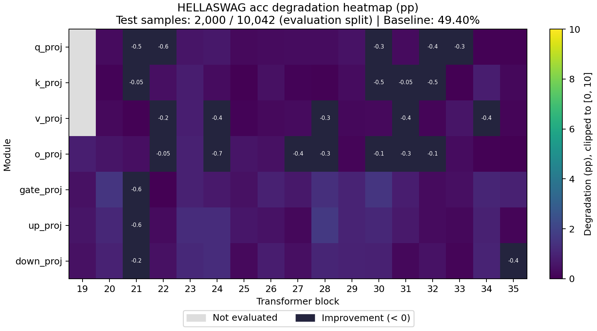
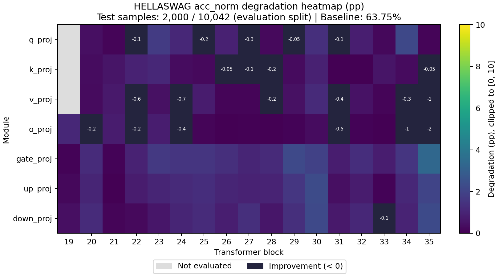

# Sensitivity Report

- Task: `hellaswag`
- Dataset: `hellaswag`
- Split: `lm-eval`
- Preprocessing: `lm-eval-0-shot`
- Evaluated examples: 2000
- Total evaluation examples: 10042
- Baseline evaluation seconds: 61.6001

## Baseline Metrics

| Metric | Value |
|---|---:|
| acc | 0.494 |
| acc_norm | 0.6375 |

## Cases

| Case | Targets | Model Compression Ratio | Tensor Size Ratio | Compression Seconds | Evaluation Seconds |
|---|---:|---:|---:|---:|---:|
| model.layers.19.self_attn.o_proj | 1 | 1.00176 | 1.00176 | 0.0917003 | 51.9215 |
| model.layers.19.mlp.gate_proj | 1 | 1.00588 | 1.00588 | 0.139159 | 54.2889 |
| model.layers.19.mlp.up_proj | 1 | 1.00588 | 1.00588 | 0.138968 | 53.9987 |
| model.layers.19.mlp.down_proj | 1 | 1.00588 | 1.00588 | 0.138634 | 52.7695 |
| model.layers.20.self_attn.q_proj | 1 | 1.00176 | 1.00176 | 0.0500376 | 51.9633 |
| model.layers.20.self_attn.k_proj | 1 | 1.00036 | 1.00036 | 0.0310695 | 52.0567 |
| model.layers.20.self_attn.v_proj | 1 | 1.00036 | 1.00036 | 0.0307016 | 51.7428 |
| model.layers.20.self_attn.o_proj | 1 | 1.00176 | 1.00176 | 0.0514367 | 51.9395 |
| model.layers.20.mlp.gate_proj | 1 | 1.00588 | 1.00588 | 0.138398 | 54.201 |
| model.layers.20.mlp.up_proj | 1 | 1.00588 | 1.00588 | 0.141483 | 54.3753 |
| model.layers.20.mlp.down_proj | 1 | 1.00588 | 1.00588 | 0.137037 | 52.7408 |
| model.layers.21.self_attn.q_proj | 1 | 1.00176 | 1.00176 | 0.0500071 | 51.8534 |
| model.layers.21.self_attn.k_proj | 1 | 1.00036 | 1.00036 | 0.0303804 | 51.9773 |
| model.layers.21.self_attn.v_proj | 1 | 1.00036 | 1.00036 | 0.0298438 | 51.5978 |
| model.layers.21.self_attn.o_proj | 1 | 1.00176 | 1.00176 | 0.050061 | 51.9109 |
| model.layers.21.mlp.gate_proj | 1 | 1.00588 | 1.00588 | 0.139542 | 53.9299 |
| model.layers.21.mlp.up_proj | 1 | 1.00588 | 1.00588 | 0.139932 | 54.2642 |
| model.layers.21.mlp.down_proj | 1 | 1.00588 | 1.00588 | 0.138312 | 52.8208 |
| model.layers.22.self_attn.q_proj | 1 | 1.00176 | 1.00176 | 0.0501621 | 52.0594 |
| model.layers.22.self_attn.k_proj | 1 | 1.00036 | 1.00036 | 0.0300239 | 52.0298 |
| model.layers.22.self_attn.v_proj | 1 | 1.00036 | 1.00036 | 0.0301004 | 51.6617 |
| model.layers.22.self_attn.o_proj | 1 | 1.00176 | 1.00176 | 0.0501697 | 51.9256 |
| model.layers.22.mlp.gate_proj | 1 | 1.00588 | 1.00588 | 0.138883 | 54.9004 |
| model.layers.22.mlp.up_proj | 1 | 1.00588 | 1.00588 | 0.138109 | 54.0913 |
| model.layers.22.mlp.down_proj | 1 | 1.00588 | 1.00588 | 0.139181 | 52.8076 |
| model.layers.23.self_attn.q_proj | 1 | 1.00176 | 1.00176 | 0.0537756 | 51.8184 |
| model.layers.23.self_attn.k_proj | 1 | 1.00036 | 1.00036 | 0.0302716 | 51.8322 |
| model.layers.23.self_attn.v_proj | 1 | 1.00036 | 1.00036 | 0.0300847 | 51.564 |
| model.layers.23.self_attn.o_proj | 1 | 1.00176 | 1.00176 | 0.050119 | 51.7821 |
| model.layers.23.mlp.gate_proj | 1 | 1.00588 | 1.00588 | 0.148178 | 54.305 |
| model.layers.23.mlp.up_proj | 1 | 1.00588 | 1.00588 | 0.13908 | 54.0545 |
| model.layers.23.mlp.down_proj | 1 | 1.00588 | 1.00588 | 0.139904 | 52.9068 |
| model.layers.24.self_attn.q_proj | 1 | 1.00176 | 1.00176 | 0.0495524 | 52.0467 |
| model.layers.24.self_attn.k_proj | 1 | 1.00036 | 1.00036 | 0.0302355 | 51.7745 |
| model.layers.24.self_attn.v_proj | 1 | 1.00036 | 1.00036 | 0.0299938 | 51.7102 |
| model.layers.24.self_attn.o_proj | 1 | 1.00176 | 1.00176 | 0.050179 | 52.1829 |
| model.layers.24.mlp.gate_proj | 1 | 1.00588 | 1.00588 | 0.139387 | 53.9929 |
| model.layers.24.mlp.up_proj | 1 | 1.00588 | 1.00588 | 0.138908 | 54.0493 |
| model.layers.24.mlp.down_proj | 1 | 1.00588 | 1.00588 | 0.138648 | 52.8144 |
| model.layers.25.self_attn.q_proj | 1 | 1.00176 | 1.00176 | 0.0501659 | 54.6996 |
| model.layers.25.self_attn.k_proj | 1 | 1.00036 | 1.00036 | 0.0306976 | 51.649 |
| model.layers.25.self_attn.v_proj | 1 | 1.00036 | 1.00036 | 0.0300414 | 51.6993 |
| model.layers.25.self_attn.o_proj | 1 | 1.00176 | 1.00176 | 0.0507771 | 51.8577 |
| model.layers.25.mlp.gate_proj | 1 | 1.00588 | 1.00588 | 0.139142 | 54.2706 |
| model.layers.25.mlp.up_proj | 1 | 1.00588 | 1.00588 | 0.13942 | 54.0726 |
| model.layers.25.mlp.down_proj | 1 | 1.00588 | 1.00588 | 0.137999 | 52.6544 |
| model.layers.26.self_attn.q_proj | 1 | 1.00176 | 1.00176 | 0.050051 | 52.1953 |
| model.layers.26.self_attn.k_proj | 1 | 1.00036 | 1.00036 | 0.030296 | 53.3169 |
| model.layers.26.self_attn.v_proj | 1 | 1.00036 | 1.00036 | 0.0302946 | 51.6794 |
| model.layers.26.self_attn.o_proj | 1 | 1.00176 | 1.00176 | 0.0499389 | 52.0443 |
| model.layers.26.mlp.gate_proj | 1 | 1.00588 | 1.00588 | 0.139257 | 53.9862 |
| model.layers.26.mlp.up_proj | 1 | 1.00588 | 1.00588 | 0.1435 | 54.0178 |
| model.layers.26.mlp.down_proj | 1 | 1.00588 | 1.00588 | 0.139375 | 52.7415 |
| model.layers.27.self_attn.q_proj | 1 | 1.00176 | 1.00176 | 0.050321 | 52.0085 |
| model.layers.27.self_attn.k_proj | 1 | 1.00036 | 1.00036 | 0.0300891 | 51.7033 |
| model.layers.27.self_attn.v_proj | 1 | 1.00036 | 1.00036 | 0.0307944 | 51.6228 |
| model.layers.27.self_attn.o_proj | 1 | 1.00176 | 1.00176 | 0.0502243 | 52.3004 |
| model.layers.27.mlp.gate_proj | 1 | 1.00588 | 1.00588 | 0.139846 | 54.1872 |
| model.layers.27.mlp.up_proj | 1 | 1.00588 | 1.00588 | 0.138984 | 54.1553 |
| model.layers.27.mlp.down_proj | 1 | 1.00588 | 1.00588 | 0.139449 | 52.9837 |
| model.layers.28.self_attn.q_proj | 1 | 1.00176 | 1.00176 | 0.0498372 | 51.8708 |
| model.layers.28.self_attn.k_proj | 1 | 1.00036 | 1.00036 | 0.0302787 | 51.7463 |
| model.layers.28.self_attn.v_proj | 1 | 1.00036 | 1.00036 | 0.0301774 | 51.7783 |
| model.layers.28.self_attn.o_proj | 1 | 1.00176 | 1.00176 | 0.0505812 | 52.1992 |
| model.layers.28.mlp.gate_proj | 1 | 1.00588 | 1.00588 | 0.144345 | 55.1381 |
| model.layers.28.mlp.up_proj | 1 | 1.00588 | 1.00588 | 0.165106 | 54.0373 |
| model.layers.28.mlp.down_proj | 1 | 1.00588 | 1.00588 | 0.140056 | 52.975 |
| model.layers.29.self_attn.q_proj | 1 | 1.00176 | 1.00176 | 0.0500971 | 51.9488 |
| model.layers.29.self_attn.k_proj | 1 | 1.00036 | 1.00036 | 0.0296662 | 51.843 |
| model.layers.29.self_attn.v_proj | 1 | 1.00036 | 1.00036 | 0.0298092 | 51.653 |
| model.layers.29.self_attn.o_proj | 1 | 1.00176 | 1.00176 | 0.0509743 | 52.2359 |
| model.layers.29.mlp.gate_proj | 1 | 1.00588 | 1.00588 | 0.139975 | 54.1085 |
| model.layers.29.mlp.up_proj | 1 | 1.00588 | 1.00588 | 0.139567 | 54.2415 |
| model.layers.29.mlp.down_proj | 1 | 1.00588 | 1.00588 | 0.136966 | 55.9092 |
| model.layers.30.self_attn.q_proj | 1 | 1.00176 | 1.00176 | 0.0609235 | 51.9934 |
| model.layers.30.self_attn.k_proj | 1 | 1.00036 | 1.00036 | 0.0327047 | 51.6768 |
| model.layers.30.self_attn.v_proj | 1 | 1.00036 | 1.00036 | 0.030498 | 51.8774 |
| model.layers.30.self_attn.o_proj | 1 | 1.00176 | 1.00176 | 0.0505276 | 51.7817 |
| model.layers.30.mlp.gate_proj | 1 | 1.00588 | 1.00588 | 0.150831 | 54.0752 |
| model.layers.30.mlp.up_proj | 1 | 1.00588 | 1.00588 | 0.139335 | 54.4104 |
| model.layers.30.mlp.down_proj | 1 | 1.00588 | 1.00588 | 0.138287 | 52.6945 |
| model.layers.31.self_attn.q_proj | 1 | 1.00176 | 1.00176 | 0.0510334 | 53.3604 |
| model.layers.31.self_attn.k_proj | 1 | 1.00036 | 1.00036 | 0.0298534 | 51.5246 |
| model.layers.31.self_attn.v_proj | 1 | 1.00036 | 1.00036 | 0.0312735 | 51.9399 |
| model.layers.31.self_attn.o_proj | 1 | 1.00176 | 1.00176 | 0.0505144 | 51.9251 |
| model.layers.31.mlp.gate_proj | 1 | 1.00588 | 1.00588 | 0.139667 | 54.4499 |
| model.layers.31.mlp.up_proj | 1 | 1.00588 | 1.00588 | 0.139249 | 54.105 |
| model.layers.31.mlp.down_proj | 1 | 1.00588 | 1.00588 | 0.149622 | 52.8634 |
| model.layers.32.self_attn.q_proj | 1 | 1.00176 | 1.00176 | 0.049497 | 51.9769 |
| model.layers.32.self_attn.k_proj | 1 | 1.00036 | 1.00036 | 0.0302155 | 52.0272 |
| model.layers.32.self_attn.v_proj | 1 | 1.00036 | 1.00036 | 0.0303675 | 51.8879 |
| model.layers.32.self_attn.o_proj | 1 | 1.00176 | 1.00176 | 0.050563 | 51.7834 |
| model.layers.32.mlp.gate_proj | 1 | 1.00588 | 1.00588 | 0.136932 | 54.2791 |
| model.layers.32.mlp.up_proj | 1 | 1.00588 | 1.00588 | 0.136693 | 53.9978 |
| model.layers.32.mlp.down_proj | 1 | 1.00588 | 1.00588 | 0.139044 | 52.7207 |
| model.layers.33.self_attn.q_proj | 1 | 1.00176 | 1.00176 | 0.0499079 | 52.0143 |
| model.layers.33.self_attn.k_proj | 1 | 1.00036 | 1.00036 | 0.031007 | 51.7546 |
| model.layers.33.self_attn.v_proj | 1 | 1.00036 | 1.00036 | 0.0296181 | 51.7031 |
| model.layers.33.self_attn.o_proj | 1 | 1.00176 | 1.00176 | 0.0505391 | 54.8428 |
| model.layers.33.mlp.gate_proj | 1 | 1.00588 | 1.00588 | 0.138814 | 54.0444 |
| model.layers.33.mlp.up_proj | 1 | 1.00588 | 1.00588 | 0.139779 | 54.2001 |
| model.layers.33.mlp.down_proj | 1 | 1.00588 | 1.00588 | 0.141002 | 52.699 |
| model.layers.34.self_attn.q_proj | 1 | 1.00176 | 1.00176 | 0.0502326 | 52.0181 |
| model.layers.34.self_attn.k_proj | 1 | 1.00036 | 1.00036 | 0.0300002 | 51.5988 |
| model.layers.34.self_attn.v_proj | 1 | 1.00036 | 1.00036 | 0.0302573 | 51.5771 |
| model.layers.34.self_attn.o_proj | 1 | 1.00176 | 1.00176 | 0.0505964 | 52.0489 |
| model.layers.34.mlp.gate_proj | 1 | 1.00588 | 1.00588 | 0.139717 | 54.4103 |
| model.layers.34.mlp.up_proj | 1 | 1.00588 | 1.00588 | 0.13987 | 56.7668 |
| model.layers.34.mlp.down_proj | 1 | 1.00588 | 1.00588 | 0.162205 | 53.0896 |
| model.layers.35.self_attn.q_proj | 1 | 1.00176 | 1.00176 | 0.0507759 | 51.9356 |
| model.layers.35.self_attn.k_proj | 1 | 1.00036 | 1.00036 | 0.0303463 | 51.7641 |
| model.layers.35.self_attn.v_proj | 1 | 1.00036 | 1.00036 | 0.0299648 | 51.8953 |
| model.layers.35.self_attn.o_proj | 1 | 1.00176 | 1.00176 | 0.0499182 | 52.0214 |
| model.layers.35.mlp.gate_proj | 1 | 1.00588 | 1.00588 | 0.140081 | 54.2061 |
| model.layers.35.mlp.up_proj | 1 | 1.00588 | 1.00588 | 0.137002 | 54.404 |
| model.layers.35.mlp.down_proj | 1 | 1.00588 | 1.00588 | 0.138215 | 52.8165 |

## Metrics

| Case | Metric | Value | Degradation |
|---|---|---:|---:|
| model.layers.19.self_attn.o_proj | acc | 0.4855 | 0.0085 |
| model.layers.19.self_attn.o_proj | acc_norm | 0.6265 | 0.011 |
| model.layers.19.mlp.gate_proj | acc | 0.4895 | 0.0045 |
| model.layers.19.mlp.gate_proj | acc_norm | 0.6365 | 0.001 |
| model.layers.19.mlp.up_proj | acc | 0.4885 | 0.0055 |
| model.layers.19.mlp.up_proj | acc_norm | 0.6355 | 0.002 |
| model.layers.19.mlp.down_proj | acc | 0.4895 | 0.0045 |
| model.layers.19.mlp.down_proj | acc_norm | 0.6335 | 0.004 |
| model.layers.20.self_attn.q_proj | acc | 0.491 | 0.003 |
| model.layers.20.self_attn.q_proj | acc_norm | 0.6335 | 0.004 |
| model.layers.20.self_attn.k_proj | acc | 0.493 | 0.001 |
| model.layers.20.self_attn.k_proj | acc_norm | 0.634 | 0.0035 |
| model.layers.20.self_attn.v_proj | acc | 0.4915 | 0.0025 |
| model.layers.20.self_attn.v_proj | acc_norm | 0.6345 | 0.003 |
| model.layers.20.self_attn.o_proj | acc | 0.4885 | 0.0055 |
| model.layers.20.self_attn.o_proj | acc_norm | 0.639 | -0.0015 |
| model.layers.20.mlp.gate_proj | acc | 0.4785 | 0.0155 |
| model.layers.20.mlp.gate_proj | acc_norm | 0.625 | 0.0125 |
| model.layers.20.mlp.up_proj | acc | 0.483 | 0.011 |
| model.layers.20.mlp.up_proj | acc_norm | 0.627 | 0.0105 |
| model.layers.20.mlp.down_proj | acc | 0.4845 | 0.0095 |
| model.layers.20.mlp.down_proj | acc_norm | 0.625 | 0.0125 |
| model.layers.21.self_attn.q_proj | acc | 0.499 | -0.005 |
| model.layers.21.self_attn.q_proj | acc_norm | 0.636 | 0.0015 |
| model.layers.21.self_attn.k_proj | acc | 0.4945 | -0.0005 |
| model.layers.21.self_attn.k_proj | acc_norm | 0.632 | 0.0055 |
| model.layers.21.self_attn.v_proj | acc | 0.4935 | 0.0005 |
| model.layers.21.self_attn.v_proj | acc_norm | 0.6305 | 0.007 |
| model.layers.21.self_attn.o_proj | acc | 0.49 | 0.004 |
| model.layers.21.self_attn.o_proj | acc_norm | 0.63 | 0.0075 |
| model.layers.21.mlp.gate_proj | acc | 0.5 | -0.006 |
| model.layers.21.mlp.gate_proj | acc_norm | 0.6365 | 0.001 |
| model.layers.21.mlp.up_proj | acc | 0.5 | -0.006 |
| model.layers.21.mlp.up_proj | acc_norm | 0.6375 | 0 |
| model.layers.21.mlp.down_proj | acc | 0.4955 | -0.0015 |
| model.layers.21.mlp.down_proj | acc_norm | 0.636 | 0.0015 |
| model.layers.22.self_attn.q_proj | acc | 0.5 | -0.006 |
| model.layers.22.self_attn.q_proj | acc_norm | 0.6385 | -0.001 |
| model.layers.22.self_attn.k_proj | acc | 0.49 | 0.004 |
| model.layers.22.self_attn.k_proj | acc_norm | 0.628 | 0.0095 |
| model.layers.22.self_attn.v_proj | acc | 0.4955 | -0.0015 |
| model.layers.22.self_attn.v_proj | acc_norm | 0.6435 | -0.006 |
| model.layers.22.self_attn.o_proj | acc | 0.4945 | -0.0005 |
| model.layers.22.self_attn.o_proj | acc_norm | 0.6395 | -0.002 |
| model.layers.22.mlp.gate_proj | acc | 0.494 | 0 |
| model.layers.22.mlp.gate_proj | acc_norm | 0.628 | 0.0095 |
| model.layers.22.mlp.up_proj | acc | 0.491 | 0.003 |
| model.layers.22.mlp.up_proj | acc_norm | 0.63 | 0.0075 |
| model.layers.22.mlp.down_proj | acc | 0.4895 | 0.0045 |
| model.layers.22.mlp.down_proj | acc_norm | 0.635 | 0.0025 |
| model.layers.23.self_attn.q_proj | acc | 0.4885 | 0.0055 |
| model.layers.23.self_attn.q_proj | acc_norm | 0.62 | 0.0175 |
| model.layers.23.self_attn.k_proj | acc | 0.486 | 0.008 |
| model.layers.23.self_attn.k_proj | acc_norm | 0.6265 | 0.011 |
| model.layers.23.self_attn.v_proj | acc | 0.4855 | 0.0085 |
| model.layers.23.self_attn.v_proj | acc_norm | 0.633 | 0.0045 |
| model.layers.23.self_attn.o_proj | acc | 0.485 | 0.009 |
| model.layers.23.self_attn.o_proj | acc_norm | 0.6295 | 0.008 |
| model.layers.23.mlp.gate_proj | acc | 0.485 | 0.009 |
| model.layers.23.mlp.gate_proj | acc_norm | 0.621 | 0.0165 |
| model.layers.23.mlp.up_proj | acc | 0.4815 | 0.0125 |
| model.layers.23.mlp.up_proj | acc_norm | 0.627 | 0.0105 |
| model.layers.23.mlp.down_proj | acc | 0.4825 | 0.0115 |
| model.layers.23.mlp.down_proj | acc_norm | 0.6315 | 0.006 |
| model.layers.24.self_attn.q_proj | acc | 0.4875 | 0.0065 |
| model.layers.24.self_attn.q_proj | acc_norm | 0.6265 | 0.011 |
| model.layers.24.self_attn.k_proj | acc | 0.4905 | 0.0035 |
| model.layers.24.self_attn.k_proj | acc_norm | 0.634 | 0.0035 |
| model.layers.24.self_attn.v_proj | acc | 0.4975 | -0.0035 |
| model.layers.24.self_attn.v_proj | acc_norm | 0.644 | -0.0065 |
| model.layers.24.self_attn.o_proj | acc | 0.5015 | -0.0075 |
| model.layers.24.self_attn.o_proj | acc_norm | 0.6415 | -0.004 |
| model.layers.24.mlp.gate_proj | acc | 0.487 | 0.007 |
| model.layers.24.mlp.gate_proj | acc_norm | 0.622 | 0.0155 |
| model.layers.24.mlp.up_proj | acc | 0.4815 | 0.0125 |
| model.layers.24.mlp.up_proj | acc_norm | 0.6255 | 0.012 |
| model.layers.24.mlp.down_proj | acc | 0.4815 | 0.0125 |
| model.layers.24.mlp.down_proj | acc_norm | 0.627 | 0.0105 |
| model.layers.25.self_attn.q_proj | acc | 0.4915 | 0.0025 |
| model.layers.25.self_attn.q_proj | acc_norm | 0.6395 | -0.002 |
| model.layers.25.self_attn.k_proj | acc | 0.494 | 0 |
| model.layers.25.self_attn.k_proj | acc_norm | 0.635 | 0.0025 |
| model.layers.25.self_attn.v_proj | acc | 0.493 | 0.001 |
| model.layers.25.self_attn.v_proj | acc_norm | 0.63 | 0.0075 |
| model.layers.25.self_attn.o_proj | acc | 0.4885 | 0.0055 |
| model.layers.25.self_attn.o_proj | acc_norm | 0.636 | 0.0015 |
| model.layers.25.mlp.gate_proj | acc | 0.4895 | 0.0045 |
| model.layers.25.mlp.gate_proj | acc_norm | 0.622 | 0.0155 |
| model.layers.25.mlp.up_proj | acc | 0.488 | 0.006 |
| model.layers.25.mlp.up_proj | acc_norm | 0.6245 | 0.013 |
| model.layers.25.mlp.down_proj | acc | 0.4915 | 0.0025 |
| model.layers.25.mlp.down_proj | acc_norm | 0.625 | 0.0125 |
| model.layers.26.self_attn.q_proj | acc | 0.491 | 0.003 |
| model.layers.26.self_attn.q_proj | acc_norm | 0.6285 | 0.009 |
| model.layers.26.self_attn.k_proj | acc | 0.4895 | 0.0045 |
| model.layers.26.self_attn.k_proj | acc_norm | 0.638 | -0.0005 |
| model.layers.26.self_attn.v_proj | acc | 0.4915 | 0.0025 |
| model.layers.26.self_attn.v_proj | acc_norm | 0.636 | 0.0015 |
| model.layers.26.self_attn.o_proj | acc | 0.4895 | 0.0045 |
| model.layers.26.self_attn.o_proj | acc_norm | 0.6375 | 0 |
| model.layers.26.mlp.gate_proj | acc | 0.485 | 0.009 |
| model.layers.26.mlp.gate_proj | acc_norm | 0.624 | 0.0135 |
| model.layers.26.mlp.up_proj | acc | 0.489 | 0.005 |
| model.layers.26.mlp.up_proj | acc_norm | 0.627 | 0.0105 |
| model.layers.26.mlp.down_proj | acc | 0.486 | 0.008 |
| model.layers.26.mlp.down_proj | acc_norm | 0.629 | 0.0085 |
| model.layers.27.self_attn.q_proj | acc | 0.4905 | 0.0035 |
| model.layers.27.self_attn.q_proj | acc_norm | 0.64 | -0.0025 |
| model.layers.27.self_attn.k_proj | acc | 0.493 | 0.001 |
| model.layers.27.self_attn.k_proj | acc_norm | 0.6385 | -0.001 |
| model.layers.27.self_attn.v_proj | acc | 0.491 | 0.003 |
| model.layers.27.self_attn.v_proj | acc_norm | 0.636 | 0.0015 |
| model.layers.27.self_attn.o_proj | acc | 0.498 | -0.004 |
| model.layers.27.self_attn.o_proj | acc_norm | 0.637 | 0.0005 |
| model.layers.27.mlp.gate_proj | acc | 0.4875 | 0.0065 |
| model.layers.27.mlp.gate_proj | acc_norm | 0.627 | 0.0105 |
| model.layers.27.mlp.up_proj | acc | 0.492 | 0.002 |
| model.layers.27.mlp.up_proj | acc_norm | 0.628 | 0.0095 |
| model.layers.27.mlp.down_proj | acc | 0.49 | 0.004 |
| model.layers.27.mlp.down_proj | acc_norm | 0.624 | 0.0135 |
| model.layers.28.self_attn.q_proj | acc | 0.4905 | 0.0035 |
| model.layers.28.self_attn.q_proj | acc_norm | 0.635 | 0.0025 |
| model.layers.28.self_attn.k_proj | acc | 0.4935 | 0.0005 |
| model.layers.28.self_attn.k_proj | acc_norm | 0.639 | -0.0015 |
| model.layers.28.self_attn.v_proj | acc | 0.4965 | -0.0025 |
| model.layers.28.self_attn.v_proj | acc_norm | 0.6395 | -0.002 |
| model.layers.28.self_attn.o_proj | acc | 0.497 | -0.003 |
| model.layers.28.self_attn.o_proj | acc_norm | 0.6375 | 0 |
| model.layers.28.mlp.gate_proj | acc | 0.4805 | 0.0135 |
| model.layers.28.mlp.gate_proj | acc_norm | 0.6255 | 0.012 |
| model.layers.28.mlp.up_proj | acc | 0.4775 | 0.0165 |
| model.layers.28.mlp.up_proj | acc_norm | 0.6275 | 0.01 |
| model.layers.28.mlp.down_proj | acc | 0.4835 | 0.0105 |
| model.layers.28.mlp.down_proj | acc_norm | 0.6315 | 0.006 |
| model.layers.29.self_attn.q_proj | acc | 0.489 | 0.005 |
| model.layers.29.self_attn.q_proj | acc_norm | 0.638 | -0.0005 |
| model.layers.29.self_attn.k_proj | acc | 0.4905 | 0.0035 |
| model.layers.29.self_attn.k_proj | acc_norm | 0.6345 | 0.003 |
| model.layers.29.self_attn.v_proj | acc | 0.492 | 0.002 |
| model.layers.29.self_attn.v_proj | acc_norm | 0.633 | 0.0045 |
| model.layers.29.self_attn.o_proj | acc | 0.4925 | 0.0015 |
| model.layers.29.self_attn.o_proj | acc_norm | 0.6365 | 0.001 |
| model.layers.29.mlp.gate_proj | acc | 0.484 | 0.01 |
| model.layers.29.mlp.gate_proj | acc_norm | 0.6155 | 0.022 |
| model.layers.29.mlp.up_proj | acc | 0.484 | 0.01 |
| model.layers.29.mlp.up_proj | acc_norm | 0.6215 | 0.016 |
| model.layers.29.mlp.down_proj | acc | 0.4845 | 0.0095 |
| model.layers.29.mlp.down_proj | acc_norm | 0.624 | 0.0135 |
| model.layers.30.self_attn.q_proj | acc | 0.4965 | -0.0025 |
| model.layers.30.self_attn.q_proj | acc_norm | 0.624 | 0.0135 |
| model.layers.30.self_attn.k_proj | acc | 0.499 | -0.005 |
| model.layers.30.self_attn.k_proj | acc_norm | 0.6285 | 0.009 |
| model.layers.30.self_attn.v_proj | acc | 0.4915 | 0.0025 |
| model.layers.30.self_attn.v_proj | acc_norm | 0.6255 | 0.012 |
| model.layers.30.self_attn.o_proj | acc | 0.495 | -0.001 |
| model.layers.30.self_attn.o_proj | acc_norm | 0.634 | 0.0035 |
| model.layers.30.mlp.gate_proj | acc | 0.4785 | 0.0155 |
| model.layers.30.mlp.gate_proj | acc_norm | 0.618 | 0.0195 |
| model.layers.30.mlp.up_proj | acc | 0.483 | 0.011 |
| model.layers.30.mlp.up_proj | acc_norm | 0.6145 | 0.023 |
| model.layers.30.mlp.down_proj | acc | 0.485 | 0.009 |
| model.layers.30.mlp.down_proj | acc_norm | 0.6155 | 0.022 |
| model.layers.31.self_attn.q_proj | acc | 0.491 | 0.003 |
| model.layers.31.self_attn.q_proj | acc_norm | 0.6385 | -0.001 |
| model.layers.31.self_attn.k_proj | acc | 0.4945 | -0.0005 |
| model.layers.31.self_attn.k_proj | acc_norm | 0.6375 | 0 |
| model.layers.31.self_attn.v_proj | acc | 0.4975 | -0.0035 |
| model.layers.31.self_attn.v_proj | acc_norm | 0.6415 | -0.004 |
| model.layers.31.self_attn.o_proj | acc | 0.4965 | -0.0025 |
| model.layers.31.self_attn.o_proj | acc_norm | 0.642 | -0.0045 |
| model.layers.31.mlp.gate_proj | acc | 0.486 | 0.008 |
| model.layers.31.mlp.gate_proj | acc_norm | 0.6295 | 0.008 |
| model.layers.31.mlp.up_proj | acc | 0.487 | 0.007 |
| model.layers.31.mlp.up_proj | acc_norm | 0.6335 | 0.004 |
| model.layers.31.mlp.down_proj | acc | 0.492 | 0.002 |
| model.layers.31.mlp.down_proj | acc_norm | 0.6305 | 0.007 |
| model.layers.32.self_attn.q_proj | acc | 0.4975 | -0.0035 |
| model.layers.32.self_attn.q_proj | acc_norm | 0.629 | 0.0085 |
| model.layers.32.self_attn.k_proj | acc | 0.4985 | -0.0045 |
| model.layers.32.self_attn.k_proj | acc_norm | 0.6375 | 0 |
| model.layers.32.self_attn.v_proj | acc | 0.4925 | 0.0015 |
| model.layers.32.self_attn.v_proj | acc_norm | 0.6325 | 0.005 |
| model.layers.32.self_attn.o_proj | acc | 0.495 | -0.001 |
| model.layers.32.self_attn.o_proj | acc_norm | 0.6365 | 0.001 |
| model.layers.32.mlp.gate_proj | acc | 0.491 | 0.003 |
| model.layers.32.mlp.gate_proj | acc_norm | 0.6245 | 0.013 |
| model.layers.32.mlp.up_proj | acc | 0.491 | 0.003 |
| model.layers.32.mlp.up_proj | acc_norm | 0.63 | 0.0075 |
| model.layers.32.mlp.down_proj | acc | 0.489 | 0.005 |
| model.layers.32.mlp.down_proj | acc_norm | 0.6265 | 0.011 |
| model.layers.33.self_attn.q_proj | acc | 0.497 | -0.003 |
| model.layers.33.self_attn.q_proj | acc_norm | 0.6355 | 0.002 |
| model.layers.33.self_attn.k_proj | acc | 0.494 | 0 |
| model.layers.33.self_attn.k_proj | acc_norm | 0.632 | 0.0055 |
| model.layers.33.self_attn.v_proj | acc | 0.4885 | 0.0055 |
| model.layers.33.self_attn.v_proj | acc_norm | 0.636 | 0.0015 |
| model.layers.33.self_attn.o_proj | acc | 0.4905 | 0.0035 |
| model.layers.33.self_attn.o_proj | acc_norm | 0.6375 | 0 |
| model.layers.33.mlp.gate_proj | acc | 0.49 | 0.004 |
| model.layers.33.mlp.gate_proj | acc_norm | 0.6295 | 0.008 |
| model.layers.33.mlp.up_proj | acc | 0.492 | 0.002 |
| model.layers.33.mlp.up_proj | acc_norm | 0.6365 | 0.001 |
| model.layers.33.mlp.down_proj | acc | 0.4925 | 0.0015 |
| model.layers.33.mlp.down_proj | acc_norm | 0.6385 | -0.001 |
| model.layers.34.self_attn.q_proj | acc | 0.4935 | 0.0005 |
| model.layers.34.self_attn.q_proj | acc_norm | 0.616 | 0.0215 |
| model.layers.34.self_attn.k_proj | acc | 0.486 | 0.008 |
| model.layers.34.self_attn.k_proj | acc_norm | 0.6345 | 0.003 |
| model.layers.34.self_attn.v_proj | acc | 0.4975 | -0.0035 |
| model.layers.34.self_attn.v_proj | acc_norm | 0.6405 | -0.003 |
| model.layers.34.self_attn.o_proj | acc | 0.4935 | 0.0005 |
| model.layers.34.self_attn.o_proj | acc_norm | 0.649 | -0.0115 |
| model.layers.34.mlp.gate_proj | acc | 0.4835 | 0.0105 |
| model.layers.34.mlp.gate_proj | acc_norm | 0.622 | 0.0155 |
| model.layers.34.mlp.up_proj | acc | 0.485 | 0.009 |
| model.layers.34.mlp.up_proj | acc_norm | 0.6265 | 0.011 |
| model.layers.34.mlp.down_proj | acc | 0.484 | 0.01 |
| model.layers.34.mlp.down_proj | acc_norm | 0.6275 | 0.01 |
| model.layers.35.self_attn.q_proj | acc | 0.4935 | 0.0005 |
| model.layers.35.self_attn.q_proj | acc_norm | 0.636 | 0.0015 |
| model.layers.35.self_attn.k_proj | acc | 0.492 | 0.002 |
| model.layers.35.self_attn.k_proj | acc_norm | 0.638 | -0.0005 |
| model.layers.35.self_attn.v_proj | acc | 0.4925 | 0.0015 |
| model.layers.35.self_attn.v_proj | acc_norm | 0.649 | -0.0115 |
| model.layers.35.self_attn.o_proj | acc | 0.494 | 0 |
| model.layers.35.self_attn.o_proj | acc_norm | 0.653 | -0.0155 |
| model.layers.35.mlp.gate_proj | acc | 0.485 | 0.009 |
| model.layers.35.mlp.gate_proj | acc_norm | 0.604 | 0.0335 |
| model.layers.35.mlp.up_proj | acc | 0.4925 | 0.0015 |
| model.layers.35.mlp.up_proj | acc_norm | 0.617 | 0.0205 |
| model.layers.35.mlp.down_proj | acc | 0.4975 | -0.0035 |
| model.layers.35.mlp.down_proj | acc_norm | 0.615 | 0.0225 |

## Layers

| Case | Module | Representation | Compression Ratio | Tensor Size Ratio | Relative Error |
|---|---|---|---:|---:|---:|
| model.layers.19.self_attn.o_proj | model.layers.19.self_attn.o_proj | mpo | 6.96599 | 6.96599 | 0.886719 |
| model.layers.19.mlp.gate_proj | model.layers.19.mlp.gate_proj | mpo | 20.48 | 20.48 | 0.96875 |
| model.layers.19.mlp.up_proj | model.layers.19.mlp.up_proj | mpo | 20.48 | 20.48 | 0.96875 |
| model.layers.19.mlp.down_proj | model.layers.19.mlp.down_proj | mpo | 20.48 | 20.48 | 0.960938 |
| model.layers.20.self_attn.q_proj | model.layers.20.self_attn.q_proj | mpo | 6.96599 | 6.96599 | 0.882812 |
| model.layers.20.self_attn.k_proj | model.layers.20.self_attn.k_proj | mpo | 3.44781 | 3.44781 | 0.800781 |
| model.layers.20.self_attn.v_proj | model.layers.20.self_attn.v_proj | mpo | 3.44781 | 3.44781 | 0.8125 |
| model.layers.20.self_attn.o_proj | model.layers.20.self_attn.o_proj | mpo | 6.96599 | 6.96599 | 0.890625 |
| model.layers.20.mlp.gate_proj | model.layers.20.mlp.gate_proj | mpo | 20.48 | 20.48 | 0.96875 |
| model.layers.20.mlp.up_proj | model.layers.20.mlp.up_proj | mpo | 20.48 | 20.48 | 0.96875 |
| model.layers.20.mlp.down_proj | model.layers.20.mlp.down_proj | mpo | 20.48 | 20.48 | 0.96875 |
| model.layers.21.self_attn.q_proj | model.layers.21.self_attn.q_proj | mpo | 6.96599 | 6.96599 | 0.886719 |
| model.layers.21.self_attn.k_proj | model.layers.21.self_attn.k_proj | mpo | 3.44781 | 3.44781 | 0.8125 |
| model.layers.21.self_attn.v_proj | model.layers.21.self_attn.v_proj | mpo | 3.44781 | 3.44781 | 0.800781 |
| model.layers.21.self_attn.o_proj | model.layers.21.self_attn.o_proj | mpo | 6.96599 | 6.96599 | 0.894531 |
| model.layers.21.mlp.gate_proj | model.layers.21.mlp.gate_proj | mpo | 20.48 | 20.48 | 0.96875 |
| model.layers.21.mlp.up_proj | model.layers.21.mlp.up_proj | mpo | 20.48 | 20.48 | 0.964844 |
| model.layers.21.mlp.down_proj | model.layers.21.mlp.down_proj | mpo | 20.48 | 20.48 | 0.96875 |
| model.layers.22.self_attn.q_proj | model.layers.22.self_attn.q_proj | mpo | 6.96599 | 6.96599 | 0.886719 |
| model.layers.22.self_attn.k_proj | model.layers.22.self_attn.k_proj | mpo | 3.44781 | 3.44781 | 0.792969 |
| model.layers.22.self_attn.v_proj | model.layers.22.self_attn.v_proj | mpo | 3.44781 | 3.44781 | 0.804688 |
| model.layers.22.self_attn.o_proj | model.layers.22.self_attn.o_proj | mpo | 6.96599 | 6.96599 | 0.890625 |
| model.layers.22.mlp.gate_proj | model.layers.22.mlp.gate_proj | mpo | 20.48 | 20.48 | 0.96875 |
| model.layers.22.mlp.up_proj | model.layers.22.mlp.up_proj | mpo | 20.48 | 20.48 | 0.96875 |
| model.layers.22.mlp.down_proj | model.layers.22.mlp.down_proj | mpo | 20.48 | 20.48 | 0.96875 |
| model.layers.23.self_attn.q_proj | model.layers.23.self_attn.q_proj | mpo | 6.96599 | 6.96599 | 0.878906 |
| model.layers.23.self_attn.k_proj | model.layers.23.self_attn.k_proj | mpo | 3.44781 | 3.44781 | 0.804688 |
| model.layers.23.self_attn.v_proj | model.layers.23.self_attn.v_proj | mpo | 3.44781 | 3.44781 | 0.800781 |
| model.layers.23.self_attn.o_proj | model.layers.23.self_attn.o_proj | mpo | 6.96599 | 6.96599 | 0.894531 |
| model.layers.23.mlp.gate_proj | model.layers.23.mlp.gate_proj | mpo | 20.48 | 20.48 | 0.964844 |
| model.layers.23.mlp.up_proj | model.layers.23.mlp.up_proj | mpo | 20.48 | 20.48 | 0.96875 |
| model.layers.23.mlp.down_proj | model.layers.23.mlp.down_proj | mpo | 20.48 | 20.48 | 0.96875 |
| model.layers.24.self_attn.q_proj | model.layers.24.self_attn.q_proj | mpo | 6.96599 | 6.96599 | 0.886719 |
| model.layers.24.self_attn.k_proj | model.layers.24.self_attn.k_proj | mpo | 3.44781 | 3.44781 | 0.808594 |
| model.layers.24.self_attn.v_proj | model.layers.24.self_attn.v_proj | mpo | 3.44781 | 3.44781 | 0.800781 |
| model.layers.24.self_attn.o_proj | model.layers.24.self_attn.o_proj | mpo | 6.96599 | 6.96599 | 0.894531 |
| model.layers.24.mlp.gate_proj | model.layers.24.mlp.gate_proj | mpo | 20.48 | 20.48 | 0.96875 |
| model.layers.24.mlp.up_proj | model.layers.24.mlp.up_proj | mpo | 20.48 | 20.48 | 0.96875 |
| model.layers.24.mlp.down_proj | model.layers.24.mlp.down_proj | mpo | 20.48 | 20.48 | 0.964844 |
| model.layers.25.self_attn.q_proj | model.layers.25.self_attn.q_proj | mpo | 6.96599 | 6.96599 | 0.894531 |
| model.layers.25.self_attn.k_proj | model.layers.25.self_attn.k_proj | mpo | 3.44781 | 3.44781 | 0.800781 |
| model.layers.25.self_attn.v_proj | model.layers.25.self_attn.v_proj | mpo | 3.44781 | 3.44781 | 0.804688 |
| model.layers.25.self_attn.o_proj | model.layers.25.self_attn.o_proj | mpo | 6.96599 | 6.96599 | 0.902344 |
| model.layers.25.mlp.gate_proj | model.layers.25.mlp.gate_proj | mpo | 20.48 | 20.48 | 0.96875 |
| model.layers.25.mlp.up_proj | model.layers.25.mlp.up_proj | mpo | 20.48 | 20.48 | 0.96875 |
| model.layers.25.mlp.down_proj | model.layers.25.mlp.down_proj | mpo | 20.48 | 20.48 | 0.96875 |
| model.layers.26.self_attn.q_proj | model.layers.26.self_attn.q_proj | mpo | 6.96599 | 6.96599 | 0.890625 |
| model.layers.26.self_attn.k_proj | model.layers.26.self_attn.k_proj | mpo | 3.44781 | 3.44781 | 0.808594 |
| model.layers.26.self_attn.v_proj | model.layers.26.self_attn.v_proj | mpo | 3.44781 | 3.44781 | 0.808594 |
| model.layers.26.self_attn.o_proj | model.layers.26.self_attn.o_proj | mpo | 6.96599 | 6.96599 | 0.894531 |
| model.layers.26.mlp.gate_proj | model.layers.26.mlp.gate_proj | mpo | 20.48 | 20.48 | 0.964844 |
| model.layers.26.mlp.up_proj | model.layers.26.mlp.up_proj | mpo | 20.48 | 20.48 | 0.964844 |
| model.layers.26.mlp.down_proj | model.layers.26.mlp.down_proj | mpo | 20.48 | 20.48 | 0.96875 |
| model.layers.27.self_attn.q_proj | model.layers.27.self_attn.q_proj | mpo | 6.96599 | 6.96599 | 0.902344 |
| model.layers.27.self_attn.k_proj | model.layers.27.self_attn.k_proj | mpo | 3.44781 | 3.44781 | 0.800781 |
| model.layers.27.self_attn.v_proj | model.layers.27.self_attn.v_proj | mpo | 3.44781 | 3.44781 | 0.804688 |
| model.layers.27.self_attn.o_proj | model.layers.27.self_attn.o_proj | mpo | 6.96599 | 6.96599 | 0.902344 |
| model.layers.27.mlp.gate_proj | model.layers.27.mlp.gate_proj | mpo | 20.48 | 20.48 | 0.964844 |
| model.layers.27.mlp.up_proj | model.layers.27.mlp.up_proj | mpo | 20.48 | 20.48 | 0.964844 |
| model.layers.27.mlp.down_proj | model.layers.27.mlp.down_proj | mpo | 20.48 | 20.48 | 0.96875 |
| model.layers.28.self_attn.q_proj | model.layers.28.self_attn.q_proj | mpo | 6.96599 | 6.96599 | 0.898438 |
| model.layers.28.self_attn.k_proj | model.layers.28.self_attn.k_proj | mpo | 3.44781 | 3.44781 | 0.792969 |
| model.layers.28.self_attn.v_proj | model.layers.28.self_attn.v_proj | mpo | 3.44781 | 3.44781 | 0.804688 |
| model.layers.28.self_attn.o_proj | model.layers.28.self_attn.o_proj | mpo | 6.96599 | 6.96599 | 0.898438 |
| model.layers.28.mlp.gate_proj | model.layers.28.mlp.gate_proj | mpo | 20.48 | 20.48 | 0.964844 |
| model.layers.28.mlp.up_proj | model.layers.28.mlp.up_proj | mpo | 20.48 | 20.48 | 0.96875 |
| model.layers.28.mlp.down_proj | model.layers.28.mlp.down_proj | mpo | 20.48 | 20.48 | 0.964844 |
| model.layers.29.self_attn.q_proj | model.layers.29.self_attn.q_proj | mpo | 6.96599 | 6.96599 | 0.882812 |
| model.layers.29.self_attn.k_proj | model.layers.29.self_attn.k_proj | mpo | 3.44781 | 3.44781 | 0.796875 |
| model.layers.29.self_attn.v_proj | model.layers.29.self_attn.v_proj | mpo | 3.44781 | 3.44781 | 0.792969 |
| model.layers.29.self_attn.o_proj | model.layers.29.self_attn.o_proj | mpo | 6.96599 | 6.96599 | 0.898438 |
| model.layers.29.mlp.gate_proj | model.layers.29.mlp.gate_proj | mpo | 20.48 | 20.48 | 0.964844 |
| model.layers.29.mlp.up_proj | model.layers.29.mlp.up_proj | mpo | 20.48 | 20.48 | 0.972656 |
| model.layers.29.mlp.down_proj | model.layers.29.mlp.down_proj | mpo | 20.48 | 20.48 | 0.964844 |
| model.layers.30.self_attn.q_proj | model.layers.30.self_attn.q_proj | mpo | 6.96599 | 6.96599 | 0.898438 |
| model.layers.30.self_attn.k_proj | model.layers.30.self_attn.k_proj | mpo | 3.44781 | 3.44781 | 0.792969 |
| model.layers.30.self_attn.v_proj | model.layers.30.self_attn.v_proj | mpo | 3.44781 | 3.44781 | 0.800781 |
| model.layers.30.self_attn.o_proj | model.layers.30.self_attn.o_proj | mpo | 6.96599 | 6.96599 | 0.902344 |
| model.layers.30.mlp.gate_proj | model.layers.30.mlp.gate_proj | mpo | 20.48 | 20.48 | 0.964844 |
| model.layers.30.mlp.up_proj | model.layers.30.mlp.up_proj | mpo | 20.48 | 20.48 | 0.964844 |
| model.layers.30.mlp.down_proj | model.layers.30.mlp.down_proj | mpo | 20.48 | 20.48 | 0.964844 |
| model.layers.31.self_attn.q_proj | model.layers.31.self_attn.q_proj | mpo | 6.96599 | 6.96599 | 0.894531 |
| model.layers.31.self_attn.k_proj | model.layers.31.self_attn.k_proj | mpo | 3.44781 | 3.44781 | 0.789062 |
| model.layers.31.self_attn.v_proj | model.layers.31.self_attn.v_proj | mpo | 3.44781 | 3.44781 | 0.804688 |
| model.layers.31.self_attn.o_proj | model.layers.31.self_attn.o_proj | mpo | 6.96599 | 6.96599 | 0.898438 |
| model.layers.31.mlp.gate_proj | model.layers.31.mlp.gate_proj | mpo | 20.48 | 20.48 | 0.964844 |
| model.layers.31.mlp.up_proj | model.layers.31.mlp.up_proj | mpo | 20.48 | 20.48 | 0.964844 |
| model.layers.31.mlp.down_proj | model.layers.31.mlp.down_proj | mpo | 20.48 | 20.48 | 0.964844 |
| model.layers.32.self_attn.q_proj | model.layers.32.self_attn.q_proj | mpo | 6.96599 | 6.96599 | 0.898438 |
| model.layers.32.self_attn.k_proj | model.layers.32.self_attn.k_proj | mpo | 3.44781 | 3.44781 | 0.789062 |
| model.layers.32.self_attn.v_proj | model.layers.32.self_attn.v_proj | mpo | 3.44781 | 3.44781 | 0.808594 |
| model.layers.32.self_attn.o_proj | model.layers.32.self_attn.o_proj | mpo | 6.96599 | 6.96599 | 0.894531 |
| model.layers.32.mlp.gate_proj | model.layers.32.mlp.gate_proj | mpo | 20.48 | 20.48 | 0.964844 |
| model.layers.32.mlp.up_proj | model.layers.32.mlp.up_proj | mpo | 20.48 | 20.48 | 0.964844 |
| model.layers.32.mlp.down_proj | model.layers.32.mlp.down_proj | mpo | 20.48 | 20.48 | 0.964844 |
| model.layers.33.self_attn.q_proj | model.layers.33.self_attn.q_proj | mpo | 6.96599 | 6.96599 | 0.894531 |
| model.layers.33.self_attn.k_proj | model.layers.33.self_attn.k_proj | mpo | 3.44781 | 3.44781 | 0.785156 |
| model.layers.33.self_attn.v_proj | model.layers.33.self_attn.v_proj | mpo | 3.44781 | 3.44781 | 0.800781 |
| model.layers.33.self_attn.o_proj | model.layers.33.self_attn.o_proj | mpo | 6.96599 | 6.96599 | 0.894531 |
| model.layers.33.mlp.gate_proj | model.layers.33.mlp.gate_proj | mpo | 20.48 | 20.48 | 0.96875 |
| model.layers.33.mlp.up_proj | model.layers.33.mlp.up_proj | mpo | 20.48 | 20.48 | 0.972656 |
| model.layers.33.mlp.down_proj | model.layers.33.mlp.down_proj | mpo | 20.48 | 20.48 | 0.964844 |
| model.layers.34.self_attn.q_proj | model.layers.34.self_attn.q_proj | mpo | 6.96599 | 6.96599 | 0.890625 |
| model.layers.34.self_attn.k_proj | model.layers.34.self_attn.k_proj | mpo | 3.44781 | 3.44781 | 0.777344 |
| model.layers.34.self_attn.v_proj | model.layers.34.self_attn.v_proj | mpo | 3.44781 | 3.44781 | 0.804688 |
| model.layers.34.self_attn.o_proj | model.layers.34.self_attn.o_proj | mpo | 6.96599 | 6.96599 | 0.902344 |
| model.layers.34.mlp.gate_proj | model.layers.34.mlp.gate_proj | mpo | 20.48 | 20.48 | 0.964844 |
| model.layers.34.mlp.up_proj | model.layers.34.mlp.up_proj | mpo | 20.48 | 20.48 | 0.972656 |
| model.layers.34.mlp.down_proj | model.layers.34.mlp.down_proj | mpo | 20.48 | 20.48 | 0.964844 |
| model.layers.35.self_attn.q_proj | model.layers.35.self_attn.q_proj | mpo | 6.96599 | 6.96599 | 0.902344 |
| model.layers.35.self_attn.k_proj | model.layers.35.self_attn.k_proj | mpo | 3.44781 | 3.44781 | 0.796875 |
| model.layers.35.self_attn.v_proj | model.layers.35.self_attn.v_proj | mpo | 3.44781 | 3.44781 | 0.800781 |
| model.layers.35.self_attn.o_proj | model.layers.35.self_attn.o_proj | mpo | 6.96599 | 6.96599 | 0.882812 |
| model.layers.35.mlp.gate_proj | model.layers.35.mlp.gate_proj | mpo | 20.48 | 20.48 | 0.964844 |
| model.layers.35.mlp.up_proj | model.layers.35.mlp.up_proj | mpo | 20.48 | 20.48 | 0.96875 |
| model.layers.35.mlp.down_proj | model.layers.35.mlp.down_proj | mpo | 20.48 | 20.48 | 0.972656 |

<!-- qcomp-sensitivity-heatmaps -->

## Sensitivity heatmaps

Positive values indicate degradation; negative values indicate improvement. Accuracy and exact-match drops are in percentage points (pp). Out-of-range cells show their actual values; gray cells were not evaluated.

