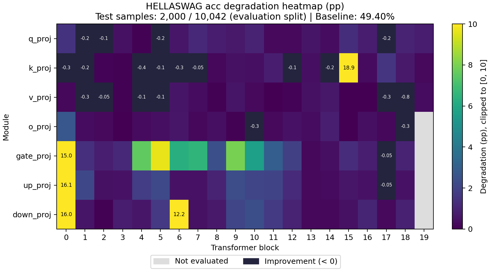
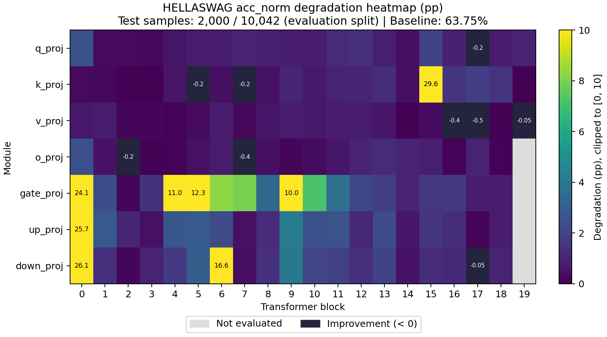

# Sensitivity Report

- Task: `hellaswag`
- Dataset: `hellaswag`
- Split: `lm-eval`
- Preprocessing: `lm-eval-0-shot`
- Evaluated examples: 2000
- Total evaluation examples: 10042
- Baseline evaluation seconds: 61.621

## Baseline Metrics

| Metric | Value |
|---|---:|
| acc | 0.494 |
| acc_norm | 0.6375 |

## Cases

| Case | Targets | Model Compression Ratio | Tensor Size Ratio | Compression Seconds | Evaluation Seconds |
|---|---:|---:|---:|---:|---:|
| model.layers.0.self_attn.q_proj | 1 | 1.00176 | 1.00176 | 0.0908996 | 52.8433 |
| model.layers.0.self_attn.k_proj | 1 | 1.00036 | 1.00036 | 0.0314449 | 52.4681 |
| model.layers.0.self_attn.v_proj | 1 | 1.00036 | 1.00036 | 0.0302351 | 52.0514 |
| model.layers.0.self_attn.o_proj | 1 | 1.00176 | 1.00176 | 0.0509424 | 52.1729 |
| model.layers.0.mlp.gate_proj | 1 | 1.00588 | 1.00588 | 0.140216 | 54.5383 |
| model.layers.0.mlp.up_proj | 1 | 1.00588 | 1.00588 | 0.139315 | 54.5517 |
| model.layers.0.mlp.down_proj | 1 | 1.00588 | 1.00588 | 0.137156 | 52.726 |
| model.layers.1.self_attn.q_proj | 1 | 1.00176 | 1.00176 | 0.0500801 | 52.02 |
| model.layers.1.self_attn.k_proj | 1 | 1.00036 | 1.00036 | 0.0306609 | 52.0028 |
| model.layers.1.self_attn.v_proj | 1 | 1.00036 | 1.00036 | 0.0302912 | 54.288 |
| model.layers.1.self_attn.o_proj | 1 | 1.00176 | 1.00176 | 0.050495 | 52.1573 |
| model.layers.1.mlp.gate_proj | 1 | 1.00588 | 1.00588 | 0.140412 | 54.1849 |
| model.layers.1.mlp.up_proj | 1 | 1.00588 | 1.00588 | 0.139081 | 54.4544 |
| model.layers.1.mlp.down_proj | 1 | 1.00588 | 1.00588 | 0.13666 | 52.8094 |
| model.layers.2.self_attn.q_proj | 1 | 1.00176 | 1.00176 | 0.0506422 | 52.0778 |
| model.layers.2.self_attn.k_proj | 1 | 1.00036 | 1.00036 | 0.0307454 | 51.9997 |
| model.layers.2.self_attn.v_proj | 1 | 1.00036 | 1.00036 | 0.0303568 | 52.2881 |
| model.layers.2.self_attn.o_proj | 1 | 1.00176 | 1.00176 | 0.0513556 | 52.114 |
| model.layers.2.mlp.gate_proj | 1 | 1.00588 | 1.00588 | 0.13768 | 56.9931 |
| model.layers.2.mlp.up_proj | 1 | 1.00588 | 1.00588 | 0.157101 | 54.4534 |
| model.layers.2.mlp.down_proj | 1 | 1.00588 | 1.00588 | 0.148799 | 52.9335 |
| model.layers.3.self_attn.q_proj | 1 | 1.00176 | 1.00176 | 0.0507217 | 52.008 |
| model.layers.3.self_attn.k_proj | 1 | 1.00036 | 1.00036 | 0.0307301 | 51.8094 |
| model.layers.3.self_attn.v_proj | 1 | 1.00036 | 1.00036 | 0.0302966 | 52.0714 |
| model.layers.3.self_attn.o_proj | 1 | 1.00176 | 1.00176 | 0.0504675 | 52.1458 |
| model.layers.3.mlp.gate_proj | 1 | 1.00588 | 1.00588 | 0.139279 | 54.4536 |
| model.layers.3.mlp.up_proj | 1 | 1.00588 | 1.00588 | 0.136198 | 54.0827 |
| model.layers.3.mlp.down_proj | 1 | 1.00588 | 1.00588 | 0.136392 | 55.3634 |
| model.layers.4.self_attn.q_proj | 1 | 1.00176 | 1.00176 | 0.0512079 | 52.0008 |
| model.layers.4.self_attn.k_proj | 1 | 1.00036 | 1.00036 | 0.0303986 | 52.1951 |
| model.layers.4.self_attn.v_proj | 1 | 1.00036 | 1.00036 | 0.0305865 | 51.8828 |
| model.layers.4.self_attn.o_proj | 1 | 1.00176 | 1.00176 | 0.0508986 | 52.049 |
| model.layers.4.mlp.gate_proj | 1 | 1.00588 | 1.00588 | 0.147997 | 54.2992 |
| model.layers.4.mlp.up_proj | 1 | 1.00588 | 1.00588 | 0.137562 | 54.1362 |
| model.layers.4.mlp.down_proj | 1 | 1.00588 | 1.00588 | 0.136867 | 52.7588 |
| model.layers.5.self_attn.q_proj | 1 | 1.00176 | 1.00176 | 0.0507711 | 52.3411 |
| model.layers.5.self_attn.k_proj | 1 | 1.00036 | 1.00036 | 0.032118 | 51.7327 |
| model.layers.5.self_attn.v_proj | 1 | 1.00036 | 1.00036 | 0.0300949 | 51.5267 |
| model.layers.5.self_attn.o_proj | 1 | 1.00176 | 1.00176 | 0.0506389 | 52.203 |
| model.layers.5.mlp.gate_proj | 1 | 1.00588 | 1.00588 | 0.139962 | 54.3763 |
| model.layers.5.mlp.up_proj | 1 | 1.00588 | 1.00588 | 0.139912 | 54.1857 |
| model.layers.5.mlp.down_proj | 1 | 1.00588 | 1.00588 | 0.139064 | 52.9011 |
| model.layers.6.self_attn.q_proj | 1 | 1.00176 | 1.00176 | 0.0505279 | 52.2872 |
| model.layers.6.self_attn.k_proj | 1 | 1.00036 | 1.00036 | 0.0306872 | 51.942 |
| model.layers.6.self_attn.v_proj | 1 | 1.00036 | 1.00036 | 0.0300619 | 51.9773 |
| model.layers.6.self_attn.o_proj | 1 | 1.00176 | 1.00176 | 0.0503315 | 52.2924 |
| model.layers.6.mlp.gate_proj | 1 | 1.00588 | 1.00588 | 0.13966 | 54.2853 |
| model.layers.6.mlp.up_proj | 1 | 1.00588 | 1.00588 | 0.139097 | 54.2098 |
| model.layers.6.mlp.down_proj | 1 | 1.00588 | 1.00588 | 0.139208 | 53.1195 |
| model.layers.7.self_attn.q_proj | 1 | 1.00176 | 1.00176 | 0.0505391 | 52.0228 |
| model.layers.7.self_attn.k_proj | 1 | 1.00036 | 1.00036 | 0.0302381 | 51.9149 |
| model.layers.7.self_attn.v_proj | 1 | 1.00036 | 1.00036 | 0.030481 | 52.1438 |
| model.layers.7.self_attn.o_proj | 1 | 1.00176 | 1.00176 | 0.0534979 | 53.3314 |
| model.layers.7.mlp.gate_proj | 1 | 1.00588 | 1.00588 | 0.138898 | 54.1711 |
| model.layers.7.mlp.up_proj | 1 | 1.00588 | 1.00588 | 0.139434 | 54.4523 |
| model.layers.7.mlp.down_proj | 1 | 1.00588 | 1.00588 | 0.139563 | 53.0486 |
| model.layers.8.self_attn.q_proj | 1 | 1.00176 | 1.00176 | 0.051121 | 52.0776 |
| model.layers.8.self_attn.k_proj | 1 | 1.00036 | 1.00036 | 0.0306862 | 52.0491 |
| model.layers.8.self_attn.v_proj | 1 | 1.00036 | 1.00036 | 0.0302463 | 51.7489 |
| model.layers.8.self_attn.o_proj | 1 | 1.00176 | 1.00176 | 0.0509177 | 51.947 |
| model.layers.8.mlp.gate_proj | 1 | 1.00588 | 1.00588 | 0.140274 | 54.3503 |
| model.layers.8.mlp.up_proj | 1 | 1.00588 | 1.00588 | 0.139217 | 55.1157 |
| model.layers.8.mlp.down_proj | 1 | 1.00588 | 1.00588 | 0.139693 | 52.7881 |
| model.layers.9.self_attn.q_proj | 1 | 1.00176 | 1.00176 | 0.0503203 | 52.175 |
| model.layers.9.self_attn.k_proj | 1 | 1.00036 | 1.00036 | 0.0301116 | 51.8488 |
| model.layers.9.self_attn.v_proj | 1 | 1.00036 | 1.00036 | 0.0301825 | 51.82 |
| model.layers.9.self_attn.o_proj | 1 | 1.00176 | 1.00176 | 0.054024 | 52.2391 |
| model.layers.9.mlp.gate_proj | 1 | 1.00588 | 1.00588 | 0.14598 | 54.2146 |
| model.layers.9.mlp.up_proj | 1 | 1.00588 | 1.00588 | 0.139807 | 54.3716 |
| model.layers.9.mlp.down_proj | 1 | 1.00588 | 1.00588 | 0.139415 | 52.9274 |
| model.layers.10.self_attn.q_proj | 1 | 1.00176 | 1.00176 | 0.0507475 | 52.4055 |
| model.layers.10.self_attn.k_proj | 1 | 1.00036 | 1.00036 | 0.0305129 | 51.7654 |
| model.layers.10.self_attn.v_proj | 1 | 1.00036 | 1.00036 | 0.0301504 | 51.8416 |
| model.layers.10.self_attn.o_proj | 1 | 1.00176 | 1.00176 | 0.0518928 | 52.2193 |
| model.layers.10.mlp.gate_proj | 1 | 1.00588 | 1.00588 | 0.14189 | 54.188 |
| model.layers.10.mlp.up_proj | 1 | 1.00588 | 1.00588 | 0.150514 | 54.2737 |
| model.layers.10.mlp.down_proj | 1 | 1.00588 | 1.00588 | 0.139373 | 53.1041 |
| model.layers.11.self_attn.q_proj | 1 | 1.00176 | 1.00176 | 0.0505086 | 51.8822 |
| model.layers.11.self_attn.k_proj | 1 | 1.00036 | 1.00036 | 0.0303783 | 54.5022 |
| model.layers.11.self_attn.v_proj | 1 | 1.00036 | 1.00036 | 0.0355342 | 52.0531 |
| model.layers.11.self_attn.o_proj | 1 | 1.00176 | 1.00176 | 0.0505094 | 52.0308 |
| model.layers.11.mlp.gate_proj | 1 | 1.00588 | 1.00588 | 0.139517 | 54.2388 |
| model.layers.11.mlp.up_proj | 1 | 1.00588 | 1.00588 | 0.139491 | 54.3591 |
| model.layers.11.mlp.down_proj | 1 | 1.00588 | 1.00588 | 0.139462 | 52.7383 |
| model.layers.12.self_attn.q_proj | 1 | 1.00176 | 1.00176 | 0.0501386 | 52.0944 |
| model.layers.12.self_attn.k_proj | 1 | 1.00036 | 1.00036 | 0.0303282 | 52.0745 |
| model.layers.12.self_attn.v_proj | 1 | 1.00036 | 1.00036 | 0.030017 | 52.2007 |
| model.layers.12.self_attn.o_proj | 1 | 1.00176 | 1.00176 | 0.0504952 | 51.8885 |
| model.layers.12.mlp.gate_proj | 1 | 1.00588 | 1.00588 | 0.140174 | 54.3097 |
| model.layers.12.mlp.up_proj | 1 | 1.00588 | 1.00588 | 0.141036 | 54.1528 |
| model.layers.12.mlp.down_proj | 1 | 1.00588 | 1.00588 | 0.149301 | 52.8628 |
| model.layers.13.self_attn.q_proj | 1 | 1.00176 | 1.00176 | 0.0506984 | 52.2278 |
| model.layers.13.self_attn.k_proj | 1 | 1.00036 | 1.00036 | 0.0305086 | 51.8565 |
| model.layers.13.self_attn.v_proj | 1 | 1.00036 | 1.00036 | 0.0300646 | 51.8878 |
| model.layers.13.self_attn.o_proj | 1 | 1.00176 | 1.00176 | 0.0512667 | 52.1405 |
| model.layers.13.mlp.gate_proj | 1 | 1.00588 | 1.00588 | 0.145902 | 55.5005 |
| model.layers.13.mlp.up_proj | 1 | 1.00588 | 1.00588 | 0.140162 | 54.2215 |
| model.layers.13.mlp.down_proj | 1 | 1.00588 | 1.00588 | 0.139657 | 53.1685 |
| model.layers.14.self_attn.q_proj | 1 | 1.00176 | 1.00176 | 0.0522688 | 52.1255 |
| model.layers.14.self_attn.k_proj | 1 | 1.00036 | 1.00036 | 0.0305411 | 51.8055 |
| model.layers.14.self_attn.v_proj | 1 | 1.00036 | 1.00036 | 0.031888 | 52.1058 |
| model.layers.14.self_attn.o_proj | 1 | 1.00176 | 1.00176 | 0.0507066 | 52.1314 |
| model.layers.14.mlp.gate_proj | 1 | 1.00588 | 1.00588 | 0.139844 | 54.2596 |
| model.layers.14.mlp.up_proj | 1 | 1.00588 | 1.00588 | 0.152251 | 54.5083 |
| model.layers.14.mlp.down_proj | 1 | 1.00588 | 1.00588 | 0.13957 | 54.7193 |
| model.layers.15.self_attn.q_proj | 1 | 1.00176 | 1.00176 | 0.050934 | 52.2084 |
| model.layers.15.self_attn.k_proj | 1 | 1.00036 | 1.00036 | 0.0305741 | 52.0607 |
| model.layers.15.self_attn.v_proj | 1 | 1.00036 | 1.00036 | 0.0302503 | 51.8785 |
| model.layers.15.self_attn.o_proj | 1 | 1.00176 | 1.00176 | 0.0502181 | 52.1279 |
| model.layers.15.mlp.gate_proj | 1 | 1.00588 | 1.00588 | 0.137433 | 54.5189 |
| model.layers.15.mlp.up_proj | 1 | 1.00588 | 1.00588 | 0.139102 | 54.1801 |
| model.layers.15.mlp.down_proj | 1 | 1.00588 | 1.00588 | 0.139278 | 52.7191 |
| model.layers.16.self_attn.q_proj | 1 | 1.00176 | 1.00176 | 0.0503904 | 52.3493 |
| model.layers.16.self_attn.k_proj | 1 | 1.00036 | 1.00036 | 0.0304308 | 51.874 |
| model.layers.16.self_attn.v_proj | 1 | 1.00036 | 1.00036 | 0.029917 | 51.9281 |
| model.layers.16.self_attn.o_proj | 1 | 1.00176 | 1.00176 | 0.0532998 | 52.3279 |
| model.layers.16.mlp.gate_proj | 1 | 1.00588 | 1.00588 | 0.140109 | 54.2833 |
| model.layers.16.mlp.up_proj | 1 | 1.00588 | 1.00588 | 0.139288 | 54.2164 |
| model.layers.16.mlp.down_proj | 1 | 1.00588 | 1.00588 | 0.139912 | 53.0936 |
| model.layers.17.self_attn.q_proj | 1 | 1.00176 | 1.00176 | 0.0508055 | 51.9587 |
| model.layers.17.self_attn.k_proj | 1 | 1.00036 | 1.00036 | 0.0303188 | 51.7313 |
| model.layers.17.self_attn.v_proj | 1 | 1.00036 | 1.00036 | 0.0302908 | 51.9164 |
| model.layers.17.self_attn.o_proj | 1 | 1.00176 | 1.00176 | 0.0502406 | 51.9975 |
| model.layers.17.mlp.gate_proj | 1 | 1.00588 | 1.00588 | 0.139642 | 54.1799 |
| model.layers.17.mlp.up_proj | 1 | 1.00588 | 1.00588 | 0.140822 | 54.455 |
| model.layers.17.mlp.down_proj | 1 | 1.00588 | 1.00588 | 0.139479 | 52.8624 |
| model.layers.18.self_attn.q_proj | 1 | 1.00176 | 1.00176 | 0.0503065 | 51.9699 |
| model.layers.18.self_attn.k_proj | 1 | 1.00036 | 1.00036 | 0.0298654 | 51.7307 |
| model.layers.18.self_attn.v_proj | 1 | 1.00036 | 1.00036 | 0.0303639 | 52.1183 |
| model.layers.18.self_attn.o_proj | 1 | 1.00176 | 1.00176 | 0.0508498 | 53.449 |
| model.layers.18.mlp.gate_proj | 1 | 1.00588 | 1.00588 | 0.139248 | 54.1712 |
| model.layers.18.mlp.up_proj | 1 | 1.00588 | 1.00588 | 0.139279 | 54.3914 |
| model.layers.18.mlp.down_proj | 1 | 1.00588 | 1.00588 | 0.139412 | 52.8954 |
| model.layers.19.self_attn.q_proj | 1 | 1.00176 | 1.00176 | 0.0504703 | 52.1273 |
| model.layers.19.self_attn.k_proj | 1 | 1.00036 | 1.00036 | 0.0301037 | 51.9698 |
| model.layers.19.self_attn.v_proj | 1 | 1.00036 | 1.00036 | 0.0302135 | 51.7983 |

## Metrics

| Case | Metric | Value | Degradation |
|---|---|---:|---:|
| model.layers.0.self_attn.q_proj | acc | 0.4795 | 0.0145 |
| model.layers.0.self_attn.q_proj | acc_norm | 0.6125 | 0.025 |
| model.layers.0.self_attn.k_proj | acc | 0.4965 | -0.0025 |
| model.layers.0.self_attn.k_proj | acc_norm | 0.635 | 0.0025 |
| model.layers.0.self_attn.v_proj | acc | 0.492 | 0.002 |
| model.layers.0.self_attn.v_proj | acc_norm | 0.631 | 0.0065 |
| model.layers.0.self_attn.o_proj | acc | 0.467 | 0.027 |
| model.layers.0.self_attn.o_proj | acc_norm | 0.613 | 0.0245 |
| model.layers.0.mlp.gate_proj | acc | 0.3445 | 0.1495 |
| model.layers.0.mlp.gate_proj | acc_norm | 0.3965 | 0.241 |
| model.layers.0.mlp.up_proj | acc | 0.333 | 0.161 |
| model.layers.0.mlp.up_proj | acc_norm | 0.38 | 0.2575 |
| model.layers.0.mlp.down_proj | acc | 0.3335 | 0.1605 |
| model.layers.0.mlp.down_proj | acc_norm | 0.376 | 0.2615 |
| model.layers.1.self_attn.q_proj | acc | 0.4955 | -0.0015 |
| model.layers.1.self_attn.q_proj | acc_norm | 0.6345 | 0.003 |
| model.layers.1.self_attn.k_proj | acc | 0.4955 | -0.0015 |
| model.layers.1.self_attn.k_proj | acc_norm | 0.6355 | 0.002 |
| model.layers.1.self_attn.v_proj | acc | 0.4965 | -0.0025 |
| model.layers.1.self_attn.v_proj | acc_norm | 0.6295 | 0.008 |
| model.layers.1.self_attn.o_proj | acc | 0.4905 | 0.0035 |
| model.layers.1.self_attn.o_proj | acc_norm | 0.6325 | 0.005 |
| model.layers.1.mlp.gate_proj | acc | 0.4805 | 0.0135 |
| model.layers.1.mlp.gate_proj | acc_norm | 0.6135 | 0.024 |
| model.layers.1.mlp.up_proj | acc | 0.4725 | 0.0215 |
| model.layers.1.mlp.up_proj | acc_norm | 0.6095 | 0.028 |
| model.layers.1.mlp.down_proj | acc | 0.4885 | 0.0055 |
| model.layers.1.mlp.down_proj | acc_norm | 0.624 | 0.0135 |
| model.layers.2.self_attn.q_proj | acc | 0.495 | -0.001 |
| model.layers.2.self_attn.q_proj | acc_norm | 0.635 | 0.0025 |
| model.layers.2.self_attn.k_proj | acc | 0.493 | 0.001 |
| model.layers.2.self_attn.k_proj | acc_norm | 0.6375 | 0 |
| model.layers.2.self_attn.v_proj | acc | 0.4945 | -0.0005 |
| model.layers.2.self_attn.v_proj | acc_norm | 0.636 | 0.0015 |
| model.layers.2.self_attn.o_proj | acc | 0.4915 | 0.0025 |
| model.layers.2.self_attn.o_proj | acc_norm | 0.6395 | -0.002 |
| model.layers.2.mlp.gate_proj | acc | 0.4855 | 0.0085 |
| model.layers.2.mlp.gate_proj | acc_norm | 0.636 | 0.0015 |
| model.layers.2.mlp.up_proj | acc | 0.4895 | 0.0045 |
| model.layers.2.mlp.up_proj | acc_norm | 0.627 | 0.0105 |
| model.layers.2.mlp.down_proj | acc | 0.4935 | 0.0005 |
| model.layers.2.mlp.down_proj | acc_norm | 0.636 | 0.0015 |
| model.layers.3.self_attn.q_proj | acc | 0.4895 | 0.0045 |
| model.layers.3.self_attn.q_proj | acc_norm | 0.6355 | 0.002 |
| model.layers.3.self_attn.k_proj | acc | 0.4935 | 0.0005 |
| model.layers.3.self_attn.k_proj | acc_norm | 0.6375 | 0 |
| model.layers.3.self_attn.v_proj | acc | 0.4935 | 0.0005 |
| model.layers.3.self_attn.v_proj | acc_norm | 0.636 | 0.0015 |
| model.layers.3.self_attn.o_proj | acc | 0.494 | 0 |
| model.layers.3.self_attn.o_proj | acc_norm | 0.637 | 0.0005 |
| model.layers.3.mlp.gate_proj | acc | 0.4825 | 0.0115 |
| model.layers.3.mlp.gate_proj | acc_norm | 0.623 | 0.0145 |
| model.layers.3.mlp.up_proj | acc | 0.489 | 0.005 |
| model.layers.3.mlp.up_proj | acc_norm | 0.633 | 0.0045 |
| model.layers.3.mlp.down_proj | acc | 0.486 | 0.008 |
| model.layers.3.mlp.down_proj | acc_norm | 0.628 | 0.0095 |
| model.layers.4.self_attn.q_proj | acc | 0.4935 | 0.0005 |
| model.layers.4.self_attn.q_proj | acc_norm | 0.632 | 0.0055 |
| model.layers.4.self_attn.k_proj | acc | 0.4975 | -0.0035 |
| model.layers.4.self_attn.k_proj | acc_norm | 0.632 | 0.0055 |
| model.layers.4.self_attn.v_proj | acc | 0.495 | -0.001 |
| model.layers.4.self_attn.v_proj | acc_norm | 0.6365 | 0.001 |
| model.layers.4.self_attn.o_proj | acc | 0.491 | 0.003 |
| model.layers.4.self_attn.o_proj | acc_norm | 0.6365 | 0.001 |
| model.layers.4.mlp.gate_proj | acc | 0.4185 | 0.0755 |
| model.layers.4.mlp.gate_proj | acc_norm | 0.5275 | 0.11 |
| model.layers.4.mlp.up_proj | acc | 0.476 | 0.018 |
| model.layers.4.mlp.up_proj | acc_norm | 0.6105 | 0.027 |
| model.layers.4.mlp.down_proj | acc | 0.488 | 0.006 |
| model.layers.4.mlp.down_proj | acc_norm | 0.6205 | 0.017 |
| model.layers.5.self_attn.q_proj | acc | 0.4955 | -0.0015 |
| model.layers.5.self_attn.q_proj | acc_norm | 0.63 | 0.0075 |
| model.layers.5.self_attn.k_proj | acc | 0.495 | -0.001 |
| model.layers.5.self_attn.k_proj | acc_norm | 0.6395 | -0.002 |
| model.layers.5.self_attn.v_proj | acc | 0.495 | -0.001 |
| model.layers.5.self_attn.v_proj | acc_norm | 0.6345 | 0.003 |
| model.layers.5.self_attn.o_proj | acc | 0.49 | 0.004 |
| model.layers.5.self_attn.o_proj | acc_norm | 0.633 | 0.0045 |
| model.layers.5.mlp.gate_proj | acc | 0.3975 | 0.0965 |
| model.layers.5.mlp.gate_proj | acc_norm | 0.5145 | 0.123 |
| model.layers.5.mlp.up_proj | acc | 0.472 | 0.022 |
| model.layers.5.mlp.up_proj | acc_norm | 0.609 | 0.0285 |
| model.layers.5.mlp.down_proj | acc | 0.4775 | 0.0165 |
| model.layers.5.mlp.down_proj | acc_norm | 0.608 | 0.0295 |
| model.layers.6.self_attn.q_proj | acc | 0.488 | 0.006 |
| model.layers.6.self_attn.q_proj | acc_norm | 0.6295 | 0.008 |
| model.layers.6.self_attn.k_proj | acc | 0.4965 | -0.0025 |
| model.layers.6.self_attn.k_proj | acc_norm | 0.6335 | 0.004 |
| model.layers.6.self_attn.v_proj | acc | 0.4885 | 0.0055 |
| model.layers.6.self_attn.v_proj | acc_norm | 0.6295 | 0.008 |
| model.layers.6.self_attn.o_proj | acc | 0.488 | 0.006 |
| model.layers.6.self_attn.o_proj | acc_norm | 0.6295 | 0.008 |
| model.layers.6.mlp.gate_proj | acc | 0.4315 | 0.0625 |
| model.layers.6.mlp.gate_proj | acc_norm | 0.5545 | 0.083 |
| model.layers.6.mlp.up_proj | acc | 0.489 | 0.005 |
| model.layers.6.mlp.up_proj | acc_norm | 0.6145 | 0.023 |
| model.layers.6.mlp.down_proj | acc | 0.3715 | 0.1225 |
| model.layers.6.mlp.down_proj | acc_norm | 0.471 | 0.1665 |
| model.layers.7.self_attn.q_proj | acc | 0.4825 | 0.0115 |
| model.layers.7.self_attn.q_proj | acc_norm | 0.6275 | 0.01 |
| model.layers.7.self_attn.k_proj | acc | 0.4945 | -0.0005 |
| model.layers.7.self_attn.k_proj | acc_norm | 0.6395 | -0.002 |
| model.layers.7.self_attn.v_proj | acc | 0.4905 | 0.0035 |
| model.layers.7.self_attn.v_proj | acc_norm | 0.6355 | 0.002 |
| model.layers.7.self_attn.o_proj | acc | 0.492 | 0.002 |
| model.layers.7.self_attn.o_proj | acc_norm | 0.6415 | -0.004 |
| model.layers.7.mlp.gate_proj | acc | 0.4285 | 0.0655 |
| model.layers.7.mlp.gate_proj | acc_norm | 0.5575 | 0.08 |
| model.layers.7.mlp.up_proj | acc | 0.489 | 0.005 |
| model.layers.7.mlp.up_proj | acc_norm | 0.633 | 0.0045 |
| model.layers.7.mlp.down_proj | acc | 0.4895 | 0.0045 |
| model.layers.7.mlp.down_proj | acc_norm | 0.6335 | 0.004 |
| model.layers.8.self_attn.q_proj | acc | 0.4865 | 0.0075 |
| model.layers.8.self_attn.q_proj | acc_norm | 0.6285 | 0.009 |
| model.layers.8.self_attn.k_proj | acc | 0.492 | 0.002 |
| model.layers.8.self_attn.k_proj | acc_norm | 0.633 | 0.0045 |
| model.layers.8.self_attn.v_proj | acc | 0.4935 | 0.0005 |
| model.layers.8.self_attn.v_proj | acc_norm | 0.632 | 0.0055 |
| model.layers.8.self_attn.o_proj | acc | 0.49 | 0.004 |
| model.layers.8.self_attn.o_proj | acc_norm | 0.6335 | 0.004 |
| model.layers.8.mlp.gate_proj | acc | 0.4695 | 0.0245 |
| model.layers.8.mlp.gate_proj | acc_norm | 0.604 | 0.0335 |
| model.layers.8.mlp.up_proj | acc | 0.484 | 0.01 |
| model.layers.8.mlp.up_proj | acc_norm | 0.6255 | 0.012 |
| model.layers.8.mlp.down_proj | acc | 0.487 | 0.007 |
| model.layers.8.mlp.down_proj | acc_norm | 0.624 | 0.0135 |
| model.layers.9.self_attn.q_proj | acc | 0.487 | 0.007 |
| model.layers.9.self_attn.q_proj | acc_norm | 0.63 | 0.0075 |
| model.layers.9.self_attn.k_proj | acc | 0.4895 | 0.0045 |
| model.layers.9.self_attn.k_proj | acc_norm | 0.627 | 0.0105 |
| model.layers.9.self_attn.v_proj | acc | 0.4885 | 0.0055 |
| model.layers.9.self_attn.v_proj | acc_norm | 0.63 | 0.0075 |
| model.layers.9.self_attn.o_proj | acc | 0.4935 | 0.0005 |
| model.layers.9.self_attn.o_proj | acc_norm | 0.636 | 0.0015 |
| model.layers.9.mlp.gate_proj | acc | 0.4145 | 0.0795 |
| model.layers.9.mlp.gate_proj | acc_norm | 0.537 | 0.1005 |
| model.layers.9.mlp.up_proj | acc | 0.4705 | 0.0235 |
| model.layers.9.mlp.up_proj | acc_norm | 0.596 | 0.0415 |
| model.layers.9.mlp.down_proj | acc | 0.473 | 0.021 |
| model.layers.9.mlp.down_proj | acc_norm | 0.597 | 0.0405 |
| model.layers.10.self_attn.q_proj | acc | 0.484 | 0.01 |
| model.layers.10.self_attn.q_proj | acc_norm | 0.63 | 0.0075 |
| model.layers.10.self_attn.k_proj | acc | 0.49 | 0.004 |
| model.layers.10.self_attn.k_proj | acc_norm | 0.6305 | 0.007 |
| model.layers.10.self_attn.v_proj | acc | 0.4915 | 0.0025 |
| model.layers.10.self_attn.v_proj | acc_norm | 0.631 | 0.0065 |
| model.layers.10.self_attn.o_proj | acc | 0.4965 | -0.0025 |
| model.layers.10.self_attn.o_proj | acc_norm | 0.634 | 0.0035 |
| model.layers.10.mlp.gate_proj | acc | 0.4375 | 0.0565 |
| model.layers.10.mlp.gate_proj | acc_norm | 0.566 | 0.0715 |
| model.layers.10.mlp.up_proj | acc | 0.473 | 0.021 |
| model.layers.10.mlp.up_proj | acc_norm | 0.613 | 0.0245 |
| model.layers.10.mlp.down_proj | acc | 0.47 | 0.024 |
| model.layers.10.mlp.down_proj | acc_norm | 0.6165 | 0.021 |
| model.layers.11.self_attn.q_proj | acc | 0.4915 | 0.0025 |
| model.layers.11.self_attn.q_proj | acc_norm | 0.6255 | 0.012 |
| model.layers.11.self_attn.k_proj | acc | 0.486 | 0.008 |
| model.layers.11.self_attn.k_proj | acc_norm | 0.6275 | 0.01 |
| model.layers.11.self_attn.v_proj | acc | 0.494 | 0 |
| model.layers.11.self_attn.v_proj | acc_norm | 0.63 | 0.0075 |
| model.layers.11.self_attn.o_proj | acc | 0.4915 | 0.0025 |
| model.layers.11.self_attn.o_proj | acc_norm | 0.6315 | 0.006 |
| model.layers.11.mlp.gate_proj | acc | 0.464 | 0.03 |
| model.layers.11.mlp.gate_proj | acc_norm | 0.6005 | 0.037 |
| model.layers.11.mlp.up_proj | acc | 0.4735 | 0.0205 |
| model.layers.11.mlp.up_proj | acc_norm | 0.612 | 0.0255 |
| model.layers.11.mlp.down_proj | acc | 0.477 | 0.017 |
| model.layers.11.mlp.down_proj | acc_norm | 0.6185 | 0.019 |
| model.layers.12.self_attn.q_proj | acc | 0.4915 | 0.0025 |
| model.layers.12.self_attn.q_proj | acc_norm | 0.6235 | 0.014 |
| model.layers.12.self_attn.k_proj | acc | 0.495 | -0.001 |
| model.layers.12.self_attn.k_proj | acc_norm | 0.627 | 0.0105 |
| model.layers.12.self_attn.v_proj | acc | 0.493 | 0.001 |
| model.layers.12.self_attn.v_proj | acc_norm | 0.63 | 0.0075 |
| model.layers.12.self_attn.o_proj | acc | 0.489 | 0.005 |
| model.layers.12.self_attn.o_proj | acc_norm | 0.628 | 0.0095 |
| model.layers.12.mlp.gate_proj | acc | 0.475 | 0.019 |
| model.layers.12.mlp.gate_proj | acc_norm | 0.616 | 0.0215 |
| model.layers.12.mlp.up_proj | acc | 0.482 | 0.012 |
| model.layers.12.mlp.up_proj | acc_norm | 0.6265 | 0.011 |
| model.layers.12.mlp.down_proj | acc | 0.4845 | 0.0095 |
| model.layers.12.mlp.down_proj | acc_norm | 0.624 | 0.0135 |
| model.layers.13.self_attn.q_proj | acc | 0.4885 | 0.0055 |
| model.layers.13.self_attn.q_proj | acc_norm | 0.629 | 0.0085 |
| model.layers.13.self_attn.k_proj | acc | 0.49 | 0.004 |
| model.layers.13.self_attn.k_proj | acc_norm | 0.6245 | 0.013 |
| model.layers.13.self_attn.v_proj | acc | 0.4895 | 0.0045 |
| model.layers.13.self_attn.v_proj | acc_norm | 0.6315 | 0.006 |
| model.layers.13.self_attn.o_proj | acc | 0.4905 | 0.0035 |
| model.layers.13.self_attn.o_proj | acc_norm | 0.625 | 0.0125 |
| model.layers.13.mlp.gate_proj | acc | 0.492 | 0.002 |
| model.layers.13.mlp.gate_proj | acc_norm | 0.6195 | 0.018 |
| model.layers.13.mlp.up_proj | acc | 0.4915 | 0.0025 |
| model.layers.13.mlp.up_proj | acc_norm | 0.6145 | 0.023 |
| model.layers.13.mlp.down_proj | acc | 0.492 | 0.002 |
| model.layers.13.mlp.down_proj | acc_norm | 0.6175 | 0.02 |
| model.layers.14.self_attn.q_proj | acc | 0.4905 | 0.0035 |
| model.layers.14.self_attn.q_proj | acc_norm | 0.6335 | 0.004 |
| model.layers.14.self_attn.k_proj | acc | 0.496 | -0.002 |
| model.layers.14.self_attn.k_proj | acc_norm | 0.6335 | 0.004 |
| model.layers.14.self_attn.v_proj | acc | 0.4875 | 0.0065 |
| model.layers.14.self_attn.v_proj | acc_norm | 0.637 | 0.0005 |
| model.layers.14.self_attn.o_proj | acc | 0.4855 | 0.0085 |
| model.layers.14.self_attn.o_proj | acc_norm | 0.6275 | 0.01 |
| model.layers.14.mlp.gate_proj | acc | 0.49 | 0.004 |
| model.layers.14.mlp.gate_proj | acc_norm | 0.6275 | 0.01 |
| model.layers.14.mlp.up_proj | acc | 0.491 | 0.003 |
| model.layers.14.mlp.up_proj | acc_norm | 0.6315 | 0.006 |
| model.layers.14.mlp.down_proj | acc | 0.492 | 0.002 |
| model.layers.14.mlp.down_proj | acc_norm | 0.6325 | 0.005 |
| model.layers.15.self_attn.q_proj | acc | 0.481 | 0.013 |
| model.layers.15.self_attn.q_proj | acc_norm | 0.6175 | 0.02 |
| model.layers.15.self_attn.k_proj | acc | 0.305 | 0.189 |
| model.layers.15.self_attn.k_proj | acc_norm | 0.341 | 0.2965 |
| model.layers.15.self_attn.v_proj | acc | 0.494 | 0 |
| model.layers.15.self_attn.v_proj | acc_norm | 0.6345 | 0.003 |
| model.layers.15.self_attn.o_proj | acc | 0.494 | 0 |
| model.layers.15.self_attn.o_proj | acc_norm | 0.629 | 0.0085 |
| model.layers.15.mlp.gate_proj | acc | 0.4815 | 0.0125 |
| model.layers.15.mlp.gate_proj | acc_norm | 0.6215 | 0.016 |
| model.layers.15.mlp.up_proj | acc | 0.488 | 0.006 |
| model.layers.15.mlp.up_proj | acc_norm | 0.6225 | 0.015 |
| model.layers.15.mlp.down_proj | acc | 0.4895 | 0.0045 |
| model.layers.15.mlp.down_proj | acc_norm | 0.6245 | 0.013 |
| model.layers.16.self_attn.q_proj | acc | 0.486 | 0.008 |
| model.layers.16.self_attn.q_proj | acc_norm | 0.6285 | 0.009 |
| model.layers.16.self_attn.k_proj | acc | 0.491 | 0.003 |
| model.layers.16.self_attn.k_proj | acc_norm | 0.6225 | 0.015 |
| model.layers.16.self_attn.v_proj | acc | 0.494 | 0 |
| model.layers.16.self_attn.v_proj | acc_norm | 0.641 | -0.0035 |
| model.layers.16.self_attn.o_proj | acc | 0.49 | 0.004 |
| model.layers.16.self_attn.o_proj | acc_norm | 0.6365 | 0.001 |
| model.layers.16.mlp.gate_proj | acc | 0.4855 | 0.0085 |
| model.layers.16.mlp.gate_proj | acc_norm | 0.621 | 0.0165 |
| model.layers.16.mlp.up_proj | acc | 0.489 | 0.005 |
| model.layers.16.mlp.up_proj | acc_norm | 0.6245 | 0.013 |
| model.layers.16.mlp.down_proj | acc | 0.4835 | 0.0105 |
| model.layers.16.mlp.down_proj | acc_norm | 0.626 | 0.0115 |
| model.layers.17.self_attn.q_proj | acc | 0.496 | -0.002 |
| model.layers.17.self_attn.q_proj | acc_norm | 0.6395 | -0.002 |
| model.layers.17.self_attn.k_proj | acc | 0.4785 | 0.0155 |
| model.layers.17.self_attn.k_proj | acc_norm | 0.6195 | 0.018 |
| model.layers.17.self_attn.v_proj | acc | 0.497 | -0.003 |
| model.layers.17.self_attn.v_proj | acc_norm | 0.642 | -0.0045 |
| model.layers.17.self_attn.o_proj | acc | 0.492 | 0.002 |
| model.layers.17.self_attn.o_proj | acc_norm | 0.628 | 0.0095 |
| model.layers.17.mlp.gate_proj | acc | 0.4945 | -0.0005 |
| model.layers.17.mlp.gate_proj | acc_norm | 0.63 | 0.0075 |
| model.layers.17.mlp.up_proj | acc | 0.4945 | -0.0005 |
| model.layers.17.mlp.up_proj | acc_norm | 0.636 | 0.0015 |
| model.layers.17.mlp.down_proj | acc | 0.4915 | 0.0025 |
| model.layers.17.mlp.down_proj | acc_norm | 0.638 | -0.0005 |
| model.layers.18.self_attn.q_proj | acc | 0.484 | 0.01 |
| model.layers.18.self_attn.q_proj | acc_norm | 0.63 | 0.0075 |
| model.layers.18.self_attn.k_proj | acc | 0.487 | 0.007 |
| model.layers.18.self_attn.k_proj | acc_norm | 0.6225 | 0.015 |
| model.layers.18.self_attn.v_proj | acc | 0.502 | -0.008 |
| model.layers.18.self_attn.v_proj | acc_norm | 0.637 | 0.0005 |
| model.layers.18.self_attn.o_proj | acc | 0.497 | -0.003 |
| model.layers.18.self_attn.o_proj | acc_norm | 0.6365 | 0.001 |
| model.layers.18.mlp.gate_proj | acc | 0.484 | 0.01 |
| model.layers.18.mlp.gate_proj | acc_norm | 0.63 | 0.0075 |
| model.layers.18.mlp.up_proj | acc | 0.489 | 0.005 |
| model.layers.18.mlp.up_proj | acc_norm | 0.63 | 0.0075 |
| model.layers.18.mlp.down_proj | acc | 0.485 | 0.009 |
| model.layers.18.mlp.down_proj | acc_norm | 0.6275 | 0.01 |
| model.layers.19.self_attn.q_proj | acc | 0.4865 | 0.0075 |
| model.layers.19.self_attn.q_proj | acc_norm | 0.628 | 0.0095 |
| model.layers.19.self_attn.k_proj | acc | 0.4915 | 0.0025 |
| model.layers.19.self_attn.k_proj | acc_norm | 0.6375 | 0 |
| model.layers.19.self_attn.v_proj | acc | 0.4905 | 0.0035 |
| model.layers.19.self_attn.v_proj | acc_norm | 0.638 | -0.0005 |

## Layers

| Case | Module | Representation | Compression Ratio | Tensor Size Ratio | Relative Error |
|---|---|---|---:|---:|---:|
| model.layers.0.self_attn.q_proj | model.layers.0.self_attn.q_proj | mpo | 6.96599 | 6.96599 | 0.902344 |
| model.layers.0.self_attn.k_proj | model.layers.0.self_attn.k_proj | mpo | 3.44781 | 3.44781 | 0.808594 |
| model.layers.0.self_attn.v_proj | model.layers.0.self_attn.v_proj | mpo | 3.44781 | 3.44781 | 0.8125 |
| model.layers.0.self_attn.o_proj | model.layers.0.self_attn.o_proj | mpo | 6.96599 | 6.96599 | 0.890625 |
| model.layers.0.mlp.gate_proj | model.layers.0.mlp.gate_proj | mpo | 20.48 | 20.48 | 0.96875 |
| model.layers.0.mlp.up_proj | model.layers.0.mlp.up_proj | mpo | 20.48 | 20.48 | 0.96875 |
| model.layers.0.mlp.down_proj | model.layers.0.mlp.down_proj | mpo | 20.48 | 20.48 | 0.96875 |
| model.layers.1.self_attn.q_proj | model.layers.1.self_attn.q_proj | mpo | 6.96599 | 6.96599 | 0.902344 |
| model.layers.1.self_attn.k_proj | model.layers.1.self_attn.k_proj | mpo | 3.44781 | 3.44781 | 0.8125 |
| model.layers.1.self_attn.v_proj | model.layers.1.self_attn.v_proj | mpo | 3.44781 | 3.44781 | 0.800781 |
| model.layers.1.self_attn.o_proj | model.layers.1.self_attn.o_proj | mpo | 6.96599 | 6.96599 | 0.902344 |
| model.layers.1.mlp.gate_proj | model.layers.1.mlp.gate_proj | mpo | 20.48 | 20.48 | 0.953125 |
| model.layers.1.mlp.up_proj | model.layers.1.mlp.up_proj | mpo | 20.48 | 20.48 | 0.964844 |
| model.layers.1.mlp.down_proj | model.layers.1.mlp.down_proj | mpo | 20.48 | 20.48 | 0.957031 |
| model.layers.2.self_attn.q_proj | model.layers.2.self_attn.q_proj | mpo | 6.96599 | 6.96599 | 0.902344 |
| model.layers.2.self_attn.k_proj | model.layers.2.self_attn.k_proj | mpo | 3.44781 | 3.44781 | 0.804688 |
| model.layers.2.self_attn.v_proj | model.layers.2.self_attn.v_proj | mpo | 3.44781 | 3.44781 | 0.808594 |
| model.layers.2.self_attn.o_proj | model.layers.2.self_attn.o_proj | mpo | 6.96599 | 6.96599 | 0.90625 |
| model.layers.2.mlp.gate_proj | model.layers.2.mlp.gate_proj | mpo | 20.48 | 20.48 | 0.957031 |
| model.layers.2.mlp.up_proj | model.layers.2.mlp.up_proj | mpo | 20.48 | 20.48 | 0.964844 |
| model.layers.2.mlp.down_proj | model.layers.2.mlp.down_proj | mpo | 20.48 | 20.48 | 0.960938 |
| model.layers.3.self_attn.q_proj | model.layers.3.self_attn.q_proj | mpo | 6.96599 | 6.96599 | 0.898438 |
| model.layers.3.self_attn.k_proj | model.layers.3.self_attn.k_proj | mpo | 3.44781 | 3.44781 | 0.808594 |
| model.layers.3.self_attn.v_proj | model.layers.3.self_attn.v_proj | mpo | 3.44781 | 3.44781 | 0.800781 |
| model.layers.3.self_attn.o_proj | model.layers.3.self_attn.o_proj | mpo | 6.96599 | 6.96599 | 0.90625 |
| model.layers.3.mlp.gate_proj | model.layers.3.mlp.gate_proj | mpo | 20.48 | 20.48 | 0.957031 |
| model.layers.3.mlp.up_proj | model.layers.3.mlp.up_proj | mpo | 20.48 | 20.48 | 0.964844 |
| model.layers.3.mlp.down_proj | model.layers.3.mlp.down_proj | mpo | 20.48 | 20.48 | 0.964844 |
| model.layers.4.self_attn.q_proj | model.layers.4.self_attn.q_proj | mpo | 6.96599 | 6.96599 | 0.90625 |
| model.layers.4.self_attn.k_proj | model.layers.4.self_attn.k_proj | mpo | 3.44781 | 3.44781 | 0.808594 |
| model.layers.4.self_attn.v_proj | model.layers.4.self_attn.v_proj | mpo | 3.44781 | 3.44781 | 0.804688 |
| model.layers.4.self_attn.o_proj | model.layers.4.self_attn.o_proj | mpo | 6.96599 | 6.96599 | 0.90625 |
| model.layers.4.mlp.gate_proj | model.layers.4.mlp.gate_proj | mpo | 20.48 | 20.48 | 0.960938 |
| model.layers.4.mlp.up_proj | model.layers.4.mlp.up_proj | mpo | 20.48 | 20.48 | 0.96875 |
| model.layers.4.mlp.down_proj | model.layers.4.mlp.down_proj | mpo | 20.48 | 20.48 | 0.96875 |
| model.layers.5.self_attn.q_proj | model.layers.5.self_attn.q_proj | mpo | 6.96599 | 6.96599 | 0.894531 |
| model.layers.5.self_attn.k_proj | model.layers.5.self_attn.k_proj | mpo | 3.44781 | 3.44781 | 0.792969 |
| model.layers.5.self_attn.v_proj | model.layers.5.self_attn.v_proj | mpo | 3.44781 | 3.44781 | 0.800781 |
| model.layers.5.self_attn.o_proj | model.layers.5.self_attn.o_proj | mpo | 6.96599 | 6.96599 | 0.898438 |
| model.layers.5.mlp.gate_proj | model.layers.5.mlp.gate_proj | mpo | 20.48 | 20.48 | 0.964844 |
| model.layers.5.mlp.up_proj | model.layers.5.mlp.up_proj | mpo | 20.48 | 20.48 | 0.972656 |
| model.layers.5.mlp.down_proj | model.layers.5.mlp.down_proj | mpo | 20.48 | 20.48 | 0.964844 |
| model.layers.6.self_attn.q_proj | model.layers.6.self_attn.q_proj | mpo | 6.96599 | 6.96599 | 0.90625 |
| model.layers.6.self_attn.k_proj | model.layers.6.self_attn.k_proj | mpo | 3.44781 | 3.44781 | 0.8125 |
| model.layers.6.self_attn.v_proj | model.layers.6.self_attn.v_proj | mpo | 3.44781 | 3.44781 | 0.804688 |
| model.layers.6.self_attn.o_proj | model.layers.6.self_attn.o_proj | mpo | 6.96599 | 6.96599 | 0.890625 |
| model.layers.6.mlp.gate_proj | model.layers.6.mlp.gate_proj | mpo | 20.48 | 20.48 | 0.964844 |
| model.layers.6.mlp.up_proj | model.layers.6.mlp.up_proj | mpo | 20.48 | 20.48 | 0.972656 |
| model.layers.6.mlp.down_proj | model.layers.6.mlp.down_proj | mpo | 20.48 | 20.48 | 0.964844 |
| model.layers.7.self_attn.q_proj | model.layers.7.self_attn.q_proj | mpo | 6.96599 | 6.96599 | 0.898438 |
| model.layers.7.self_attn.k_proj | model.layers.7.self_attn.k_proj | mpo | 3.44781 | 3.44781 | 0.804688 |
| model.layers.7.self_attn.v_proj | model.layers.7.self_attn.v_proj | mpo | 3.44781 | 3.44781 | 0.796875 |
| model.layers.7.self_attn.o_proj | model.layers.7.self_attn.o_proj | mpo | 6.96599 | 6.96599 | 0.902344 |
| model.layers.7.mlp.gate_proj | model.layers.7.mlp.gate_proj | mpo | 20.48 | 20.48 | 0.96875 |
| model.layers.7.mlp.up_proj | model.layers.7.mlp.up_proj | mpo | 20.48 | 20.48 | 0.96875 |
| model.layers.7.mlp.down_proj | model.layers.7.mlp.down_proj | mpo | 20.48 | 20.48 | 0.96875 |
| model.layers.8.self_attn.q_proj | model.layers.8.self_attn.q_proj | mpo | 6.96599 | 6.96599 | 0.898438 |
| model.layers.8.self_attn.k_proj | model.layers.8.self_attn.k_proj | mpo | 3.44781 | 3.44781 | 0.808594 |
| model.layers.8.self_attn.v_proj | model.layers.8.self_attn.v_proj | mpo | 3.44781 | 3.44781 | 0.808594 |
| model.layers.8.self_attn.o_proj | model.layers.8.self_attn.o_proj | mpo | 6.96599 | 6.96599 | 0.902344 |
| model.layers.8.mlp.gate_proj | model.layers.8.mlp.gate_proj | mpo | 20.48 | 20.48 | 0.964844 |
| model.layers.8.mlp.up_proj | model.layers.8.mlp.up_proj | mpo | 20.48 | 20.48 | 0.96875 |
| model.layers.8.mlp.down_proj | model.layers.8.mlp.down_proj | mpo | 20.48 | 20.48 | 0.96875 |
| model.layers.9.self_attn.q_proj | model.layers.9.self_attn.q_proj | mpo | 6.96599 | 6.96599 | 0.898438 |
| model.layers.9.self_attn.k_proj | model.layers.9.self_attn.k_proj | mpo | 3.44781 | 3.44781 | 0.800781 |
| model.layers.9.self_attn.v_proj | model.layers.9.self_attn.v_proj | mpo | 3.44781 | 3.44781 | 0.792969 |
| model.layers.9.self_attn.o_proj | model.layers.9.self_attn.o_proj | mpo | 6.96599 | 6.96599 | 0.898438 |
| model.layers.9.mlp.gate_proj | model.layers.9.mlp.gate_proj | mpo | 20.48 | 20.48 | 0.96875 |
| model.layers.9.mlp.up_proj | model.layers.9.mlp.up_proj | mpo | 20.48 | 20.48 | 0.96875 |
| model.layers.9.mlp.down_proj | model.layers.9.mlp.down_proj | mpo | 20.48 | 20.48 | 0.96875 |
| model.layers.10.self_attn.q_proj | model.layers.10.self_attn.q_proj | mpo | 6.96599 | 6.96599 | 0.90625 |
| model.layers.10.self_attn.k_proj | model.layers.10.self_attn.k_proj | mpo | 3.44781 | 3.44781 | 0.8125 |
| model.layers.10.self_attn.v_proj | model.layers.10.self_attn.v_proj | mpo | 3.44781 | 3.44781 | 0.800781 |
| model.layers.10.self_attn.o_proj | model.layers.10.self_attn.o_proj | mpo | 6.96599 | 6.96599 | 0.890625 |
| model.layers.10.mlp.gate_proj | model.layers.10.mlp.gate_proj | mpo | 20.48 | 20.48 | 0.960938 |
| model.layers.10.mlp.up_proj | model.layers.10.mlp.up_proj | mpo | 20.48 | 20.48 | 0.96875 |
| model.layers.10.mlp.down_proj | model.layers.10.mlp.down_proj | mpo | 20.48 | 20.48 | 0.96875 |
| model.layers.11.self_attn.q_proj | model.layers.11.self_attn.q_proj | mpo | 6.96599 | 6.96599 | 0.898438 |
| model.layers.11.self_attn.k_proj | model.layers.11.self_attn.k_proj | mpo | 3.44781 | 3.44781 | 0.808594 |
| model.layers.11.self_attn.v_proj | model.layers.11.self_attn.v_proj | mpo | 3.44781 | 3.44781 | 0.796875 |
| model.layers.11.self_attn.o_proj | model.layers.11.self_attn.o_proj | mpo | 6.96599 | 6.96599 | 0.894531 |
| model.layers.11.mlp.gate_proj | model.layers.11.mlp.gate_proj | mpo | 20.48 | 20.48 | 0.964844 |
| model.layers.11.mlp.up_proj | model.layers.11.mlp.up_proj | mpo | 20.48 | 20.48 | 0.96875 |
| model.layers.11.mlp.down_proj | model.layers.11.mlp.down_proj | mpo | 20.48 | 20.48 | 0.96875 |
| model.layers.12.self_attn.q_proj | model.layers.12.self_attn.q_proj | mpo | 6.96599 | 6.96599 | 0.898438 |
| model.layers.12.self_attn.k_proj | model.layers.12.self_attn.k_proj | mpo | 3.44781 | 3.44781 | 0.804688 |
| model.layers.12.self_attn.v_proj | model.layers.12.self_attn.v_proj | mpo | 3.44781 | 3.44781 | 0.796875 |
| model.layers.12.self_attn.o_proj | model.layers.12.self_attn.o_proj | mpo | 6.96599 | 6.96599 | 0.898438 |
| model.layers.12.mlp.gate_proj | model.layers.12.mlp.gate_proj | mpo | 20.48 | 20.48 | 0.964844 |
| model.layers.12.mlp.up_proj | model.layers.12.mlp.up_proj | mpo | 20.48 | 20.48 | 0.96875 |
| model.layers.12.mlp.down_proj | model.layers.12.mlp.down_proj | mpo | 20.48 | 20.48 | 0.96875 |
| model.layers.13.self_attn.q_proj | model.layers.13.self_attn.q_proj | mpo | 6.96599 | 6.96599 | 0.890625 |
| model.layers.13.self_attn.k_proj | model.layers.13.self_attn.k_proj | mpo | 3.44781 | 3.44781 | 0.796875 |
| model.layers.13.self_attn.v_proj | model.layers.13.self_attn.v_proj | mpo | 3.44781 | 3.44781 | 0.800781 |
| model.layers.13.self_attn.o_proj | model.layers.13.self_attn.o_proj | mpo | 6.96599 | 6.96599 | 0.902344 |
| model.layers.13.mlp.gate_proj | model.layers.13.mlp.gate_proj | mpo | 20.48 | 20.48 | 0.96875 |
| model.layers.13.mlp.up_proj | model.layers.13.mlp.up_proj | mpo | 20.48 | 20.48 | 0.96875 |
| model.layers.13.mlp.down_proj | model.layers.13.mlp.down_proj | mpo | 20.48 | 20.48 | 0.96875 |
| model.layers.14.self_attn.q_proj | model.layers.14.self_attn.q_proj | mpo | 6.96599 | 6.96599 | 0.902344 |
| model.layers.14.self_attn.k_proj | model.layers.14.self_attn.k_proj | mpo | 3.44781 | 3.44781 | 0.804688 |
| model.layers.14.self_attn.v_proj | model.layers.14.self_attn.v_proj | mpo | 3.44781 | 3.44781 | 0.808594 |
| model.layers.14.self_attn.o_proj | model.layers.14.self_attn.o_proj | mpo | 6.96599 | 6.96599 | 0.898438 |
| model.layers.14.mlp.gate_proj | model.layers.14.mlp.gate_proj | mpo | 20.48 | 20.48 | 0.96875 |
| model.layers.14.mlp.up_proj | model.layers.14.mlp.up_proj | mpo | 20.48 | 20.48 | 0.96875 |
| model.layers.14.mlp.down_proj | model.layers.14.mlp.down_proj | mpo | 20.48 | 20.48 | 0.96875 |
| model.layers.15.self_attn.q_proj | model.layers.15.self_attn.q_proj | mpo | 6.96599 | 6.96599 | 0.886719 |
| model.layers.15.self_attn.k_proj | model.layers.15.self_attn.k_proj | mpo | 3.44781 | 3.44781 | 0.804688 |
| model.layers.15.self_attn.v_proj | model.layers.15.self_attn.v_proj | mpo | 3.44781 | 3.44781 | 0.8125 |
| model.layers.15.self_attn.o_proj | model.layers.15.self_attn.o_proj | mpo | 6.96599 | 6.96599 | 0.894531 |
| model.layers.15.mlp.gate_proj | model.layers.15.mlp.gate_proj | mpo | 20.48 | 20.48 | 0.960938 |
| model.layers.15.mlp.up_proj | model.layers.15.mlp.up_proj | mpo | 20.48 | 20.48 | 0.96875 |
| model.layers.15.mlp.down_proj | model.layers.15.mlp.down_proj | mpo | 20.48 | 20.48 | 0.96875 |
| model.layers.16.self_attn.q_proj | model.layers.16.self_attn.q_proj | mpo | 6.96599 | 6.96599 | 0.890625 |
| model.layers.16.self_attn.k_proj | model.layers.16.self_attn.k_proj | mpo | 3.44781 | 3.44781 | 0.800781 |
| model.layers.16.self_attn.v_proj | model.layers.16.self_attn.v_proj | mpo | 3.44781 | 3.44781 | 0.800781 |
| model.layers.16.self_attn.o_proj | model.layers.16.self_attn.o_proj | mpo | 6.96599 | 6.96599 | 0.898438 |
| model.layers.16.mlp.gate_proj | model.layers.16.mlp.gate_proj | mpo | 20.48 | 20.48 | 0.964844 |
| model.layers.16.mlp.up_proj | model.layers.16.mlp.up_proj | mpo | 20.48 | 20.48 | 0.96875 |
| model.layers.16.mlp.down_proj | model.layers.16.mlp.down_proj | mpo | 20.48 | 20.48 | 0.96875 |
| model.layers.17.self_attn.q_proj | model.layers.17.self_attn.q_proj | mpo | 6.96599 | 6.96599 | 0.882812 |
| model.layers.17.self_attn.k_proj | model.layers.17.self_attn.k_proj | mpo | 3.44781 | 3.44781 | 0.804688 |
| model.layers.17.self_attn.v_proj | model.layers.17.self_attn.v_proj | mpo | 3.44781 | 3.44781 | 0.808594 |
| model.layers.17.self_attn.o_proj | model.layers.17.self_attn.o_proj | mpo | 6.96599 | 6.96599 | 0.902344 |
| model.layers.17.mlp.gate_proj | model.layers.17.mlp.gate_proj | mpo | 20.48 | 20.48 | 0.96875 |
| model.layers.17.mlp.up_proj | model.layers.17.mlp.up_proj | mpo | 20.48 | 20.48 | 0.96875 |
| model.layers.17.mlp.down_proj | model.layers.17.mlp.down_proj | mpo | 20.48 | 20.48 | 0.96875 |
| model.layers.18.self_attn.q_proj | model.layers.18.self_attn.q_proj | mpo | 6.96599 | 6.96599 | 0.890625 |
| model.layers.18.self_attn.k_proj | model.layers.18.self_attn.k_proj | mpo | 3.44781 | 3.44781 | 0.804688 |
| model.layers.18.self_attn.v_proj | model.layers.18.self_attn.v_proj | mpo | 3.44781 | 3.44781 | 0.808594 |
| model.layers.18.self_attn.o_proj | model.layers.18.self_attn.o_proj | mpo | 6.96599 | 6.96599 | 0.902344 |
| model.layers.18.mlp.gate_proj | model.layers.18.mlp.gate_proj | mpo | 20.48 | 20.48 | 0.96875 |
| model.layers.18.mlp.up_proj | model.layers.18.mlp.up_proj | mpo | 20.48 | 20.48 | 0.96875 |
| model.layers.18.mlp.down_proj | model.layers.18.mlp.down_proj | mpo | 20.48 | 20.48 | 0.96875 |
| model.layers.19.self_attn.q_proj | model.layers.19.self_attn.q_proj | mpo | 6.96599 | 6.96599 | 0.882812 |
| model.layers.19.self_attn.k_proj | model.layers.19.self_attn.k_proj | mpo | 3.44781 | 3.44781 | 0.796875 |
| model.layers.19.self_attn.v_proj | model.layers.19.self_attn.v_proj | mpo | 3.44781 | 3.44781 | 0.800781 |

<!-- qcomp-sensitivity-heatmaps -->

## Sensitivity heatmaps

Positive values indicate degradation; negative values indicate improvement. Accuracy and exact-match drops are in percentage points (pp). Out-of-range cells show their actual values; gray cells were not evaluated.

