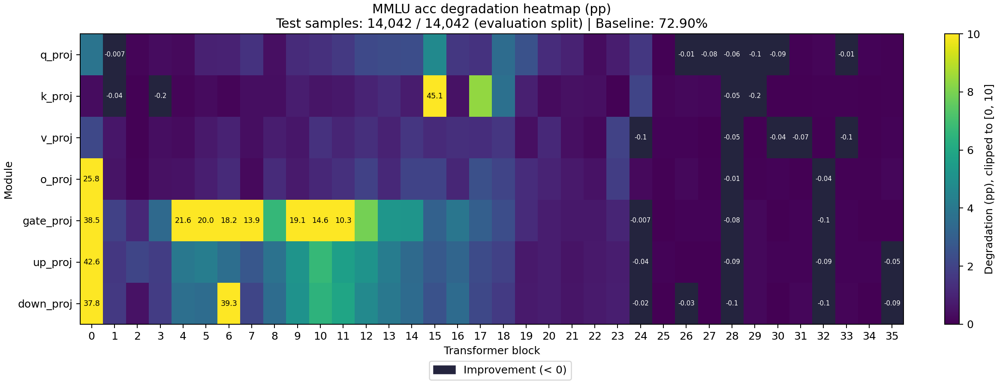

# Sensitivity Report

- Task: `mmlu`
- Dataset: `mmlu`
- Split: `lm-eval`
- Preprocessing: `lm-eval-default-shot`
- Evaluated examples: 14042
- Total evaluation examples: 14042
- Baseline evaluation seconds: 223.011

## Baseline Metrics

| Metric | Value |
|---|---:|
| acc | 0.728956 |

## Cases

| Case | Targets | Model Compression Ratio | Tensor Size Ratio | Compression Seconds | Evaluation Seconds |
|---|---:|---:|---:|---:|---:|
| model.layers.0.self_attn.q_proj | 1 | 1.00176 | 1.00176 | 0.0856898 | 218.983 |
| model.layers.0.self_attn.k_proj | 1 | 1.00036 | 1.00036 | 0.0317622 | 218.293 |
| model.layers.0.self_attn.v_proj | 1 | 1.00036 | 1.00036 | 0.0307584 | 218.419 |
| model.layers.0.self_attn.o_proj | 1 | 1.00176 | 1.00176 | 0.050667 | 220.563 |
| model.layers.0.mlp.gate_proj | 1 | 1.00588 | 1.00588 | 0.139595 | 223.226 |
| model.layers.0.mlp.up_proj | 1 | 1.00588 | 1.00588 | 0.138732 | 222.898 |
| model.layers.0.mlp.down_proj | 1 | 1.00588 | 1.00588 | 0.136212 | 220.707 |
| model.layers.1.self_attn.q_proj | 1 | 1.00176 | 1.00176 | 0.053418 | 219.129 |
| model.layers.1.self_attn.k_proj | 1 | 1.00036 | 1.00036 | 0.0308706 | 219.394 |
| model.layers.1.self_attn.v_proj | 1 | 1.00036 | 1.00036 | 0.0303564 | 219.058 |
| model.layers.1.self_attn.o_proj | 1 | 1.00176 | 1.00176 | 0.0506537 | 218.952 |
| model.layers.1.mlp.gate_proj | 1 | 1.00588 | 1.00588 | 0.140312 | 223.408 |
| model.layers.1.mlp.up_proj | 1 | 1.00588 | 1.00588 | 0.136856 | 222.244 |
| model.layers.1.mlp.down_proj | 1 | 1.00588 | 1.00588 | 0.135776 | 220.289 |
| model.layers.2.self_attn.q_proj | 1 | 1.00176 | 1.00176 | 0.0509451 | 217.955 |
| model.layers.2.self_attn.k_proj | 1 | 1.00036 | 1.00036 | 0.031553 | 218.994 |
| model.layers.2.self_attn.v_proj | 1 | 1.00036 | 1.00036 | 0.0304398 | 218.428 |
| model.layers.2.self_attn.o_proj | 1 | 1.00176 | 1.00176 | 0.0514163 | 219.636 |
| model.layers.2.mlp.gate_proj | 1 | 1.00588 | 1.00588 | 0.136465 | 222.559 |
| model.layers.2.mlp.up_proj | 1 | 1.00588 | 1.00588 | 0.135073 | 223.728 |
| model.layers.2.mlp.down_proj | 1 | 1.00588 | 1.00588 | 0.137355 | 221.847 |
| model.layers.3.self_attn.q_proj | 1 | 1.00176 | 1.00176 | 0.0499485 | 219.612 |
| model.layers.3.self_attn.k_proj | 1 | 1.00036 | 1.00036 | 0.0308405 | 218.842 |
| model.layers.3.self_attn.v_proj | 1 | 1.00036 | 1.00036 | 0.0303093 | 218.607 |
| model.layers.3.self_attn.o_proj | 1 | 1.00176 | 1.00176 | 0.0506737 | 218.831 |
| model.layers.3.mlp.gate_proj | 1 | 1.00588 | 1.00588 | 0.141183 | 222.807 |
| model.layers.3.mlp.up_proj | 1 | 1.00588 | 1.00588 | 0.135047 | 222.054 |
| model.layers.3.mlp.down_proj | 1 | 1.00588 | 1.00588 | 0.135393 | 220.631 |
| model.layers.4.self_attn.q_proj | 1 | 1.00176 | 1.00176 | 0.0513114 | 219.564 |
| model.layers.4.self_attn.k_proj | 1 | 1.00036 | 1.00036 | 0.030556 | 219.624 |
| model.layers.4.self_attn.v_proj | 1 | 1.00036 | 1.00036 | 0.0299969 | 219.222 |
| model.layers.4.self_attn.o_proj | 1 | 1.00176 | 1.00176 | 0.051264 | 219.208 |
| model.layers.4.mlp.gate_proj | 1 | 1.00588 | 1.00588 | 0.138401 | 222.387 |
| model.layers.4.mlp.up_proj | 1 | 1.00588 | 1.00588 | 0.136268 | 222.553 |
| model.layers.4.mlp.down_proj | 1 | 1.00588 | 1.00588 | 0.136136 | 223.272 |
| model.layers.5.self_attn.q_proj | 1 | 1.00176 | 1.00176 | 0.05396 | 219.346 |
| model.layers.5.self_attn.k_proj | 1 | 1.00036 | 1.00036 | 0.0306142 | 219.314 |
| model.layers.5.self_attn.v_proj | 1 | 1.00036 | 1.00036 | 0.0304144 | 221.231 |
| model.layers.5.self_attn.o_proj | 1 | 1.00176 | 1.00176 | 0.0539296 | 218.441 |
| model.layers.5.mlp.gate_proj | 1 | 1.00588 | 1.00588 | 0.139294 | 222.94 |
| model.layers.5.mlp.up_proj | 1 | 1.00588 | 1.00588 | 0.139319 | 223.146 |
| model.layers.5.mlp.down_proj | 1 | 1.00588 | 1.00588 | 0.138123 | 220.804 |
| model.layers.6.self_attn.q_proj | 1 | 1.00176 | 1.00176 | 0.0507207 | 219.503 |
| model.layers.6.self_attn.k_proj | 1 | 1.00036 | 1.00036 | 0.0309475 | 218.852 |
| model.layers.6.self_attn.v_proj | 1 | 1.00036 | 1.00036 | 0.0300215 | 219.155 |
| model.layers.6.self_attn.o_proj | 1 | 1.00176 | 1.00176 | 0.0504834 | 220.415 |
| model.layers.6.mlp.gate_proj | 1 | 1.00588 | 1.00588 | 0.138782 | 223.501 |
| model.layers.6.mlp.up_proj | 1 | 1.00588 | 1.00588 | 0.138641 | 223.632 |
| model.layers.6.mlp.down_proj | 1 | 1.00588 | 1.00588 | 0.138819 | 220.928 |
| model.layers.7.self_attn.q_proj | 1 | 1.00176 | 1.00176 | 0.0503263 | 219.904 |
| model.layers.7.self_attn.k_proj | 1 | 1.00036 | 1.00036 | 0.0312754 | 218.815 |
| model.layers.7.self_attn.v_proj | 1 | 1.00036 | 1.00036 | 0.0304815 | 218.153 |
| model.layers.7.self_attn.o_proj | 1 | 1.00176 | 1.00176 | 0.050652 | 218.452 |
| model.layers.7.mlp.gate_proj | 1 | 1.00588 | 1.00588 | 0.140967 | 222.346 |
| model.layers.7.mlp.up_proj | 1 | 1.00588 | 1.00588 | 0.140362 | 222.716 |
| model.layers.7.mlp.down_proj | 1 | 1.00588 | 1.00588 | 0.138809 | 220.052 |
| model.layers.8.self_attn.q_proj | 1 | 1.00176 | 1.00176 | 0.0511354 | 219.138 |
| model.layers.8.self_attn.k_proj | 1 | 1.00036 | 1.00036 | 0.0308031 | 218.228 |
| model.layers.8.self_attn.v_proj | 1 | 1.00036 | 1.00036 | 0.0304406 | 218.021 |
| model.layers.8.self_attn.o_proj | 1 | 1.00176 | 1.00176 | 0.0513848 | 218.85 |
| model.layers.8.mlp.gate_proj | 1 | 1.00588 | 1.00588 | 0.139384 | 223.02 |
| model.layers.8.mlp.up_proj | 1 | 1.00588 | 1.00588 | 0.138421 | 222.062 |
| model.layers.8.mlp.down_proj | 1 | 1.00588 | 1.00588 | 0.139949 | 220.289 |
| model.layers.9.self_attn.q_proj | 1 | 1.00176 | 1.00176 | 0.0504987 | 218.837 |
| model.layers.9.self_attn.k_proj | 1 | 1.00036 | 1.00036 | 0.0300833 | 218.311 |
| model.layers.9.self_attn.v_proj | 1 | 1.00036 | 1.00036 | 0.0303237 | 219.011 |
| model.layers.9.self_attn.o_proj | 1 | 1.00176 | 1.00176 | 0.0509009 | 219.837 |
| model.layers.9.mlp.gate_proj | 1 | 1.00588 | 1.00588 | 0.139334 | 223.143 |
| model.layers.9.mlp.up_proj | 1 | 1.00588 | 1.00588 | 0.139017 | 224.293 |
| model.layers.9.mlp.down_proj | 1 | 1.00588 | 1.00588 | 0.138345 | 220.751 |
| model.layers.10.self_attn.q_proj | 1 | 1.00176 | 1.00176 | 0.0506831 | 218.982 |
| model.layers.10.self_attn.k_proj | 1 | 1.00036 | 1.00036 | 0.0306861 | 220.091 |
| model.layers.10.self_attn.v_proj | 1 | 1.00036 | 1.00036 | 0.0303806 | 219.075 |
| model.layers.10.self_attn.o_proj | 1 | 1.00176 | 1.00176 | 0.0505348 | 218.835 |
| model.layers.10.mlp.gate_proj | 1 | 1.00588 | 1.00588 | 0.140113 | 224.218 |
| model.layers.10.mlp.up_proj | 1 | 1.00588 | 1.00588 | 0.139666 | 223.037 |
| model.layers.10.mlp.down_proj | 1 | 1.00588 | 1.00588 | 0.138661 | 220.938 |
| model.layers.11.self_attn.q_proj | 1 | 1.00176 | 1.00176 | 0.0506355 | 219.694 |
| model.layers.11.self_attn.k_proj | 1 | 1.00036 | 1.00036 | 0.030637 | 220.036 |
| model.layers.11.self_attn.v_proj | 1 | 1.00036 | 1.00036 | 0.0304839 | 219.685 |
| model.layers.11.self_attn.o_proj | 1 | 1.00176 | 1.00176 | 0.0505981 | 219.065 |
| model.layers.11.mlp.gate_proj | 1 | 1.00588 | 1.00588 | 0.142867 | 222.631 |
| model.layers.11.mlp.up_proj | 1 | 1.00588 | 1.00588 | 0.138746 | 222.813 |
| model.layers.11.mlp.down_proj | 1 | 1.00588 | 1.00588 | 0.138747 | 220.802 |
| model.layers.12.self_attn.q_proj | 1 | 1.00176 | 1.00176 | 0.0503029 | 218.938 |
| model.layers.12.self_attn.k_proj | 1 | 1.00036 | 1.00036 | 0.0324608 | 219.037 |
| model.layers.12.self_attn.v_proj | 1 | 1.00036 | 1.00036 | 0.0301033 | 218.84 |
| model.layers.12.self_attn.o_proj | 1 | 1.00176 | 1.00176 | 0.054797 | 218.549 |
| model.layers.12.mlp.gate_proj | 1 | 1.00588 | 1.00588 | 0.139635 | 222.441 |
| model.layers.12.mlp.up_proj | 1 | 1.00588 | 1.00588 | 0.138651 | 223.188 |
| model.layers.12.mlp.down_proj | 1 | 1.00588 | 1.00588 | 0.140067 | 220.837 |
| model.layers.13.self_attn.q_proj | 1 | 1.00176 | 1.00176 | 0.0506004 | 219.597 |
| model.layers.13.self_attn.k_proj | 1 | 1.00036 | 1.00036 | 0.0306912 | 218.659 |
| model.layers.13.self_attn.v_proj | 1 | 1.00036 | 1.00036 | 0.0300474 | 219.138 |
| model.layers.13.self_attn.o_proj | 1 | 1.00176 | 1.00176 | 0.0514077 | 218.824 |
| model.layers.13.mlp.gate_proj | 1 | 1.00588 | 1.00588 | 0.139769 | 222.513 |
| model.layers.13.mlp.up_proj | 1 | 1.00588 | 1.00588 | 0.13937 | 222.715 |
| model.layers.13.mlp.down_proj | 1 | 1.00588 | 1.00588 | 0.139555 | 221.879 |
| model.layers.14.self_attn.q_proj | 1 | 1.00176 | 1.00176 | 0.0512497 | 219.193 |
| model.layers.14.self_attn.k_proj | 1 | 1.00036 | 1.00036 | 0.0306205 | 218.916 |
| model.layers.14.self_attn.v_proj | 1 | 1.00036 | 1.00036 | 0.0305226 | 218.356 |
| model.layers.14.self_attn.o_proj | 1 | 1.00176 | 1.00176 | 0.052087 | 219.076 |
| model.layers.14.mlp.gate_proj | 1 | 1.00588 | 1.00588 | 0.138802 | 225.259 |
| model.layers.14.mlp.up_proj | 1 | 1.00588 | 1.00588 | 0.139943 | 222.894 |
| model.layers.14.mlp.down_proj | 1 | 1.00588 | 1.00588 | 0.148335 | 221.117 |
| model.layers.15.self_attn.q_proj | 1 | 1.00176 | 1.00176 | 0.0504218 | 219.131 |
| model.layers.15.self_attn.k_proj | 1 | 1.00036 | 1.00036 | 0.0308981 | 219.378 |
| model.layers.15.self_attn.v_proj | 1 | 1.00036 | 1.00036 | 0.0301921 | 218.189 |
| model.layers.15.self_attn.o_proj | 1 | 1.00176 | 1.00176 | 0.0502637 | 221.772 |
| model.layers.15.mlp.gate_proj | 1 | 1.00588 | 1.00588 | 0.136441 | 222.687 |
| model.layers.15.mlp.up_proj | 1 | 1.00588 | 1.00588 | 0.138762 | 222.87 |
| model.layers.15.mlp.down_proj | 1 | 1.00588 | 1.00588 | 0.138114 | 220.376 |
| model.layers.16.self_attn.q_proj | 1 | 1.00176 | 1.00176 | 0.0506032 | 219.613 |
| model.layers.16.self_attn.k_proj | 1 | 1.00036 | 1.00036 | 0.0325512 | 218.914 |
| model.layers.16.self_attn.v_proj | 1 | 1.00036 | 1.00036 | 0.0301787 | 218.495 |
| model.layers.16.self_attn.o_proj | 1 | 1.00176 | 1.00176 | 0.0503562 | 218.841 |
| model.layers.16.mlp.gate_proj | 1 | 1.00588 | 1.00588 | 0.138413 | 222.725 |
| model.layers.16.mlp.up_proj | 1 | 1.00588 | 1.00588 | 0.138618 | 222.881 |
| model.layers.16.mlp.down_proj | 1 | 1.00588 | 1.00588 | 0.139724 | 219.992 |
| model.layers.17.self_attn.q_proj | 1 | 1.00176 | 1.00176 | 0.0508547 | 218.924 |
| model.layers.17.self_attn.k_proj | 1 | 1.00036 | 1.00036 | 0.0304923 | 218.586 |
| model.layers.17.self_attn.v_proj | 1 | 1.00036 | 1.00036 | 0.0305369 | 218.596 |
| model.layers.17.self_attn.o_proj | 1 | 1.00176 | 1.00176 | 0.0510345 | 219.968 |
| model.layers.17.mlp.gate_proj | 1 | 1.00588 | 1.00588 | 0.138791 | 221.905 |
| model.layers.17.mlp.up_proj | 1 | 1.00588 | 1.00588 | 0.139974 | 222.07 |
| model.layers.17.mlp.down_proj | 1 | 1.00588 | 1.00588 | 0.138574 | 221.175 |
| model.layers.18.self_attn.q_proj | 1 | 1.00176 | 1.00176 | 0.0504585 | 219.459 |
| model.layers.18.self_attn.k_proj | 1 | 1.00036 | 1.00036 | 0.0299987 | 218.006 |
| model.layers.18.self_attn.v_proj | 1 | 1.00036 | 1.00036 | 0.0316329 | 218.826 |
| model.layers.18.self_attn.o_proj | 1 | 1.00176 | 1.00176 | 0.0508286 | 219.14 |
| model.layers.18.mlp.gate_proj | 1 | 1.00588 | 1.00588 | 0.138469 | 222.612 |
| model.layers.18.mlp.up_proj | 1 | 1.00588 | 1.00588 | 0.138504 | 223.339 |
| model.layers.18.mlp.down_proj | 1 | 1.00588 | 1.00588 | 0.138478 | 220.818 |
| model.layers.19.self_attn.q_proj | 1 | 1.00176 | 1.00176 | 0.0504852 | 219.611 |
| model.layers.19.self_attn.k_proj | 1 | 1.00036 | 1.00036 | 0.0302621 | 218.401 |
| model.layers.19.self_attn.v_proj | 1 | 1.00036 | 1.00036 | 0.0304756 | 218.616 |
| model.layers.19.self_attn.o_proj | 1 | 1.00176 | 1.00176 | 0.049884 | 218.444 |
| model.layers.19.mlp.gate_proj | 1 | 1.00588 | 1.00588 | 0.138592 | 222.845 |
| model.layers.19.mlp.up_proj | 1 | 1.00588 | 1.00588 | 0.139085 | 223.04 |
| model.layers.19.mlp.down_proj | 1 | 1.00588 | 1.00588 | 0.138143 | 222.976 |
| model.layers.20.self_attn.q_proj | 1 | 1.00176 | 1.00176 | 0.0502215 | 218.731 |
| model.layers.20.self_attn.k_proj | 1 | 1.00036 | 1.00036 | 0.0304525 | 218.683 |
| model.layers.20.self_attn.v_proj | 1 | 1.00036 | 1.00036 | 0.0309484 | 218.595 |
| model.layers.20.self_attn.o_proj | 1 | 1.00176 | 1.00176 | 0.0505859 | 218.74 |
| model.layers.20.mlp.gate_proj | 1 | 1.00588 | 1.00588 | 0.13808 | 223.393 |
| model.layers.20.mlp.up_proj | 1 | 1.00588 | 1.00588 | 0.139156 | 223.867 |
| model.layers.20.mlp.down_proj | 1 | 1.00588 | 1.00588 | 0.136844 | 220.329 |
| model.layers.21.self_attn.q_proj | 1 | 1.00176 | 1.00176 | 0.0503254 | 218.438 |
| model.layers.21.self_attn.k_proj | 1 | 1.00036 | 1.00036 | 0.0305433 | 220.924 |
| model.layers.21.self_attn.v_proj | 1 | 1.00036 | 1.00036 | 0.0300211 | 217.921 |
| model.layers.21.self_attn.o_proj | 1 | 1.00176 | 1.00176 | 0.0503623 | 218.32 |
| model.layers.21.mlp.gate_proj | 1 | 1.00588 | 1.00588 | 0.139324 | 223.529 |
| model.layers.21.mlp.up_proj | 1 | 1.00588 | 1.00588 | 0.151275 | 221.804 |
| model.layers.21.mlp.down_proj | 1 | 1.00588 | 1.00588 | 0.138167 | 220.205 |
| model.layers.22.self_attn.q_proj | 1 | 1.00176 | 1.00176 | 0.0502806 | 218.775 |
| model.layers.22.self_attn.k_proj | 1 | 1.00036 | 1.00036 | 0.0304407 | 219.102 |
| model.layers.22.self_attn.v_proj | 1 | 1.00036 | 1.00036 | 0.0303291 | 218.486 |
| model.layers.22.self_attn.o_proj | 1 | 1.00176 | 1.00176 | 0.0504035 | 221.135 |
| model.layers.22.mlp.gate_proj | 1 | 1.00588 | 1.00588 | 0.138409 | 221.623 |
| model.layers.22.mlp.up_proj | 1 | 1.00588 | 1.00588 | 0.146289 | 222.57 |
| model.layers.22.mlp.down_proj | 1 | 1.00588 | 1.00588 | 0.139081 | 220.413 |
| model.layers.23.self_attn.q_proj | 1 | 1.00176 | 1.00176 | 0.0507514 | 218.254 |
| model.layers.23.self_attn.k_proj | 1 | 1.00036 | 1.00036 | 0.0301086 | 219.412 |
| model.layers.23.self_attn.v_proj | 1 | 1.00036 | 1.00036 | 0.0302938 | 218.892 |
| model.layers.23.self_attn.o_proj | 1 | 1.00176 | 1.00176 | 0.0504561 | 219.508 |
| model.layers.23.mlp.gate_proj | 1 | 1.00588 | 1.00588 | 0.139072 | 222.494 |
| model.layers.23.mlp.up_proj | 1 | 1.00588 | 1.00588 | 0.1442 | 222.172 |
| model.layers.23.mlp.down_proj | 1 | 1.00588 | 1.00588 | 0.13774 | 220.429 |
| model.layers.24.self_attn.q_proj | 1 | 1.00176 | 1.00176 | 0.0498711 | 219.578 |
| model.layers.24.self_attn.k_proj | 1 | 1.00036 | 1.00036 | 0.0303218 | 218.445 |
| model.layers.24.self_attn.v_proj | 1 | 1.00036 | 1.00036 | 0.0302403 | 218.836 |
| model.layers.24.self_attn.o_proj | 1 | 1.00176 | 1.00176 | 0.0503554 | 218.944 |
| model.layers.24.mlp.gate_proj | 1 | 1.00588 | 1.00588 | 0.139408 | 223.388 |
| model.layers.24.mlp.up_proj | 1 | 1.00588 | 1.00588 | 0.142916 | 223.244 |
| model.layers.24.mlp.down_proj | 1 | 1.00588 | 1.00588 | 0.147227 | 221.81 |
| model.layers.25.self_attn.q_proj | 1 | 1.00176 | 1.00176 | 0.050557 | 219.354 |
| model.layers.25.self_attn.k_proj | 1 | 1.00036 | 1.00036 | 0.0312796 | 218.081 |
| model.layers.25.self_attn.v_proj | 1 | 1.00036 | 1.00036 | 0.0314637 | 219.269 |
| model.layers.25.self_attn.o_proj | 1 | 1.00176 | 1.00176 | 0.0515731 | 219.071 |
| model.layers.25.mlp.gate_proj | 1 | 1.00588 | 1.00588 | 0.138864 | 222.408 |
| model.layers.25.mlp.up_proj | 1 | 1.00588 | 1.00588 | 0.138746 | 221.463 |
| model.layers.25.mlp.down_proj | 1 | 1.00588 | 1.00588 | 0.138183 | 219.529 |
| model.layers.26.self_attn.q_proj | 1 | 1.00176 | 1.00176 | 0.0504984 | 219.311 |
| model.layers.26.self_attn.k_proj | 1 | 1.00036 | 1.00036 | 0.0305805 | 217.951 |
| model.layers.26.self_attn.v_proj | 1 | 1.00036 | 1.00036 | 0.0304489 | 217.912 |
| model.layers.26.self_attn.o_proj | 1 | 1.00176 | 1.00176 | 0.0504338 | 219.54 |
| model.layers.26.mlp.gate_proj | 1 | 1.00588 | 1.00588 | 0.13885 | 222.37 |
| model.layers.26.mlp.up_proj | 1 | 1.00588 | 1.00588 | 0.13902 | 222.63 |
| model.layers.26.mlp.down_proj | 1 | 1.00588 | 1.00588 | 0.138995 | 221.541 |
| model.layers.27.self_attn.q_proj | 1 | 1.00176 | 1.00176 | 0.0508397 | 219.389 |
| model.layers.27.self_attn.k_proj | 1 | 1.00036 | 1.00036 | 0.0313123 | 219.006 |
| model.layers.27.self_attn.v_proj | 1 | 1.00036 | 1.00036 | 0.03056 | 219.478 |
| model.layers.27.self_attn.o_proj | 1 | 1.00176 | 1.00176 | 0.0507719 | 219.027 |
| model.layers.27.mlp.gate_proj | 1 | 1.00588 | 1.00588 | 0.139498 | 222.488 |
| model.layers.27.mlp.up_proj | 1 | 1.00588 | 1.00588 | 0.138507 | 224.501 |
| model.layers.27.mlp.down_proj | 1 | 1.00588 | 1.00588 | 0.138987 | 220.981 |
| model.layers.28.self_attn.q_proj | 1 | 1.00176 | 1.00176 | 0.0500159 | 218.908 |
| model.layers.28.self_attn.k_proj | 1 | 1.00036 | 1.00036 | 0.0305498 | 219.92 |
| model.layers.28.self_attn.v_proj | 1 | 1.00036 | 1.00036 | 0.0320012 | 218.699 |
| model.layers.28.self_attn.o_proj | 1 | 1.00176 | 1.00176 | 0.0547763 | 219.519 |
| model.layers.28.mlp.gate_proj | 1 | 1.00588 | 1.00588 | 0.139481 | 223.978 |
| model.layers.28.mlp.up_proj | 1 | 1.00588 | 1.00588 | 0.148152 | 222.466 |
| model.layers.28.mlp.down_proj | 1 | 1.00588 | 1.00588 | 0.139559 | 221.091 |
| model.layers.29.self_attn.q_proj | 1 | 1.00176 | 1.00176 | 0.0504426 | 218.651 |
| model.layers.29.self_attn.k_proj | 1 | 1.00036 | 1.00036 | 0.0298555 | 218.548 |
| model.layers.29.self_attn.v_proj | 1 | 1.00036 | 1.00036 | 0.0302798 | 218.679 |
| model.layers.29.self_attn.o_proj | 1 | 1.00176 | 1.00176 | 0.0530258 | 220.114 |
| model.layers.29.mlp.gate_proj | 1 | 1.00588 | 1.00588 | 0.139523 | 222.375 |
| model.layers.29.mlp.up_proj | 1 | 1.00588 | 1.00588 | 0.138964 | 223.582 |
| model.layers.29.mlp.down_proj | 1 | 1.00588 | 1.00588 | 0.136114 | 220.4 |
| model.layers.30.self_attn.q_proj | 1 | 1.00176 | 1.00176 | 0.0513903 | 218.997 |
| model.layers.30.self_attn.k_proj | 1 | 1.00036 | 1.00036 | 0.0303858 | 218.99 |
| model.layers.30.self_attn.v_proj | 1 | 1.00036 | 1.00036 | 0.0302192 | 217.848 |
| model.layers.30.self_attn.o_proj | 1 | 1.00176 | 1.00176 | 0.05074 | 219.873 |
| model.layers.30.mlp.gate_proj | 1 | 1.00588 | 1.00588 | 0.138841 | 222.237 |
| model.layers.30.mlp.up_proj | 1 | 1.00588 | 1.00588 | 0.138734 | 222.463 |
| model.layers.30.mlp.down_proj | 1 | 1.00588 | 1.00588 | 0.13819 | 220.21 |
| model.layers.31.self_attn.q_proj | 1 | 1.00176 | 1.00176 | 0.0558633 | 218.755 |
| model.layers.31.self_attn.k_proj | 1 | 1.00036 | 1.00036 | 0.0301529 | 218.74 |
| model.layers.31.self_attn.v_proj | 1 | 1.00036 | 1.00036 | 0.030697 | 219.373 |
| model.layers.31.self_attn.o_proj | 1 | 1.00176 | 1.00176 | 0.0520262 | 219.527 |
| model.layers.31.mlp.gate_proj | 1 | 1.00588 | 1.00588 | 0.149706 | 223.153 |
| model.layers.31.mlp.up_proj | 1 | 1.00588 | 1.00588 | 0.13941 | 222.38 |
| model.layers.31.mlp.down_proj | 1 | 1.00588 | 1.00588 | 0.143169 | 220.316 |
| model.layers.32.self_attn.q_proj | 1 | 1.00176 | 1.00176 | 0.0498112 | 218.544 |
| model.layers.32.self_attn.k_proj | 1 | 1.00036 | 1.00036 | 0.0301609 | 217.747 |
| model.layers.32.self_attn.v_proj | 1 | 1.00036 | 1.00036 | 0.0309092 | 218.258 |
| model.layers.32.self_attn.o_proj | 1 | 1.00176 | 1.00176 | 0.0504792 | 218.231 |
| model.layers.32.mlp.gate_proj | 1 | 1.00588 | 1.00588 | 0.136469 | 222.87 |
| model.layers.32.mlp.up_proj | 1 | 1.00588 | 1.00588 | 0.136349 | 222.39 |
| model.layers.32.mlp.down_proj | 1 | 1.00588 | 1.00588 | 0.138663 | 221.438 |
| model.layers.33.self_attn.q_proj | 1 | 1.00176 | 1.00176 | 0.0520247 | 218.983 |
| model.layers.33.self_attn.k_proj | 1 | 1.00036 | 1.00036 | 0.0301341 | 218.37 |
| model.layers.33.self_attn.v_proj | 1 | 1.00036 | 1.00036 | 0.030623 | 218.61 |
| model.layers.33.self_attn.o_proj | 1 | 1.00176 | 1.00176 | 0.0509282 | 218.679 |
| model.layers.33.mlp.gate_proj | 1 | 1.00588 | 1.00588 | 0.138587 | 223.582 |
| model.layers.33.mlp.up_proj | 1 | 1.00588 | 1.00588 | 0.139489 | 222.843 |
| model.layers.33.mlp.down_proj | 1 | 1.00588 | 1.00588 | 0.139033 | 221.375 |
| model.layers.34.self_attn.q_proj | 1 | 1.00176 | 1.00176 | 0.0517408 | 219.629 |
| model.layers.34.self_attn.k_proj | 1 | 1.00036 | 1.00036 | 0.0320781 | 218.406 |
| model.layers.34.self_attn.v_proj | 1 | 1.00036 | 1.00036 | 0.0306857 | 218.912 |
| model.layers.34.self_attn.o_proj | 1 | 1.00176 | 1.00176 | 0.0508759 | 219.154 |
| model.layers.34.mlp.gate_proj | 1 | 1.00588 | 1.00588 | 0.139564 | 222.27 |
| model.layers.34.mlp.up_proj | 1 | 1.00588 | 1.00588 | 0.139376 | 224.715 |
| model.layers.34.mlp.down_proj | 1 | 1.00588 | 1.00588 | 0.138112 | 220.462 |
| model.layers.35.self_attn.q_proj | 1 | 1.00176 | 1.00176 | 0.0509454 | 218.684 |
| model.layers.35.self_attn.k_proj | 1 | 1.00036 | 1.00036 | 0.0303218 | 220.685 |
| model.layers.35.self_attn.v_proj | 1 | 1.00036 | 1.00036 | 0.0300925 | 218.644 |
| model.layers.35.self_attn.o_proj | 1 | 1.00176 | 1.00176 | 0.0509116 | 219.412 |
| model.layers.35.mlp.gate_proj | 1 | 1.00588 | 1.00588 | 0.139729 | 224.072 |
| model.layers.35.mlp.up_proj | 1 | 1.00588 | 1.00588 | 0.136436 | 223.799 |
| model.layers.35.mlp.down_proj | 1 | 1.00588 | 1.00588 | 0.137889 | 220.161 |

## Metrics

| Case | Metric | Value | Degradation |
|---|---|---:|---:|
| model.layers.0.self_attn.q_proj | acc | 0.690571 | 0.0383848 |
| model.layers.0.self_attn.k_proj | acc | 0.725466 | 0.00348953 |
| model.layers.0.self_attn.v_proj | acc | 0.707235 | 0.0217206 |
| model.layers.0.self_attn.o_proj | acc | 0.470659 | 0.258297 |
| model.layers.0.mlp.gate_proj | acc | 0.343968 | 0.384988 |
| model.layers.0.mlp.up_proj | acc | 0.302735 | 0.426221 |
| model.layers.0.mlp.down_proj | acc | 0.351446 | 0.37751 |
| model.layers.1.self_attn.q_proj | acc | 0.729027 | -7.12149e-05 |
| model.layers.1.self_attn.k_proj | acc | 0.729383 | -0.00042729 |
| model.layers.1.self_attn.v_proj | acc | 0.722903 | 0.00605327 |
| model.layers.1.self_attn.o_proj | acc | 0.723686 | 0.0052699 |
| model.layers.1.mlp.gate_proj | acc | 0.709586 | 0.0193705 |
| model.layers.1.mlp.up_proj | acc | 0.712861 | 0.0160946 |
| model.layers.1.mlp.down_proj | acc | 0.712292 | 0.0166643 |
| model.layers.2.self_attn.q_proj | acc | 0.727603 | 0.00135308 |
| model.layers.2.self_attn.k_proj | acc | 0.728529 | 0.00042729 |
| model.layers.2.self_attn.v_proj | acc | 0.728386 | 0.000569719 |
| model.layers.2.self_attn.o_proj | acc | 0.728173 | 0.000783364 |
| model.layers.2.mlp.gate_proj | acc | 0.717704 | 0.011252 |
| model.layers.2.mlp.up_proj | acc | 0.708019 | 0.0209372 |
| model.layers.2.mlp.down_proj | acc | 0.724113 | 0.00484262 |
| model.layers.3.self_attn.q_proj | acc | 0.725538 | 0.00341832 |
| model.layers.3.self_attn.k_proj | acc | 0.730523 | -0.00156673 |
| model.layers.3.self_attn.v_proj | acc | 0.725182 | 0.00377439 |
| model.layers.3.self_attn.o_proj | acc | 0.724469 | 0.00448654 |
| model.layers.3.mlp.gate_proj | acc | 0.694702 | 0.0342544 |
| model.layers.3.mlp.up_proj | acc | 0.710939 | 0.0180174 |
| model.layers.3.mlp.down_proj | acc | 0.711366 | 0.0175901 |
| model.layers.4.self_attn.q_proj | acc | 0.726321 | 0.00263495 |
| model.layers.4.self_attn.k_proj | acc | 0.727603 | 0.00135308 |
| model.layers.4.self_attn.v_proj | acc | 0.726036 | 0.00291981 |
| model.layers.4.self_attn.o_proj | acc | 0.724256 | 0.00470019 |
| model.layers.4.mlp.gate_proj | acc | 0.513246 | 0.21571 |
| model.layers.4.mlp.up_proj | acc | 0.689004 | 0.0399516 |
| model.layers.4.mlp.down_proj | acc | 0.692352 | 0.0366045 |
| model.layers.5.self_attn.q_proj | acc | 0.71984 | 0.00911551 |
| model.layers.5.self_attn.k_proj | acc | 0.725965 | 0.00299103 |
| model.layers.5.self_attn.v_proj | acc | 0.722119 | 0.00683663 |
| model.layers.5.self_attn.o_proj | acc | 0.720695 | 0.00826093 |
| model.layers.5.mlp.gate_proj | acc | 0.528557 | 0.200399 |
| model.layers.5.mlp.up_proj | acc | 0.686654 | 0.0423017 |
| model.layers.5.mlp.down_proj | acc | 0.693491 | 0.035465 |
| model.layers.6.self_attn.q_proj | acc | 0.719342 | 0.00961402 |
| model.layers.6.self_attn.k_proj | acc | 0.727674 | 0.00128187 |
| model.layers.6.self_attn.v_proj | acc | 0.719556 | 0.00940037 |
| model.layers.6.self_attn.o_proj | acc | 0.717063 | 0.0118929 |
| model.layers.6.mlp.gate_proj | acc | 0.547215 | 0.18174 |
| model.layers.6.mlp.up_proj | acc | 0.692921 | 0.0360348 |
| model.layers.6.mlp.down_proj | acc | 0.33585 | 0.393106 |
| model.layers.7.self_attn.q_proj | acc | 0.714286 | 0.0146703 |
| model.layers.7.self_attn.k_proj | acc | 0.725253 | 0.00370318 |
| model.layers.7.self_attn.v_proj | acc | 0.72511 | 0.00384561 |
| model.layers.7.self_attn.o_proj | acc | 0.72625 | 0.00270617 |
| model.layers.7.mlp.gate_proj | acc | 0.58966 | 0.139296 |
| model.layers.7.mlp.up_proj | acc | 0.701681 | 0.0272753 |
| model.layers.7.mlp.down_proj | acc | 0.70809 | 0.020866 |
| model.layers.8.self_attn.q_proj | acc | 0.724754 | 0.00420168 |
| model.layers.8.self_attn.k_proj | acc | 0.725324 | 0.00363196 |
| model.layers.8.self_attn.v_proj | acc | 0.721051 | 0.00790486 |
| model.layers.8.self_attn.o_proj | acc | 0.716636 | 0.0123202 |
| model.layers.8.mlp.gate_proj | acc | 0.662299 | 0.0666572 |
| model.layers.8.mlp.up_proj | acc | 0.691355 | 0.0376015 |
| model.layers.8.mlp.down_proj | acc | 0.693705 | 0.0352514 |
| model.layers.9.self_attn.q_proj | acc | 0.716565 | 0.0123914 |
| model.layers.9.self_attn.k_proj | acc | 0.720837 | 0.0081185 |
| model.layers.9.self_attn.v_proj | acc | 0.722974 | 0.00598205 |
| model.layers.9.self_attn.o_proj | acc | 0.721621 | 0.00733514 |
| model.layers.9.mlp.gate_proj | acc | 0.537673 | 0.191283 |
| model.layers.9.mlp.up_proj | acc | 0.677183 | 0.0517733 |
| model.layers.9.mlp.down_proj | acc | 0.677824 | 0.0511323 |
| model.layers.10.self_attn.q_proj | acc | 0.71514 | 0.0138157 |
| model.layers.10.self_attn.k_proj | acc | 0.723401 | 0.00555476 |
| model.layers.10.self_attn.v_proj | acc | 0.714784 | 0.0141718 |
| model.layers.10.self_attn.o_proj | acc | 0.717846 | 0.0111095 |
| model.layers.10.mlp.gate_proj | acc | 0.582681 | 0.146275 |
| model.layers.10.mlp.up_proj | acc | 0.662156 | 0.0667996 |
| model.layers.10.mlp.down_proj | acc | 0.664435 | 0.0645207 |
| model.layers.11.self_attn.q_proj | acc | 0.712292 | 0.0166643 |
| model.layers.11.self_attn.k_proj | acc | 0.722547 | 0.00640934 |
| model.layers.11.self_attn.v_proj | acc | 0.718559 | 0.0103974 |
| model.layers.11.self_attn.o_proj | acc | 0.715212 | 0.0137445 |
| model.layers.11.mlp.gate_proj | acc | 0.625481 | 0.103475 |
| model.layers.11.mlp.up_proj | acc | 0.672696 | 0.0562598 |
| model.layers.11.mlp.down_proj | acc | 0.670061 | 0.0588947 |
| model.layers.12.self_attn.q_proj | acc | 0.707022 | 0.0219342 |
| model.layers.12.self_attn.k_proj | acc | 0.719128 | 0.00982766 |
| model.layers.12.self_attn.v_proj | acc | 0.715639 | 0.0133172 |
| model.layers.12.self_attn.o_proj | acc | 0.709799 | 0.0191568 |
| model.layers.12.mlp.gate_proj | acc | 0.649907 | 0.0790486 |
| model.layers.12.mlp.up_proj | acc | 0.67761 | 0.051346 |
| model.layers.12.mlp.down_proj | acc | 0.681812 | 0.0471443 |
| model.layers.13.self_attn.q_proj | acc | 0.705597 | 0.0233585 |
| model.layers.13.self_attn.k_proj | acc | 0.716707 | 0.012249 |
| model.layers.13.self_attn.v_proj | acc | 0.719484 | 0.00947159 |
| model.layers.13.self_attn.o_proj | acc | 0.71749 | 0.0114656 |
| model.layers.13.mlp.gate_proj | acc | 0.676257 | 0.052699 |
| model.layers.13.mlp.up_proj | acc | 0.686797 | 0.0421592 |
| model.layers.13.mlp.down_proj | acc | 0.688791 | 0.0401652 |
| model.layers.14.self_attn.q_proj | acc | 0.705241 | 0.0237146 |
| model.layers.14.self_attn.k_proj | acc | 0.721194 | 0.00776243 |
| model.layers.14.self_attn.v_proj | acc | 0.713217 | 0.0157385 |
| model.layers.14.self_attn.o_proj | acc | 0.708802 | 0.0201538 |
| model.layers.14.mlp.gate_proj | acc | 0.676613 | 0.052343 |
| model.layers.14.mlp.up_proj | acc | 0.694417 | 0.0345392 |
| model.layers.14.mlp.down_proj | acc | 0.694061 | 0.0348953 |
| model.layers.15.self_attn.q_proj | acc | 0.681598 | 0.0473579 |
| model.layers.15.self_attn.k_proj | acc | 0.278094 | 0.450862 |
| model.layers.15.self_attn.v_proj | acc | 0.717206 | 0.0117505 |
| model.layers.15.self_attn.o_proj | acc | 0.708873 | 0.0200826 |
| model.layers.15.mlp.gate_proj | acc | 0.697977 | 0.0309785 |
| model.layers.15.mlp.up_proj | acc | 0.700897 | 0.0280587 |
| model.layers.15.mlp.down_proj | acc | 0.703888 | 0.0250677 |
| model.layers.16.self_attn.q_proj | acc | 0.712648 | 0.0163082 |
| model.layers.16.self_attn.k_proj | acc | 0.724042 | 0.00491383 |
| model.layers.16.self_attn.v_proj | acc | 0.715568 | 0.0133884 |
| model.layers.16.self_attn.o_proj | acc | 0.718203 | 0.0107535 |
| model.layers.16.mlp.gate_proj | acc | 0.689717 | 0.0392394 |
| model.layers.16.mlp.up_proj | acc | 0.69634 | 0.0326164 |
| model.layers.16.mlp.down_proj | acc | 0.694132 | 0.0348241 |
| model.layers.17.self_attn.q_proj | acc | 0.714214 | 0.0147415 |
| model.layers.17.self_attn.k_proj | acc | 0.645136 | 0.08382 |
| model.layers.17.self_attn.v_proj | acc | 0.715852 | 0.0131035 |
| model.layers.17.self_attn.o_proj | acc | 0.704458 | 0.0244979 |
| model.layers.17.mlp.gate_proj | acc | 0.698547 | 0.0304088 |
| model.layers.17.mlp.up_proj | acc | 0.706238 | 0.0227176 |
| model.layers.17.mlp.down_proj | acc | 0.707164 | 0.0217918 |
| model.layers.18.self_attn.q_proj | acc | 0.693562 | 0.0353938 |
| model.layers.18.self_attn.k_proj | acc | 0.691995 | 0.0369605 |
| model.layers.18.self_attn.v_proj | acc | 0.713289 | 0.0156673 |
| model.layers.18.self_attn.o_proj | acc | 0.708589 | 0.0203675 |
| model.layers.18.mlp.gate_proj | acc | 0.705313 | 0.0236434 |
| model.layers.18.mlp.up_proj | acc | 0.709443 | 0.0195129 |
| model.layers.18.mlp.down_proj | acc | 0.712078 | 0.0168779 |
| model.layers.19.self_attn.q_proj | acc | 0.703675 | 0.0252813 |
| model.layers.19.self_attn.k_proj | acc | 0.720054 | 0.00890187 |
| model.layers.19.self_attn.v_proj | acc | 0.724897 | 0.00405925 |
| model.layers.19.self_attn.o_proj | acc | 0.716422 | 0.0125338 |
| model.layers.19.mlp.gate_proj | acc | 0.716778 | 0.0121778 |
| model.layers.19.mlp.up_proj | acc | 0.722048 | 0.00690785 |
| model.layers.19.mlp.down_proj | acc | 0.72155 | 0.00740635 |
| model.layers.20.self_attn.q_proj | acc | 0.716422 | 0.0125338 |
| model.layers.20.self_attn.k_proj | acc | 0.725965 | 0.00299103 |
| model.layers.20.self_attn.v_proj | acc | 0.717419 | 0.0115368 |
| model.layers.20.self_attn.o_proj | acc | 0.718915 | 0.0100413 |
| model.layers.20.mlp.gate_proj | acc | 0.721051 | 0.00790486 |
| model.layers.20.mlp.up_proj | acc | 0.721122 | 0.00783364 |
| model.layers.20.mlp.down_proj | acc | 0.720766 | 0.00818972 |
| model.layers.21.self_attn.q_proj | acc | 0.719556 | 0.00940037 |
| model.layers.21.self_attn.k_proj | acc | 0.724469 | 0.00448654 |
| model.layers.21.self_attn.v_proj | acc | 0.724826 | 0.00413047 |
| model.layers.21.self_attn.o_proj | acc | 0.722191 | 0.00676542 |
| model.layers.21.mlp.gate_proj | acc | 0.722618 | 0.00633813 |
| model.layers.21.mlp.up_proj | acc | 0.723615 | 0.00534112 |
| model.layers.21.mlp.down_proj | acc | 0.723401 | 0.00555476 |
| model.layers.22.self_attn.q_proj | acc | 0.725751 | 0.00320467 |
| model.layers.22.self_attn.k_proj | acc | 0.725039 | 0.00391682 |
| model.layers.22.self_attn.v_proj | acc | 0.72682 | 0.00213645 |
| model.layers.22.self_attn.o_proj | acc | 0.723971 | 0.00498504 |
| model.layers.22.mlp.gate_proj | acc | 0.722689 | 0.00626691 |
| model.layers.22.mlp.up_proj | acc | 0.722191 | 0.00676542 |
| model.layers.22.mlp.down_proj | acc | 0.721763 | 0.00719271 |
| model.layers.23.self_attn.q_proj | acc | 0.720766 | 0.00818972 |
| model.layers.23.self_attn.k_proj | acc | 0.728386 | 0.000569719 |
| model.layers.23.self_attn.v_proj | acc | 0.709158 | 0.0197977 |
| model.layers.23.self_attn.o_proj | acc | 0.710867 | 0.0180886 |
| model.layers.23.mlp.gate_proj | acc | 0.718701 | 0.0102549 |
| model.layers.23.mlp.up_proj | acc | 0.721122 | 0.00783364 |
| model.layers.23.mlp.down_proj | acc | 0.72041 | 0.00854579 |
| model.layers.24.self_attn.q_proj | acc | 0.712719 | 0.016237 |
| model.layers.24.self_attn.k_proj | acc | 0.708375 | 0.0205811 |
| model.layers.24.self_attn.v_proj | acc | 0.730452 | -0.00149551 |
| model.layers.24.self_attn.o_proj | acc | 0.726463 | 0.00249252 |
| model.layers.24.mlp.gate_proj | acc | 0.729027 | -7.12149e-05 |
| model.layers.24.mlp.up_proj | acc | 0.729312 | -0.000356075 |
| model.layers.24.mlp.down_proj | acc | 0.72917 | -0.000213645 |
| model.layers.25.self_attn.q_proj | acc | 0.728529 | 0.00042729 |
| model.layers.25.self_attn.k_proj | acc | 0.727674 | 0.00128187 |
| model.layers.25.self_attn.v_proj | acc | 0.72803 | 0.000925794 |
| model.layers.25.self_attn.o_proj | acc | 0.728529 | 0.00042729 |
| model.layers.25.mlp.gate_proj | acc | 0.728956 | 0 |
| model.layers.25.mlp.up_proj | acc | 0.728101 | 0.000854579 |
| model.layers.25.mlp.down_proj | acc | 0.728671 | 0.00028486 |
| model.layers.26.self_attn.q_proj | acc | 0.729098 | -0.00014243 |
| model.layers.26.self_attn.k_proj | acc | 0.72682 | 0.00213645 |
| model.layers.26.self_attn.v_proj | acc | 0.727959 | 0.000997009 |
| model.layers.26.self_attn.o_proj | acc | 0.72682 | 0.00213645 |
| model.layers.26.mlp.gate_proj | acc | 0.727959 | 0.000997009 |
| model.layers.26.mlp.up_proj | acc | 0.728885 | 7.12149e-05 |
| model.layers.26.mlp.down_proj | acc | 0.729241 | -0.00028486 |
| model.layers.27.self_attn.q_proj | acc | 0.729739 | -0.000783364 |
| model.layers.27.self_attn.k_proj | acc | 0.727033 | 0.0019228 |
| model.layers.27.self_attn.v_proj | acc | 0.728885 | 7.12149e-05 |
| model.layers.27.self_attn.o_proj | acc | 0.728315 | 0.000640934 |
| model.layers.27.mlp.gate_proj | acc | 0.727959 | 0.000997009 |
| model.layers.27.mlp.up_proj | acc | 0.728885 | 7.12149e-05 |
| model.layers.27.mlp.down_proj | acc | 0.7286 | 0.000356075 |
| model.layers.28.self_attn.q_proj | acc | 0.729526 | -0.000569719 |
| model.layers.28.self_attn.k_proj | acc | 0.729454 | -0.000498504 |
| model.layers.28.self_attn.v_proj | acc | 0.729454 | -0.000498504 |
| model.layers.28.self_attn.o_proj | acc | 0.729098 | -0.00014243 |
| model.layers.28.mlp.gate_proj | acc | 0.729739 | -0.000783364 |
| model.layers.28.mlp.up_proj | acc | 0.729811 | -0.000854579 |
| model.layers.28.mlp.down_proj | acc | 0.73038 | -0.0014243 |
| model.layers.29.self_attn.q_proj | acc | 0.730309 | -0.00135308 |
| model.layers.29.self_attn.k_proj | acc | 0.730879 | -0.0019228 |
| model.layers.29.self_attn.v_proj | acc | 0.7286 | 0.000356075 |
| model.layers.29.self_attn.o_proj | acc | 0.728244 | 0.000712149 |
| model.layers.29.mlp.gate_proj | acc | 0.72682 | 0.00213645 |
| model.layers.29.mlp.up_proj | acc | 0.726748 | 0.00220766 |
| model.layers.29.mlp.down_proj | acc | 0.726891 | 0.00206523 |
| model.layers.30.self_attn.q_proj | acc | 0.729882 | -0.000925794 |
| model.layers.30.self_attn.k_proj | acc | 0.728885 | 7.12149e-05 |
| model.layers.30.self_attn.v_proj | acc | 0.729383 | -0.00042729 |
| model.layers.30.self_attn.o_proj | acc | 0.728101 | 0.000854579 |
| model.layers.30.mlp.gate_proj | acc | 0.728742 | 0.000213645 |
| model.layers.30.mlp.up_proj | acc | 0.728173 | 0.000783364 |
| model.layers.30.mlp.down_proj | acc | 0.7286 | 0.000356075 |
| model.layers.31.self_attn.q_proj | acc | 0.728457 | 0.000498504 |
| model.layers.31.self_attn.k_proj | acc | 0.728671 | 0.00028486 |
| model.layers.31.self_attn.v_proj | acc | 0.729668 | -0.000712149 |
| model.layers.31.self_attn.o_proj | acc | 0.728671 | 0.00028486 |
| model.layers.31.mlp.gate_proj | acc | 0.727888 | 0.00106822 |
| model.layers.31.mlp.up_proj | acc | 0.727888 | 0.00106822 |
| model.layers.31.mlp.down_proj | acc | 0.727104 | 0.00185159 |
| model.layers.32.self_attn.q_proj | acc | 0.727745 | 0.00121065 |
| model.layers.32.self_attn.k_proj | acc | 0.728386 | 0.000569719 |
| model.layers.32.self_attn.v_proj | acc | 0.728742 | 0.000213645 |
| model.layers.32.self_attn.o_proj | acc | 0.729312 | -0.000356075 |
| model.layers.32.mlp.gate_proj | acc | 0.730238 | -0.00128187 |
| model.layers.32.mlp.up_proj | acc | 0.729811 | -0.000854579 |
| model.layers.32.mlp.down_proj | acc | 0.729953 | -0.000997009 |
| model.layers.33.self_attn.q_proj | acc | 0.729098 | -0.00014243 |
| model.layers.33.self_attn.k_proj | acc | 0.728529 | 0.00042729 |
| model.layers.33.self_attn.v_proj | acc | 0.730095 | -0.00113944 |
| model.layers.33.self_attn.o_proj | acc | 0.728529 | 0.00042729 |
| model.layers.33.mlp.gate_proj | acc | 0.728173 | 0.000783364 |
| model.layers.33.mlp.up_proj | acc | 0.727817 | 0.00113944 |
| model.layers.33.mlp.down_proj | acc | 0.727603 | 0.00135308 |
| model.layers.34.self_attn.q_proj | acc | 0.727959 | 0.000997009 |
| model.layers.34.self_attn.k_proj | acc | 0.728742 | 0.000213645 |
| model.layers.34.self_attn.v_proj | acc | 0.728742 | 0.000213645 |
| model.layers.34.self_attn.o_proj | acc | 0.728386 | 0.000569719 |
| model.layers.34.mlp.gate_proj | acc | 0.7286 | 0.000356075 |
| model.layers.34.mlp.up_proj | acc | 0.72803 | 0.000925794 |
| model.layers.34.mlp.down_proj | acc | 0.7286 | 0.000356075 |
| model.layers.35.self_attn.q_proj | acc | 0.728315 | 0.000640934 |
| model.layers.35.self_attn.k_proj | acc | 0.728386 | 0.000569719 |
| model.layers.35.self_attn.v_proj | acc | 0.728101 | 0.000854579 |
| model.layers.35.self_attn.o_proj | acc | 0.727104 | 0.00185159 |
| model.layers.35.mlp.gate_proj | acc | 0.728956 | 0 |
| model.layers.35.mlp.up_proj | acc | 0.729454 | -0.000498504 |
| model.layers.35.mlp.down_proj | acc | 0.729811 | -0.000854579 |

## Layers

| Case | Module | Representation | Compression Ratio | Tensor Size Ratio | Relative Error |
|---|---|---|---:|---:|---:|
| model.layers.0.self_attn.q_proj | model.layers.0.self_attn.q_proj | mpo | 6.96599 | 6.96599 | 0.902344 |
| model.layers.0.self_attn.k_proj | model.layers.0.self_attn.k_proj | mpo | 3.44781 | 3.44781 | 0.808594 |
| model.layers.0.self_attn.v_proj | model.layers.0.self_attn.v_proj | mpo | 3.44781 | 3.44781 | 0.8125 |
| model.layers.0.self_attn.o_proj | model.layers.0.self_attn.o_proj | mpo | 6.96599 | 6.96599 | 0.890625 |
| model.layers.0.mlp.gate_proj | model.layers.0.mlp.gate_proj | mpo | 20.48 | 20.48 | 0.96875 |
| model.layers.0.mlp.up_proj | model.layers.0.mlp.up_proj | mpo | 20.48 | 20.48 | 0.96875 |
| model.layers.0.mlp.down_proj | model.layers.0.mlp.down_proj | mpo | 20.48 | 20.48 | 0.96875 |
| model.layers.1.self_attn.q_proj | model.layers.1.self_attn.q_proj | mpo | 6.96599 | 6.96599 | 0.902344 |
| model.layers.1.self_attn.k_proj | model.layers.1.self_attn.k_proj | mpo | 3.44781 | 3.44781 | 0.8125 |
| model.layers.1.self_attn.v_proj | model.layers.1.self_attn.v_proj | mpo | 3.44781 | 3.44781 | 0.800781 |
| model.layers.1.self_attn.o_proj | model.layers.1.self_attn.o_proj | mpo | 6.96599 | 6.96599 | 0.902344 |
| model.layers.1.mlp.gate_proj | model.layers.1.mlp.gate_proj | mpo | 20.48 | 20.48 | 0.953125 |
| model.layers.1.mlp.up_proj | model.layers.1.mlp.up_proj | mpo | 20.48 | 20.48 | 0.964844 |
| model.layers.1.mlp.down_proj | model.layers.1.mlp.down_proj | mpo | 20.48 | 20.48 | 0.957031 |
| model.layers.2.self_attn.q_proj | model.layers.2.self_attn.q_proj | mpo | 6.96599 | 6.96599 | 0.902344 |
| model.layers.2.self_attn.k_proj | model.layers.2.self_attn.k_proj | mpo | 3.44781 | 3.44781 | 0.804688 |
| model.layers.2.self_attn.v_proj | model.layers.2.self_attn.v_proj | mpo | 3.44781 | 3.44781 | 0.808594 |
| model.layers.2.self_attn.o_proj | model.layers.2.self_attn.o_proj | mpo | 6.96599 | 6.96599 | 0.90625 |
| model.layers.2.mlp.gate_proj | model.layers.2.mlp.gate_proj | mpo | 20.48 | 20.48 | 0.957031 |
| model.layers.2.mlp.up_proj | model.layers.2.mlp.up_proj | mpo | 20.48 | 20.48 | 0.964844 |
| model.layers.2.mlp.down_proj | model.layers.2.mlp.down_proj | mpo | 20.48 | 20.48 | 0.960938 |
| model.layers.3.self_attn.q_proj | model.layers.3.self_attn.q_proj | mpo | 6.96599 | 6.96599 | 0.898438 |
| model.layers.3.self_attn.k_proj | model.layers.3.self_attn.k_proj | mpo | 3.44781 | 3.44781 | 0.808594 |
| model.layers.3.self_attn.v_proj | model.layers.3.self_attn.v_proj | mpo | 3.44781 | 3.44781 | 0.800781 |
| model.layers.3.self_attn.o_proj | model.layers.3.self_attn.o_proj | mpo | 6.96599 | 6.96599 | 0.90625 |
| model.layers.3.mlp.gate_proj | model.layers.3.mlp.gate_proj | mpo | 20.48 | 20.48 | 0.957031 |
| model.layers.3.mlp.up_proj | model.layers.3.mlp.up_proj | mpo | 20.48 | 20.48 | 0.964844 |
| model.layers.3.mlp.down_proj | model.layers.3.mlp.down_proj | mpo | 20.48 | 20.48 | 0.964844 |
| model.layers.4.self_attn.q_proj | model.layers.4.self_attn.q_proj | mpo | 6.96599 | 6.96599 | 0.90625 |
| model.layers.4.self_attn.k_proj | model.layers.4.self_attn.k_proj | mpo | 3.44781 | 3.44781 | 0.808594 |
| model.layers.4.self_attn.v_proj | model.layers.4.self_attn.v_proj | mpo | 3.44781 | 3.44781 | 0.804688 |
| model.layers.4.self_attn.o_proj | model.layers.4.self_attn.o_proj | mpo | 6.96599 | 6.96599 | 0.90625 |
| model.layers.4.mlp.gate_proj | model.layers.4.mlp.gate_proj | mpo | 20.48 | 20.48 | 0.960938 |
| model.layers.4.mlp.up_proj | model.layers.4.mlp.up_proj | mpo | 20.48 | 20.48 | 0.96875 |
| model.layers.4.mlp.down_proj | model.layers.4.mlp.down_proj | mpo | 20.48 | 20.48 | 0.96875 |
| model.layers.5.self_attn.q_proj | model.layers.5.self_attn.q_proj | mpo | 6.96599 | 6.96599 | 0.894531 |
| model.layers.5.self_attn.k_proj | model.layers.5.self_attn.k_proj | mpo | 3.44781 | 3.44781 | 0.792969 |
| model.layers.5.self_attn.v_proj | model.layers.5.self_attn.v_proj | mpo | 3.44781 | 3.44781 | 0.800781 |
| model.layers.5.self_attn.o_proj | model.layers.5.self_attn.o_proj | mpo | 6.96599 | 6.96599 | 0.898438 |
| model.layers.5.mlp.gate_proj | model.layers.5.mlp.gate_proj | mpo | 20.48 | 20.48 | 0.964844 |
| model.layers.5.mlp.up_proj | model.layers.5.mlp.up_proj | mpo | 20.48 | 20.48 | 0.972656 |
| model.layers.5.mlp.down_proj | model.layers.5.mlp.down_proj | mpo | 20.48 | 20.48 | 0.964844 |
| model.layers.6.self_attn.q_proj | model.layers.6.self_attn.q_proj | mpo | 6.96599 | 6.96599 | 0.90625 |
| model.layers.6.self_attn.k_proj | model.layers.6.self_attn.k_proj | mpo | 3.44781 | 3.44781 | 0.8125 |
| model.layers.6.self_attn.v_proj | model.layers.6.self_attn.v_proj | mpo | 3.44781 | 3.44781 | 0.804688 |
| model.layers.6.self_attn.o_proj | model.layers.6.self_attn.o_proj | mpo | 6.96599 | 6.96599 | 0.890625 |
| model.layers.6.mlp.gate_proj | model.layers.6.mlp.gate_proj | mpo | 20.48 | 20.48 | 0.964844 |
| model.layers.6.mlp.up_proj | model.layers.6.mlp.up_proj | mpo | 20.48 | 20.48 | 0.972656 |
| model.layers.6.mlp.down_proj | model.layers.6.mlp.down_proj | mpo | 20.48 | 20.48 | 0.964844 |
| model.layers.7.self_attn.q_proj | model.layers.7.self_attn.q_proj | mpo | 6.96599 | 6.96599 | 0.898438 |
| model.layers.7.self_attn.k_proj | model.layers.7.self_attn.k_proj | mpo | 3.44781 | 3.44781 | 0.804688 |
| model.layers.7.self_attn.v_proj | model.layers.7.self_attn.v_proj | mpo | 3.44781 | 3.44781 | 0.796875 |
| model.layers.7.self_attn.o_proj | model.layers.7.self_attn.o_proj | mpo | 6.96599 | 6.96599 | 0.902344 |
| model.layers.7.mlp.gate_proj | model.layers.7.mlp.gate_proj | mpo | 20.48 | 20.48 | 0.96875 |
| model.layers.7.mlp.up_proj | model.layers.7.mlp.up_proj | mpo | 20.48 | 20.48 | 0.96875 |
| model.layers.7.mlp.down_proj | model.layers.7.mlp.down_proj | mpo | 20.48 | 20.48 | 0.96875 |
| model.layers.8.self_attn.q_proj | model.layers.8.self_attn.q_proj | mpo | 6.96599 | 6.96599 | 0.898438 |
| model.layers.8.self_attn.k_proj | model.layers.8.self_attn.k_proj | mpo | 3.44781 | 3.44781 | 0.808594 |
| model.layers.8.self_attn.v_proj | model.layers.8.self_attn.v_proj | mpo | 3.44781 | 3.44781 | 0.808594 |
| model.layers.8.self_attn.o_proj | model.layers.8.self_attn.o_proj | mpo | 6.96599 | 6.96599 | 0.902344 |
| model.layers.8.mlp.gate_proj | model.layers.8.mlp.gate_proj | mpo | 20.48 | 20.48 | 0.964844 |
| model.layers.8.mlp.up_proj | model.layers.8.mlp.up_proj | mpo | 20.48 | 20.48 | 0.96875 |
| model.layers.8.mlp.down_proj | model.layers.8.mlp.down_proj | mpo | 20.48 | 20.48 | 0.96875 |
| model.layers.9.self_attn.q_proj | model.layers.9.self_attn.q_proj | mpo | 6.96599 | 6.96599 | 0.898438 |
| model.layers.9.self_attn.k_proj | model.layers.9.self_attn.k_proj | mpo | 3.44781 | 3.44781 | 0.800781 |
| model.layers.9.self_attn.v_proj | model.layers.9.self_attn.v_proj | mpo | 3.44781 | 3.44781 | 0.792969 |
| model.layers.9.self_attn.o_proj | model.layers.9.self_attn.o_proj | mpo | 6.96599 | 6.96599 | 0.898438 |
| model.layers.9.mlp.gate_proj | model.layers.9.mlp.gate_proj | mpo | 20.48 | 20.48 | 0.96875 |
| model.layers.9.mlp.up_proj | model.layers.9.mlp.up_proj | mpo | 20.48 | 20.48 | 0.96875 |
| model.layers.9.mlp.down_proj | model.layers.9.mlp.down_proj | mpo | 20.48 | 20.48 | 0.96875 |
| model.layers.10.self_attn.q_proj | model.layers.10.self_attn.q_proj | mpo | 6.96599 | 6.96599 | 0.90625 |
| model.layers.10.self_attn.k_proj | model.layers.10.self_attn.k_proj | mpo | 3.44781 | 3.44781 | 0.8125 |
| model.layers.10.self_attn.v_proj | model.layers.10.self_attn.v_proj | mpo | 3.44781 | 3.44781 | 0.800781 |
| model.layers.10.self_attn.o_proj | model.layers.10.self_attn.o_proj | mpo | 6.96599 | 6.96599 | 0.890625 |
| model.layers.10.mlp.gate_proj | model.layers.10.mlp.gate_proj | mpo | 20.48 | 20.48 | 0.960938 |
| model.layers.10.mlp.up_proj | model.layers.10.mlp.up_proj | mpo | 20.48 | 20.48 | 0.96875 |
| model.layers.10.mlp.down_proj | model.layers.10.mlp.down_proj | mpo | 20.48 | 20.48 | 0.96875 |
| model.layers.11.self_attn.q_proj | model.layers.11.self_attn.q_proj | mpo | 6.96599 | 6.96599 | 0.898438 |
| model.layers.11.self_attn.k_proj | model.layers.11.self_attn.k_proj | mpo | 3.44781 | 3.44781 | 0.808594 |
| model.layers.11.self_attn.v_proj | model.layers.11.self_attn.v_proj | mpo | 3.44781 | 3.44781 | 0.796875 |
| model.layers.11.self_attn.o_proj | model.layers.11.self_attn.o_proj | mpo | 6.96599 | 6.96599 | 0.894531 |
| model.layers.11.mlp.gate_proj | model.layers.11.mlp.gate_proj | mpo | 20.48 | 20.48 | 0.964844 |
| model.layers.11.mlp.up_proj | model.layers.11.mlp.up_proj | mpo | 20.48 | 20.48 | 0.96875 |
| model.layers.11.mlp.down_proj | model.layers.11.mlp.down_proj | mpo | 20.48 | 20.48 | 0.96875 |
| model.layers.12.self_attn.q_proj | model.layers.12.self_attn.q_proj | mpo | 6.96599 | 6.96599 | 0.898438 |
| model.layers.12.self_attn.k_proj | model.layers.12.self_attn.k_proj | mpo | 3.44781 | 3.44781 | 0.804688 |
| model.layers.12.self_attn.v_proj | model.layers.12.self_attn.v_proj | mpo | 3.44781 | 3.44781 | 0.796875 |
| model.layers.12.self_attn.o_proj | model.layers.12.self_attn.o_proj | mpo | 6.96599 | 6.96599 | 0.898438 |
| model.layers.12.mlp.gate_proj | model.layers.12.mlp.gate_proj | mpo | 20.48 | 20.48 | 0.964844 |
| model.layers.12.mlp.up_proj | model.layers.12.mlp.up_proj | mpo | 20.48 | 20.48 | 0.96875 |
| model.layers.12.mlp.down_proj | model.layers.12.mlp.down_proj | mpo | 20.48 | 20.48 | 0.96875 |
| model.layers.13.self_attn.q_proj | model.layers.13.self_attn.q_proj | mpo | 6.96599 | 6.96599 | 0.890625 |
| model.layers.13.self_attn.k_proj | model.layers.13.self_attn.k_proj | mpo | 3.44781 | 3.44781 | 0.796875 |
| model.layers.13.self_attn.v_proj | model.layers.13.self_attn.v_proj | mpo | 3.44781 | 3.44781 | 0.800781 |
| model.layers.13.self_attn.o_proj | model.layers.13.self_attn.o_proj | mpo | 6.96599 | 6.96599 | 0.902344 |
| model.layers.13.mlp.gate_proj | model.layers.13.mlp.gate_proj | mpo | 20.48 | 20.48 | 0.96875 |
| model.layers.13.mlp.up_proj | model.layers.13.mlp.up_proj | mpo | 20.48 | 20.48 | 0.96875 |
| model.layers.13.mlp.down_proj | model.layers.13.mlp.down_proj | mpo | 20.48 | 20.48 | 0.96875 |
| model.layers.14.self_attn.q_proj | model.layers.14.self_attn.q_proj | mpo | 6.96599 | 6.96599 | 0.902344 |
| model.layers.14.self_attn.k_proj | model.layers.14.self_attn.k_proj | mpo | 3.44781 | 3.44781 | 0.804688 |
| model.layers.14.self_attn.v_proj | model.layers.14.self_attn.v_proj | mpo | 3.44781 | 3.44781 | 0.808594 |
| model.layers.14.self_attn.o_proj | model.layers.14.self_attn.o_proj | mpo | 6.96599 | 6.96599 | 0.898438 |
| model.layers.14.mlp.gate_proj | model.layers.14.mlp.gate_proj | mpo | 20.48 | 20.48 | 0.96875 |
| model.layers.14.mlp.up_proj | model.layers.14.mlp.up_proj | mpo | 20.48 | 20.48 | 0.96875 |
| model.layers.14.mlp.down_proj | model.layers.14.mlp.down_proj | mpo | 20.48 | 20.48 | 0.96875 |
| model.layers.15.self_attn.q_proj | model.layers.15.self_attn.q_proj | mpo | 6.96599 | 6.96599 | 0.886719 |
| model.layers.15.self_attn.k_proj | model.layers.15.self_attn.k_proj | mpo | 3.44781 | 3.44781 | 0.804688 |
| model.layers.15.self_attn.v_proj | model.layers.15.self_attn.v_proj | mpo | 3.44781 | 3.44781 | 0.8125 |
| model.layers.15.self_attn.o_proj | model.layers.15.self_attn.o_proj | mpo | 6.96599 | 6.96599 | 0.894531 |
| model.layers.15.mlp.gate_proj | model.layers.15.mlp.gate_proj | mpo | 20.48 | 20.48 | 0.960938 |
| model.layers.15.mlp.up_proj | model.layers.15.mlp.up_proj | mpo | 20.48 | 20.48 | 0.96875 |
| model.layers.15.mlp.down_proj | model.layers.15.mlp.down_proj | mpo | 20.48 | 20.48 | 0.96875 |
| model.layers.16.self_attn.q_proj | model.layers.16.self_attn.q_proj | mpo | 6.96599 | 6.96599 | 0.890625 |
| model.layers.16.self_attn.k_proj | model.layers.16.self_attn.k_proj | mpo | 3.44781 | 3.44781 | 0.800781 |
| model.layers.16.self_attn.v_proj | model.layers.16.self_attn.v_proj | mpo | 3.44781 | 3.44781 | 0.800781 |
| model.layers.16.self_attn.o_proj | model.layers.16.self_attn.o_proj | mpo | 6.96599 | 6.96599 | 0.898438 |
| model.layers.16.mlp.gate_proj | model.layers.16.mlp.gate_proj | mpo | 20.48 | 20.48 | 0.964844 |
| model.layers.16.mlp.up_proj | model.layers.16.mlp.up_proj | mpo | 20.48 | 20.48 | 0.96875 |
| model.layers.16.mlp.down_proj | model.layers.16.mlp.down_proj | mpo | 20.48 | 20.48 | 0.96875 |
| model.layers.17.self_attn.q_proj | model.layers.17.self_attn.q_proj | mpo | 6.96599 | 6.96599 | 0.882812 |
| model.layers.17.self_attn.k_proj | model.layers.17.self_attn.k_proj | mpo | 3.44781 | 3.44781 | 0.804688 |
| model.layers.17.self_attn.v_proj | model.layers.17.self_attn.v_proj | mpo | 3.44781 | 3.44781 | 0.808594 |
| model.layers.17.self_attn.o_proj | model.layers.17.self_attn.o_proj | mpo | 6.96599 | 6.96599 | 0.902344 |
| model.layers.17.mlp.gate_proj | model.layers.17.mlp.gate_proj | mpo | 20.48 | 20.48 | 0.96875 |
| model.layers.17.mlp.up_proj | model.layers.17.mlp.up_proj | mpo | 20.48 | 20.48 | 0.96875 |
| model.layers.17.mlp.down_proj | model.layers.17.mlp.down_proj | mpo | 20.48 | 20.48 | 0.96875 |
| model.layers.18.self_attn.q_proj | model.layers.18.self_attn.q_proj | mpo | 6.96599 | 6.96599 | 0.890625 |
| model.layers.18.self_attn.k_proj | model.layers.18.self_attn.k_proj | mpo | 3.44781 | 3.44781 | 0.804688 |
| model.layers.18.self_attn.v_proj | model.layers.18.self_attn.v_proj | mpo | 3.44781 | 3.44781 | 0.808594 |
| model.layers.18.self_attn.o_proj | model.layers.18.self_attn.o_proj | mpo | 6.96599 | 6.96599 | 0.902344 |
| model.layers.18.mlp.gate_proj | model.layers.18.mlp.gate_proj | mpo | 20.48 | 20.48 | 0.96875 |
| model.layers.18.mlp.up_proj | model.layers.18.mlp.up_proj | mpo | 20.48 | 20.48 | 0.96875 |
| model.layers.18.mlp.down_proj | model.layers.18.mlp.down_proj | mpo | 20.48 | 20.48 | 0.96875 |
| model.layers.19.self_attn.q_proj | model.layers.19.self_attn.q_proj | mpo | 6.96599 | 6.96599 | 0.882812 |
| model.layers.19.self_attn.k_proj | model.layers.19.self_attn.k_proj | mpo | 3.44781 | 3.44781 | 0.796875 |
| model.layers.19.self_attn.v_proj | model.layers.19.self_attn.v_proj | mpo | 3.44781 | 3.44781 | 0.800781 |
| model.layers.19.self_attn.o_proj | model.layers.19.self_attn.o_proj | mpo | 6.96599 | 6.96599 | 0.886719 |
| model.layers.19.mlp.gate_proj | model.layers.19.mlp.gate_proj | mpo | 20.48 | 20.48 | 0.96875 |
| model.layers.19.mlp.up_proj | model.layers.19.mlp.up_proj | mpo | 20.48 | 20.48 | 0.96875 |
| model.layers.19.mlp.down_proj | model.layers.19.mlp.down_proj | mpo | 20.48 | 20.48 | 0.960938 |
| model.layers.20.self_attn.q_proj | model.layers.20.self_attn.q_proj | mpo | 6.96599 | 6.96599 | 0.882812 |
| model.layers.20.self_attn.k_proj | model.layers.20.self_attn.k_proj | mpo | 3.44781 | 3.44781 | 0.800781 |
| model.layers.20.self_attn.v_proj | model.layers.20.self_attn.v_proj | mpo | 3.44781 | 3.44781 | 0.8125 |
| model.layers.20.self_attn.o_proj | model.layers.20.self_attn.o_proj | mpo | 6.96599 | 6.96599 | 0.890625 |
| model.layers.20.mlp.gate_proj | model.layers.20.mlp.gate_proj | mpo | 20.48 | 20.48 | 0.96875 |
| model.layers.20.mlp.up_proj | model.layers.20.mlp.up_proj | mpo | 20.48 | 20.48 | 0.96875 |
| model.layers.20.mlp.down_proj | model.layers.20.mlp.down_proj | mpo | 20.48 | 20.48 | 0.96875 |
| model.layers.21.self_attn.q_proj | model.layers.21.self_attn.q_proj | mpo | 6.96599 | 6.96599 | 0.886719 |
| model.layers.21.self_attn.k_proj | model.layers.21.self_attn.k_proj | mpo | 3.44781 | 3.44781 | 0.8125 |
| model.layers.21.self_attn.v_proj | model.layers.21.self_attn.v_proj | mpo | 3.44781 | 3.44781 | 0.800781 |
| model.layers.21.self_attn.o_proj | model.layers.21.self_attn.o_proj | mpo | 6.96599 | 6.96599 | 0.894531 |
| model.layers.21.mlp.gate_proj | model.layers.21.mlp.gate_proj | mpo | 20.48 | 20.48 | 0.96875 |
| model.layers.21.mlp.up_proj | model.layers.21.mlp.up_proj | mpo | 20.48 | 20.48 | 0.964844 |
| model.layers.21.mlp.down_proj | model.layers.21.mlp.down_proj | mpo | 20.48 | 20.48 | 0.96875 |
| model.layers.22.self_attn.q_proj | model.layers.22.self_attn.q_proj | mpo | 6.96599 | 6.96599 | 0.886719 |
| model.layers.22.self_attn.k_proj | model.layers.22.self_attn.k_proj | mpo | 3.44781 | 3.44781 | 0.792969 |
| model.layers.22.self_attn.v_proj | model.layers.22.self_attn.v_proj | mpo | 3.44781 | 3.44781 | 0.804688 |
| model.layers.22.self_attn.o_proj | model.layers.22.self_attn.o_proj | mpo | 6.96599 | 6.96599 | 0.890625 |
| model.layers.22.mlp.gate_proj | model.layers.22.mlp.gate_proj | mpo | 20.48 | 20.48 | 0.96875 |
| model.layers.22.mlp.up_proj | model.layers.22.mlp.up_proj | mpo | 20.48 | 20.48 | 0.96875 |
| model.layers.22.mlp.down_proj | model.layers.22.mlp.down_proj | mpo | 20.48 | 20.48 | 0.96875 |
| model.layers.23.self_attn.q_proj | model.layers.23.self_attn.q_proj | mpo | 6.96599 | 6.96599 | 0.878906 |
| model.layers.23.self_attn.k_proj | model.layers.23.self_attn.k_proj | mpo | 3.44781 | 3.44781 | 0.804688 |
| model.layers.23.self_attn.v_proj | model.layers.23.self_attn.v_proj | mpo | 3.44781 | 3.44781 | 0.800781 |
| model.layers.23.self_attn.o_proj | model.layers.23.self_attn.o_proj | mpo | 6.96599 | 6.96599 | 0.894531 |
| model.layers.23.mlp.gate_proj | model.layers.23.mlp.gate_proj | mpo | 20.48 | 20.48 | 0.964844 |
| model.layers.23.mlp.up_proj | model.layers.23.mlp.up_proj | mpo | 20.48 | 20.48 | 0.96875 |
| model.layers.23.mlp.down_proj | model.layers.23.mlp.down_proj | mpo | 20.48 | 20.48 | 0.96875 |
| model.layers.24.self_attn.q_proj | model.layers.24.self_attn.q_proj | mpo | 6.96599 | 6.96599 | 0.886719 |
| model.layers.24.self_attn.k_proj | model.layers.24.self_attn.k_proj | mpo | 3.44781 | 3.44781 | 0.808594 |
| model.layers.24.self_attn.v_proj | model.layers.24.self_attn.v_proj | mpo | 3.44781 | 3.44781 | 0.800781 |
| model.layers.24.self_attn.o_proj | model.layers.24.self_attn.o_proj | mpo | 6.96599 | 6.96599 | 0.894531 |
| model.layers.24.mlp.gate_proj | model.layers.24.mlp.gate_proj | mpo | 20.48 | 20.48 | 0.96875 |
| model.layers.24.mlp.up_proj | model.layers.24.mlp.up_proj | mpo | 20.48 | 20.48 | 0.96875 |
| model.layers.24.mlp.down_proj | model.layers.24.mlp.down_proj | mpo | 20.48 | 20.48 | 0.964844 |
| model.layers.25.self_attn.q_proj | model.layers.25.self_attn.q_proj | mpo | 6.96599 | 6.96599 | 0.894531 |
| model.layers.25.self_attn.k_proj | model.layers.25.self_attn.k_proj | mpo | 3.44781 | 3.44781 | 0.800781 |
| model.layers.25.self_attn.v_proj | model.layers.25.self_attn.v_proj | mpo | 3.44781 | 3.44781 | 0.804688 |
| model.layers.25.self_attn.o_proj | model.layers.25.self_attn.o_proj | mpo | 6.96599 | 6.96599 | 0.902344 |
| model.layers.25.mlp.gate_proj | model.layers.25.mlp.gate_proj | mpo | 20.48 | 20.48 | 0.96875 |
| model.layers.25.mlp.up_proj | model.layers.25.mlp.up_proj | mpo | 20.48 | 20.48 | 0.96875 |
| model.layers.25.mlp.down_proj | model.layers.25.mlp.down_proj | mpo | 20.48 | 20.48 | 0.96875 |
| model.layers.26.self_attn.q_proj | model.layers.26.self_attn.q_proj | mpo | 6.96599 | 6.96599 | 0.890625 |
| model.layers.26.self_attn.k_proj | model.layers.26.self_attn.k_proj | mpo | 3.44781 | 3.44781 | 0.808594 |
| model.layers.26.self_attn.v_proj | model.layers.26.self_attn.v_proj | mpo | 3.44781 | 3.44781 | 0.808594 |
| model.layers.26.self_attn.o_proj | model.layers.26.self_attn.o_proj | mpo | 6.96599 | 6.96599 | 0.894531 |
| model.layers.26.mlp.gate_proj | model.layers.26.mlp.gate_proj | mpo | 20.48 | 20.48 | 0.964844 |
| model.layers.26.mlp.up_proj | model.layers.26.mlp.up_proj | mpo | 20.48 | 20.48 | 0.964844 |
| model.layers.26.mlp.down_proj | model.layers.26.mlp.down_proj | mpo | 20.48 | 20.48 | 0.96875 |
| model.layers.27.self_attn.q_proj | model.layers.27.self_attn.q_proj | mpo | 6.96599 | 6.96599 | 0.902344 |
| model.layers.27.self_attn.k_proj | model.layers.27.self_attn.k_proj | mpo | 3.44781 | 3.44781 | 0.800781 |
| model.layers.27.self_attn.v_proj | model.layers.27.self_attn.v_proj | mpo | 3.44781 | 3.44781 | 0.804688 |
| model.layers.27.self_attn.o_proj | model.layers.27.self_attn.o_proj | mpo | 6.96599 | 6.96599 | 0.902344 |
| model.layers.27.mlp.gate_proj | model.layers.27.mlp.gate_proj | mpo | 20.48 | 20.48 | 0.964844 |
| model.layers.27.mlp.up_proj | model.layers.27.mlp.up_proj | mpo | 20.48 | 20.48 | 0.964844 |
| model.layers.27.mlp.down_proj | model.layers.27.mlp.down_proj | mpo | 20.48 | 20.48 | 0.96875 |
| model.layers.28.self_attn.q_proj | model.layers.28.self_attn.q_proj | mpo | 6.96599 | 6.96599 | 0.898438 |
| model.layers.28.self_attn.k_proj | model.layers.28.self_attn.k_proj | mpo | 3.44781 | 3.44781 | 0.792969 |
| model.layers.28.self_attn.v_proj | model.layers.28.self_attn.v_proj | mpo | 3.44781 | 3.44781 | 0.804688 |
| model.layers.28.self_attn.o_proj | model.layers.28.self_attn.o_proj | mpo | 6.96599 | 6.96599 | 0.898438 |
| model.layers.28.mlp.gate_proj | model.layers.28.mlp.gate_proj | mpo | 20.48 | 20.48 | 0.964844 |
| model.layers.28.mlp.up_proj | model.layers.28.mlp.up_proj | mpo | 20.48 | 20.48 | 0.96875 |
| model.layers.28.mlp.down_proj | model.layers.28.mlp.down_proj | mpo | 20.48 | 20.48 | 0.964844 |
| model.layers.29.self_attn.q_proj | model.layers.29.self_attn.q_proj | mpo | 6.96599 | 6.96599 | 0.882812 |
| model.layers.29.self_attn.k_proj | model.layers.29.self_attn.k_proj | mpo | 3.44781 | 3.44781 | 0.796875 |
| model.layers.29.self_attn.v_proj | model.layers.29.self_attn.v_proj | mpo | 3.44781 | 3.44781 | 0.792969 |
| model.layers.29.self_attn.o_proj | model.layers.29.self_attn.o_proj | mpo | 6.96599 | 6.96599 | 0.898438 |
| model.layers.29.mlp.gate_proj | model.layers.29.mlp.gate_proj | mpo | 20.48 | 20.48 | 0.964844 |
| model.layers.29.mlp.up_proj | model.layers.29.mlp.up_proj | mpo | 20.48 | 20.48 | 0.972656 |
| model.layers.29.mlp.down_proj | model.layers.29.mlp.down_proj | mpo | 20.48 | 20.48 | 0.964844 |
| model.layers.30.self_attn.q_proj | model.layers.30.self_attn.q_proj | mpo | 6.96599 | 6.96599 | 0.898438 |
| model.layers.30.self_attn.k_proj | model.layers.30.self_attn.k_proj | mpo | 3.44781 | 3.44781 | 0.792969 |
| model.layers.30.self_attn.v_proj | model.layers.30.self_attn.v_proj | mpo | 3.44781 | 3.44781 | 0.800781 |
| model.layers.30.self_attn.o_proj | model.layers.30.self_attn.o_proj | mpo | 6.96599 | 6.96599 | 0.902344 |
| model.layers.30.mlp.gate_proj | model.layers.30.mlp.gate_proj | mpo | 20.48 | 20.48 | 0.964844 |
| model.layers.30.mlp.up_proj | model.layers.30.mlp.up_proj | mpo | 20.48 | 20.48 | 0.964844 |
| model.layers.30.mlp.down_proj | model.layers.30.mlp.down_proj | mpo | 20.48 | 20.48 | 0.964844 |
| model.layers.31.self_attn.q_proj | model.layers.31.self_attn.q_proj | mpo | 6.96599 | 6.96599 | 0.894531 |
| model.layers.31.self_attn.k_proj | model.layers.31.self_attn.k_proj | mpo | 3.44781 | 3.44781 | 0.789062 |
| model.layers.31.self_attn.v_proj | model.layers.31.self_attn.v_proj | mpo | 3.44781 | 3.44781 | 0.804688 |
| model.layers.31.self_attn.o_proj | model.layers.31.self_attn.o_proj | mpo | 6.96599 | 6.96599 | 0.898438 |
| model.layers.31.mlp.gate_proj | model.layers.31.mlp.gate_proj | mpo | 20.48 | 20.48 | 0.964844 |
| model.layers.31.mlp.up_proj | model.layers.31.mlp.up_proj | mpo | 20.48 | 20.48 | 0.964844 |
| model.layers.31.mlp.down_proj | model.layers.31.mlp.down_proj | mpo | 20.48 | 20.48 | 0.964844 |
| model.layers.32.self_attn.q_proj | model.layers.32.self_attn.q_proj | mpo | 6.96599 | 6.96599 | 0.898438 |
| model.layers.32.self_attn.k_proj | model.layers.32.self_attn.k_proj | mpo | 3.44781 | 3.44781 | 0.789062 |
| model.layers.32.self_attn.v_proj | model.layers.32.self_attn.v_proj | mpo | 3.44781 | 3.44781 | 0.808594 |
| model.layers.32.self_attn.o_proj | model.layers.32.self_attn.o_proj | mpo | 6.96599 | 6.96599 | 0.894531 |
| model.layers.32.mlp.gate_proj | model.layers.32.mlp.gate_proj | mpo | 20.48 | 20.48 | 0.964844 |
| model.layers.32.mlp.up_proj | model.layers.32.mlp.up_proj | mpo | 20.48 | 20.48 | 0.964844 |
| model.layers.32.mlp.down_proj | model.layers.32.mlp.down_proj | mpo | 20.48 | 20.48 | 0.964844 |
| model.layers.33.self_attn.q_proj | model.layers.33.self_attn.q_proj | mpo | 6.96599 | 6.96599 | 0.894531 |
| model.layers.33.self_attn.k_proj | model.layers.33.self_attn.k_proj | mpo | 3.44781 | 3.44781 | 0.785156 |
| model.layers.33.self_attn.v_proj | model.layers.33.self_attn.v_proj | mpo | 3.44781 | 3.44781 | 0.800781 |
| model.layers.33.self_attn.o_proj | model.layers.33.self_attn.o_proj | mpo | 6.96599 | 6.96599 | 0.894531 |
| model.layers.33.mlp.gate_proj | model.layers.33.mlp.gate_proj | mpo | 20.48 | 20.48 | 0.96875 |
| model.layers.33.mlp.up_proj | model.layers.33.mlp.up_proj | mpo | 20.48 | 20.48 | 0.972656 |
| model.layers.33.mlp.down_proj | model.layers.33.mlp.down_proj | mpo | 20.48 | 20.48 | 0.964844 |
| model.layers.34.self_attn.q_proj | model.layers.34.self_attn.q_proj | mpo | 6.96599 | 6.96599 | 0.890625 |
| model.layers.34.self_attn.k_proj | model.layers.34.self_attn.k_proj | mpo | 3.44781 | 3.44781 | 0.777344 |
| model.layers.34.self_attn.v_proj | model.layers.34.self_attn.v_proj | mpo | 3.44781 | 3.44781 | 0.804688 |
| model.layers.34.self_attn.o_proj | model.layers.34.self_attn.o_proj | mpo | 6.96599 | 6.96599 | 0.902344 |
| model.layers.34.mlp.gate_proj | model.layers.34.mlp.gate_proj | mpo | 20.48 | 20.48 | 0.964844 |
| model.layers.34.mlp.up_proj | model.layers.34.mlp.up_proj | mpo | 20.48 | 20.48 | 0.972656 |
| model.layers.34.mlp.down_proj | model.layers.34.mlp.down_proj | mpo | 20.48 | 20.48 | 0.964844 |
| model.layers.35.self_attn.q_proj | model.layers.35.self_attn.q_proj | mpo | 6.96599 | 6.96599 | 0.902344 |
| model.layers.35.self_attn.k_proj | model.layers.35.self_attn.k_proj | mpo | 3.44781 | 3.44781 | 0.796875 |
| model.layers.35.self_attn.v_proj | model.layers.35.self_attn.v_proj | mpo | 3.44781 | 3.44781 | 0.800781 |
| model.layers.35.self_attn.o_proj | model.layers.35.self_attn.o_proj | mpo | 6.96599 | 6.96599 | 0.882812 |
| model.layers.35.mlp.gate_proj | model.layers.35.mlp.gate_proj | mpo | 20.48 | 20.48 | 0.964844 |
| model.layers.35.mlp.up_proj | model.layers.35.mlp.up_proj | mpo | 20.48 | 20.48 | 0.96875 |
| model.layers.35.mlp.down_proj | model.layers.35.mlp.down_proj | mpo | 20.48 | 20.48 | 0.972656 |

<!-- qcomp-sensitivity-heatmaps -->

## Sensitivity heatmaps

Positive values indicate degradation; negative values indicate improvement. Accuracy and exact-match drops are in percentage points (pp). Out-of-range cells show their actual values; gray cells were not evaluated.

