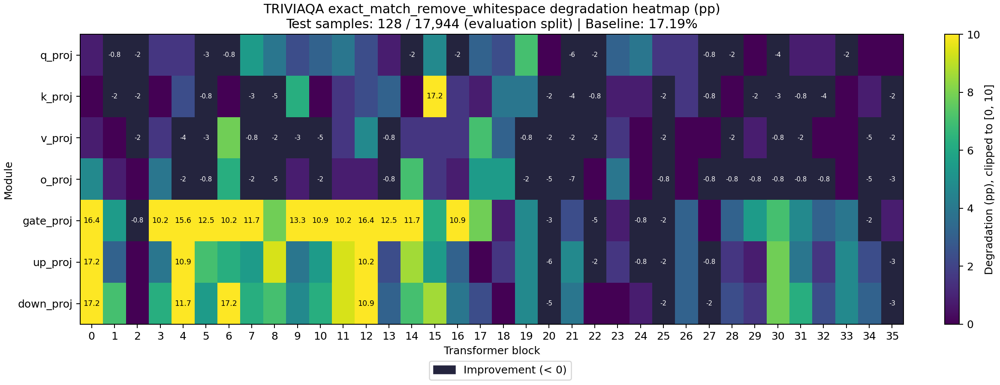

# Sensitivity Report

- Task: `triviaqa`
- Dataset: `triviaqa`
- Split: `lm-eval`
- Preprocessing: `lm-eval-0-shot`
- Evaluated examples: 128
- Baseline evaluation seconds: 146.421
- Total evaluation examples: 17944

## Baseline Metrics

| Metric | Value |
|---|---:|
| exact_match_remove_whitespace | 0.171875 |

## Cases

| Case | Targets | Model Compression Ratio | Tensor Size Ratio | Compression Seconds | Evaluation Seconds |
|---|---:|---:|---:|---:|---:|
| model.layers.0.self_attn.q_proj | 1 | 1.00176 | 1.00176 | 0.0932716 | 101.638 |
| model.layers.0.self_attn.k_proj | 1 | 1.00036 | 1.00036 | 0.0315122 | 106.308 |
| model.layers.0.self_attn.v_proj | 1 | 1.00036 | 1.00036 | 0.030784 | 85.5439 |
| model.layers.0.self_attn.o_proj | 1 | 1.00176 | 1.00176 | 0.0528965 | 82.2802 |
| model.layers.0.mlp.gate_proj | 1 | 1.00588 | 1.00588 | 0.140842 | 76.7179 |
| model.layers.0.mlp.up_proj | 1 | 1.00588 | 1.00588 | 0.13923 | 143.843 |
| model.layers.0.mlp.down_proj | 1 | 1.00588 | 1.00588 | 0.137138 | 113.919 |
| model.layers.1.self_attn.q_proj | 1 | 1.00176 | 1.00176 | 0.0533582 | 129.743 |
| model.layers.1.self_attn.k_proj | 1 | 1.00036 | 1.00036 | 0.030921 | 130.496 |
| model.layers.1.self_attn.v_proj | 1 | 1.00036 | 1.00036 | 0.0304098 | 121.636 |
| model.layers.1.self_attn.o_proj | 1 | 1.00176 | 1.00176 | 0.051054 | 117.689 |
| model.layers.1.mlp.gate_proj | 1 | 1.00588 | 1.00588 | 0.140145 | 82.8293 |
| model.layers.1.mlp.up_proj | 1 | 1.00588 | 1.00588 | 0.137484 | 110.717 |
| model.layers.1.mlp.down_proj | 1 | 1.00588 | 1.00588 | 0.14661 | 66.0663 |
| model.layers.2.self_attn.q_proj | 1 | 1.00176 | 1.00176 | 0.0514602 | 121.665 |
| model.layers.2.self_attn.k_proj | 1 | 1.00036 | 1.00036 | 0.0307664 | 126.843 |
| model.layers.2.self_attn.v_proj | 1 | 1.00036 | 1.00036 | 0.0305471 | 122.163 |
| model.layers.2.self_attn.o_proj | 1 | 1.00176 | 1.00176 | 0.0515286 | 105.187 |
| model.layers.2.mlp.gate_proj | 1 | 1.00588 | 1.00588 | 0.139785 | 134.75 |
| model.layers.2.mlp.up_proj | 1 | 1.00588 | 1.00588 | 0.13593 | 117.472 |
| model.layers.2.mlp.down_proj | 1 | 1.00588 | 1.00588 | 0.138365 | 107.042 |
| model.layers.3.self_attn.q_proj | 1 | 1.00176 | 1.00176 | 0.0500978 | 112.499 |
| model.layers.3.self_attn.k_proj | 1 | 1.00036 | 1.00036 | 0.030792 | 111.371 |
| model.layers.3.self_attn.v_proj | 1 | 1.00036 | 1.00036 | 0.030711 | 128.123 |
| model.layers.3.self_attn.o_proj | 1 | 1.00176 | 1.00176 | 0.0510458 | 122.687 |
| model.layers.3.mlp.gate_proj | 1 | 1.00588 | 1.00588 | 0.138877 | 108.214 |
| model.layers.3.mlp.up_proj | 1 | 1.00588 | 1.00588 | 0.136098 | 107.601 |
| model.layers.3.mlp.down_proj | 1 | 1.00588 | 1.00588 | 0.136302 | 112.69 |
| model.layers.4.self_attn.q_proj | 1 | 1.00176 | 1.00176 | 0.0522892 | 117.294 |
| model.layers.4.self_attn.k_proj | 1 | 1.00036 | 1.00036 | 0.0308335 | 115.38 |
| model.layers.4.self_attn.v_proj | 1 | 1.00036 | 1.00036 | 0.0302401 | 102.485 |
| model.layers.4.self_attn.o_proj | 1 | 1.00176 | 1.00176 | 0.0513151 | 117.294 |
| model.layers.4.mlp.gate_proj | 1 | 1.00588 | 1.00588 | 0.144167 | 62.2054 |
| model.layers.4.mlp.up_proj | 1 | 1.00588 | 1.00588 | 0.137202 | 97.6902 |
| model.layers.4.mlp.down_proj | 1 | 1.00588 | 1.00588 | 0.136572 | 100.025 |
| model.layers.5.self_attn.q_proj | 1 | 1.00176 | 1.00176 | 0.0512647 | 108.06 |
| model.layers.5.self_attn.k_proj | 1 | 1.00036 | 1.00036 | 0.0306553 | 123.294 |
| model.layers.5.self_attn.v_proj | 1 | 1.00036 | 1.00036 | 0.0305128 | 118.831 |
| model.layers.5.self_attn.o_proj | 1 | 1.00176 | 1.00176 | 0.0506159 | 118.112 |
| model.layers.5.mlp.gate_proj | 1 | 1.00588 | 1.00588 | 0.139865 | 75.2855 |
| model.layers.5.mlp.up_proj | 1 | 1.00588 | 1.00588 | 0.13966 | 81.7736 |
| model.layers.5.mlp.down_proj | 1 | 1.00588 | 1.00588 | 0.139031 | 104.628 |
| model.layers.6.self_attn.q_proj | 1 | 1.00176 | 1.00176 | 0.0507858 | 115.722 |
| model.layers.6.self_attn.k_proj | 1 | 1.00036 | 1.00036 | 0.0308941 | 122.434 |
| model.layers.6.self_attn.v_proj | 1 | 1.00036 | 1.00036 | 0.03204 | 90.4906 |
| model.layers.6.self_attn.o_proj | 1 | 1.00176 | 1.00176 | 0.0511292 | 68.68 |
| model.layers.6.mlp.gate_proj | 1 | 1.00588 | 1.00588 | 0.1399 | 81.4786 |
| model.layers.6.mlp.up_proj | 1 | 1.00588 | 1.00588 | 0.139691 | 102.017 |
| model.layers.6.mlp.down_proj | 1 | 1.00588 | 1.00588 | 0.139086 | 142.982 |
| model.layers.7.self_attn.q_proj | 1 | 1.00176 | 1.00176 | 0.0511145 | 81.2581 |
| model.layers.7.self_attn.k_proj | 1 | 1.00036 | 1.00036 | 0.0310859 | 116.348 |
| model.layers.7.self_attn.v_proj | 1 | 1.00036 | 1.00036 | 0.0306131 | 117.034 |
| model.layers.7.self_attn.o_proj | 1 | 1.00176 | 1.00176 | 0.0527194 | 105.335 |
| model.layers.7.mlp.gate_proj | 1 | 1.00588 | 1.00588 | 0.139357 | 85.9609 |
| model.layers.7.mlp.up_proj | 1 | 1.00588 | 1.00588 | 0.139184 | 87.5968 |
| model.layers.7.mlp.down_proj | 1 | 1.00588 | 1.00588 | 0.139973 | 87.1513 |
| model.layers.8.self_attn.q_proj | 1 | 1.00176 | 1.00176 | 0.0520232 | 99.6061 |
| model.layers.8.self_attn.k_proj | 1 | 1.00036 | 1.00036 | 0.0307572 | 115.595 |
| model.layers.8.self_attn.v_proj | 1 | 1.00036 | 1.00036 | 0.0945813 | 113.518 |
| model.layers.8.self_attn.o_proj | 1 | 1.00176 | 1.00176 | 0.051516 | 110.705 |
| model.layers.8.mlp.gate_proj | 1 | 1.00588 | 1.00588 | 0.139787 | 76.858 |
| model.layers.8.mlp.up_proj | 1 | 1.00588 | 1.00588 | 0.142093 | 91.2328 |
| model.layers.8.mlp.down_proj | 1 | 1.00588 | 1.00588 | 0.139271 | 81.3141 |
| model.layers.9.self_attn.q_proj | 1 | 1.00176 | 1.00176 | 0.0545468 | 106.272 |
| model.layers.9.self_attn.k_proj | 1 | 1.00036 | 1.00036 | 0.0302152 | 123.906 |
| model.layers.9.self_attn.v_proj | 1 | 1.00036 | 1.00036 | 0.0304704 | 122.392 |
| model.layers.9.self_attn.o_proj | 1 | 1.00176 | 1.00176 | 0.0518554 | 117.346 |
| model.layers.9.mlp.gate_proj | 1 | 1.00588 | 1.00588 | 0.139381 | 86.2601 |
| model.layers.9.mlp.up_proj | 1 | 1.00588 | 1.00588 | 0.142132 | 120.127 |
| model.layers.9.mlp.down_proj | 1 | 1.00588 | 1.00588 | 0.139248 | 101.386 |
| model.layers.10.self_attn.q_proj | 1 | 1.00176 | 1.00176 | 0.0511942 | 114.539 |
| model.layers.10.self_attn.k_proj | 1 | 1.00036 | 1.00036 | 0.0307107 | 113.156 |
| model.layers.10.self_attn.v_proj | 1 | 1.00036 | 1.00036 | 0.030345 | 124.3 |
| model.layers.10.self_attn.o_proj | 1 | 1.00176 | 1.00176 | 0.050947 | 122.252 |
| model.layers.10.mlp.gate_proj | 1 | 1.00588 | 1.00588 | 0.140417 | 103.137 |
| model.layers.10.mlp.up_proj | 1 | 1.00588 | 1.00588 | 0.139914 | 114.456 |
| model.layers.10.mlp.down_proj | 1 | 1.00588 | 1.00588 | 0.139732 | 128.39 |
| model.layers.11.self_attn.q_proj | 1 | 1.00176 | 1.00176 | 0.0508948 | 106.096 |
| model.layers.11.self_attn.k_proj | 1 | 1.00036 | 1.00036 | 0.0305886 | 106.717 |
| model.layers.11.self_attn.v_proj | 1 | 1.00036 | 1.00036 | 0.0305096 | 109.1 |
| model.layers.11.self_attn.o_proj | 1 | 1.00176 | 1.00176 | 0.0511896 | 112.705 |
| model.layers.11.mlp.gate_proj | 1 | 1.00588 | 1.00588 | 0.13934 | 62.8021 |
| model.layers.11.mlp.up_proj | 1 | 1.00588 | 1.00588 | 0.139601 | 99.3613 |
| model.layers.11.mlp.down_proj | 1 | 1.00588 | 1.00588 | 0.139613 | 87.3777 |
| model.layers.12.self_attn.q_proj | 1 | 1.00176 | 1.00176 | 0.050847 | 113.18 |
| model.layers.12.self_attn.k_proj | 1 | 1.00036 | 1.00036 | 0.0303979 | 113.021 |
| model.layers.12.self_attn.v_proj | 1 | 1.00036 | 1.00036 | 0.0301439 | 102.661 |
| model.layers.12.self_attn.o_proj | 1 | 1.00176 | 1.00176 | 0.0509426 | 122.227 |
| model.layers.12.mlp.gate_proj | 1 | 1.00588 | 1.00588 | 0.139969 | 53.3233 |
| model.layers.12.mlp.up_proj | 1 | 1.00588 | 1.00588 | 0.139497 | 66.1449 |
| model.layers.12.mlp.down_proj | 1 | 1.00588 | 1.00588 | 0.140419 | 75.1013 |
| model.layers.13.self_attn.q_proj | 1 | 1.00176 | 1.00176 | 0.0510717 | 112.337 |
| model.layers.13.self_attn.k_proj | 1 | 1.00036 | 1.00036 | 0.0306575 | 91.9391 |
| model.layers.13.self_attn.v_proj | 1 | 1.00036 | 1.00036 | 0.0301675 | 113.815 |
| model.layers.13.self_attn.o_proj | 1 | 1.00176 | 1.00176 | 0.0516656 | 122.977 |
| model.layers.13.mlp.gate_proj | 1 | 1.00588 | 1.00588 | 0.140414 | 71.2249 |
| model.layers.13.mlp.up_proj | 1 | 1.00588 | 1.00588 | 0.149147 | 105.84 |
| model.layers.13.mlp.down_proj | 1 | 1.00588 | 1.00588 | 0.139453 | 94.4103 |
| model.layers.14.self_attn.q_proj | 1 | 1.00176 | 1.00176 | 0.0515816 | 109.375 |
| model.layers.14.self_attn.k_proj | 1 | 1.00036 | 1.00036 | 0.0306471 | 89.6504 |
| model.layers.14.self_attn.v_proj | 1 | 1.00036 | 1.00036 | 0.0305073 | 94.2027 |
| model.layers.14.self_attn.o_proj | 1 | 1.00176 | 1.00176 | 0.0508368 | 84.0644 |
| model.layers.14.mlp.gate_proj | 1 | 1.00588 | 1.00588 | 0.151907 | 98.2875 |
| model.layers.14.mlp.up_proj | 1 | 1.00588 | 1.00588 | 0.140265 | 105.635 |
| model.layers.14.mlp.down_proj | 1 | 1.00588 | 1.00588 | 0.139543 | 126.179 |
| model.layers.15.self_attn.q_proj | 1 | 1.00176 | 1.00176 | 0.0506239 | 111.494 |
| model.layers.15.self_attn.k_proj | 1 | 1.00036 | 1.00036 | 0.0306046 | 87.3219 |
| model.layers.15.self_attn.v_proj | 1 | 1.00036 | 1.00036 | 0.0303031 | 108.471 |
| model.layers.15.self_attn.o_proj | 1 | 1.00176 | 1.00176 | 0.0509263 | 128.26 |
| model.layers.15.mlp.gate_proj | 1 | 1.00588 | 1.00588 | 0.139119 | 91.7692 |
| model.layers.15.mlp.up_proj | 1 | 1.00588 | 1.00588 | 0.149422 | 82.5769 |
| model.layers.15.mlp.down_proj | 1 | 1.00588 | 1.00588 | 0.139629 | 70.9727 |
| model.layers.16.self_attn.q_proj | 1 | 1.00176 | 1.00176 | 0.0507725 | 105.277 |
| model.layers.16.self_attn.k_proj | 1 | 1.00036 | 1.00036 | 0.0304228 | 132.019 |
| model.layers.16.self_attn.v_proj | 1 | 1.00036 | 1.00036 | 0.0326479 | 107.075 |
| model.layers.16.self_attn.o_proj | 1 | 1.00176 | 1.00176 | 0.0504907 | 113.533 |
| model.layers.16.mlp.gate_proj | 1 | 1.00588 | 1.00588 | 0.138931 | 58.4043 |
| model.layers.16.mlp.up_proj | 1 | 1.00588 | 1.00588 | 0.141889 | 109.77 |
| model.layers.16.mlp.down_proj | 1 | 1.00588 | 1.00588 | 0.139874 | 113.642 |
| model.layers.17.self_attn.q_proj | 1 | 1.00176 | 1.00176 | 0.0529401 | 81.8759 |
| model.layers.17.self_attn.k_proj | 1 | 1.00036 | 1.00036 | 0.0304501 | 122.468 |
| model.layers.17.self_attn.v_proj | 1 | 1.00036 | 1.00036 | 0.0305377 | 104.312 |
| model.layers.17.self_attn.o_proj | 1 | 1.00176 | 1.00176 | 0.0506405 | 106.371 |
| model.layers.17.mlp.gate_proj | 1 | 1.00588 | 1.00588 | 0.139343 | 71.9955 |
| model.layers.17.mlp.up_proj | 1 | 1.00588 | 1.00588 | 0.140839 | 117.619 |
| model.layers.17.mlp.down_proj | 1 | 1.00588 | 1.00588 | 0.139524 | 108.476 |
| model.layers.18.self_attn.q_proj | 1 | 1.00176 | 1.00176 | 0.0506224 | 113.244 |
| model.layers.18.self_attn.k_proj | 1 | 1.00036 | 1.00036 | 0.0302645 | 102.422 |
| model.layers.18.self_attn.v_proj | 1 | 1.00036 | 1.00036 | 0.030418 | 118.343 |
| model.layers.18.self_attn.o_proj | 1 | 1.00176 | 1.00176 | 0.0511956 | 107.779 |
| model.layers.18.mlp.gate_proj | 1 | 1.00588 | 1.00588 | 0.138841 | 44.6812 |
| model.layers.18.mlp.up_proj | 1 | 1.00588 | 1.00588 | 0.139077 | 66.8388 |
| model.layers.18.mlp.down_proj | 1 | 1.00588 | 1.00588 | 0.139331 | 48.7014 |
| model.layers.19.self_attn.q_proj | 1 | 1.00176 | 1.00176 | 0.050575 | 89.1186 |
| model.layers.19.self_attn.k_proj | 1 | 1.00036 | 1.00036 | 0.0302261 | 113.387 |
| model.layers.19.self_attn.v_proj | 1 | 1.00036 | 1.00036 | 0.0305127 | 126.238 |
| model.layers.19.self_attn.o_proj | 1 | 1.00176 | 1.00176 | 0.0502238 | 134.46 |
| model.layers.19.mlp.gate_proj | 1 | 1.00588 | 1.00588 | 0.138803 | 95.3952 |
| model.layers.19.mlp.up_proj | 1 | 1.00588 | 1.00588 | 0.139551 | 108.056 |
| model.layers.19.mlp.down_proj | 1 | 1.00588 | 1.00588 | 0.1493 | 104.214 |
| model.layers.20.self_attn.q_proj | 1 | 1.00176 | 1.00176 | 0.0504747 | 126.455 |
| model.layers.20.self_attn.k_proj | 1 | 1.00036 | 1.00036 | 0.0303391 | 105.491 |
| model.layers.20.self_attn.v_proj | 1 | 1.00036 | 1.00036 | 0.0308636 | 119.733 |
| model.layers.20.self_attn.o_proj | 1 | 1.00176 | 1.00176 | 0.0507591 | 119.835 |
| model.layers.20.mlp.gate_proj | 1 | 1.00588 | 1.00588 | 0.139271 | 117.498 |
| model.layers.20.mlp.up_proj | 1 | 1.00588 | 1.00588 | 0.139499 | 101.822 |
| model.layers.20.mlp.down_proj | 1 | 1.00588 | 1.00588 | 0.141386 | 104.688 |
| model.layers.21.self_attn.q_proj | 1 | 1.00176 | 1.00176 | 0.0503181 | 99.0474 |
| model.layers.21.self_attn.k_proj | 1 | 1.00036 | 1.00036 | 0.0307004 | 118.696 |
| model.layers.21.self_attn.v_proj | 1 | 1.00036 | 1.00036 | 0.0300809 | 120.734 |
| model.layers.21.self_attn.o_proj | 1 | 1.00176 | 1.00176 | 0.0505348 | 132.978 |
| model.layers.21.mlp.gate_proj | 1 | 1.00588 | 1.00588 | 0.139956 | 60.3968 |
| model.layers.21.mlp.up_proj | 1 | 1.00588 | 1.00588 | 0.140317 | 70.198 |
| model.layers.21.mlp.down_proj | 1 | 1.00588 | 1.00588 | 0.138822 | 80.8123 |
| model.layers.22.self_attn.q_proj | 1 | 1.00176 | 1.00176 | 0.0505507 | 105.355 |
| model.layers.22.self_attn.k_proj | 1 | 1.00036 | 1.00036 | 0.0302788 | 130.64 |
| model.layers.22.self_attn.v_proj | 1 | 1.00036 | 1.00036 | 0.0303458 | 102.108 |
| model.layers.22.self_attn.o_proj | 1 | 1.00176 | 1.00176 | 0.053624 | 94.0485 |
| model.layers.22.mlp.gate_proj | 1 | 1.00588 | 1.00588 | 0.139139 | 65.5651 |
| model.layers.22.mlp.up_proj | 1 | 1.00588 | 1.00588 | 0.138536 | 67.9232 |
| model.layers.22.mlp.down_proj | 1 | 1.00588 | 1.00588 | 0.139501 | 69.9935 |
| model.layers.23.self_attn.q_proj | 1 | 1.00176 | 1.00176 | 0.0505225 | 133.505 |
| model.layers.23.self_attn.k_proj | 1 | 1.00036 | 1.00036 | 0.0299867 | 113.419 |
| model.layers.23.self_attn.v_proj | 1 | 1.00036 | 1.00036 | 0.0335425 | 129.327 |
| model.layers.23.self_attn.o_proj | 1 | 1.00176 | 1.00176 | 0.0506939 | 129.94 |
| model.layers.23.mlp.gate_proj | 1 | 1.00588 | 1.00588 | 0.139902 | 129.413 |
| model.layers.23.mlp.up_proj | 1 | 1.00588 | 1.00588 | 0.151361 | 129.996 |
| model.layers.23.mlp.down_proj | 1 | 1.00588 | 1.00588 | 0.13891 | 129.067 |
| model.layers.24.self_attn.q_proj | 1 | 1.00176 | 1.00176 | 0.0512392 | 85.0679 |
| model.layers.24.self_attn.k_proj | 1 | 1.00036 | 1.00036 | 0.0315475 | 114.268 |
| model.layers.24.self_attn.v_proj | 1 | 1.00036 | 1.00036 | 0.0303832 | 111 |
| model.layers.24.self_attn.o_proj | 1 | 1.00176 | 1.00176 | 0.0506233 | 109.921 |
| model.layers.24.mlp.gate_proj | 1 | 1.00588 | 1.00588 | 0.139699 | 128.361 |
| model.layers.24.mlp.up_proj | 1 | 1.00588 | 1.00588 | 0.139175 | 114.401 |
| model.layers.24.mlp.down_proj | 1 | 1.00588 | 1.00588 | 0.13896 | 123.134 |
| model.layers.25.self_attn.q_proj | 1 | 1.00176 | 1.00176 | 0.0542851 | 113.476 |
| model.layers.25.self_attn.k_proj | 1 | 1.00036 | 1.00036 | 0.0328594 | 130.432 |
| model.layers.25.self_attn.v_proj | 1 | 1.00036 | 1.00036 | 0.0308865 | 122.421 |
| model.layers.25.self_attn.o_proj | 1 | 1.00176 | 1.00176 | 0.0512707 | 122.235 |
| model.layers.25.mlp.gate_proj | 1 | 1.00588 | 1.00588 | 0.1394 | 105.349 |
| model.layers.25.mlp.up_proj | 1 | 1.00588 | 1.00588 | 0.139905 | 125.664 |
| model.layers.25.mlp.down_proj | 1 | 1.00588 | 1.00588 | 0.138689 | 116.894 |
| model.layers.26.self_attn.q_proj | 1 | 1.00176 | 1.00176 | 0.0506949 | 111.446 |
| model.layers.26.self_attn.k_proj | 1 | 1.00036 | 1.00036 | 0.0306768 | 118.793 |
| model.layers.26.self_attn.v_proj | 1 | 1.00036 | 1.00036 | 0.0304169 | 95.0685 |
| model.layers.26.self_attn.o_proj | 1 | 1.00176 | 1.00176 | 0.053596 | 112.076 |
| model.layers.26.mlp.gate_proj | 1 | 1.00588 | 1.00588 | 0.139643 | 118.23 |
| model.layers.26.mlp.up_proj | 1 | 1.00588 | 1.00588 | 0.15124 | 114.264 |
| model.layers.26.mlp.down_proj | 1 | 1.00588 | 1.00588 | 0.139427 | 117.924 |
| model.layers.27.self_attn.q_proj | 1 | 1.00176 | 1.00176 | 0.0509084 | 114.51 |
| model.layers.27.self_attn.k_proj | 1 | 1.00036 | 1.00036 | 0.030385 | 121.063 |
| model.layers.27.self_attn.v_proj | 1 | 1.00036 | 1.00036 | 0.0303698 | 105.902 |
| model.layers.27.self_attn.o_proj | 1 | 1.00176 | 1.00176 | 0.0508261 | 123.065 |
| model.layers.27.mlp.gate_proj | 1 | 1.00588 | 1.00588 | 0.139792 | 77.4186 |
| model.layers.27.mlp.up_proj | 1 | 1.00588 | 1.00588 | 0.142057 | 91.1739 |
| model.layers.27.mlp.down_proj | 1 | 1.00588 | 1.00588 | 0.139712 | 93.4084 |
| model.layers.28.self_attn.q_proj | 1 | 1.00176 | 1.00176 | 0.0501931 | 125.577 |
| model.layers.28.self_attn.k_proj | 1 | 1.00036 | 1.00036 | 0.0316368 | 108.66 |
| model.layers.28.self_attn.v_proj | 1 | 1.00036 | 1.00036 | 0.0304146 | 110.627 |
| model.layers.28.self_attn.o_proj | 1 | 1.00176 | 1.00176 | 0.0525357 | 108.661 |
| model.layers.28.mlp.gate_proj | 1 | 1.00588 | 1.00588 | 0.140338 | 124.677 |
| model.layers.28.mlp.up_proj | 1 | 1.00588 | 1.00588 | 0.139925 | 112.832 |
| model.layers.28.mlp.down_proj | 1 | 1.00588 | 1.00588 | 0.140213 | 125.369 |
| model.layers.29.self_attn.q_proj | 1 | 1.00176 | 1.00176 | 0.0506746 | 125.733 |
| model.layers.29.self_attn.k_proj | 1 | 1.00036 | 1.00036 | 0.0298597 | 114.026 |
| model.layers.29.self_attn.v_proj | 1 | 1.00036 | 1.00036 | 0.0309788 | 120.388 |
| model.layers.29.self_attn.o_proj | 1 | 1.00176 | 1.00176 | 0.051362 | 106.225 |
| model.layers.29.mlp.gate_proj | 1 | 1.00588 | 1.00588 | 0.140003 | 118.89 |
| model.layers.29.mlp.up_proj | 1 | 1.00588 | 1.00588 | 0.150212 | 115.996 |
| model.layers.29.mlp.down_proj | 1 | 1.00588 | 1.00588 | 0.137102 | 120.008 |
| model.layers.30.self_attn.q_proj | 1 | 1.00176 | 1.00176 | 0.0513323 | 93.157 |
| model.layers.30.self_attn.k_proj | 1 | 1.00036 | 1.00036 | 0.0303975 | 120.418 |
| model.layers.30.self_attn.v_proj | 1 | 1.00036 | 1.00036 | 0.0308233 | 107.817 |
| model.layers.30.self_attn.o_proj | 1 | 1.00176 | 1.00176 | 0.0512661 | 118.032 |
| model.layers.30.mlp.gate_proj | 1 | 1.00588 | 1.00588 | 0.139265 | 105.111 |
| model.layers.30.mlp.up_proj | 1 | 1.00588 | 1.00588 | 0.139638 | 108.821 |
| model.layers.30.mlp.down_proj | 1 | 1.00588 | 1.00588 | 0.139539 | 119.417 |
| model.layers.31.self_attn.q_proj | 1 | 1.00176 | 1.00176 | 0.0524978 | 118.014 |
| model.layers.31.self_attn.k_proj | 1 | 1.00036 | 1.00036 | 0.0301997 | 106.206 |
| model.layers.31.self_attn.v_proj | 1 | 1.00036 | 1.00036 | 0.0306732 | 87.1655 |
| model.layers.31.self_attn.o_proj | 1 | 1.00176 | 1.00176 | 0.0549134 | 102.425 |
| model.layers.31.mlp.gate_proj | 1 | 1.00588 | 1.00588 | 0.14024 | 109.02 |
| model.layers.31.mlp.up_proj | 1 | 1.00588 | 1.00588 | 0.148148 | 112.71 |
| model.layers.31.mlp.down_proj | 1 | 1.00588 | 1.00588 | 0.1393 | 113.799 |
| model.layers.32.self_attn.q_proj | 1 | 1.00176 | 1.00176 | 0.0499593 | 111.768 |
| model.layers.32.self_attn.k_proj | 1 | 1.00036 | 1.00036 | 0.0305451 | 97.9205 |
| model.layers.32.self_attn.v_proj | 1 | 1.00036 | 1.00036 | 0.0306118 | 114.96 |
| model.layers.32.self_attn.o_proj | 1 | 1.00176 | 1.00176 | 0.0505279 | 124.179 |
| model.layers.32.mlp.gate_proj | 1 | 1.00588 | 1.00588 | 0.146034 | 113.754 |
| model.layers.32.mlp.up_proj | 1 | 1.00588 | 1.00588 | 0.137176 | 108.05 |
| model.layers.32.mlp.down_proj | 1 | 1.00588 | 1.00588 | 0.141948 | 113.185 |
| model.layers.33.self_attn.q_proj | 1 | 1.00176 | 1.00176 | 0.0506041 | 119.731 |
| model.layers.33.self_attn.k_proj | 1 | 1.00036 | 1.00036 | 0.0304169 | 103.592 |
| model.layers.33.self_attn.v_proj | 1 | 1.00036 | 1.00036 | 0.0300071 | 95.5514 |
| model.layers.33.self_attn.o_proj | 1 | 1.00176 | 1.00176 | 0.0510684 | 113.297 |
| model.layers.33.mlp.gate_proj | 1 | 1.00588 | 1.00588 | 0.139336 | 126.441 |
| model.layers.33.mlp.up_proj | 1 | 1.00588 | 1.00588 | 0.139978 | 107.759 |
| model.layers.33.mlp.down_proj | 1 | 1.00588 | 1.00588 | 0.139965 | 126.537 |
| model.layers.34.self_attn.q_proj | 1 | 1.00176 | 1.00176 | 0.0507948 | 118.147 |
| model.layers.34.self_attn.k_proj | 1 | 1.00036 | 1.00036 | 0.030352 | 125.905 |
| model.layers.34.self_attn.v_proj | 1 | 1.00036 | 1.00036 | 0.0306838 | 122.386 |
| model.layers.34.self_attn.o_proj | 1 | 1.00176 | 1.00176 | 0.0508456 | 106.622 |
| model.layers.34.mlp.gate_proj | 1 | 1.00588 | 1.00588 | 0.144413 | 79.7259 |
| model.layers.34.mlp.up_proj | 1 | 1.00588 | 1.00588 | 0.139732 | 83.8763 |
| model.layers.34.mlp.down_proj | 1 | 1.00588 | 1.00588 | 0.138796 | 103.889 |
| model.layers.35.self_attn.q_proj | 1 | 1.00176 | 1.00176 | 0.0514119 | 117.435 |
| model.layers.35.self_attn.k_proj | 1 | 1.00036 | 1.00036 | 0.0307413 | 126.624 |
| model.layers.35.self_attn.v_proj | 1 | 1.00036 | 1.00036 | 0.0300644 | 107.656 |
| model.layers.35.self_attn.o_proj | 1 | 1.00176 | 1.00176 | 0.050693 | 101.54 |
| model.layers.35.mlp.gate_proj | 1 | 1.00588 | 1.00588 | 0.140534 | 116.031 |
| model.layers.35.mlp.up_proj | 1 | 1.00588 | 1.00588 | 0.137341 | 121.466 |
| model.layers.35.mlp.down_proj | 1 | 1.00588 | 1.00588 | 0.138285 | 109.831 |

## Metrics

| Case | Metric | Value | Degradation |
|---|---|---:|---:|
| model.layers.0.self_attn.q_proj | exact_match_remove_whitespace | 0.164062 | 0.0078125 |
| model.layers.0.self_attn.k_proj | exact_match_remove_whitespace | 0.171875 | 0 |
| model.layers.0.self_attn.v_proj | exact_match_remove_whitespace | 0.164062 | 0.0078125 |
| model.layers.0.self_attn.o_proj | exact_match_remove_whitespace | 0.125 | 0.046875 |
| model.layers.0.mlp.gate_proj | exact_match_remove_whitespace | 0.0078125 | 0.164062 |
| model.layers.0.mlp.up_proj | exact_match_remove_whitespace | 0 | 0.171875 |
| model.layers.0.mlp.down_proj | exact_match_remove_whitespace | 0 | 0.171875 |
| model.layers.1.self_attn.q_proj | exact_match_remove_whitespace | 0.179688 | -0.0078125 |
| model.layers.1.self_attn.k_proj | exact_match_remove_whitespace | 0.1875 | -0.015625 |
| model.layers.1.self_attn.v_proj | exact_match_remove_whitespace | 0.171875 | 0 |
| model.layers.1.self_attn.o_proj | exact_match_remove_whitespace | 0.164062 | 0.0078125 |
| model.layers.1.mlp.gate_proj | exact_match_remove_whitespace | 0.117188 | 0.0546875 |
| model.layers.1.mlp.up_proj | exact_match_remove_whitespace | 0.140625 | 0.03125 |
| model.layers.1.mlp.down_proj | exact_match_remove_whitespace | 0.101562 | 0.0703125 |
| model.layers.2.self_attn.q_proj | exact_match_remove_whitespace | 0.1875 | -0.015625 |
| model.layers.2.self_attn.k_proj | exact_match_remove_whitespace | 0.1875 | -0.015625 |
| model.layers.2.self_attn.v_proj | exact_match_remove_whitespace | 0.195312 | -0.0234375 |
| model.layers.2.self_attn.o_proj | exact_match_remove_whitespace | 0.171875 | 0 |
| model.layers.2.mlp.gate_proj | exact_match_remove_whitespace | 0.179688 | -0.0078125 |
| model.layers.2.mlp.up_proj | exact_match_remove_whitespace | 0.171875 | 0 |
| model.layers.2.mlp.down_proj | exact_match_remove_whitespace | 0.171875 | 0 |
| model.layers.3.self_attn.q_proj | exact_match_remove_whitespace | 0.15625 | 0.015625 |
| model.layers.3.self_attn.k_proj | exact_match_remove_whitespace | 0.171875 | 0 |
| model.layers.3.self_attn.v_proj | exact_match_remove_whitespace | 0.15625 | 0.015625 |
| model.layers.3.self_attn.o_proj | exact_match_remove_whitespace | 0.132812 | 0.0390625 |
| model.layers.3.mlp.gate_proj | exact_match_remove_whitespace | 0.0703125 | 0.101562 |
| model.layers.3.mlp.up_proj | exact_match_remove_whitespace | 0.132812 | 0.0390625 |
| model.layers.3.mlp.down_proj | exact_match_remove_whitespace | 0.109375 | 0.0625 |
| model.layers.4.self_attn.q_proj | exact_match_remove_whitespace | 0.15625 | 0.015625 |
| model.layers.4.self_attn.k_proj | exact_match_remove_whitespace | 0.148438 | 0.0234375 |
| model.layers.4.self_attn.v_proj | exact_match_remove_whitespace | 0.210938 | -0.0390625 |
| model.layers.4.self_attn.o_proj | exact_match_remove_whitespace | 0.195312 | -0.0234375 |
| model.layers.4.mlp.gate_proj | exact_match_remove_whitespace | 0.015625 | 0.15625 |
| model.layers.4.mlp.up_proj | exact_match_remove_whitespace | 0.0625 | 0.109375 |
| model.layers.4.mlp.down_proj | exact_match_remove_whitespace | 0.0546875 | 0.117188 |
| model.layers.5.self_attn.q_proj | exact_match_remove_whitespace | 0.203125 | -0.03125 |
| model.layers.5.self_attn.k_proj | exact_match_remove_whitespace | 0.179688 | -0.0078125 |
| model.layers.5.self_attn.v_proj | exact_match_remove_whitespace | 0.203125 | -0.03125 |
| model.layers.5.self_attn.o_proj | exact_match_remove_whitespace | 0.179688 | -0.0078125 |
| model.layers.5.mlp.gate_proj | exact_match_remove_whitespace | 0.046875 | 0.125 |
| model.layers.5.mlp.up_proj | exact_match_remove_whitespace | 0.101562 | 0.0703125 |
| model.layers.5.mlp.down_proj | exact_match_remove_whitespace | 0.117188 | 0.0546875 |
| model.layers.6.self_attn.q_proj | exact_match_remove_whitespace | 0.179688 | -0.0078125 |
| model.layers.6.self_attn.k_proj | exact_match_remove_whitespace | 0.171875 | 0 |
| model.layers.6.self_attn.v_proj | exact_match_remove_whitespace | 0.09375 | 0.078125 |
| model.layers.6.self_attn.o_proj | exact_match_remove_whitespace | 0.109375 | 0.0625 |
| model.layers.6.mlp.gate_proj | exact_match_remove_whitespace | 0.0703125 | 0.101562 |
| model.layers.6.mlp.up_proj | exact_match_remove_whitespace | 0.109375 | 0.0625 |
| model.layers.6.mlp.down_proj | exact_match_remove_whitespace | 0 | 0.171875 |
| model.layers.7.self_attn.q_proj | exact_match_remove_whitespace | 0.117188 | 0.0546875 |
| model.layers.7.self_attn.k_proj | exact_match_remove_whitespace | 0.203125 | -0.03125 |
| model.layers.7.self_attn.v_proj | exact_match_remove_whitespace | 0.179688 | -0.0078125 |
| model.layers.7.self_attn.o_proj | exact_match_remove_whitespace | 0.1875 | -0.015625 |
| model.layers.7.mlp.gate_proj | exact_match_remove_whitespace | 0.0546875 | 0.117188 |
| model.layers.7.mlp.up_proj | exact_match_remove_whitespace | 0.117188 | 0.0546875 |
| model.layers.7.mlp.down_proj | exact_match_remove_whitespace | 0.109375 | 0.0625 |
| model.layers.8.self_attn.q_proj | exact_match_remove_whitespace | 0.132812 | 0.0390625 |
| model.layers.8.self_attn.k_proj | exact_match_remove_whitespace | 0.21875 | -0.046875 |
| model.layers.8.self_attn.v_proj | exact_match_remove_whitespace | 0.1875 | -0.015625 |
| model.layers.8.self_attn.o_proj | exact_match_remove_whitespace | 0.21875 | -0.046875 |
| model.layers.8.mlp.gate_proj | exact_match_remove_whitespace | 0.09375 | 0.078125 |
| model.layers.8.mlp.up_proj | exact_match_remove_whitespace | 0.078125 | 0.09375 |
| model.layers.8.mlp.down_proj | exact_match_remove_whitespace | 0.101562 | 0.0703125 |
| model.layers.9.self_attn.q_proj | exact_match_remove_whitespace | 0.148438 | 0.0234375 |
| model.layers.9.self_attn.k_proj | exact_match_remove_whitespace | 0.109375 | 0.0625 |
| model.layers.9.self_attn.v_proj | exact_match_remove_whitespace | 0.203125 | -0.03125 |
| model.layers.9.self_attn.o_proj | exact_match_remove_whitespace | 0.164062 | 0.0078125 |
| model.layers.9.mlp.gate_proj | exact_match_remove_whitespace | 0.0390625 | 0.132812 |
| model.layers.9.mlp.up_proj | exact_match_remove_whitespace | 0.132812 | 0.0390625 |
| model.layers.9.mlp.down_proj | exact_match_remove_whitespace | 0.125 | 0.046875 |
| model.layers.10.self_attn.q_proj | exact_match_remove_whitespace | 0.140625 | 0.03125 |
| model.layers.10.self_attn.k_proj | exact_match_remove_whitespace | 0.171875 | 0 |
| model.layers.10.self_attn.v_proj | exact_match_remove_whitespace | 0.21875 | -0.046875 |
| model.layers.10.self_attn.o_proj | exact_match_remove_whitespace | 0.1875 | -0.015625 |
| model.layers.10.mlp.gate_proj | exact_match_remove_whitespace | 0.0625 | 0.109375 |
| model.layers.10.mlp.up_proj | exact_match_remove_whitespace | 0.117188 | 0.0546875 |
| model.layers.10.mlp.down_proj | exact_match_remove_whitespace | 0.109375 | 0.0625 |
| model.layers.11.self_attn.q_proj | exact_match_remove_whitespace | 0.132812 | 0.0390625 |
| model.layers.11.self_attn.k_proj | exact_match_remove_whitespace | 0.15625 | 0.015625 |
| model.layers.11.self_attn.v_proj | exact_match_remove_whitespace | 0.15625 | 0.015625 |
| model.layers.11.self_attn.o_proj | exact_match_remove_whitespace | 0.164062 | 0.0078125 |
| model.layers.11.mlp.gate_proj | exact_match_remove_whitespace | 0.0703125 | 0.101562 |
| model.layers.11.mlp.up_proj | exact_match_remove_whitespace | 0.078125 | 0.09375 |
| model.layers.11.mlp.down_proj | exact_match_remove_whitespace | 0.078125 | 0.09375 |
| model.layers.12.self_attn.q_proj | exact_match_remove_whitespace | 0.148438 | 0.0234375 |
| model.layers.12.self_attn.k_proj | exact_match_remove_whitespace | 0.148438 | 0.0234375 |
| model.layers.12.self_attn.v_proj | exact_match_remove_whitespace | 0.125 | 0.046875 |
| model.layers.12.self_attn.o_proj | exact_match_remove_whitespace | 0.164062 | 0.0078125 |
| model.layers.12.mlp.gate_proj | exact_match_remove_whitespace | 0.0078125 | 0.164062 |
| model.layers.12.mlp.up_proj | exact_match_remove_whitespace | 0.0703125 | 0.101562 |
| model.layers.12.mlp.down_proj | exact_match_remove_whitespace | 0.0625 | 0.109375 |
| model.layers.13.self_attn.q_proj | exact_match_remove_whitespace | 0.164062 | 0.0078125 |
| model.layers.13.self_attn.k_proj | exact_match_remove_whitespace | 0.140625 | 0.03125 |
| model.layers.13.self_attn.v_proj | exact_match_remove_whitespace | 0.179688 | -0.0078125 |
| model.layers.13.self_attn.o_proj | exact_match_remove_whitespace | 0.179688 | -0.0078125 |
| model.layers.13.mlp.gate_proj | exact_match_remove_whitespace | 0.046875 | 0.125 |
| model.layers.13.mlp.up_proj | exact_match_remove_whitespace | 0.148438 | 0.0234375 |
| model.layers.13.mlp.down_proj | exact_match_remove_whitespace | 0.140625 | 0.03125 |
| model.layers.14.self_attn.q_proj | exact_match_remove_whitespace | 0.1875 | -0.015625 |
| model.layers.14.self_attn.k_proj | exact_match_remove_whitespace | 0.171875 | 0 |
| model.layers.14.self_attn.v_proj | exact_match_remove_whitespace | 0.15625 | 0.015625 |
| model.layers.14.self_attn.o_proj | exact_match_remove_whitespace | 0.101562 | 0.0703125 |
| model.layers.14.mlp.gate_proj | exact_match_remove_whitespace | 0.0546875 | 0.117188 |
| model.layers.14.mlp.up_proj | exact_match_remove_whitespace | 0.0859375 | 0.0859375 |
| model.layers.14.mlp.down_proj | exact_match_remove_whitespace | 0.101562 | 0.0703125 |
| model.layers.15.self_attn.q_proj | exact_match_remove_whitespace | 0.125 | 0.046875 |
| model.layers.15.self_attn.k_proj | exact_match_remove_whitespace | 0 | 0.171875 |
| model.layers.15.self_attn.v_proj | exact_match_remove_whitespace | 0.15625 | 0.015625 |
| model.layers.15.self_attn.o_proj | exact_match_remove_whitespace | 0.15625 | 0.015625 |
| model.layers.15.mlp.gate_proj | exact_match_remove_whitespace | 0.109375 | 0.0625 |
| model.layers.15.mlp.up_proj | exact_match_remove_whitespace | 0.117188 | 0.0546875 |
| model.layers.15.mlp.down_proj | exact_match_remove_whitespace | 0.0859375 | 0.0859375 |
| model.layers.16.self_attn.q_proj | exact_match_remove_whitespace | 0.1875 | -0.015625 |
| model.layers.16.self_attn.k_proj | exact_match_remove_whitespace | 0.15625 | 0.015625 |
| model.layers.16.self_attn.v_proj | exact_match_remove_whitespace | 0.15625 | 0.015625 |
| model.layers.16.self_attn.o_proj | exact_match_remove_whitespace | 0.164062 | 0.0078125 |
| model.layers.16.mlp.gate_proj | exact_match_remove_whitespace | 0.0625 | 0.109375 |
| model.layers.16.mlp.up_proj | exact_match_remove_whitespace | 0.140625 | 0.03125 |
| model.layers.16.mlp.down_proj | exact_match_remove_whitespace | 0.132812 | 0.0390625 |
| model.layers.17.self_attn.q_proj | exact_match_remove_whitespace | 0.140625 | 0.03125 |
| model.layers.17.self_attn.k_proj | exact_match_remove_whitespace | 0.164062 | 0.0078125 |
| model.layers.17.self_attn.v_proj | exact_match_remove_whitespace | 0.101562 | 0.0703125 |
| model.layers.17.self_attn.o_proj | exact_match_remove_whitespace | 0.117188 | 0.0546875 |
| model.layers.17.mlp.gate_proj | exact_match_remove_whitespace | 0.09375 | 0.078125 |
| model.layers.17.mlp.up_proj | exact_match_remove_whitespace | 0.171875 | 0 |
| model.layers.17.mlp.down_proj | exact_match_remove_whitespace | 0.148438 | 0.0234375 |
| model.layers.18.self_attn.q_proj | exact_match_remove_whitespace | 0.148438 | 0.0234375 |
| model.layers.18.self_attn.k_proj | exact_match_remove_whitespace | 0.132812 | 0.0390625 |
| model.layers.18.self_attn.v_proj | exact_match_remove_whitespace | 0.140625 | 0.03125 |
| model.layers.18.self_attn.o_proj | exact_match_remove_whitespace | 0.117188 | 0.0546875 |
| model.layers.18.mlp.gate_proj | exact_match_remove_whitespace | 0.164062 | 0.0078125 |
| model.layers.18.mlp.up_proj | exact_match_remove_whitespace | 0.15625 | 0.015625 |
| model.layers.18.mlp.down_proj | exact_match_remove_whitespace | 0.171875 | 0 |
| model.layers.19.self_attn.q_proj | exact_match_remove_whitespace | 0.101562 | 0.0703125 |
| model.layers.19.self_attn.k_proj | exact_match_remove_whitespace | 0.132812 | 0.0390625 |
| model.layers.19.self_attn.v_proj | exact_match_remove_whitespace | 0.179688 | -0.0078125 |
| model.layers.19.self_attn.o_proj | exact_match_remove_whitespace | 0.195312 | -0.0234375 |
| model.layers.19.mlp.gate_proj | exact_match_remove_whitespace | 0.125 | 0.046875 |
| model.layers.19.mlp.up_proj | exact_match_remove_whitespace | 0.125 | 0.046875 |
| model.layers.19.mlp.down_proj | exact_match_remove_whitespace | 0.125 | 0.046875 |
| model.layers.20.self_attn.q_proj | exact_match_remove_whitespace | 0.171875 | 0 |
| model.layers.20.self_attn.k_proj | exact_match_remove_whitespace | 0.1875 | -0.015625 |
| model.layers.20.self_attn.v_proj | exact_match_remove_whitespace | 0.195312 | -0.0234375 |
| model.layers.20.self_attn.o_proj | exact_match_remove_whitespace | 0.21875 | -0.046875 |
| model.layers.20.mlp.gate_proj | exact_match_remove_whitespace | 0.203125 | -0.03125 |
| model.layers.20.mlp.up_proj | exact_match_remove_whitespace | 0.234375 | -0.0625 |
| model.layers.20.mlp.down_proj | exact_match_remove_whitespace | 0.21875 | -0.046875 |
| model.layers.21.self_attn.q_proj | exact_match_remove_whitespace | 0.234375 | -0.0625 |
| model.layers.21.self_attn.k_proj | exact_match_remove_whitespace | 0.210938 | -0.0390625 |
| model.layers.21.self_attn.v_proj | exact_match_remove_whitespace | 0.195312 | -0.0234375 |
| model.layers.21.self_attn.o_proj | exact_match_remove_whitespace | 0.242188 | -0.0703125 |
| model.layers.21.mlp.gate_proj | exact_match_remove_whitespace | 0.148438 | 0.0234375 |
| model.layers.21.mlp.up_proj | exact_match_remove_whitespace | 0.125 | 0.046875 |
| model.layers.21.mlp.down_proj | exact_match_remove_whitespace | 0.132812 | 0.0390625 |
| model.layers.22.self_attn.q_proj | exact_match_remove_whitespace | 0.195312 | -0.0234375 |
| model.layers.22.self_attn.k_proj | exact_match_remove_whitespace | 0.179688 | -0.0078125 |
| model.layers.22.self_attn.v_proj | exact_match_remove_whitespace | 0.195312 | -0.0234375 |
| model.layers.22.self_attn.o_proj | exact_match_remove_whitespace | 0.171875 | 0 |
| model.layers.22.mlp.gate_proj | exact_match_remove_whitespace | 0.226562 | -0.0546875 |
| model.layers.22.mlp.up_proj | exact_match_remove_whitespace | 0.195312 | -0.0234375 |
| model.layers.22.mlp.down_proj | exact_match_remove_whitespace | 0.171875 | 0 |
| model.layers.23.self_attn.q_proj | exact_match_remove_whitespace | 0.140625 | 0.03125 |
| model.layers.23.self_attn.k_proj | exact_match_remove_whitespace | 0.164062 | 0.0078125 |
| model.layers.23.self_attn.v_proj | exact_match_remove_whitespace | 0.15625 | 0.015625 |
| model.layers.23.self_attn.o_proj | exact_match_remove_whitespace | 0.132812 | 0.0390625 |
| model.layers.23.mlp.gate_proj | exact_match_remove_whitespace | 0.164062 | 0.0078125 |
| model.layers.23.mlp.up_proj | exact_match_remove_whitespace | 0.15625 | 0.015625 |
| model.layers.23.mlp.down_proj | exact_match_remove_whitespace | 0.171875 | 0 |
| model.layers.24.self_attn.q_proj | exact_match_remove_whitespace | 0.132812 | 0.0390625 |
| model.layers.24.self_attn.k_proj | exact_match_remove_whitespace | 0.164062 | 0.0078125 |
| model.layers.24.self_attn.v_proj | exact_match_remove_whitespace | 0.171875 | 0 |
| model.layers.24.self_attn.o_proj | exact_match_remove_whitespace | 0.171875 | 0 |
| model.layers.24.mlp.gate_proj | exact_match_remove_whitespace | 0.179688 | -0.0078125 |
| model.layers.24.mlp.up_proj | exact_match_remove_whitespace | 0.179688 | -0.0078125 |
| model.layers.24.mlp.down_proj | exact_match_remove_whitespace | 0.164062 | 0.0078125 |
| model.layers.25.self_attn.q_proj | exact_match_remove_whitespace | 0.15625 | 0.015625 |
| model.layers.25.self_attn.k_proj | exact_match_remove_whitespace | 0.1875 | -0.015625 |
| model.layers.25.self_attn.v_proj | exact_match_remove_whitespace | 0.1875 | -0.015625 |
| model.layers.25.self_attn.o_proj | exact_match_remove_whitespace | 0.179688 | -0.0078125 |
| model.layers.25.mlp.gate_proj | exact_match_remove_whitespace | 0.195312 | -0.0234375 |
| model.layers.25.mlp.up_proj | exact_match_remove_whitespace | 0.1875 | -0.015625 |
| model.layers.25.mlp.down_proj | exact_match_remove_whitespace | 0.1875 | -0.015625 |
| model.layers.26.self_attn.q_proj | exact_match_remove_whitespace | 0.15625 | 0.015625 |
| model.layers.26.self_attn.k_proj | exact_match_remove_whitespace | 0.15625 | 0.015625 |
| model.layers.26.self_attn.v_proj | exact_match_remove_whitespace | 0.171875 | 0 |
| model.layers.26.self_attn.o_proj | exact_match_remove_whitespace | 0.171875 | 0 |
| model.layers.26.mlp.gate_proj | exact_match_remove_whitespace | 0.140625 | 0.03125 |
| model.layers.26.mlp.up_proj | exact_match_remove_whitespace | 0.140625 | 0.03125 |
| model.layers.26.mlp.down_proj | exact_match_remove_whitespace | 0.140625 | 0.03125 |
| model.layers.27.self_attn.q_proj | exact_match_remove_whitespace | 0.179688 | -0.0078125 |
| model.layers.27.self_attn.k_proj | exact_match_remove_whitespace | 0.179688 | -0.0078125 |
| model.layers.27.self_attn.v_proj | exact_match_remove_whitespace | 0.171875 | 0 |
| model.layers.27.self_attn.o_proj | exact_match_remove_whitespace | 0.179688 | -0.0078125 |
| model.layers.27.mlp.gate_proj | exact_match_remove_whitespace | 0.171875 | 0 |
| model.layers.27.mlp.up_proj | exact_match_remove_whitespace | 0.179688 | -0.0078125 |
| model.layers.27.mlp.down_proj | exact_match_remove_whitespace | 0.1875 | -0.015625 |
| model.layers.28.self_attn.q_proj | exact_match_remove_whitespace | 0.1875 | -0.015625 |
| model.layers.28.self_attn.k_proj | exact_match_remove_whitespace | 0.171875 | 0 |
| model.layers.28.self_attn.v_proj | exact_match_remove_whitespace | 0.195312 | -0.0234375 |
| model.layers.28.self_attn.o_proj | exact_match_remove_whitespace | 0.179688 | -0.0078125 |
| model.layers.28.mlp.gate_proj | exact_match_remove_whitespace | 0.140625 | 0.03125 |
| model.layers.28.mlp.up_proj | exact_match_remove_whitespace | 0.15625 | 0.015625 |
| model.layers.28.mlp.down_proj | exact_match_remove_whitespace | 0.148438 | 0.0234375 |
| model.layers.29.self_attn.q_proj | exact_match_remove_whitespace | 0.171875 | 0 |
| model.layers.29.self_attn.k_proj | exact_match_remove_whitespace | 0.195312 | -0.0234375 |
| model.layers.29.self_attn.v_proj | exact_match_remove_whitespace | 0.164062 | 0.0078125 |
| model.layers.29.self_attn.o_proj | exact_match_remove_whitespace | 0.179688 | -0.0078125 |
| model.layers.29.mlp.gate_proj | exact_match_remove_whitespace | 0.117188 | 0.0546875 |
| model.layers.29.mlp.up_proj | exact_match_remove_whitespace | 0.164062 | 0.0078125 |
| model.layers.29.mlp.down_proj | exact_match_remove_whitespace | 0.15625 | 0.015625 |
| model.layers.30.self_attn.q_proj | exact_match_remove_whitespace | 0.210938 | -0.0390625 |
| model.layers.30.self_attn.k_proj | exact_match_remove_whitespace | 0.203125 | -0.03125 |
| model.layers.30.self_attn.v_proj | exact_match_remove_whitespace | 0.179688 | -0.0078125 |
| model.layers.30.self_attn.o_proj | exact_match_remove_whitespace | 0.179688 | -0.0078125 |
| model.layers.30.mlp.gate_proj | exact_match_remove_whitespace | 0.101562 | 0.0703125 |
| model.layers.30.mlp.up_proj | exact_match_remove_whitespace | 0.09375 | 0.078125 |
| model.layers.30.mlp.down_proj | exact_match_remove_whitespace | 0.09375 | 0.078125 |
| model.layers.31.self_attn.q_proj | exact_match_remove_whitespace | 0.164062 | 0.0078125 |
| model.layers.31.self_attn.k_proj | exact_match_remove_whitespace | 0.179688 | -0.0078125 |
| model.layers.31.self_attn.v_proj | exact_match_remove_whitespace | 0.1875 | -0.015625 |
| model.layers.31.self_attn.o_proj | exact_match_remove_whitespace | 0.179688 | -0.0078125 |
| model.layers.31.mlp.gate_proj | exact_match_remove_whitespace | 0.125 | 0.046875 |
| model.layers.31.mlp.up_proj | exact_match_remove_whitespace | 0.132812 | 0.0390625 |
| model.layers.31.mlp.down_proj | exact_match_remove_whitespace | 0.109375 | 0.0625 |
| model.layers.32.self_attn.q_proj | exact_match_remove_whitespace | 0.164062 | 0.0078125 |
| model.layers.32.self_attn.k_proj | exact_match_remove_whitespace | 0.210938 | -0.0390625 |
| model.layers.32.self_attn.v_proj | exact_match_remove_whitespace | 0.171875 | 0 |
| model.layers.32.self_attn.o_proj | exact_match_remove_whitespace | 0.179688 | -0.0078125 |
| model.layers.32.mlp.gate_proj | exact_match_remove_whitespace | 0.140625 | 0.03125 |
| model.layers.32.mlp.up_proj | exact_match_remove_whitespace | 0.15625 | 0.015625 |
| model.layers.32.mlp.down_proj | exact_match_remove_whitespace | 0.148438 | 0.0234375 |
| model.layers.33.self_attn.q_proj | exact_match_remove_whitespace | 0.1875 | -0.015625 |
| model.layers.33.self_attn.k_proj | exact_match_remove_whitespace | 0.171875 | 0 |
| model.layers.33.self_attn.v_proj | exact_match_remove_whitespace | 0.171875 | 0 |
| model.layers.33.self_attn.o_proj | exact_match_remove_whitespace | 0.171875 | 0 |
| model.layers.33.mlp.gate_proj | exact_match_remove_whitespace | 0.132812 | 0.0390625 |
| model.layers.33.mlp.up_proj | exact_match_remove_whitespace | 0.125 | 0.046875 |
| model.layers.33.mlp.down_proj | exact_match_remove_whitespace | 0.125 | 0.046875 |
| model.layers.34.self_attn.q_proj | exact_match_remove_whitespace | 0.171875 | 0 |
| model.layers.34.self_attn.k_proj | exact_match_remove_whitespace | 0.164062 | 0.0078125 |
| model.layers.34.self_attn.v_proj | exact_match_remove_whitespace | 0.226562 | -0.0546875 |
| model.layers.34.self_attn.o_proj | exact_match_remove_whitespace | 0.226562 | -0.0546875 |
| model.layers.34.mlp.gate_proj | exact_match_remove_whitespace | 0.1875 | -0.015625 |
| model.layers.34.mlp.up_proj | exact_match_remove_whitespace | 0.148438 | 0.0234375 |
| model.layers.34.mlp.down_proj | exact_match_remove_whitespace | 0.140625 | 0.03125 |
| model.layers.35.self_attn.q_proj | exact_match_remove_whitespace | 0.171875 | 0 |
| model.layers.35.self_attn.k_proj | exact_match_remove_whitespace | 0.195312 | -0.0234375 |
| model.layers.35.self_attn.v_proj | exact_match_remove_whitespace | 0.195312 | -0.0234375 |
| model.layers.35.self_attn.o_proj | exact_match_remove_whitespace | 0.203125 | -0.03125 |
| model.layers.35.mlp.gate_proj | exact_match_remove_whitespace | 0.164062 | 0.0078125 |
| model.layers.35.mlp.up_proj | exact_match_remove_whitespace | 0.203125 | -0.03125 |
| model.layers.35.mlp.down_proj | exact_match_remove_whitespace | 0.203125 | -0.03125 |

## Layers

| Case | Module | Representation | Compression Ratio | Tensor Size Ratio | Relative Error |
|---|---|---|---:|---:|---:|
| model.layers.0.self_attn.q_proj | model.layers.0.self_attn.q_proj | mpo | 6.96599 | 6.96599 | 0.902344 |
| model.layers.0.self_attn.k_proj | model.layers.0.self_attn.k_proj | mpo | 3.44781 | 3.44781 | 0.808594 |
| model.layers.0.self_attn.v_proj | model.layers.0.self_attn.v_proj | mpo | 3.44781 | 3.44781 | 0.8125 |
| model.layers.0.self_attn.o_proj | model.layers.0.self_attn.o_proj | mpo | 6.96599 | 6.96599 | 0.890625 |
| model.layers.0.mlp.gate_proj | model.layers.0.mlp.gate_proj | mpo | 20.48 | 20.48 | 0.96875 |
| model.layers.0.mlp.up_proj | model.layers.0.mlp.up_proj | mpo | 20.48 | 20.48 | 0.96875 |
| model.layers.0.mlp.down_proj | model.layers.0.mlp.down_proj | mpo | 20.48 | 20.48 | 0.96875 |
| model.layers.1.self_attn.q_proj | model.layers.1.self_attn.q_proj | mpo | 6.96599 | 6.96599 | 0.902344 |
| model.layers.1.self_attn.k_proj | model.layers.1.self_attn.k_proj | mpo | 3.44781 | 3.44781 | 0.8125 |
| model.layers.1.self_attn.v_proj | model.layers.1.self_attn.v_proj | mpo | 3.44781 | 3.44781 | 0.800781 |
| model.layers.1.self_attn.o_proj | model.layers.1.self_attn.o_proj | mpo | 6.96599 | 6.96599 | 0.902344 |
| model.layers.1.mlp.gate_proj | model.layers.1.mlp.gate_proj | mpo | 20.48 | 20.48 | 0.953125 |
| model.layers.1.mlp.up_proj | model.layers.1.mlp.up_proj | mpo | 20.48 | 20.48 | 0.964844 |
| model.layers.1.mlp.down_proj | model.layers.1.mlp.down_proj | mpo | 20.48 | 20.48 | 0.957031 |
| model.layers.2.self_attn.q_proj | model.layers.2.self_attn.q_proj | mpo | 6.96599 | 6.96599 | 0.902344 |
| model.layers.2.self_attn.k_proj | model.layers.2.self_attn.k_proj | mpo | 3.44781 | 3.44781 | 0.804688 |
| model.layers.2.self_attn.v_proj | model.layers.2.self_attn.v_proj | mpo | 3.44781 | 3.44781 | 0.808594 |
| model.layers.2.self_attn.o_proj | model.layers.2.self_attn.o_proj | mpo | 6.96599 | 6.96599 | 0.90625 |
| model.layers.2.mlp.gate_proj | model.layers.2.mlp.gate_proj | mpo | 20.48 | 20.48 | 0.957031 |
| model.layers.2.mlp.up_proj | model.layers.2.mlp.up_proj | mpo | 20.48 | 20.48 | 0.964844 |
| model.layers.2.mlp.down_proj | model.layers.2.mlp.down_proj | mpo | 20.48 | 20.48 | 0.960938 |
| model.layers.3.self_attn.q_proj | model.layers.3.self_attn.q_proj | mpo | 6.96599 | 6.96599 | 0.898438 |
| model.layers.3.self_attn.k_proj | model.layers.3.self_attn.k_proj | mpo | 3.44781 | 3.44781 | 0.808594 |
| model.layers.3.self_attn.v_proj | model.layers.3.self_attn.v_proj | mpo | 3.44781 | 3.44781 | 0.800781 |
| model.layers.3.self_attn.o_proj | model.layers.3.self_attn.o_proj | mpo | 6.96599 | 6.96599 | 0.90625 |
| model.layers.3.mlp.gate_proj | model.layers.3.mlp.gate_proj | mpo | 20.48 | 20.48 | 0.957031 |
| model.layers.3.mlp.up_proj | model.layers.3.mlp.up_proj | mpo | 20.48 | 20.48 | 0.964844 |
| model.layers.3.mlp.down_proj | model.layers.3.mlp.down_proj | mpo | 20.48 | 20.48 | 0.964844 |
| model.layers.4.self_attn.q_proj | model.layers.4.self_attn.q_proj | mpo | 6.96599 | 6.96599 | 0.90625 |
| model.layers.4.self_attn.k_proj | model.layers.4.self_attn.k_proj | mpo | 3.44781 | 3.44781 | 0.808594 |
| model.layers.4.self_attn.v_proj | model.layers.4.self_attn.v_proj | mpo | 3.44781 | 3.44781 | 0.804688 |
| model.layers.4.self_attn.o_proj | model.layers.4.self_attn.o_proj | mpo | 6.96599 | 6.96599 | 0.90625 |
| model.layers.4.mlp.gate_proj | model.layers.4.mlp.gate_proj | mpo | 20.48 | 20.48 | 0.960938 |
| model.layers.4.mlp.up_proj | model.layers.4.mlp.up_proj | mpo | 20.48 | 20.48 | 0.96875 |
| model.layers.4.mlp.down_proj | model.layers.4.mlp.down_proj | mpo | 20.48 | 20.48 | 0.96875 |
| model.layers.5.self_attn.q_proj | model.layers.5.self_attn.q_proj | mpo | 6.96599 | 6.96599 | 0.894531 |
| model.layers.5.self_attn.k_proj | model.layers.5.self_attn.k_proj | mpo | 3.44781 | 3.44781 | 0.792969 |
| model.layers.5.self_attn.v_proj | model.layers.5.self_attn.v_proj | mpo | 3.44781 | 3.44781 | 0.800781 |
| model.layers.5.self_attn.o_proj | model.layers.5.self_attn.o_proj | mpo | 6.96599 | 6.96599 | 0.898438 |
| model.layers.5.mlp.gate_proj | model.layers.5.mlp.gate_proj | mpo | 20.48 | 20.48 | 0.964844 |
| model.layers.5.mlp.up_proj | model.layers.5.mlp.up_proj | mpo | 20.48 | 20.48 | 0.972656 |
| model.layers.5.mlp.down_proj | model.layers.5.mlp.down_proj | mpo | 20.48 | 20.48 | 0.964844 |
| model.layers.6.self_attn.q_proj | model.layers.6.self_attn.q_proj | mpo | 6.96599 | 6.96599 | 0.90625 |
| model.layers.6.self_attn.k_proj | model.layers.6.self_attn.k_proj | mpo | 3.44781 | 3.44781 | 0.8125 |
| model.layers.6.self_attn.v_proj | model.layers.6.self_attn.v_proj | mpo | 3.44781 | 3.44781 | 0.804688 |
| model.layers.6.self_attn.o_proj | model.layers.6.self_attn.o_proj | mpo | 6.96599 | 6.96599 | 0.890625 |
| model.layers.6.mlp.gate_proj | model.layers.6.mlp.gate_proj | mpo | 20.48 | 20.48 | 0.964844 |
| model.layers.6.mlp.up_proj | model.layers.6.mlp.up_proj | mpo | 20.48 | 20.48 | 0.972656 |
| model.layers.6.mlp.down_proj | model.layers.6.mlp.down_proj | mpo | 20.48 | 20.48 | 0.964844 |
| model.layers.7.self_attn.q_proj | model.layers.7.self_attn.q_proj | mpo | 6.96599 | 6.96599 | 0.898438 |
| model.layers.7.self_attn.k_proj | model.layers.7.self_attn.k_proj | mpo | 3.44781 | 3.44781 | 0.804688 |
| model.layers.7.self_attn.v_proj | model.layers.7.self_attn.v_proj | mpo | 3.44781 | 3.44781 | 0.796875 |
| model.layers.7.self_attn.o_proj | model.layers.7.self_attn.o_proj | mpo | 6.96599 | 6.96599 | 0.902344 |
| model.layers.7.mlp.gate_proj | model.layers.7.mlp.gate_proj | mpo | 20.48 | 20.48 | 0.96875 |
| model.layers.7.mlp.up_proj | model.layers.7.mlp.up_proj | mpo | 20.48 | 20.48 | 0.96875 |
| model.layers.7.mlp.down_proj | model.layers.7.mlp.down_proj | mpo | 20.48 | 20.48 | 0.96875 |
| model.layers.8.self_attn.q_proj | model.layers.8.self_attn.q_proj | mpo | 6.96599 | 6.96599 | 0.898438 |
| model.layers.8.self_attn.k_proj | model.layers.8.self_attn.k_proj | mpo | 3.44781 | 3.44781 | 0.808594 |
| model.layers.8.self_attn.v_proj | model.layers.8.self_attn.v_proj | mpo | 3.44781 | 3.44781 | 0.808594 |
| model.layers.8.self_attn.o_proj | model.layers.8.self_attn.o_proj | mpo | 6.96599 | 6.96599 | 0.902344 |
| model.layers.8.mlp.gate_proj | model.layers.8.mlp.gate_proj | mpo | 20.48 | 20.48 | 0.964844 |
| model.layers.8.mlp.up_proj | model.layers.8.mlp.up_proj | mpo | 20.48 | 20.48 | 0.96875 |
| model.layers.8.mlp.down_proj | model.layers.8.mlp.down_proj | mpo | 20.48 | 20.48 | 0.96875 |
| model.layers.9.self_attn.q_proj | model.layers.9.self_attn.q_proj | mpo | 6.96599 | 6.96599 | 0.898438 |
| model.layers.9.self_attn.k_proj | model.layers.9.self_attn.k_proj | mpo | 3.44781 | 3.44781 | 0.800781 |
| model.layers.9.self_attn.v_proj | model.layers.9.self_attn.v_proj | mpo | 3.44781 | 3.44781 | 0.792969 |
| model.layers.9.self_attn.o_proj | model.layers.9.self_attn.o_proj | mpo | 6.96599 | 6.96599 | 0.898438 |
| model.layers.9.mlp.gate_proj | model.layers.9.mlp.gate_proj | mpo | 20.48 | 20.48 | 0.96875 |
| model.layers.9.mlp.up_proj | model.layers.9.mlp.up_proj | mpo | 20.48 | 20.48 | 0.96875 |
| model.layers.9.mlp.down_proj | model.layers.9.mlp.down_proj | mpo | 20.48 | 20.48 | 0.96875 |
| model.layers.10.self_attn.q_proj | model.layers.10.self_attn.q_proj | mpo | 6.96599 | 6.96599 | 0.90625 |
| model.layers.10.self_attn.k_proj | model.layers.10.self_attn.k_proj | mpo | 3.44781 | 3.44781 | 0.8125 |
| model.layers.10.self_attn.v_proj | model.layers.10.self_attn.v_proj | mpo | 3.44781 | 3.44781 | 0.800781 |
| model.layers.10.self_attn.o_proj | model.layers.10.self_attn.o_proj | mpo | 6.96599 | 6.96599 | 0.890625 |
| model.layers.10.mlp.gate_proj | model.layers.10.mlp.gate_proj | mpo | 20.48 | 20.48 | 0.960938 |
| model.layers.10.mlp.up_proj | model.layers.10.mlp.up_proj | mpo | 20.48 | 20.48 | 0.96875 |
| model.layers.10.mlp.down_proj | model.layers.10.mlp.down_proj | mpo | 20.48 | 20.48 | 0.96875 |
| model.layers.11.self_attn.q_proj | model.layers.11.self_attn.q_proj | mpo | 6.96599 | 6.96599 | 0.898438 |
| model.layers.11.self_attn.k_proj | model.layers.11.self_attn.k_proj | mpo | 3.44781 | 3.44781 | 0.808594 |
| model.layers.11.self_attn.v_proj | model.layers.11.self_attn.v_proj | mpo | 3.44781 | 3.44781 | 0.796875 |
| model.layers.11.self_attn.o_proj | model.layers.11.self_attn.o_proj | mpo | 6.96599 | 6.96599 | 0.894531 |
| model.layers.11.mlp.gate_proj | model.layers.11.mlp.gate_proj | mpo | 20.48 | 20.48 | 0.964844 |
| model.layers.11.mlp.up_proj | model.layers.11.mlp.up_proj | mpo | 20.48 | 20.48 | 0.96875 |
| model.layers.11.mlp.down_proj | model.layers.11.mlp.down_proj | mpo | 20.48 | 20.48 | 0.96875 |
| model.layers.12.self_attn.q_proj | model.layers.12.self_attn.q_proj | mpo | 6.96599 | 6.96599 | 0.898438 |
| model.layers.12.self_attn.k_proj | model.layers.12.self_attn.k_proj | mpo | 3.44781 | 3.44781 | 0.804688 |
| model.layers.12.self_attn.v_proj | model.layers.12.self_attn.v_proj | mpo | 3.44781 | 3.44781 | 0.796875 |
| model.layers.12.self_attn.o_proj | model.layers.12.self_attn.o_proj | mpo | 6.96599 | 6.96599 | 0.898438 |
| model.layers.12.mlp.gate_proj | model.layers.12.mlp.gate_proj | mpo | 20.48 | 20.48 | 0.964844 |
| model.layers.12.mlp.up_proj | model.layers.12.mlp.up_proj | mpo | 20.48 | 20.48 | 0.96875 |
| model.layers.12.mlp.down_proj | model.layers.12.mlp.down_proj | mpo | 20.48 | 20.48 | 0.96875 |
| model.layers.13.self_attn.q_proj | model.layers.13.self_attn.q_proj | mpo | 6.96599 | 6.96599 | 0.890625 |
| model.layers.13.self_attn.k_proj | model.layers.13.self_attn.k_proj | mpo | 3.44781 | 3.44781 | 0.796875 |
| model.layers.13.self_attn.v_proj | model.layers.13.self_attn.v_proj | mpo | 3.44781 | 3.44781 | 0.800781 |
| model.layers.13.self_attn.o_proj | model.layers.13.self_attn.o_proj | mpo | 6.96599 | 6.96599 | 0.902344 |
| model.layers.13.mlp.gate_proj | model.layers.13.mlp.gate_proj | mpo | 20.48 | 20.48 | 0.96875 |
| model.layers.13.mlp.up_proj | model.layers.13.mlp.up_proj | mpo | 20.48 | 20.48 | 0.96875 |
| model.layers.13.mlp.down_proj | model.layers.13.mlp.down_proj | mpo | 20.48 | 20.48 | 0.96875 |
| model.layers.14.self_attn.q_proj | model.layers.14.self_attn.q_proj | mpo | 6.96599 | 6.96599 | 0.902344 |
| model.layers.14.self_attn.k_proj | model.layers.14.self_attn.k_proj | mpo | 3.44781 | 3.44781 | 0.804688 |
| model.layers.14.self_attn.v_proj | model.layers.14.self_attn.v_proj | mpo | 3.44781 | 3.44781 | 0.808594 |
| model.layers.14.self_attn.o_proj | model.layers.14.self_attn.o_proj | mpo | 6.96599 | 6.96599 | 0.898438 |
| model.layers.14.mlp.gate_proj | model.layers.14.mlp.gate_proj | mpo | 20.48 | 20.48 | 0.96875 |
| model.layers.14.mlp.up_proj | model.layers.14.mlp.up_proj | mpo | 20.48 | 20.48 | 0.96875 |
| model.layers.14.mlp.down_proj | model.layers.14.mlp.down_proj | mpo | 20.48 | 20.48 | 0.96875 |
| model.layers.15.self_attn.q_proj | model.layers.15.self_attn.q_proj | mpo | 6.96599 | 6.96599 | 0.886719 |
| model.layers.15.self_attn.k_proj | model.layers.15.self_attn.k_proj | mpo | 3.44781 | 3.44781 | 0.804688 |
| model.layers.15.self_attn.v_proj | model.layers.15.self_attn.v_proj | mpo | 3.44781 | 3.44781 | 0.8125 |
| model.layers.15.self_attn.o_proj | model.layers.15.self_attn.o_proj | mpo | 6.96599 | 6.96599 | 0.894531 |
| model.layers.15.mlp.gate_proj | model.layers.15.mlp.gate_proj | mpo | 20.48 | 20.48 | 0.960938 |
| model.layers.15.mlp.up_proj | model.layers.15.mlp.up_proj | mpo | 20.48 | 20.48 | 0.96875 |
| model.layers.15.mlp.down_proj | model.layers.15.mlp.down_proj | mpo | 20.48 | 20.48 | 0.96875 |
| model.layers.16.self_attn.q_proj | model.layers.16.self_attn.q_proj | mpo | 6.96599 | 6.96599 | 0.890625 |
| model.layers.16.self_attn.k_proj | model.layers.16.self_attn.k_proj | mpo | 3.44781 | 3.44781 | 0.800781 |
| model.layers.16.self_attn.v_proj | model.layers.16.self_attn.v_proj | mpo | 3.44781 | 3.44781 | 0.800781 |
| model.layers.16.self_attn.o_proj | model.layers.16.self_attn.o_proj | mpo | 6.96599 | 6.96599 | 0.898438 |
| model.layers.16.mlp.gate_proj | model.layers.16.mlp.gate_proj | mpo | 20.48 | 20.48 | 0.964844 |
| model.layers.16.mlp.up_proj | model.layers.16.mlp.up_proj | mpo | 20.48 | 20.48 | 0.96875 |
| model.layers.16.mlp.down_proj | model.layers.16.mlp.down_proj | mpo | 20.48 | 20.48 | 0.96875 |
| model.layers.17.self_attn.q_proj | model.layers.17.self_attn.q_proj | mpo | 6.96599 | 6.96599 | 0.882812 |
| model.layers.17.self_attn.k_proj | model.layers.17.self_attn.k_proj | mpo | 3.44781 | 3.44781 | 0.804688 |
| model.layers.17.self_attn.v_proj | model.layers.17.self_attn.v_proj | mpo | 3.44781 | 3.44781 | 0.808594 |
| model.layers.17.self_attn.o_proj | model.layers.17.self_attn.o_proj | mpo | 6.96599 | 6.96599 | 0.902344 |
| model.layers.17.mlp.gate_proj | model.layers.17.mlp.gate_proj | mpo | 20.48 | 20.48 | 0.96875 |
| model.layers.17.mlp.up_proj | model.layers.17.mlp.up_proj | mpo | 20.48 | 20.48 | 0.96875 |
| model.layers.17.mlp.down_proj | model.layers.17.mlp.down_proj | mpo | 20.48 | 20.48 | 0.96875 |
| model.layers.18.self_attn.q_proj | model.layers.18.self_attn.q_proj | mpo | 6.96599 | 6.96599 | 0.890625 |
| model.layers.18.self_attn.k_proj | model.layers.18.self_attn.k_proj | mpo | 3.44781 | 3.44781 | 0.804688 |
| model.layers.18.self_attn.v_proj | model.layers.18.self_attn.v_proj | mpo | 3.44781 | 3.44781 | 0.808594 |
| model.layers.18.self_attn.o_proj | model.layers.18.self_attn.o_proj | mpo | 6.96599 | 6.96599 | 0.902344 |
| model.layers.18.mlp.gate_proj | model.layers.18.mlp.gate_proj | mpo | 20.48 | 20.48 | 0.96875 |
| model.layers.18.mlp.up_proj | model.layers.18.mlp.up_proj | mpo | 20.48 | 20.48 | 0.96875 |
| model.layers.18.mlp.down_proj | model.layers.18.mlp.down_proj | mpo | 20.48 | 20.48 | 0.96875 |
| model.layers.19.self_attn.q_proj | model.layers.19.self_attn.q_proj | mpo | 6.96599 | 6.96599 | 0.882812 |
| model.layers.19.self_attn.k_proj | model.layers.19.self_attn.k_proj | mpo | 3.44781 | 3.44781 | 0.796875 |
| model.layers.19.self_attn.v_proj | model.layers.19.self_attn.v_proj | mpo | 3.44781 | 3.44781 | 0.800781 |
| model.layers.19.self_attn.o_proj | model.layers.19.self_attn.o_proj | mpo | 6.96599 | 6.96599 | 0.886719 |
| model.layers.19.mlp.gate_proj | model.layers.19.mlp.gate_proj | mpo | 20.48 | 20.48 | 0.96875 |
| model.layers.19.mlp.up_proj | model.layers.19.mlp.up_proj | mpo | 20.48 | 20.48 | 0.96875 |
| model.layers.19.mlp.down_proj | model.layers.19.mlp.down_proj | mpo | 20.48 | 20.48 | 0.960938 |
| model.layers.20.self_attn.q_proj | model.layers.20.self_attn.q_proj | mpo | 6.96599 | 6.96599 | 0.882812 |
| model.layers.20.self_attn.k_proj | model.layers.20.self_attn.k_proj | mpo | 3.44781 | 3.44781 | 0.800781 |
| model.layers.20.self_attn.v_proj | model.layers.20.self_attn.v_proj | mpo | 3.44781 | 3.44781 | 0.8125 |
| model.layers.20.self_attn.o_proj | model.layers.20.self_attn.o_proj | mpo | 6.96599 | 6.96599 | 0.890625 |
| model.layers.20.mlp.gate_proj | model.layers.20.mlp.gate_proj | mpo | 20.48 | 20.48 | 0.96875 |
| model.layers.20.mlp.up_proj | model.layers.20.mlp.up_proj | mpo | 20.48 | 20.48 | 0.96875 |
| model.layers.20.mlp.down_proj | model.layers.20.mlp.down_proj | mpo | 20.48 | 20.48 | 0.96875 |
| model.layers.21.self_attn.q_proj | model.layers.21.self_attn.q_proj | mpo | 6.96599 | 6.96599 | 0.886719 |
| model.layers.21.self_attn.k_proj | model.layers.21.self_attn.k_proj | mpo | 3.44781 | 3.44781 | 0.8125 |
| model.layers.21.self_attn.v_proj | model.layers.21.self_attn.v_proj | mpo | 3.44781 | 3.44781 | 0.800781 |
| model.layers.21.self_attn.o_proj | model.layers.21.self_attn.o_proj | mpo | 6.96599 | 6.96599 | 0.894531 |
| model.layers.21.mlp.gate_proj | model.layers.21.mlp.gate_proj | mpo | 20.48 | 20.48 | 0.96875 |
| model.layers.21.mlp.up_proj | model.layers.21.mlp.up_proj | mpo | 20.48 | 20.48 | 0.964844 |
| model.layers.21.mlp.down_proj | model.layers.21.mlp.down_proj | mpo | 20.48 | 20.48 | 0.96875 |
| model.layers.22.self_attn.q_proj | model.layers.22.self_attn.q_proj | mpo | 6.96599 | 6.96599 | 0.886719 |
| model.layers.22.self_attn.k_proj | model.layers.22.self_attn.k_proj | mpo | 3.44781 | 3.44781 | 0.792969 |
| model.layers.22.self_attn.v_proj | model.layers.22.self_attn.v_proj | mpo | 3.44781 | 3.44781 | 0.804688 |
| model.layers.22.self_attn.o_proj | model.layers.22.self_attn.o_proj | mpo | 6.96599 | 6.96599 | 0.890625 |
| model.layers.22.mlp.gate_proj | model.layers.22.mlp.gate_proj | mpo | 20.48 | 20.48 | 0.96875 |
| model.layers.22.mlp.up_proj | model.layers.22.mlp.up_proj | mpo | 20.48 | 20.48 | 0.96875 |
| model.layers.22.mlp.down_proj | model.layers.22.mlp.down_proj | mpo | 20.48 | 20.48 | 0.96875 |
| model.layers.23.self_attn.q_proj | model.layers.23.self_attn.q_proj | mpo | 6.96599 | 6.96599 | 0.878906 |
| model.layers.23.self_attn.k_proj | model.layers.23.self_attn.k_proj | mpo | 3.44781 | 3.44781 | 0.804688 |
| model.layers.23.self_attn.v_proj | model.layers.23.self_attn.v_proj | mpo | 3.44781 | 3.44781 | 0.800781 |
| model.layers.23.self_attn.o_proj | model.layers.23.self_attn.o_proj | mpo | 6.96599 | 6.96599 | 0.894531 |
| model.layers.23.mlp.gate_proj | model.layers.23.mlp.gate_proj | mpo | 20.48 | 20.48 | 0.964844 |
| model.layers.23.mlp.up_proj | model.layers.23.mlp.up_proj | mpo | 20.48 | 20.48 | 0.96875 |
| model.layers.23.mlp.down_proj | model.layers.23.mlp.down_proj | mpo | 20.48 | 20.48 | 0.96875 |
| model.layers.24.self_attn.q_proj | model.layers.24.self_attn.q_proj | mpo | 6.96599 | 6.96599 | 0.886719 |
| model.layers.24.self_attn.k_proj | model.layers.24.self_attn.k_proj | mpo | 3.44781 | 3.44781 | 0.808594 |
| model.layers.24.self_attn.v_proj | model.layers.24.self_attn.v_proj | mpo | 3.44781 | 3.44781 | 0.800781 |
| model.layers.24.self_attn.o_proj | model.layers.24.self_attn.o_proj | mpo | 6.96599 | 6.96599 | 0.894531 |
| model.layers.24.mlp.gate_proj | model.layers.24.mlp.gate_proj | mpo | 20.48 | 20.48 | 0.96875 |
| model.layers.24.mlp.up_proj | model.layers.24.mlp.up_proj | mpo | 20.48 | 20.48 | 0.96875 |
| model.layers.24.mlp.down_proj | model.layers.24.mlp.down_proj | mpo | 20.48 | 20.48 | 0.964844 |
| model.layers.25.self_attn.q_proj | model.layers.25.self_attn.q_proj | mpo | 6.96599 | 6.96599 | 0.894531 |
| model.layers.25.self_attn.k_proj | model.layers.25.self_attn.k_proj | mpo | 3.44781 | 3.44781 | 0.800781 |
| model.layers.25.self_attn.v_proj | model.layers.25.self_attn.v_proj | mpo | 3.44781 | 3.44781 | 0.804688 |
| model.layers.25.self_attn.o_proj | model.layers.25.self_attn.o_proj | mpo | 6.96599 | 6.96599 | 0.902344 |
| model.layers.25.mlp.gate_proj | model.layers.25.mlp.gate_proj | mpo | 20.48 | 20.48 | 0.96875 |
| model.layers.25.mlp.up_proj | model.layers.25.mlp.up_proj | mpo | 20.48 | 20.48 | 0.96875 |
| model.layers.25.mlp.down_proj | model.layers.25.mlp.down_proj | mpo | 20.48 | 20.48 | 0.96875 |
| model.layers.26.self_attn.q_proj | model.layers.26.self_attn.q_proj | mpo | 6.96599 | 6.96599 | 0.890625 |
| model.layers.26.self_attn.k_proj | model.layers.26.self_attn.k_proj | mpo | 3.44781 | 3.44781 | 0.808594 |
| model.layers.26.self_attn.v_proj | model.layers.26.self_attn.v_proj | mpo | 3.44781 | 3.44781 | 0.808594 |
| model.layers.26.self_attn.o_proj | model.layers.26.self_attn.o_proj | mpo | 6.96599 | 6.96599 | 0.894531 |
| model.layers.26.mlp.gate_proj | model.layers.26.mlp.gate_proj | mpo | 20.48 | 20.48 | 0.964844 |
| model.layers.26.mlp.up_proj | model.layers.26.mlp.up_proj | mpo | 20.48 | 20.48 | 0.964844 |
| model.layers.26.mlp.down_proj | model.layers.26.mlp.down_proj | mpo | 20.48 | 20.48 | 0.96875 |
| model.layers.27.self_attn.q_proj | model.layers.27.self_attn.q_proj | mpo | 6.96599 | 6.96599 | 0.902344 |
| model.layers.27.self_attn.k_proj | model.layers.27.self_attn.k_proj | mpo | 3.44781 | 3.44781 | 0.800781 |
| model.layers.27.self_attn.v_proj | model.layers.27.self_attn.v_proj | mpo | 3.44781 | 3.44781 | 0.804688 |
| model.layers.27.self_attn.o_proj | model.layers.27.self_attn.o_proj | mpo | 6.96599 | 6.96599 | 0.902344 |
| model.layers.27.mlp.gate_proj | model.layers.27.mlp.gate_proj | mpo | 20.48 | 20.48 | 0.964844 |
| model.layers.27.mlp.up_proj | model.layers.27.mlp.up_proj | mpo | 20.48 | 20.48 | 0.964844 |
| model.layers.27.mlp.down_proj | model.layers.27.mlp.down_proj | mpo | 20.48 | 20.48 | 0.96875 |
| model.layers.28.self_attn.q_proj | model.layers.28.self_attn.q_proj | mpo | 6.96599 | 6.96599 | 0.898438 |
| model.layers.28.self_attn.k_proj | model.layers.28.self_attn.k_proj | mpo | 3.44781 | 3.44781 | 0.792969 |
| model.layers.28.self_attn.v_proj | model.layers.28.self_attn.v_proj | mpo | 3.44781 | 3.44781 | 0.804688 |
| model.layers.28.self_attn.o_proj | model.layers.28.self_attn.o_proj | mpo | 6.96599 | 6.96599 | 0.898438 |
| model.layers.28.mlp.gate_proj | model.layers.28.mlp.gate_proj | mpo | 20.48 | 20.48 | 0.964844 |
| model.layers.28.mlp.up_proj | model.layers.28.mlp.up_proj | mpo | 20.48 | 20.48 | 0.96875 |
| model.layers.28.mlp.down_proj | model.layers.28.mlp.down_proj | mpo | 20.48 | 20.48 | 0.964844 |
| model.layers.29.self_attn.q_proj | model.layers.29.self_attn.q_proj | mpo | 6.96599 | 6.96599 | 0.882812 |
| model.layers.29.self_attn.k_proj | model.layers.29.self_attn.k_proj | mpo | 3.44781 | 3.44781 | 0.796875 |
| model.layers.29.self_attn.v_proj | model.layers.29.self_attn.v_proj | mpo | 3.44781 | 3.44781 | 0.792969 |
| model.layers.29.self_attn.o_proj | model.layers.29.self_attn.o_proj | mpo | 6.96599 | 6.96599 | 0.898438 |
| model.layers.29.mlp.gate_proj | model.layers.29.mlp.gate_proj | mpo | 20.48 | 20.48 | 0.964844 |
| model.layers.29.mlp.up_proj | model.layers.29.mlp.up_proj | mpo | 20.48 | 20.48 | 0.972656 |
| model.layers.29.mlp.down_proj | model.layers.29.mlp.down_proj | mpo | 20.48 | 20.48 | 0.964844 |
| model.layers.30.self_attn.q_proj | model.layers.30.self_attn.q_proj | mpo | 6.96599 | 6.96599 | 0.898438 |
| model.layers.30.self_attn.k_proj | model.layers.30.self_attn.k_proj | mpo | 3.44781 | 3.44781 | 0.792969 |
| model.layers.30.self_attn.v_proj | model.layers.30.self_attn.v_proj | mpo | 3.44781 | 3.44781 | 0.800781 |
| model.layers.30.self_attn.o_proj | model.layers.30.self_attn.o_proj | mpo | 6.96599 | 6.96599 | 0.902344 |
| model.layers.30.mlp.gate_proj | model.layers.30.mlp.gate_proj | mpo | 20.48 | 20.48 | 0.964844 |
| model.layers.30.mlp.up_proj | model.layers.30.mlp.up_proj | mpo | 20.48 | 20.48 | 0.964844 |
| model.layers.30.mlp.down_proj | model.layers.30.mlp.down_proj | mpo | 20.48 | 20.48 | 0.964844 |
| model.layers.31.self_attn.q_proj | model.layers.31.self_attn.q_proj | mpo | 6.96599 | 6.96599 | 0.894531 |
| model.layers.31.self_attn.k_proj | model.layers.31.self_attn.k_proj | mpo | 3.44781 | 3.44781 | 0.789062 |
| model.layers.31.self_attn.v_proj | model.layers.31.self_attn.v_proj | mpo | 3.44781 | 3.44781 | 0.804688 |
| model.layers.31.self_attn.o_proj | model.layers.31.self_attn.o_proj | mpo | 6.96599 | 6.96599 | 0.898438 |
| model.layers.31.mlp.gate_proj | model.layers.31.mlp.gate_proj | mpo | 20.48 | 20.48 | 0.964844 |
| model.layers.31.mlp.up_proj | model.layers.31.mlp.up_proj | mpo | 20.48 | 20.48 | 0.964844 |
| model.layers.31.mlp.down_proj | model.layers.31.mlp.down_proj | mpo | 20.48 | 20.48 | 0.964844 |
| model.layers.32.self_attn.q_proj | model.layers.32.self_attn.q_proj | mpo | 6.96599 | 6.96599 | 0.898438 |
| model.layers.32.self_attn.k_proj | model.layers.32.self_attn.k_proj | mpo | 3.44781 | 3.44781 | 0.789062 |
| model.layers.32.self_attn.v_proj | model.layers.32.self_attn.v_proj | mpo | 3.44781 | 3.44781 | 0.808594 |
| model.layers.32.self_attn.o_proj | model.layers.32.self_attn.o_proj | mpo | 6.96599 | 6.96599 | 0.894531 |
| model.layers.32.mlp.gate_proj | model.layers.32.mlp.gate_proj | mpo | 20.48 | 20.48 | 0.964844 |
| model.layers.32.mlp.up_proj | model.layers.32.mlp.up_proj | mpo | 20.48 | 20.48 | 0.964844 |
| model.layers.32.mlp.down_proj | model.layers.32.mlp.down_proj | mpo | 20.48 | 20.48 | 0.964844 |
| model.layers.33.self_attn.q_proj | model.layers.33.self_attn.q_proj | mpo | 6.96599 | 6.96599 | 0.894531 |
| model.layers.33.self_attn.k_proj | model.layers.33.self_attn.k_proj | mpo | 3.44781 | 3.44781 | 0.785156 |
| model.layers.33.self_attn.v_proj | model.layers.33.self_attn.v_proj | mpo | 3.44781 | 3.44781 | 0.800781 |
| model.layers.33.self_attn.o_proj | model.layers.33.self_attn.o_proj | mpo | 6.96599 | 6.96599 | 0.894531 |
| model.layers.33.mlp.gate_proj | model.layers.33.mlp.gate_proj | mpo | 20.48 | 20.48 | 0.96875 |
| model.layers.33.mlp.up_proj | model.layers.33.mlp.up_proj | mpo | 20.48 | 20.48 | 0.972656 |
| model.layers.33.mlp.down_proj | model.layers.33.mlp.down_proj | mpo | 20.48 | 20.48 | 0.964844 |
| model.layers.34.self_attn.q_proj | model.layers.34.self_attn.q_proj | mpo | 6.96599 | 6.96599 | 0.890625 |
| model.layers.34.self_attn.k_proj | model.layers.34.self_attn.k_proj | mpo | 3.44781 | 3.44781 | 0.777344 |
| model.layers.34.self_attn.v_proj | model.layers.34.self_attn.v_proj | mpo | 3.44781 | 3.44781 | 0.804688 |
| model.layers.34.self_attn.o_proj | model.layers.34.self_attn.o_proj | mpo | 6.96599 | 6.96599 | 0.902344 |
| model.layers.34.mlp.gate_proj | model.layers.34.mlp.gate_proj | mpo | 20.48 | 20.48 | 0.964844 |
| model.layers.34.mlp.up_proj | model.layers.34.mlp.up_proj | mpo | 20.48 | 20.48 | 0.972656 |
| model.layers.34.mlp.down_proj | model.layers.34.mlp.down_proj | mpo | 20.48 | 20.48 | 0.964844 |
| model.layers.35.self_attn.q_proj | model.layers.35.self_attn.q_proj | mpo | 6.96599 | 6.96599 | 0.902344 |
| model.layers.35.self_attn.k_proj | model.layers.35.self_attn.k_proj | mpo | 3.44781 | 3.44781 | 0.796875 |
| model.layers.35.self_attn.v_proj | model.layers.35.self_attn.v_proj | mpo | 3.44781 | 3.44781 | 0.800781 |
| model.layers.35.self_attn.o_proj | model.layers.35.self_attn.o_proj | mpo | 6.96599 | 6.96599 | 0.882812 |
| model.layers.35.mlp.gate_proj | model.layers.35.mlp.gate_proj | mpo | 20.48 | 20.48 | 0.964844 |
| model.layers.35.mlp.up_proj | model.layers.35.mlp.up_proj | mpo | 20.48 | 20.48 | 0.96875 |
| model.layers.35.mlp.down_proj | model.layers.35.mlp.down_proj | mpo | 20.48 | 20.48 | 0.972656 |

<!-- qcomp-sensitivity-heatmaps -->

## Sensitivity heatmaps

Positive values indicate degradation; negative values indicate improvement. Accuracy and exact-match drops are in percentage points (pp). Out-of-range cells show their actual values; gray cells were not evaluated.

